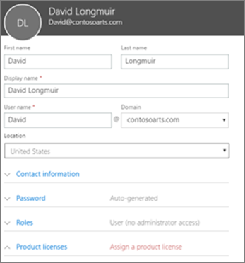

# Lägga till fler användare i Microsoft 365 BusinessAdd more users to Microsoft 365 Business

## Lägg till nya användareAdd new users

Titta på en kort video om hur du lägger till en användare.Watch a short video about adding a user.   

> [!VIDEO https://www.microsoft.com/videoplayer/embed/RE1FOfN] 

Om den här videon har hjälp dig kan du ta en titt på den[fullständiga utbildningsserien för småföretag och de som är nya för Microsoft 365](https://support.office.com/article/6ab4bbcd-79cf-4000-a0bd-d42ce4d12816).If you found this video helpful, check out the [complete training series for small businesses and those new to Microsoft 365](https://support.office.com/article/6ab4bbcd-79cf-4000-a0bd-d42ce4d12816).

Så här lägger du till en användare:To add a user:

1. Gå till admin <a href="https://go.microsoft.com/fwlink/p/?linkid=837890" target="_blank">https://admin.microsoft.com</a>center på .Go to the admin center at <a href="https://go.microsoft.com/fwlink/p/?linkid=837890" target="_blank">https://admin.microsoft.com</a>. 
2. Välj **Aktiva** \> **användare**i det vänstra navigeringsfönstret .In the left navigation pane, choose **Users** \> **Active users**.
3. På sidan **Aktiva användare** väljer du Lägg till **en användare**.On the **Active users** page, choose **Add a user**.
4. Skriv den information som krävs på den **nya användarpanelen.**In the **New user** panel, type the required information. 
  
    Du kan ange mer information under **Kontaktinformation**, välja hur du anger lösenordet under **Lösenordsinställning** och tilldela roller under **Roller**.You can enter more information under **Contact information**, choose how you set the password under **Password** setting, and assign roles under **Roles**.
      
    
      
    Ange licensinställningen **för Microsoft 365** Business-produktlicens på **På**i avsnittet Produktlicenser.In the Product licenses section, set the **Microsoft 365 Business** product license setting to **On**.
      
    
  
Mer information om hur du lägger till användare finns i [Lägga till användare individuellt eller i bulk](https://docs.microsoft.com/office365/admin/add-users/add-users).For  more information about adding users, see [Add users individually or in bulk](https://docs.microsoft.com/office365/admin/add-users/add-users).
  
