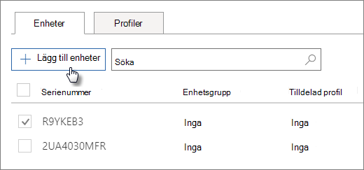

# Skapa och redigera AutoPilot-enheterCreate and edit AutoPilot devices

## Ladda upp en lista med enheterUpload a list of devices

Du kan använda [guiden med stegvisa instruktioner för att](add-autopilot-devices-and-profile.md) ladda upp enheter, men du kan också ladda upp enheter på **fliken** Enheter.You can use the [Step-by-step guide](add-autopilot-devices-and-profile.md) to upload devices, but you can also upload devices in the **Devices** tab. 
  
Enheter måste uppfylla följande krav:Devices must meet these requirements:
  
- Windows 10, version 1703 eller senareWindows 10, version 1703 or later
    
- Nya enheter som inte redan är via WindowsNew devices that haven't been through Windows out-of-box experience

1. I administrationscentret för Microsoft 365 väljer du **Devices** \> **AutoPilot.**In the Microsoft 365 admin center, choose **Devices** \> **AutoPilot**.
  
2. På sidan **AutoPilot** väljer du fliken **Enheter** Lägg \> **till enheter.**On the **AutoPilot** page, choose the **Devices** tab \> **Add devices**.
    
    
  
3. På panelen **Lägg till enheter** bläddrar du till en [CSV-fil med](../admin/misc/device-list.md) enhetslistan som du har förberett \> **Spara** \> **stäng.**On the **Add devices** panel, browse to a [Device list CSV file](../admin/misc/device-list.md) that you prepared \> **Save** \> **Close**.
    
    Du kan få den här informationen från din maskinvaruleverantör eller använda [PowerShell-skriptet Get-WindowsAutoPilotInfo](https://www.powershellgallery.com/packages/Get-WindowsAutoPilotInfo) för att generera en CSV-fil.You can get this information from your hardware vendor, or you can use the [Get-WindowsAutoPilotInfo PowerShell script](https://www.powershellgallery.com/packages/Get-WindowsAutoPilotInfo) to generate a CSV file. 
    
## Tilldela en profil till en enhet eller en grupp enheterAssign a profile to a device or a group of devices

1. På sidan **Förbereder Windows** väljer **du fliken** Enheter och markerar kryssrutan bredvid en eller flera enheter.On the **Prepare Windows** page, choose the **Devices** tab, and select the check box next to one or more devices. 
    
2. På panelen **Enhet**, väljer du en profil från listrutan **Tilldelad profil**.On the **Device** panel, select a profile from the **Assigned profile** drop-down. 
    
    Om du inte redan har profiler hittar du anvisningar i [Skapa och redigera AutoPilot-profiler](create-and-edit-autopilot-profiles.md).If you don't have any profiles yet, see [Create and edit AutoPilot profiles](create-and-edit-autopilot-profiles.md) for instructions. 
