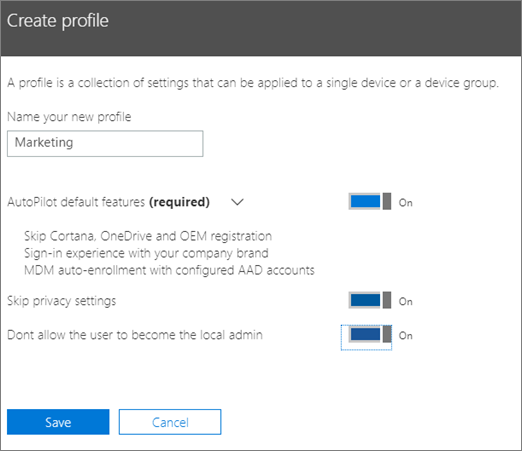

# Skapa och redigera AutoPilot-profilerCreate and edit AutoPilot profiles

## Skapa en profilCreate a profile

En profil gäller för en enhet eller en grupp enheter.A profile applies to a device, or a group of devices,
  
1. Välj **enheter** i Microsoft 365 Business Admin center, \> **AutoPilot**.In the Microsoft 365 Business Admin center, choose **Devices** \> **AutoPilot**.
  
2. Välj fliken **profiler** på sidan **AutoPilot** \> **Skapa profil**.On the **AutoPilot** page, choose the **Profiles** tab \> **Create profile**.
    
3. På sidan **Skapa profil** anger du ett namn för profilen som kan hjälpa dig att identifiera den, till exempel Marknadsföring. Aktivera inställningen som du vill använda (mer information finns i [Om AutoPilot-profilinställningar](autopilot-profile-settings.md)) och välj **Spara**.On the **Create profile** page, enter a name for the profile that helps you identify it, for example Marketing, turn on the setting you want (see [About AutoPilot Profile settings](autopilot-profile-settings.md) for more information), and choose **Save**.
    
    
  
### Använda profil på en enhetApply profile to a device

När du har skapat en profil kan du använda den på en enhet eller en grupp av enheter. Du kan välja en befintlig profil i [guiden med stegvisa anvisningar](add-autopilot-devices-and-profile.md) och använda den på nya enheter, eller så kan du ersätta en befintlig profil för en enhet eller en grupp av enheter.After you create a profile you can apply it to a device or a group of devices. You can pick an existing profile in the [step-by-step guide](add-autopilot-devices-and-profile.md), you can apply it to new devices, or you can replace an existing profile for a device or group of devices. 
  
1. På sidan för att **förbereda Windows** väljer du fliken **Enheter**.On the **Prepare Windows** page, choose the **Devices** tab. 
    
2. Klicka på kryssrutan bredvid en enhets namn. På panelen **Enhet** väljer du sedan en profil i listrutan **Tilldelad profil** \> **Spara**.Click the check-box next to a device name and in the **Device** panel, choose a profile from the **Assigned profile** drop-down \> **Save**.
    
    
  
## Redigera eller ta bort en profilEdit, delete, or remove a profile

När du har tilldelat en profil till en enhet kan du uppdatera den, även om du redan har gett enheten till en användare. När enheten ansluts till internet laddar den ned den senaste versionen av profilen under installationen. Om användaren återställer enheten till de förvalda inställningarna hämtar enheten på nytt de senaste uppdateringarna av profilen.Once you've assigned a profile to a device, you can update it, even if you've already given the device to a user. When the device connects to the internet, it downloads the latest version of your profile during the setup process. If the user restores their device to its factory default settings, the device will again download the latest updates to your profile. 
  
### Redigera en profilEdit a profile

1. På sidan för att **förbereda Windows** väljer du fliken **Profiler**.On the **Prepare Windows** page, choose the **Profiles** tab. 
    
2. Klicka på kryssrutan bredvid enhetens namn. På panelen **Profil** uppdaterar du någon av de tillgängliga inställningarna \> **Spara**.Click the check-box next to a device name and in the **Profile** panel update any of the available settings \> **Save**.
    
    Om du gör detta innan någon användare ansluter enheten till internet används profilen för installationen.If you do this before a user connects the device to the internet, then the profile gets applied to the setup process.
    
### Radera en profilDelete a profile

1. På sidan för att **förbereda Windows** väljer du fliken **Profiler**.On the **Prepare Windows** page, choose the **Profiles** tab. 
    
2. Klicka på kryssrutan bredvid enhetens namn. På panelen **Profil** klickar du på **Ta bort profil** \> **Spara**.Click the check-box next to a device name and in the **Profile** panel click **Delete profile** \> **Save**.
    
    När du raderar en profil tas den bort från en enhet eller en grupp av enheter som den var tilldelad till.When you delete a profile, it gets removed from a device or a group of devices it was assigned to.
    
### Ta bort en profilRemove a profile

1. På sidan för att **förbereda Windows** väljer du fliken **Enheter**.On the **Prepare Windows** page, choose the **Devices** tab. 
    
2. Klicka på kryssrutan bredvid en enhets namn. På panelen **Enhet** väljer du sedan **Ingen** i listrutan **Tilldelad profil** \> **Spara**.Click the check-box next to a device name and in the **Device** panel, choose a **None** from the **Assigned profile** drop-down \> **Save**.
    
