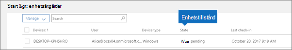

# Statusvärden för enheterDevice states

Den här artikeln gäller Microsoft 365 Business Premium.This article applies to Microsoft 365 Business Premium.

Enheter i listan **Enhetsåtgärder** (Administratörshemsida \> **Enhetsåtgärder**) kan ha följande statusar.Devices in the **Device actions** list (Admin home \> **Device actions**) can have the following states.
  

  
|**Status****Status**|**Beskrivning****Description**|
|:-----|:-----|
|Managed by Intune (Hanteras av Intune)Managed by Intune    |Hanteras av Microsoft 365 Business Premium.Managed by Microsoft 365 Business Premium.    |
|Retire pending (Väntar på att tas ur bruk)Retire pending    |Microsoft 365 Business Premium för förbereda för att ta bort företagsdata från enheten.Microsoft 365 Business Premium is getting ready to remove company data from the device.    |
|Retire in progress (Tas nu ur bruk)Retire in progress    |Microsoft 365 Business Premium tar för närvarande bort företagsdata från enheten.Microsoft 365 Business Premium is currently removing company data from the device.    |
|Retire failed (Det gick inte att ta ur bruk)Retire failed    | Åtgärden att ta bort företagsdata misslyckades.Remove company data action failed.    |
|Retire canceled (Dra tillbaka) har avbrutitsRetire canceled    |Åtgärden för att ta ur verksamhet har avbrutits.Retire action was canceled.    |
|Wipe pending (Rensning väntar)Wipe pending    |Väntar på att fabriksåterställning ska starta.Waiting for factory reset to start.    |
|Wipe in progress (Rensning pågår)Wipe in progress    |Fabriksinställning har skickats.Factory reset has been issued.    |
|Wipe failed (Det gick inte att rensa)Wipe failed    |Det gick inte göra fabriksåterställning.Couldn't do factory reset.    |
|Rensningen har avbrutitsWipe canceled    |Fabriksåterställningen avbröts.Factory wipe was canceled.    |
|Unhealthy (Ej felfri)Unhealthy    |En åtgärd väntar (eller pågår), men enheten har inte checkats in på mer än 30 dagar.An action is pending (or in progress), but the device hasn't checked in for 30+ days.    |
|Delete pending (Väntar på att tas bort)Delete pending    |Ta bort-åtgärd som väntar.Delete action is pending.    |
|Discovered (Identifierad)Discovered    |Microsoft 365 Business Premium har upptäckt enheten.Microsoft 365 Business Premium has detected the device.    |
   
