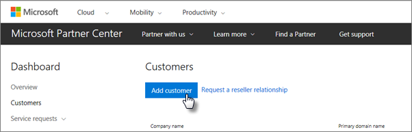

# Skaffa Microsoft 365 Business

## Skaffa Microsoft 365 Business från Microsoft

Om du inte har en partner men vill skaffa Microsoft 365 Business, kan du [köpa det här](https://www.microsoft.com/en-US/microsoft-365/business).

Se [registrera dig för Microsoft 365 Business](sign-up.md) för detaljerade instruktioner.

Du kan också gå över till en [Microsoft Store](https://www.microsoft.com/en-us/store/locations/find-a-store?icid=en_US_Store_UH_FAS) för att köpa Microsoft 365 Business och få installationshjälp.
  
## Hämta Microsoft 365 Business från Microsoft-partnercenter

1. Logga in på [Microsoft-partnercenter](https://go.microsoft.com/fwlink/p/?linkid=849910) med hjälp av autentiseringsuppgifter som du skapade när du registrerar sig för tjänsten Leverantör av Microsoft-molnlösningar (CSP). 
    
2. Välj **Kunder**på partnerinstrumentpanelen och välj sedan kunden eller lägg till en ny kund innan du skaffar Microsoft 365 Business.
    
    
  
3. På kundens **prenumerationssida** väljer du **Lägg till prenumeration,** välj alternativet Småföretag under Katalog och välj sedan **Microsoft 365 Business**.
    
    Välj antalet licenser du behöver (upp till 300). Om du har fler än 300 användare går du till [Microsoft 365 Enterprise](https://go.microsoft.com/fwlink/p/?linkid=862316) i stället. 
    
    
  
    Fyll i resten av stegen för att lägga till en ny kund, inklusive företagsnamnet.
    

