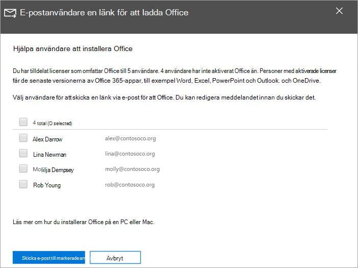

# Hjälpa användarna att installera Office på Windows 10-enheter

Du kan snabbt och enkelt installera Office på datorer med Windows 10 från administrationscentret för Microsoft 365.
  
Om du vill veta mer om hur det fungerar med tidigare installerade Office-program kan du läsa [Förbered för installation av Office-klienten](prepare-for-office-client-deployment.md) innan du sätter igång.

Titta på en kort video om hur du installerar Office-appar.  

> [!VIDEO https://www.microsoft.com/videoplayer/embed/acce002c-0756-4b64-ac5d-2198ee96a9b1] 

Om den här videon har hjälpt dig kan du ta en titt på den [fullständiga utbildningsserien för småföretag och nya användare av Microsoft 365](https://support.microsoft.com/office/6ab4bbcd-79cf-4000-a0bd-d42ce4d12816).

## Hantera Office-distribution

1. Gå till administrationscentret på <a href="https://go.microsoft.com/fwlink/p/?linkid=2024339" target="_blank">https://admin.microsoft.com</a> och logga in med autentiseringsuppgifterna för global administratör. 

2. Gå till **Inställningar** i det vänstra navigeringsfönstret och på sidan **Inställningar** bläddrar du till **Appar och uppdateringar.**
    > [!NOTE]
    > Du kanske inte ser det här kortet om alla dina användare har installerat Office-program.
  
3. På kortet **Hjälp användarna att installera Office-appar** väljer du **Visa** och sedan **Komma igång.**
    
4. På panelen **E-postanvändare en länk för att** ladda ned Office väljer du de användare du vill skicka e-post till och sedan **E-posta valda användare.**

   

## Mer information om att konfigurera och använda Microsoft 365 Business Premium

[Utbildningsvideor för Microsoft 365 Business](https://support.microsoft.com/office/6ab4bbcd-79cf-4000-a0bd-d42ce4d12816)