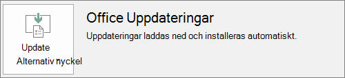

# Förbereda Office-distribution genom Microsoft 365 för företagPrepare for Office client deployment by Microsoft 365 for business

Den här artikeln gäller Microsoft 365 Business Premium.This article applies to Microsoft 365 Business Premium.

## Förbereda för automatisk installation av Office-program på klientdatorerPrepare to automatically install Office apps to client computers

Du kan använda Microsoft 365 Business Premium för att automatiskt installera 32-bitars Office-program på Windows 10-datorer och hålla dem aktuella med uppdateringar.You can use Microsoft 365 Business Premium to automatically install the 32-bit Office apps on Windows 10 computers and keep them current with updates.
  
Automatisk installation fungerar bäst om slutanvändarens dator finns på Windows 10 Business och:Automatic installation works best if the end user's computer is on Windows 10 Business and:
  
- Inte har befintliga Office-skrivbordsprogram (Word, Excel, PowerPoint, Outlook, OneNote, Publisher, Access och OneDrive).Doesn't have existing Office desktop apps (Word, Excel, PowerPoint, Outlook, OneNote, Publisher, Access, and OneDrive).
    
    elleror
    
- har en befintlig Klicka-och-kör-version av Office installerad.Has an existing version of Click-to-Run Office installed.
    
Du kan avgöra om du har Klicka-och-kör-versionen av Office genom att välja **Arkiv** \> **Konto** ( **Office-konto** i Outlook) i valfritt Office-program.To determine if you have the Click-to-Run version of Office, in any Office app go to **File** \> **Account** ( **Office Account** in Outlook). Om du ser **Office-uppdateringar** enligt följande bild har installationen utförts med Klicka-och-kör.If you see **Office Updates** as shown in the following figure, then the installation was done by using Click-to-Run. 
  

  
 **Vem drar nytta av den här funktionen?****Who benefits from having this feature**
  
Användaren vars dator:The end user whose PC:
  
- **Har**  en användarlicens för Windows 10 Business, en aktiv Microsoft 365 för företag-licens, Windows 10 Creators Update och är ansluten till Azure Active Directory.**Has**  a Windows 10 Business user license, an active Microsoft 365 for business license, Windows 10 Creators Update, and is joined to Azure Active Directory. 
    
- **Inte har** 64-bitars Office-program (exempel: Word, Excel och PowerPoint).**Doesn't have** 64-bit Office apps (example: Word, Excel, PowerPoint). Den här funktionen är inget bra alternativ om 64-bitarsversionen av Office-programmen är ett krav eftersom det inte finns något stöd för att starta en 64-bitars Klicka-och-kör-version av Office 2016 från administratörskonsolen för Microsoft 365 för företag.If 64-bit Office apps are required, then this feature isn't a good fit because there's no support for triggering a 64-bit 2016 Click-to-Run version of Office from the Microsoft 365 for business admin console. 
    
- **Har inga** fristående 2016-program installerade med Windows Installer (MSI) (till exempel Visio eller Project).**Doesn't have** any 2016 Windows Installer (MSI) standalone apps (for example, Visio or Project). Microsoft 365 för företag uppgraderar Office till Klicka-och-kör-versionen av Office 2016 och det fungerar inte med fristående Office 2016 MSI-program.Microsoft 365 for business upgrades Office to the Click-to-Run version of Office 2016 and that doesn't work with Office 2016 MSI standalone apps. 
    
I följande tabell visas vilka åtgärder som slutanvändare/administratörer kan behöva vidta, beroende på starttillståndet, för att få en lyckad 32-bitars Klicka-och-kör-version av Office-distribution från administratörskonsolen för Microsoft 365 för företag.The following table shows what action the end users/admins may need to take, depending on their beginning state, to have a successful 32-bit Click-to-Run version of Office deployment from the Microsoft 365 for business admin console.
  
|**Status vid start av Office-installationen****Starting Office install status**|**Åtgärd att vidta innan Office-installationen av Microsoft 365 för företag****Action to take before Microsoft 365 for business Office install**|**Slutstatus****End state**|
|:-----|:-----|:-----|
|Ingen Office-programsvit installeradNo Office suite installed    |IngenNone    |32-bitars office 2016 installeras med Klicka-och-körOffice 2016 32-bit is installed by using Click-to-Run    |
|Befintlig 32-bitars Klicka-och-kör-version av Office (2016 eller tidigare) och inga fristående programExisting Click-to-Run 32-bit version of Office (2016 or earlier) and no standalone apps    |IngenNone    |Uppgraderad till den senaste 32-bitars Klicka-och-kör-versionen av Office 2016, enligt behov **\***Upgraded to the latest 32-bit Click-to-Run version of Office 2016, as needed **\***   |
|Befintlig 32-bitars Klicka-och-kör-version av Office och 32-bitars eller 64-bitars Klicka-och-kör-bitarsversionen av fristående Office-program (till exempel Visio och Project)Existing Click-to-Run 32-bit version of Office and Click-to-Run 32-bit or 64-bit standalone Office apps (for example, Visio, Project)    |IngenNone    |Fristående program påverkas inte.Standalone apps aren't affected. Programsviten uppgraderas till 32-bitars Klicka-och-kör-versioner av Office 2016Suite is upgraded to Click-to-Run 32-bit version of Office 2016    |
|Befintlig 32-bitars Klicka-och-kör-version av Office och eventuella 32-bitars eller 64-bitars (med undantag av 2016) fristående MSI Office-programExisting Click-to-Run 32-bit version of Office and any 32-bit or 64-bit (except 2016) MSI standalone Office apps    |IngenNone    |Fristående program påverkas inte.Standalone apps aren't affected. Programsviten uppgraderas till 32-bitars Klicka-och-kör-versioner av Office 2016Suite is upgraded to Click-to-Run 32-bit version of Office 2016    ||||
|Alla befintliga 64-bitars Klicka-och-kör-versioner av OfficeAny existing Click-to-Run 64-bit version of Office    |Avinstallera 64-bitars Office-programmen om det går bra att ersätta dem med 32-bitars Office-programUninstall the 64-bit Office apps, if it's OK to replace them with 32-bit Office apps    |Om 64-bitarsprogram tas bort installeras 32-bitars Klicka-och-kör-versionen av Office 2016If Office 64-bit apps are removed, the Click-to-Run 32-bit version of Office 2016 is installed    |
|En befintlig MSI-installation av Office 2016 med eller utan fristående programAn existing MSI install of Office 2016 with or without standalone apps    |Avinstallera MSI-versionen av Office 2016.Uninstall MSI Office 2016.    |32-bitars Klicka-och-kör-version av Office 2016 installeras. Inga ändringar av fristående programClick-to-Run 32-bit version of Office 2016 is installed. No change to standalone apps    |
|En befintlig MSI-installation av Office 2013 (eller tidigare) och/eller fristående Office-programExisting MSI install of Office 2013 (or earlier) and/or standalone Office apps    |IngenNone    |32-bitars Klicka-och-kör-versionen av Office 2016 kan installeras sida vid sida med befintlig MSI-installation av Office (och fristående program)Click-to-Run 32-bit version of Office 2016 with the pre-existing MSI Office install (and standalone apps) exist side-by-side    |
||||
   
 **( \* ) Obs!** Uppgraderar inte till 32-bitars Klicka-och-kör-versionen av Office 2016 på grund av ett känt programfel.**(\*) Note:** Does not upgrade to Click-to-Run 32-bit version of Office 2016 due to a known bug. En korrigering pågår.A fix is in progress. 
  
