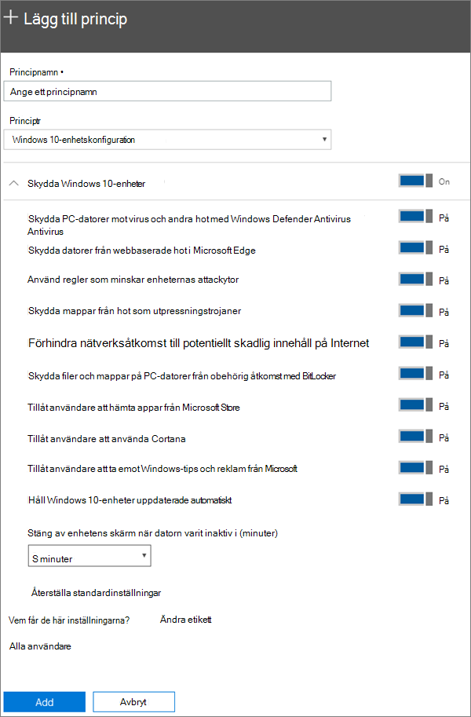

# Redigera eller skapa inställningar för enhetsskydd för Windows 10-datorerEdit or create device protection settings for Windows 10 PCs

Den här artikeln gäller för Microsoft 365 Business Premium.This article applies to Microsoft 365 Business Premium.

När du har angett Windows standardinställningar för skydd på sidan Konfigurera kan du lägga till nya som gäller för antingen alla användare eller en uppsättning användare.After you have set set up default Windows protection settings on the Setup page, you can add new ones that apply to either all users, or a set of users. Du kan också redigera de du har skapat.You can also edit any of the ones you have created.

## Skapa skyddsinställningar för Windows 10 enheterCreate protection settings for Windows 10 devices

Visa en video om hur du skyddar Windows 10 enheter med Microsoft 365 Business Premium:View a video on how to secure Windows 10 devices with Microsoft 365 Business Premium:
  
> [!VIDEO https://www.microsoft.com/videoplayer/embed/a5734146-620a-4cec-8618-536b3ca37972?autoplay=false]
  
1. Gå till administrationscentret på <a href="https://go.microsoft.com/fwlink/p/?linkid=837890" target="_blank">https://admin.microsoft.com</a>.Go to the admin center at <a href="https://go.microsoft.com/fwlink/p/?linkid=837890" target="_blank">https://admin.microsoft.com</a>. 
2. Välj Enheter principer Lägg till **i** \> **navigeringsfältet** \> **till vänster.**On the left nav, choose **Devices** \> **Policies** \> **Add**.
3. I fönstret **Lägg till princip** anger du ett unikt namn för principen.On the **Add policy** pane, enter a unique name for this policy. 
4. Under **Typ av princip** väljer du **Konfiguration av Windows 10-enhet**.Under **Policy type**, choose **Windows 10 Device Configuration**.
5. Expandera **Skydda Windows 10-enheter** \> konfigurera inställningar enligt eget önskemål.Expand **Secure Windows 10 Devices** \> configure the settings how you would like. Mer information finns i [Tillgängliga inställningar](#available-settings).For more information, see [Available settings](#available-settings). 
    
    Du kan alltid använda länken **Återställ standardinställningar** för att återgå till standardinställningarna.You can always use the **Reset default settings** link to return to the default setting. 
    
    
  
6. **Vem får de här inställningarna?** Om du inte vill använda säkerhetsgruppen **Alla användare** (standard) väljer du **Ändra** och anger vilka säkerhetsgrupper som får dessa inställningar \> **Välj**.Next decide **Who will get these settings?** If you don't want to use the default **All users** security group, Choose **Change**, search for the security group who will get these settings \> **Select**.
7. Välj **Klar** för att spara principen och tilldela den till enheter.Finally, choose **Done** to save the policy, and assign it to devices. 

## Redigera Windows 10 säkerhetsinställningarEdit Windows 10 protection settings
 
1. Gå till administrationscentret på <a href="https://go.microsoft.com/fwlink/p/?linkid=837890" target="_blank">https://admin.microsoft.com</a>.Go to the admin center at <a href="https://go.microsoft.com/fwlink/p/?linkid=837890" target="_blank">https://admin.microsoft.com</a>.     
2. Välj Principer för enheter i **navigeringsfältet** \> **till vänster.**On the left nav, choose **Devices** \> **Policies** .
1. Välj en befintlig Windows och sedan **Redigera**.Choose an existing Windows device policy and then **Edit**.
1. Välj **Redigera** bredvid den inställning du vill ändra och sedan **Spara**.Choose **Edit** next to a setting you want to change and then **Save**.

## Tillgängliga inställningarAvailable settings

Som standard är alla inställningar **På**. Följande inställningar är tillgängliga.By default all settings are **On**. The following settings are available.
  
Mer information finns i Hur [mappar skyddsfunktioner i Microsoft 365 Premium till Intune-inställningarna.](map-protection-features-to-intune-settings.md)For more information, see [How do protection features in Microsoft 365 Premium map to Intune settings](map-protection-features-to-intune-settings.md). 
  
|||
|:-----|:-----|
|InställningSetting    |BeskrivningDescription    |
|Skydda PC-datorer mot virus och andra hot med Windows Defender AntivirusHelp protect PCs from viruses and other threats using Windows Defender Antivirus    |Kräver att antivirusprogrammet Windows Defender är aktiverat för att skydda datorer från fara vid uppkoppling till internet.Requires that Windows Defender Antivirus is turned on to protect PCs from the dangers of being connected to the internet.    |
|Skydda datorer från webbaserade hot i Microsoft EdgeHelp protect PCs from web-based threats in Microsoft Edge    |Aktiverar inställningarna Microsoft i Edge som hjälper till att skydda användare från skadliga webbplatser och nedladdningar.Turns on settings in Edge that help protect users from malicious sites and downloads.    |
|Använd regler som minskar enheternas attackytorUse rules that reduce the attack surface of devices    |När inställningen är aktiv bidrar minskningen av attackytan till att blockera åtgärder och program som vanligtvis används av skadlig programvara för att smitta enheter. Inställningen är bara tillgänglig om Windows Defender Antivirus är aktiverad. Mer information finns i [Minska attackytor](/windows/security/threat-protection/microsoft-defender-atp/exploit-protection).  When turned On, attack surface reduction helps block actions and apps typically used by malware to infect devices. This setting is only available if Windows Defender Antivirus is set to On. See [Reduce attack surfaces](/windows/security/threat-protection/microsoft-defender-atp/exploit-protection) to learn more.    |
|Skydda mappar från hot som utpressningstrojanerProtect folders from threats such as ransomware    |Den här inställningen använder kontrollerad mappåtkomst för att skydda företagsdata från att ändras av misstänkta eller skadliga program, till exempel utpressningstrojaner.This setting uses controlled folder access to protect company data from modification by suspicious or malicious apps, such as ransomware. Dessa typer av program blockeras från att göra ändringar i skyddade mappar.These types of apps are blocked from making changes in protected folders. Inställningen är bara tillgänglig om Windows Defender Antivirus är aktiverad.This setting is only available if Windows Defender Antivirus is set to On. Mer [information finns i Skydda mappar med kontrollerad](/mem/configmgr/protect/deploy-use/create-deploy-exploit-guard-policy#bkmk_CFA) mappåtkomst.See [Protect folders with Controlled folder access](/mem/configmgr/protect/deploy-use/create-deploy-exploit-guard-policy#bkmk_CFA) to learn more.    |
|Förhindra nätverksåtkomst till potentiellt skadlig innehåll på InternetPrevent network access to potentially malicious content on the Internet    |Använd den här inställningen för att blockera utgående användaranslutningar till berykliga Internetplatser som kan vara värdar för nätfiske, sårbarheter eller annat skadligt innehåll.Use this setting to block outbound user connections to low-reputation Internet locations that may host phishing scams, exploits, or other malicious content. Den här inställningen är bara tillgänglig Windows Defender Antivirus inställningen är **På.**This setting is only available if Windows Defender Antivirus is set to **On**. Mer information finns i [Skydda ditt nätverk.](/windows/security/threat-protection/windows-defender-antivirus/configure-real-time-protection-windows-defender-antivirus)For more information, see [Protect your network](/windows/security/threat-protection/windows-defender-antivirus/configure-real-time-protection-windows-defender-antivirus).    |
|Skydda filer och mappar på PC-datorer från obehörig åtkomst med BitLockerHelp protect files and folders on PCs from unauthorized access with BitLocker    |BitLocker skyddar data genom att kryptera datorhårddiskar samt skyddar mot exponering av data om en dator försvinner eller blir stulen.Bitlocker protects data by encrypting the computer hard drives and protect against data exposure if a computer is lost or stolen. Mer information finns i Vanliga [frågor och svar om Bitlocker.](/windows/security/information-protection/bitlocker/bitlocker-frequently-asked-questions)For more information, see [Bitlocker FAQ](/windows/security/information-protection/bitlocker/bitlocker-frequently-asked-questions).    |
|Tillåt användare att hämta appar från Microsoft StoreAllow users to download apps from Microsoft Store    |Låter användare ladda ned och installera appar från Microsoft Store. Appar inbegriper allt från spel till produktivitetsverktyg, så vi lämnar den här inställningen **På**, men du kan inaktivera den för extra säkerhet.  Lets users download and install apps from the Microsoft Store. Apps include everything from games to productivity tools, so we leave this setting **On**, but you can turn it off for extra security.    |
|Tillåt användare att använda CortanaAllow users to access Cortana    |Cortana kan vara mycket användbar!Cortana can be very helpful! Cortana kan aktivera eller inaktivera inställningar åt dig, ge vägbeskrivningar och kontrollera att du håller avtalade tider, så vi behåller den här inställningen **På** som standard.Cortana can turn settings on or off for you, give directions, and make sure you're on time for appointments, so we keep this setting **On** by default.    |
|Tillåt användare att ta emot Windows-tips och reklam från MicrosoftAllow users to receive Windows tips and advertisements from Microsoft    |Windows-tips kan vara praktiskt eftersom de informerar användare när nya funktioner blir tillgängliga.Windows tips can be handy and help orient users when new features are released.    |
|Håll Windows 10-enheter uppdaterade automatisktKeep Windows 10 devices up to date automatically    |Säkerställer att Windows 10-enheter automatiskt får de senaste uppdateringarna.Makes sure that Windows 10 devices automatically receive the latest updates.    |
|Stäng av enhetens skärm efter en viss tids inaktivitetTurn off device screen when idle for this amount of time    |Säkerställer att företagsdata skyddas om en användare är inaktiv. En användare som befinner sig på en offentlig plats, till exempel ett café, kan göra ett ärende eller låter sig distraheras för ett ögonblick, vilket gör att obehöriga kan få tillgång till enheten. Med den här inställningen kan du bestämma hur länge användaren kan vara inaktiv innan skärmen stängs av.Makes sure that company data is protected if a user is idle. A user may be working in a public location, like a coffee shop, and step away or be distracted for just a moment, leaving their device vulnerable to random glances. This setting lets you control how long the user can be idle before the screen shuts off.    |