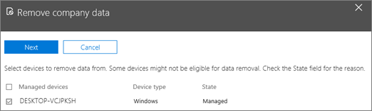

# Ta bort företagsdata från enheter

## Ta bort företagsdata

Du kan använda Microsoft 365 Business för att ta bort företagsdata som användarna har på sina [enheter](app-protection-settings-for-android-and-ios.md) eller [Windows-datorer](protection-settings-for-windows-10-devices.md) som skyddas av Microsoft 365. **Företagsdata som tas bort från en enhet kan inte återställas**. 
  
1. Logga in på [Microsoft 365 Business](https://portal.office.com) som global administratör. 
    
2. I Administrationscenter väljer du **Ta bort företagsdata** från kortet **Enhetsåtgärder**.
    
    
  
3. Välj eller sök efter en användare vars data du vill ta bort i fönstret **Ta bort företagsdata** och välj namnet. 
    
4. I nästa fönster väljer du enheten eller enheterna du vill ta bort data från i listan **Hanterade enheter** och väljer **Nästa**. 
    
    
  
5. I fönstret **Är du säker på att du vill ta bort företagsdata på följande enheter** väljer du **Ta bort** \> **Stäng**.
    

