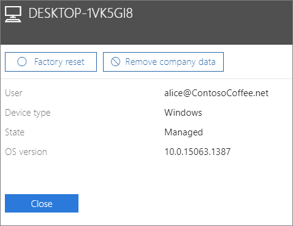

# Ta bort företagsdata från enheterRemove company data from devices

## Ta bort företagsdataRemove company data

Du kan använda Microsoft 365 Business för att ta bort företagsdata som användarna har på sina [enheter](app-protection-settings-for-android-and-ios.md) eller [Windows-datorer](protection-settings-for-windows-10-devices.md) som skyddas av Microsoft 365. **Företagsdata som tas bort från en enhet kan inte återställas**.You can use Microsoft 365 Business to remove company data that your users have on their [devices](app-protection-settings-for-android-and-ios.md) or [Windows PCs](protection-settings-for-windows-10-devices.md) that are protected by Microsoft 365. **If you remove company data from a device, you cannot restore it later**. 
  
1. Gå till administratörscenter på <a href="https://go.microsoft.com/fwlink/p/?linkid=837890" target="_blank">https://admin.microsoft.com</a>.Go to the admin center at <a href="https://go.microsoft.com/fwlink/p/?linkid=837890" target="_blank">https://admin.microsoft.com</a>.
    
2. Välj **enheter** \> **Hantera**i det vänstra navigeringsfältet.  On the left nav, choose **Devices**  \> **Manage**.
  
3. På sidan **Hantera** väljer eller söker du efter en användare som är data som du vill ta bort och väljer namnet.On the **Manage** page, choose or search for a user who's data you want to remove, and choose the name. 
    
4. I nästa fönster väljer du enheten eller enheterna i listan **enheter** och i enhetsfönstret som öppnas kan du välja att återställa enheten till fabriksinställningarna eller ta bort företagsdata beroende på enhetstyp.On the next pane, select the device or devices from the **Devices** list and on the device pane that opens you can choose to reset the device to factory settings, or remove company data depending on the device type. 
    
    
  
5. I bekräftelsefönstret väljer du **Bekräfta** \> **stängning**.On the confirmation pane, choose **Confirm** \> **Close**.
    

