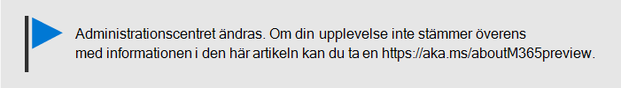

# Återställa Windows 10-enheter till fabriksinställningarna

En fabriksinställning återställer en enhet till de ursprungliga inställningarna då enheten köptes. Data, och alla appar som installerats sedan dess tas bort. Du kan använda Microsoft 365 Business för att göra fabriksåterställning av de Windows 10-enheter du hanterar.
  
1. Gå till administrationscentret på <a href="https://go.microsoft.com/fwlink/p/?linkid=837890" target="_blank">https://admin.microsoft.com</a>.
    
2. Välj \> **Enhetshantera**i **** den vänstra navigatorn.

3. Markera **** kryssrutan bredvid den enhet du vill ta bort data från och välj sedan **Fabriksåterställning**i listrutan **Hantera** .
    
4. I fönstret **Är du säker på att du vill fabriksåterställa följande enheter** väljer du **Bekräfta** \> **Stäng**.
    
  

