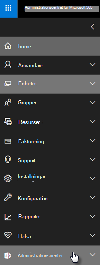

# Säkerhets- och efterlevnadsfunktioner för Microsoft 365 Business

Microsoft 365 Business erbjuder förenklade säkerhetsfunktioner för att skydda dina data på datorer, telefoner och surfplattor.
    
## Säkerhetsfunktioner för Microsoft 365 Business-administrationscenter

Du kan hantera många av säkerhetsfunktionerna i Microsoft 365 Business i administrationscentret, vilket ger dig ett förenklat sätt att aktivera eller inaktivera dessa funktioner. I administrationscentret kan du göra följande:
  
- [Ange inställningar för programhantering för Android- eller iOS-enheter](app-protection-settings-for-android-and-ios.md) . 
    
    Dessa inställningar inkluderar att ta bort filer från en inaktiv enhet efter en viss period, kryptera arbetsfiler, kräva att användarna anger en PIN-kod och så vidare.
    
- [Ange inställningar för programskydd för Windows 10-enheter](protection-settings-for-windows-10-devices.md) . 
    
    Dessa inställningar kan tillämpas på företagsdata på både företagsägda eller personligt ägda enheter.
    
- [Ange inställningar för enhetsskydd för Windows 10-enheter](protection-settings-for-windows-10-pcs.md) . 
    
    Du kan aktivera [BitLocker-kryptering](https://go.microsoft.com/fwlink/p/?linkid=871405) för att skydda data om en enhet försvinner eller blir stulen och aktivera [Windows Exploit Guard](https://docs.microsoft.com/windows/security/threat-protection/microsoft-defender-atp/enable-exploit-protection) för att ge avancerat skydd mot ransomware. 
    
- [Ta bort företagsdata från enheter](remove-company-data.md)
    
    Du kan fjärrrensa företagsdata om en enhet försvinner, blir stulen eller om en anställd lämnar företaget.
    
- [Återställ Windows 10-enheter till fabriksinställningarna](reset-devices-to-factory-settings.md) . 
    
    Du kan återställa alla Windows 10-enheter som har enhetsskyddsinställningar som tillämpas på dem.
    
## Ytterligare säkerhetsfunktioner 

Avancerade funktioner i Microsoft 365 Business är tillgängliga för att skydda ditt företag mot cyberhot och skydda känslig information.
  
- **[Office 365 Avancerat skydd](https://support.office.com/article/e100fe7c-f2a1-4b7d-9e08-622330b83653)**
    
    Advanced Threat Protection (ATP) hjälper till att skydda ditt företag mot sofistikerade nätfiske- och utpressningsattacker som är utformade för att äventyra medarbetarnas eller kundinformationen. Funktioner inkluderar:
    
  - Sofistikerad skanning av bifogade filer och AI-driven analys för att upptäcka och kassera farliga meddelanden.
    
  - Automatiska kontroller av länkar i e-post för att bedöma om de ingår i ett nätfiskesystem. Detta håller dig säker från att komma åt osäkra webbplatser.

- **[De fullständiga funktionerna för Intune i Azure-portalen](https://go.microsoft.com/fwlink/p/?linkid=871403)**
    
    Med åtkomst till Intune-administrationscentret i Azure-portalen kan du konfigurera ytterligare säkerhetsfunktioner, till exempel hantering av MacOS-enheter, iPhone och Android-enheter, tillsammans med avancerad enhetshantering för Windows, som inte är tillgängliga via Microsoft 365 Business administrationscenter.
- **Samma [villkorliga åtkomst](https://docs.microsoft.com/azure/active-directory/conditional-access/overview) som Azure AD Premium P1-abonnemang**

    Villkorlig åtkomst kan skydda din organisation från inloggningsrisk, åtkomstförsök från ett oväntat nätverk eller språk, åtkomstförsök från riskfyllda enhetstyper och så vidare. Principer för villkorlig åtkomst tillämpas efter att den första autentiseringen har slutförts och använder signaler från den första autentiseringshändelsen för att avgöra om försöket ska godkännas, nekas eller om fler bevis (till exempel en andra form av identifiering) krävs.

    Funktionerna för villkorlig åtkomst ingår:

    - Åtkomst baserat på användarnamn, grupp och roll
    - Åtkomst [baserat på en app](https://docs.microsoft.com/azure/active-directory/conditional-access/app-based-conditional-access) 
    - [Tillträde baserat på plats;](https://docs.microsoft.com/azure/active-directory/authentication/howto-registration-mfa-sspr-combined#conditional-access-policies-for-combined-registration)  endast tillåta åtkomst från betrodda IP-intervall eller specifika länder 
    - Kräv MFA för åtkomst
    - Blockera åtkomst till appar som använder [äldre autentisering](https://docs.microsoft.com/azure/active-directory/conditional-access/block-legacy-authentication)
    - Kräv appar tp använda [Intune-appskydd](https://docs.microsoft.com/azure/active-directory/conditional-access/app-protection-based-conditional-access)
    - Anpassad autentisering som MFA med tredjepartsleverantörer, till exempel DUO.
   
    Andra funktioner:
    - [Återställning av lösenord för självbetjäning](https://docs.microsoft.com/azure/active-directory/authentication/concept-sspr-customization) för hybrid Azure AD
    
## Funktioner för efterlevnad

Din Microsoft 365 Business-prenumeration innehåller funktioner som hjälper dig att upprätthålla efterlevnads- och regelstandarder.

- **[Översikt över principer för att förebygga dataförlust](https://support.office.com/article/1966b2a7-d1e2-4d92-ab61-42efbb137f5e)** (DLP). 
    
    Du kan ställa in DLP för att automatiskt upptäcka känslig information, till exempel kreditkortsnummer, personnummer och så vidare, för att förhindra att de oavsiktligt delar utanför företaget.
    
- **[Exchange Online - arkivering](https://products.office.com/exchange/microsoft-exchange-online-archiving-email)**
    
    Exchange Online Archiving licens gör att meddelanden enkelt kan arkiveras med kontinuerlig säkerhetskopiering av data. Den lagrar alla en användares e-postmeddelanden, inklusive borttagna objekt, om de behövs senare för identifiering eller återställning. Dessutom kan du använda olika lagringsprinciper för att bevara e-postdata för rättstvister, eDiscovery eller för att uppfylla efterlevnadskraven.
    
- **[Känslighetsetiketter](https://docs.microsoft.com/microsoft-365/compliance/sensitivity-labels)**

   Microsoft 365 Business innehåller alla funktioner i [Azure Information Protection Plan 1](https://go.microsoft.com/fwlink/p/?linkid=871407). Med det här abonnemanget kan du skapa **känslighetsetiketter** som gör att du kan styra åtkomsten till känslig information i e-post och dokument, med kontroller som "Vidarebefordra inte" och "Kopiera inte". Du kan också klassificera känslig information som "Konfidentiell" och ange hur sekretessbelagd information kan delas utanför och inom företaget. Kryptering i företagsklass är lätt att använda för e-post och dokument för att hålla din information privat. Du kan också installera klienttillägget Azure Information Protection för Office-appar. Mer information finns i [Azure Information Protection unified labeling client](https://docs.microsoft.com/azure/information-protection/rms-client/unifiedlabelingclient-version-release-history). För känslighetsetiketter installerar **du AzInfoProtection_UL.exe**.

Du kan hantera dessa &amp; funktioner i säkerhetsefterlevnadscentret och Administrationscentret för Intune. Med tiden läggs de förenklade kontrollerna till i microsoft 365 Business-administrationscentret.
  
    
## Vanliga frågor och svar

 ### Är dessa säkerhetsfunktioner tillgängliga på alla marknader?
  
Ja, dessa funktioner är tillgängliga på alla marknader där Microsoft 365 Business säljs.
  
### Hur hittar jag &amp; säkerhetsorganisationscentret?
  
1. [Logga in på Microsoft 365 Business](https://portal.microsoft.com/) med hjälp av administratörsuppgifterna. 
    
2. Leta reda på administrationscenter i den vänstra **navigeringscentralen** och expandera den. 
    
    
  
3. Välj ** &amp; Säkerhetsefterlevnad** för att gå till säkerhetsefterlevnadscenter. &amp;
