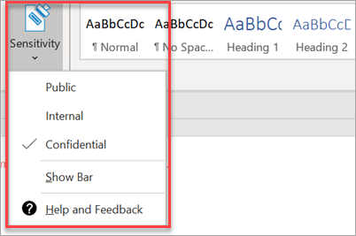

# Ställa in efterlevnadsfunktionerSet up compliance features

Din Microsoft 365-verksamhet levereras med funktioner som skyddar dina data och enheter och hjälper dig att skydda dina och kundernas känsliga information.Your Microsoft 365 Business comes with features to protect your data and devices, and help you keep yours and your customers' sensitive information secure.

## Konfigurera DLP-funktionerSet up DLP features

Se [skapa en DLP-princip från en mall](https://support.office.com/article/59414438-99f5-488b-975c-5023f2254369) för ett exempel på hur du ställer in en princip för att skydda mot personligt identifierbar information (PII).See [Create a DLP policy from a template](https://support.office.com/article/59414438-99f5-488b-975c-5023f2254369) for an example on how to set up a policy to protect against personally identifiable information (PII). 
  
DLP levereras med många färdiga att använda principmallar för många olika språk.DLP comes with many ready-to-use policy templates for many different locales. Till exempel Australien Financial data, Kanada personuppgifter Act, amerikanska finansiella data, etc. Se [vad DLP-principmallarna innehåller](https://support.office.com/article/c2e588d3-8f4f-4937-a286-8c399f28953a) för en fullständig lista.For example, Australia Financial Data, Canada Personal Information Act, U.S. Financial Data, etc. See [What the DLP policy templates include](https://support.office.com/article/c2e588d3-8f4f-4937-a286-8c399f28953a) for a full list. Alla dessa mallar kan aktiveras liknande den PII mall exempel.All of these templates can be enabled similar to the PII template example. 
  
## Konfigurera e-postlagring med Exchange Online-arkiveringSet up email retention with Exchange Online Archiving

 **Exchange Online arkivering** licens funktioner bidra till att upprätthålla efterlevnad och reglerande standarder genom att bevara e-innehåll för eDiscovery.**Exchange Online Archiving** license features help maintain compliance and regulatory standards by preserving email content for eDiscovery. Det bidrar också till att minska risken i händelse av en rättegång och ger ett sätt att återskapa data efter en säkerhetsöverträdelse, eller när du behöver återskapa borttagna objekt.It also helps reduce your risk in the event of a lawsuit and provides a way to recover data after a security breach, or when you need to recover deleted items. Du kan använda bevarande av juridiska tvister för att bevara allt innehåll i en användare eller använda loggperiodsprinciper för att anpassa vad du vill bevara.You can use litigation hold to preserve all of a user's content, or use retention policies to customize what you want to preserve.
  
**Rättstvist håller:** Du kan bevara allt postlådeinnehåll inklusive borttagna objekt genom att placera en användares hela postlåda i rättstvist håller.**Litigation hold:** You can preserve all mailbox content including deleted items by putting a user's entire mailbox on litigation hold. 
    
Om du vill placera en postlåda i rättstvist håller du i administratörscenter:To place a mailbox on litigation hold, in the Admin center:
    
1. Gå till **användare** \> **aktiva användare**i det vänstra navigeringsfältet.In the left nav, go to **Users** \> **Active users**.
    
2. Välj en användare vars postlåda du vill placera på rättstvist håller och i fönstret användare expandera **e-postinställningar** och bredvid **fler inställningar** väljer **Redigera Exchange-egenskaper**.Select a user whose mailbox you want to place on litigation hold and in the user pane expand **Mail settings** and next to **More settings** choose **Edit Exchange properties**.
    
3. På sidan postlådesida för användaren väljer du \* \* Postlådefunktioner \* \* i det vänstra navigeringsfältet och väljer sedan **Aktivera** länk under **rättstvist håller**.On the mailbox page for the user, choose \*\* mailbox features \*\* on the left nav, and then choose the **Enable** link under **Litigation hold**.
    
4. I dialogrutan **rättstvist håller** du kan ange rättstvist håller varaktighet i fältet **rättstvist håller varaktighet** , lämna fältet tomt om du vill placera en oändlig spärr.In the **litigation hold** dialog box you can specify the litigation hold duration in the **Litigation hold duration** field, leave field empty if you want to place an infinite hold. Du kan också lägga till anteckningar och dirigera brev låde ägaren till en webbplats som du kanske måste förklara mer om bevarande av \> rätts **tvister.**You can also add notes and direct the mail box owner to a website you might have to explain more about the litigation hold \> **Save**.
    
**Retention:** Du kan aktivera anpassade bevarandeprinciper, till exempel för att bevara under en viss tid eller ta bort innehåll permanent i slutet av kvarhållningsperioden.**Retention:** You can enable customized retention policies, for example, to preserve for a specific amount of time or delete content permanently at the end of the retention period. Mer information finns [i Översikt över bevarandeprinciper](https://support.office.com/article/5e377752-700d-4870-9b6d-12bfc12d2423).To learn more, see [Overview of retention policies](https://support.office.com/article/5e377752-700d-4870-9b6d-12bfc12d2423).

## Ställ in känslighets etiketterSet up Sensitivity labels

Känslighets etiketter levereras med Azure information Protection (AIP) plan 1 och hjälper dig att klassificera och eventuellt skydda dina dokument och e-postmeddelanden genom att använda etiketter.Sensitivity labels come with Azure Information Protection (AIP) Plan 1, and help you classify and optionally, protect your documents and emails, by applying labels. Etiketter kan användas automatiskt av administratörer som definierar regler och villkor, manuellt av användare eller genom att använda en kombination där användare ges rekommendationer.Labels can be applied automatically by administrators who define rules and conditions, manually by users, or by using a combination where users are given recommendations.

Om du vill ställa in känslighets etiketter, Visa [skapa och hantera känslighets etiketter](https://support.office.com/article/2fb96b54-7dd2-4f0c-ac8d-170790d4b8b9) video.To set up Sensitivity labels, view [create and manage sensitivity labels](https://support.office.com/article/2fb96b54-7dd2-4f0c-ac8d-170790d4b8b9) video.

### Installera Azure information Protection-klienten manuelltInstall the Azure Information Protection client manually

Så här installerar du AIP-klienten manuellt:To manually install the AIP client:

1. Hämta **AzinfoProtection_UL. exe** från [Microsoft Download Center](https://www.microsoft.com/download/details.aspx?id=53018).Download **AzinfoProtection_UL.exe** from [Microsoft download center](https://www.microsoft.com/download/details.aspx?id=53018).
 
2. Du kan kontrollera att installationen fungerade genom att visa ett Word-dokument och se till att alternativet **känslighet** är tillgängligt på fliken **Start** .You can verify that the installation worked by viewing a Word document and making sure that the **Sensitivity** option is available on the **Home** tab.
 

Mer information finns [i installera klienten](https://docs.microsoft.com/azure/information-protection/infoprotect-tutorial-step3).For more information see, [Install the client](https://docs.microsoft.com/azure/information-protection/infoprotect-tutorial-step3).
