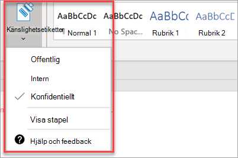

# Konfigurera funktioner för efterlevnad

Din Microsoft 365 Business Premium levereras med funktioner för att skydda dina data och enheter och hjälper dig att skydda din och dina kunders känsliga information.

## Konfigurera DLP-funktioner

Se [Skapa en DLP-princip från en mall](https://docs.microsoft.com/microsoft-365/compliance/create-a-dlp-policy-from-a-template) för ett exempel på hur du ställer in en princip för att skydda mot personligt identifierbar information (PII). 
  
DLP levereras med många färdiga principmallar för många olika språk. Till exempel, Australien Financial Data, Canada Personal Information Act, AMERIKANSKA finansiella data, och så vidare. Se [Vad DLP-principmallarna innehåller](https://docs.microsoft.com/microsoft-365/compliance/what-the-dlp-policy-templates-include) för en fullständig lista. Alla dessa mallar kan aktiveras på samma sätt som pii-mallexemplet. 
  
## Konfigurera lagring av e-post med Exchange Online-arkivering

 **Exchange Online Archiving** licensfunktioner bidra till att upprätthålla efterlevnad och reglerande standarder genom att bevara e-postinnehåll för eDiscovery. Det bidrar också till att minska risken om det finns en rättegång, och ger ett sätt att återställa data efter en säkerhetsöverträdelse eller när du behöver återställa borttagna objekt. Du kan använda bevarande av rättstvister för att bevara allt innehåll för en användare eller använda bevarandeprinciper för att anpassa det du vill bevara.
  
**Rättstvister håller:** Du kan bevara allt postlådeinnehåll, inklusive borttagna objekt genom att spärra hela en användares postlåda. 
    
Så här placerar du en postlåda i bevarandet av rättstvister i administrationscentret:
    
1. Gå till Aktiva användare i den vänstra **navigeringsfältet** \> **Active users**.
    
2. Välj en användare vars postlåda du vill placera i bevarandet av rättstvister. Expandera **E-postinställningarna**i användarfönstret och välj **Redigera Exchange-egenskaper**bredvid **Fler inställningar**.
    
3. På postlådesidan för användaren väljer du ** postlådefunktioner ** på den vänstra navigeringsfältet och väljer sedan länken **Aktivera** under **Bevarande av juridiska skäl**.
    
4. I dialogrutan **bevarande av rättstvister** kan du ange varaktigheten för bevarande av rättstvister i fältet **Bevarande av juridiska skäl.** Lämna fältet tomt om du vill placera ett oändligt grepp. Du kan också lägga till anteckningar och dirigera postlådans ägare till en webbplats som du kanske måste förklara mer om bevarandet av rättstvister. \>**Spara**.
    
**Lagring:** Du kan aktivera anpassade bevarandeprinciper, till exempel för att bevara under en viss tid eller ta bort innehåll permanent i slutet av kvarhållningsperioden. Mer information finns i [Översikt över bevarandeprinciper](https://docs.microsoft.com/microsoft-365/compliance/retention-policies).

## Ställ in känslighetsetiketter

Känslighetsetiketter levereras med Azure Information Protection (AIP) Plan 1 och hjälper dig att klassificera och eventuellt skydda dina dokument och e-postmeddelanden genom att använda etiketter. Etiketter kan användas automatiskt av administratörer som definierar regler och villkor, manuellt av användare eller genom att använda en kombination där användarna får rekommendationer.

Om du vill ställa in Känslighetsetiketter visar du [skapa och hantera känslighetsetiketter](https://support.office.com/article/2fb96b54-7dd2-4f0c-ac8d-170790d4b8b9) video.

### Installera Azure Information Protection-klienten manuellt

Så här installerar du AIP-klienten manuellt:

1. Ladda ned **AzinfoProtection_UL.exe** från [Microsoft Download Center](https://www.microsoft.com/download/details.aspx?id=53018).
 
2. Du kan kontrollera att installationen fungerade genom att visa ett Word-dokument och se till att alternativet **Känslighet** är tillgängligt på fliken **Start.**
 

Mer information finns i [Installera klienten](https://docs.microsoft.com/azure/information-protection/infoprotect-tutorial-step3).
