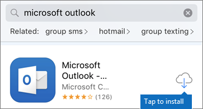
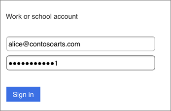
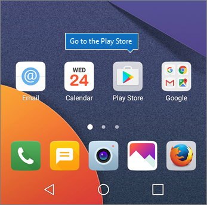
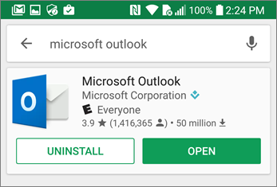

# Konfigurera mobila enheter för Microsoft 365 företag-användare

Följ instruktionerna på flikarna för att installera Office på en iPhone eller en Android-telefon. När du har utfört de här stegen skyddas arbetsfiler som skapats i Office-program av Microsoft 365 Business.

  
Exemplet rör Outlook, men gäller även för alla andra Office-program du vill installera.
  
## Konfigurera mobila enheter

## [iPhone](#tab/iPhone)
  
Titta på en video om hur du konfigurerar Office-apparna på iOS-enheter med Microsoft 365 Business:

> [!VIDEO https://www.microsoft.com/videoplayer/embed/e0ee7052-e0f4-4c42-a4f1-5e91b9776ce9?autoplay=false] 

Gå till **App Store** och sök efter Microsoft Outlook.
  

  
Tryck på molnikonen för att installera Outlook.
  

  
När installationen är klar trycker du på **Öppna** för att öppna Outlook och tryck sedan på **Komma igång**.
  

  
Ange e-postadressen till arbetet på skärmen **Lägg till e-postkonto** \> **Lägg till konto** och ange sedan dina Microsoft 365 Business-inloggningsuppgifter \> **Logga in**.
  

  
Om din organisation skyddar programfiler visas en dialogruta som säger att din organisation nu skyddar appens data och att du måste starta om appen om du vill fortsätta att använda den. Tryck på **OK** och Stäng Outlook. 
  

  
Leta upp Outlook på din iPhone och starta om. Ange och bekräfta PIN-koden när du blir uppmanad. Outlook på din iPhone är nu redo att användas.
  

  
## [Android](#tab/Android)
  
Gå till Play butik om du vill starta installationsprogrammet på din Android telefon.
  

  
Ange Microsoft Outlook i sökrutan och tryck på **Installera**.Tryck på **Öppna** när installationen av Outlook är genomförd.
  

  
I Outlook-appen trycker du på **Komma igång**, lägger till ditt Microsoft 365 Business e-postkonto \> **Fortsätt** och logga in med dina inloggningsuppgifter.
  

  
I dialogrutan som meddelar att du måste installera appen Intune-företagsportal trycker du på **Gå till butik**.
  

  
Installera Intune-företagsportal från Play Butik.
  

  
Öppna Outlook igen, och ange/bekräfta din PIN-kod. Outlook-appen är nu klar för användning.
  

  
---

