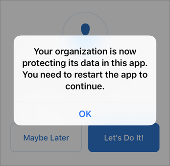

# Konfigurera mobila enheter för Microsoft 365 företag-användare

Följ instruktionerna på flikarna för att installera Office på en iPhone eller en Android-telefon. När du har utfört de här stegen skyddas arbetsfiler som skapats i Office-program av Microsoft 365 Business.

Exemplet rör Outlook, men gäller även för alla andra Office-program du vill installera.
  
## Konfigurera mobila enheter

## [Iphone](#tab/iPhone)
  
Titta på en kort video om hur du konfigurerar Office-appar på iOS-enheter med Microsoft 365 Business.  

> [!VIDEO https://www.microsoft.com/videoplayer/embed/RWee2n] 

Om den här videon har hjälpt dig kan du ta en titt på den [fullständiga utbildningsserien för småföretag och nya användare av Microsoft 365](https://support.office.com/article/6ab4bbcd-79cf-4000-a0bd-d42ce4d12816).

Gå till **App Store** och sök efter Microsoft Outlook.
  

  
Tryck på molnikonen för att installera Outlook.
  

  
När installationen är klar trycker du på **Öppna** för att öppna Outlook och tryck sedan på **Komma igång**.
  

  
Ange e-postadressen till arbetet på skärmen **Lägg till e-postkonto** \> **Lägg till konto** och ange sedan dina Microsoft 365 Business-inloggningsuppgifter \> **Logga in**.
  

  
Om din organisation skyddar filer i appar visas en dialogruta där det står att din organisation nu skyddar data i appen och du måste starta om appen för att fortsätta använda den. Tryck på **OK** och Stäng Outlook. 
  

  
Leta upp Outlook på din iPhone och starta om. När du uppmanas till det anger du en PIN-kod och verifierar den. Outlook på din iPhone är nu redo att användas.
  

  
## [Android](#tab/Android)
  
Titta på en video om hur du installerar Outlook och Office på Android-enheter.  

> [!VIDEO https://www.microsoft.com/videoplayer/embed/ecc2e9c0-bc7e-4f26-8b14-91d84dbcfef0] 

Om den här videon har hjälpt dig kan du ta en titt på den [fullständiga utbildningsserien för småföretag och nya användare av Microsoft 365](https://support.office.com/article/6ab4bbcd-79cf-4000-a0bd-d42ce4d12816).

Om du vill börja konfigurera på din Android-telefon går du till Play Store.
  

  
Ange Microsoft Outlook i sökrutan på Google Play och tryck på **Installera**. När Outlook är klar med installationen trycker du på **Öppna**.
  

  
Tryck på Kom **igång**i Outlook-appen och lägg sedan \> till ditt Microsoft 365 Business-e-postkonto **Fortsätt**och loggar in med dina organisationsuppgifter.
  

  
I dialogrutan som meddelar att du måste installera appen Intune-företagsportal trycker du på **Gå till butik**.
  

  
Installera Intune Company Portal i Play Butik.
  

  
Öppna Outlook igen, och ange/bekräfta din PIN-kod. Outlook-appen är nu klar för användning.
  

## Se även

[Utbildningsvideor för Microsoft 365 Business](https://support.office.com/article/6ab4bbcd-79cf-4000-a0bd-d42ce4d12816)

---
