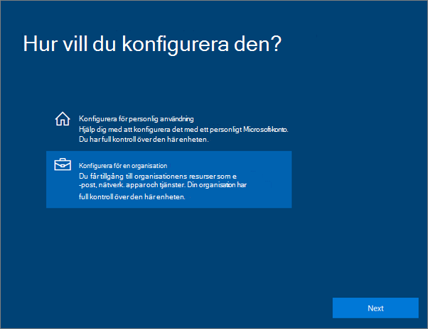
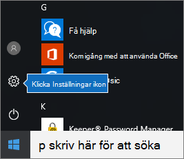
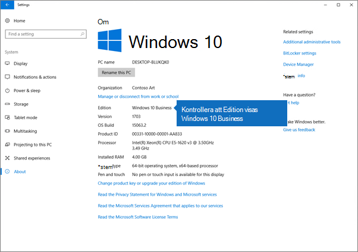

# Konfigurera Windows-enheter för Microsoft 365 Business Premium-användareSet up Windows devices for Microsoft 365 Business Premium users

## Förutsättningar för att konfigurera Windows-enheter för Microsoft 365 Business Premium-användarePrerequisites for setting up Windows devices for Microsoft 365 Business Premium users

Innan du kan konfigurera Windows-enheter för Microsoft 365 Business Premium-användare kontrollerar du att alla Windows-enheter kör Windows 10 Pro, version 1703 (Creators Update).Before you can set up Windows devices for Microsoft 365 Business Premium users, make sure all the Windows devices are running Windows 10 Pro, version 1703 (Creators Update). Windows 10 Pro är en förutsättning för distribution av Windows 10 Business, som är en uppsättning molntjänster och enhetshanteringsfunktioner som kompletterar Windows 10 Pro och aktiverar centraliserade hanterings- och säkerhetskontroller av Microsoft 365 Business Premium.Windows 10 Pro is a prerequisite for deploying Windows 10 Business, which is a set of cloud services and device management capabilities that complement Windows 10 Pro and enable the centralized management and security controls of Microsoft 365 Business Premium.
  
Om du har Windows-enheter som kör Windows 7 Pro, Windows 8 Pro eller Windows 8.1 Pro ger din Microsoft 365 Business Premium-prenumeration dig rätt till en Windows 10-uppgradering.If you have Windows devices running Windows 7 Pro, Windows 8 Pro, or Windows 8.1 Pro, your Microsoft 365 Business Premium subscription entitles you to a Windows 10 upgrade.
  
Följ stegen i det här avsnittet för att få mer information om hur du uppgraderar Windows-enheter till Windows 10 Pro Creators Update: [Uppgradera Windows-enheter till Windows Pro Creators Update](upgrade-to-windows-pro-creators-update.md).For more information on how to upgrade Windows devices to Windows 10 Pro Creators Update, follow the steps in this topic: [Upgrade Windows devices to Windows Pro Creators Update](upgrade-to-windows-pro-creators-update.md).
  
Se [Verifiera att enheten är ansluten till Azure AD](#verify-the-device-is-connected-to-azure-ad) för att verifiera att du har uppgraderingen eller för att se till att uppgraderingen fungerade.See [Verify the device is connected to Azure AD](#verify-the-device-is-connected-to-azure-ad) to verify you have the upgrade, or to make sure the upgrade worked.

Titta på en kort video om hur du ansluter Windows till Microsoft 365.Watch a short video about connecting Windows to Microsoft 365.  

> [!VIDEO https://www.microsoft.com/videoplayer/embed/RE3yXh3] 

Om den här videon har hjälpt dig kan du ta en titt på den [fullständiga utbildningsserien för småföretag och nya användare av Microsoft 365](https://support.office.com/article/6ab4bbcd-79cf-4000-a0bd-d42ce4d12816).If you found this video helpful, check out the [complete training series for small businesses and those new to Microsoft 365](https://support.office.com/article/6ab4bbcd-79cf-4000-a0bd-d42ce4d12816).
  
## Anslut Windows 10-enheter till organisationens Azure ADJoin Windows 10 devices to your organization's Azure AD

När alla Windows-enheter i organisationen antingen har uppgraderats till Windows 10 Pro Creators Update eller redan kör Windows 10 Pro Creators Update kan du ansluta dessa enheter till organisationens Azure Active Directory.When all Windows devices in your organization have either been upgraded to Windows 10 Pro Creators Update or are already running Windows 10 Pro Creators Update, you can join these devices to your organization's Azure Active Directory. När enheterna har anslutits uppgraderas de automatiskt till Windows 10 Business, som ingår i din Microsoft 365 Business Premium-prenumeration.Once the devices are joined, they'll be automatically upgraded to Windows 10 Business, which is part of your Microsoft 365 Business Premium subscription.
  
### En helt ny eller nyligen uppgraderad Windows 10 Pro-enhetFor a brand new, or newly upgraded, Windows 10 Pro device

Följ de här stegen för helt nya enheter som kör Windows 10 Pro Creators Update eller för enheter som uppgraderats till Windows 10 Pro Creators Update men som inte utfört konfiguration för Windows 10-enheter.For a brand new device running Windows 10 Pro Creators Update, or for a device that was upgraded to Windows 10 Pro Creators Update but has not gone through Windows 10 device setup, follow these steps.
  
1. Gå igenom konfigurationen av Windows 10-enheter tills du kommer till sidan **Hur vill du konfigurera?**Go through Windows 10 device setup until you get to the **How would you like to set up?** page. 
    
    
  
2. Här väljer du **Konfigurera för en organisation** och anger sedan ditt användarnamn och lösenord för Microsoft 365 Business Premium.Here, choose **Set up for an organization** and then enter your username and password for Microsoft 365 Business Premium. 
    
3. Slutför konfigurationen av Windows 10-enhet.Finish Windows 10 device setup.
    
   När du är klar är användaren ansluten till organisationens Azure AD. Kontrollera att allt är korrekt genom att läsa [Kontrollera att enheten är ansluten till Azure AD](#verify-the-device-is-connected-to-azure-ad).Once you're done, the user will be connected to your organization's Azure AD. See [Verify the device is connected to Azure AD](#verify-the-device-is-connected-to-azure-ad) to make sure. 
  
### Enheter som redan är konfigurerade och använder Windows 10 ProFor a device already set up and running Windows 10 Pro

 **Ansluta användare till Azure AD:****Connect users to Azure AD:**
  
1. Klicka på Windows-logotypen och sedan på inställningsikonen på användarens dator med Windows 10 Pro, version 1703 (Creators Update) (se [förutsättningar](pre-requisites-for-data-protection.md)).In your user's Windows PC, that is running Windows 10 Pro, version 1703 (Creators Update) (see [pre-requisites](pre-requisites-for-data-protection.md)), click the Windows logo, and then the Settings icon.
  
   
  
2. I **Inställningar** går du till **Konton**.In **Settings**, go to **Accounts**.
  
   
  
3. På sidan **Din information** klickar du på **Åtkomst till arbete eller skola** \> **Anslut**.On **Your info** page, click **Access work or school** \> **Connect**.
  
   
  
4. I dialogrutan **Konfigurera ett arbets- eller skolkonto** dialogrutan väljer du **Anslut den här enheten till Azure Active Directory** under **Alternativa åtgärder**.On the **Set up a work or school account** dialog, under **Alternate actions**, choose **Join this device to Azure Active Directory**.
  
   
  
5. On the **Let's get you signed in** page, enter your work or school account \> **Next**.On the **Let's get you signed in** page, enter your work or school account \> **Next**.
  
   On the **Enter password** page, enter your password \> **Sign in**.On the **Enter password** page, enter your password \> **Sign in**.
  
   
  
6. Kontrollera att informationen är korrekt på sidan Kontrollera att **informationen är** korrekt och klicka på Gå **med**.On the **Make sure this is your organization** page, verify that the information is correct, and click **Join**.
  
   På sidan **Klart!** klickar du på **Klar**.On the **You're all set!** page, click **Done**.
  
   
  
Om du laddade upp filer till OneDrive för företag, synkroniserar du dem med datorn.If you uploaded files to OneDrive for Business, sync them back down. Om du använde ett verktyg från tredje part för att migrera profil och filer synkroniserar du även dem med den nya profilen.If you used a third-party tool to migrate profile and files, also sync those to the new profile.
  
## Kontrollera att enheten är ansluten till Azure ADVerify the device is connected to Azure AD

Om du vill verifiera synkroniseringsstatus klickar du i området **Anslut till** _ _ på sidan Access för arbete eller **skola** i **Inställningar**för att \<organization name\> visa knapparna **Info** och **Koppla från**.To verify your sync status, on the **Access work or school** page in **Settings**, click in the **Connected to** _ \<organization name\> _ area to expose the buttons **Info** and **Disconnect**. Klicka på **Info** för att få din synkroniseringsstatus.Click on **Info** to get your synchronization status. 
  
Klicka på Synkronisera på sidan Synkroniseringsstatus synkronisering för att hämta de senaste hanteringsprinciperna för mobila enheter till datorn.On the Sync status page, click Sync to get the latest mobile device management policies onto the PC.
  
Om du vill börja använda Microsoft 365 Business Premium-kontot går du till **Start-knappen i** Windows, högerklickar på din aktuella kontobild och byter sedan **konto**.To start using the Microsoft 365 Business Premium account, go to the Windows **Start** button, right-click your current account picture, and then **Switch account**. Logga in med din e-postadress och lösenord hos organisationen.Sign in by using your organization email and password.
  

  
## Kontrollera att enheten uppgraderats till Windows 10 BusinessVerify the device is upgraded to Windows 10 Business

Kontrollera att dina Azure AD-anslutna Windows 10-enheter har uppgraderats till Windows 10 Business som en del av din Microsoft 365 Business Premium-prenumeration.Verify that your Azure AD joined Windows 10 devices were upgraded to Windows 10 Business as part of your Microsoft 365 Business Premium subscription.
  
1. Gå till **Inställningar** \> **System** \> **Om**.Go to **Settings** \> **System** \> **About**.
    
2. Kontrollera att **Version** är **Windows 10 Business**.Confirm that the **Edition** shows **Windows 10 Business**.
    
    
  
## Nästa stegNext steps

Information om hur du konfigurerar dina mobila enheter finns i [Konfigurera mobila enheter för Microsoft 365 Business Premium-användare](set-up-mobile-devices.md), Så här anger du principer för enhetsskydd eller appskydd, Hantera Microsoft [365 för företag](manage.md).To set up your mobile devices, see [Set up mobile devices for Microsoft 365 Business Premium users](set-up-mobile-devices.md), To set device protection or app protection policies, see [Manage Microsoft 365 for business](manage.md).
  
## Mer information om hur du konfigurerar och använder Microsoft 365 Business PremiumFor more on setting up and using Microsoft 365 Business Premium

[Utbildningsvideor för Microsoft 365 BusinessMicrosoft 365 for business training videos](https://support.office.com/article/6ab4bbcd-79cf-4000-a0bd-d42ce4d12816)
