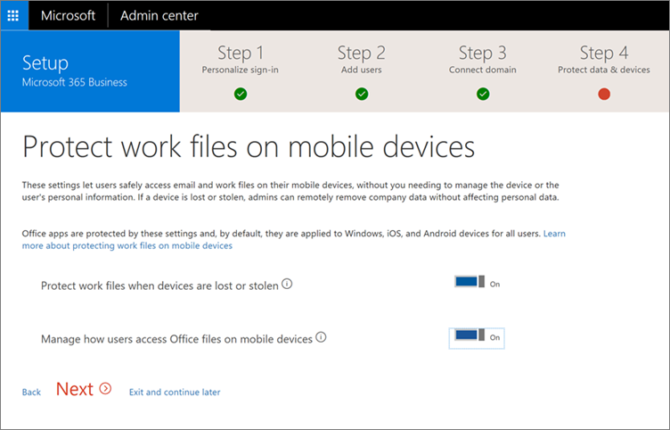

# Konfigurera Microsoft 365 Business med hjälp av installationsguidenSet up Microsoft 365 Business by using the setup wizard

Slutför steg 1 – 4 nedan.Complete steps 1-4 below.
  
### Konfigurera Microsoft 365 BusinessSet up Microsoft 365 Business

Titta på en video om hur du konfigurerar Microsoft 365 Business när du inte har en lokal Active Directory:Watch a video on how to set up Microsoft 365 Business when you don't have an on-premises Active Directory:
  
> [!VIDEO https://www.microsoft.com/videoplayer/embed/0705c337-f3e8-4d28-bb6c-530cd28e99f2?autoplay=false]
  
Installation steg innehåller information för inställningar som inkluderar lokala Active Directory. Om du vill fortsätta använda domänanslutna enheter läser följande artiklar för två olika sätt att aktivera som och slutför stegen innan du kör guiden:The set-up steps include information for setups that include local Active Directory. If you want to continue to access domain-joined devices, read the following articles for two different way of enabling that, and complete the steps before you run the Setup wizard:
  
- [Aktivera domänanslutna Windows 10-enheter för hantering i Microsoft 365 BusinessEnable domain-joined Windows 10 devices to be managed by Microsoft 365 Business](manage-windows-devices.md)
    
    -Detta är det rekommenderade sättet.-This is the recommended way.
    
- [Åtkomst på lokala resurser från en Azure AD-ansluten enhet i Microsoft 365 BusinessAccess on-premises resources from an Azure AD-joined device in Microsoft 365 Business](access-resources.md)
    
### Steg 1: Anpassa logga inStep 1: Personalize sign-in

1. Logga in på [Microsoft 365 Business](https://portal.microsoft.com) som global administratör. Välj panelen **Administratör** för att gå till administrationscentret.Sign in to [Microsoft 365 Business](https://portal.microsoft.com) by using your global admin credentials. Choose the **Admin** tile to go to the admin center. 
    
2. Välj **Påbörja installationen** (beroende på din region visas kanske **Fortsätt installationen** i stället) i administrationscentret för att starta guiden.Choose **Start setup** (depending on your state you may see **Continue setup** instead) in the admin center to start the wizard. 
    
3. Ange domännamnet du vill använda (t.ex. contoso.com).Enter the domain name you want to use (like contoso.com).
    
    Gå vidare och ange din domän, även om du har verifierat när du använder Azure AD Connect, t.ex. Följande två steg gäller inte för dig om du har använt Azure AD Anslut för att verifiera din domän.Go ahead and enter your domain even if you have verified it while using Azure AD Connect, for example. The following two steps do not apply to you if you used Azure AD Connect to verify your domain.
    
4. Följ stegen i guiden för att [Skapa DNS-poster på en DNS-värd leverantör för Office 365](https://support.office.com/article/7b7b075d-79f9-4e37-8a9e-fb60c1d95166) som verifierar att du äger domänen.Follow the steps in the wizard to [Create DNS records at any DNS hosting provider for Office 365](https://support.office.com/article/7b7b075d-79f9-4e37-8a9e-fb60c1d95166) that verifies you own the domain. 
    
    Du kan se en film som exempel [Video: installationsprogrammet för Office 365 i nya Admin Center](https://support.office.com/article/a8c2002a-34bc-4ab3-93d8-9b5156c48bf8). Observera att den här videon inte innehåller data protection stegen i Microsoft 365 Business.You can view an example video of [Video: Setup Office 365 in the new Admin Center](https://support.office.com/article/a8c2002a-34bc-4ab3-93d8-9b5156c48bf8). Note that this video does not include the data protection steps of Microsoft 365 Business.
    
    
  
### Steg 2: Lägga till användare och tilldela licenserStep 2: Add users and assign licenses

1. Du kan lägga till användare här eller också kan du [lägga till användare senare](add-users-m365b.md) i administratörscenter.You can add users here, or you can [add users later](add-users-m365b.md) in the admin center. 
    
    Alla användare tilldelas automatiskt en Microsoft 365 Business-licens.Any users you add get automatically assigned a Microsoft 365 Business license.
    
2. Om ditt Microsoft 365 Business-abonnemang har befintliga användare (till exempel om du använde Azure AD Connect), får du möjlighet att tilldela licenser till dem nu. Lägg till licenser till dem också.If your Microsoft 365 Business subscription has existing users (for example, if you used Azure AD Connect) , you will get an option to assign licenses to them now. Go ahead and add licenses to them as well.
    
3. Du får också möjlighet att dela autentiseringsuppgifter med de nya användarna som du har lagt till. Du kan välja att skriva ut, e-posta eller ladda ned.You will also get an option to share credentials with the new users you added. You can choose to print them out, email them, or download them.
    
4. Hoppa över steget att föra över e-postmeddelanden och välj **Nästa** på sidan **Migrera e-postmeddelanden**.Skip migrating email messages and choose **Next** on **Migrate email messages** page. 
    
    Om du flyttar från en annan leverantör av e-post och vill kopiera data senare, kan du [migrera e-post och kontakter till Office 365](https://support.office.com/article/a3e3bddb-582e-4133-8670-e61b9f58627e).If you are moving from another email provider and want to copy your data later, you can [Migrate email and contacts to Office 365](https://support.office.com/article/a3e3bddb-582e-4133-8670-e61b9f58627e).
    
    
  
### Steg 3: Anslut din domänStep 3: Connect your domain

> [!NOTE]
> Om du väljer att använda .onmicrosoft-domän eller Azure AD Connect, visas inte det här steget.If you chose to use the .onmicrosoft domain, or used Azure AD Connect, you will not see this step. 
  
För att få igång tjänsten måste du uppdatera några poster hos din DNS-värd eller domänregistrator.To set up services, you have to update some records at your DNS host or domain registrar.
  
1. Installationsguiden identifierar domänregistreraren normalt och ger en länk till stegvisa instruktioner för uppdatering av NS-poster via webbplatsen justitiesekreterare. Om den inte [Ändra nameservers att ställa in Office 365 med något domänregistrerare](https://support.office.com/article/a8b487a9-2a45-4581-9dc4-5d28a47010a2).The setup wizard typically detects your registrar and gives you a link to step-by-step instructions for updating your NS records at the registrar website. If it doesn't, [Change nameservers to set up Office 365 with any domain registrar](https://support.office.com/article/a8b487a9-2a45-4581-9dc4-5d28a47010a2).
    
2. E-post och andra tjänster konfigureras automatisktEmail and other services will be set up for you
    
### Steg 4: Hantera enheter och arbeta med filerStep 4: Manage devices and work files

1. Sidan Ange på **skydda arbete filer på dina mobila enheter** **hantera hur användare kan komma åt Office-filer på mobila enheter** inställningar och **skydda arbete filer går förlorade eller stulna enheter** **på**. Du kan också använda varje underordnad inställning genom att klicka på sparrarna vid varje inställning.On the **Protect work files on your mobile devices** page set both **Protect work files when devices are lost or stolen** and **Manage how users access Office files on mobile devices** settings to **On**. You can also access each sub-setting by clicking the chevrons next to each setting.
  
  Alla licensierade användarnas arbete filer nu skyddas på iOS- och Android-enheter, så snart som de [installerar Office apps](set-up-mobile-devices.md) (och autentisera med sina autentiseringsuppgifter i Microsoft 365 Business).All of your licensed users' work files are now protected on iOS and Android devices, as soon as they [install Office apps](set-up-mobile-devices.md) (and authenticate with their Microsoft 365 Business credentials). 
  
  
  
2. På sidan **Ange Windows 10 enhetskonfigurationen** ställa **Säker Windows 10 enheter** **på**.On the **Set Windows 10 device configuration** page, set **Secure Windows 10 Devices** setting to **On**.
  
   Du kan också använda varje underordnad inställning genom att klicka på ikonen bredvid den.You can also access each sub-setting by clicking the chevron next to it.
  
3. Ange inställningen **Installera Office på Windows 10 enheter** till **Ja** om alla användare har Windows 10-datorer och inga befintliga Office installerar eller klicka-och-kör Office installeras. Om så inte är fallet kan du ange det här alternativet **Nej**. Du kan [installera Office automatiskt](auto-install-or-uninstall-office.md) senare från administratörscenter när du har förberett användarnas datorer. Instruktioner finns i [förbereda för installation av Office-klient](prepare-for-office-client-deployment.md).Set the **Install Office on Windows 10 Devices** setting to **Yes** if all of your users have Windows 10 computers, and either no existing Office installs, or click-to-run Office installs. If this is not the case, set this option to **No**. You can [automatically install Office](auto-install-or-uninstall-office.md) later from the admin center after you have prepared the user computers. For instructions, see [prepare for Office client installation](prepare-for-office-client-deployment.md).
  
    Licensierade användare arbetsfält på Windows 10 enheter kommer att projiceras så snart som de [ansluta sina Windows 10-enhet](set-up-windows-devices.md) till en Microsoft 365 Business Azure AD-domän eller [installera Windows 10 på en ny dator](https://support.office.com/article/c654bd23-d256-4ac7-8fba-0c993bf5a771.aspx) medan du samtidigt ansluta till Microsoft 365 Business Azure AD-domänen.The licensed users' work files on Windows 10 devices will be projected as soon as they [join their Windows 10 device](set-up-windows-devices.md) to a Microsoft 365 Business Azure AD domain or [install Windows 10 on a new computer](https://support.office.com/article/c654bd23-d256-4ac7-8fba-0c993bf5a771.aspx) while simultaneously joining the Microsoft 365 Business Azure AD domain. 
  
4. Klicka på **Nästa** och du är klar med installationen.Click **Next** and you are done with setup. 
  
    Lämna oss feedback i det här steget för att hjälpa oss att förbättra upplevelsen.Please leave us feedback at this step to help us improve the experience.
  
    
  
## Ytterligare säkerhetsinställningarAdditional security settings

Förutom säkerhet och regelefterlevnad inställning i guiden kan du också ange följande inställningar:In addition to the security and compliance setting in the setup wizard, you can also set up the following additional settings:
  
- Ställa in skydd mot osäkra bifogade filer. **Avancerat skydd** (ATP) identifierar skadligt innehåll och blockerar leverans av osäkra bifogade filer, skydda mot phishing system och ransomware infektioner. Om du vill aktivera skydd för bifogade filer finns i [ställa in principer för Office 365 ATP säkra bifogade filer](https://support.office.com/article/078eb946-819a-4e13-8673-fe0c0ad3a775#setpolicy).Set up protection against unsafe attachments. **Advanced Threat Protection** (ATP) identifies malicious content and then blocks delivery of unsafe attachments, helping protect you against phishing schemes and ransomware infections. To activate attachment protection, see [Set up Office 365 ATP Safe Attachments policies](https://support.office.com/article/078eb946-819a-4e13-8673-fe0c0ad3a775#setpolicy).
    
- Skydda när användaren klickar på skadliga länkar. ATP undersöker länkar i e-post när en användare klickar på dem.. Om en länk är osäkra, inte att besöka webbplatsen för användaren eller informeras om att webbplatsen har blockerats. Detta skyddar mot phishing system. [Konfigurera Office 365 ATP Safe länkar principer](https://support.office.com/article/bdd5372d-775e-4442-9c1b-609627b94b5d#reveddefaultscc) eller [Konfigurera Office 365 ATP Safe länkar principer](https://support.office.com/article/bdd5372d-775e-4442-9c1b-609627b94b5d#addemailpolscc).Protect your environment when users click malicious links. ATP examines links in email at the time a user clicks them. If a link is unsafe, the user is warned not to visit the site or informed that the site has been blocked. This helps protect against phishing schemes. [Set up Office 365 ATP Safe Links policies](https://support.office.com/article/bdd5372d-775e-4442-9c1b-609627b94b5d#reveddefaultscc) or [Set up Office 365 ATP Safe Links policies](https://support.office.com/article/bdd5372d-775e-4442-9c1b-609627b94b5d#addemailpolscc).
    
- Du kan behålla alla innehållet inklusive borttagna objekt genom att infoga hela postlådan för en användare i en **rättstvist håller**. Instruktioner finns iYou can preserve all mailbox content including deleted items by putting a user's entire mailbox on **litigation hold**. For instructions, see 
- [Ställ in e-lagring med Exchange Online-arkivering](security-features.md#set-up-email-retention-with-exchange-online-archiving).[Set up email retention with Exchange Online Archiving](security-features.md#set-up-email-retention-with-exchange-online-archiving).
    
- Ställ in anpassade **principer för bevarande**, till exempel att bevara under en viss tid eller permanent ta bort innehåll i slutet av loggperioden. Du kan aktivera anpassade lagringsprinciper i regelefterlevnadscentret, gå till **Data-styre** och värdepapper \> **bevarande**och följ sedan stegen i guiden. Mer information finns i [Översikt över bevarandeprinciper](https://support.office.com/article/5e377752-700d-4870-9b6d-12bfc12d2423).Set up customized **retention policies**, for example, to preserve for a specific amount of time or delete content permanently at the end of the retention period. You can enable customized retention policies in the Securities and compliance center, go to **Data governance** \> **Retention**, and then follow the steps in the wizard. To learn more, see [Overview of retention policies](https://support.office.com/article/5e377752-700d-4870-9b6d-12bfc12d2423).
    
## Nästa stegNext steps

För de användare som har licenser, är nästa steg att konfigurera enheter.For the users that have their licenses, the next step is to set up devices.  Se [Konfigurera Windows-enheter för Microsoft 365 Business-användare](set-up-windows-devices.md) och [Konfigurera mobila enheter för Microsoft 365 Business-användare](set-up-mobile-devices.md).See [Set up Windows devices for Microsoft 365 Business users](set-up-windows-devices.md) and [Set up mobile devices for Microsoft 365 Business users](set-up-mobile-devices.md).  Se [Hantera Microsoft 365 Business](manage.md) för länkar till information om hur du anger enhets- och programskyddsprinciper och hur du tar bort data från användares enheter.See [Manage Microsoft 365 Business](manage.md) for links to topics on how to set device and app protection polices, and how to remove data from user devices. 
  

