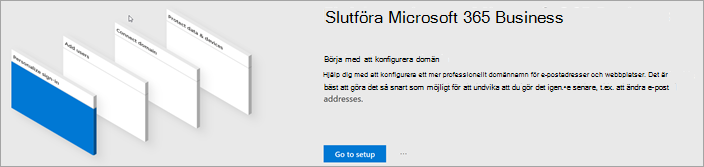

# Konfigurera Microsoft 365 Business Premium i installationsguidenSet up Microsoft 365 Business Premium in the setup wizard

## Titta: Översikt över Microsoft 365 konfigurationWatch: Overview of Microsoft 365 setup

Titta på den här videon för en översikt över Microsoft 365 Business Premium konfiguration.Watch this video for an overview of Microsoft 365 Business Premium setup.  

> [!VIDEO https://www.microsoft.com/videoplayer/embed/RE4jZwg] 

## Lägga till domän, användare och konfigurera principerAdd your domain, users, and set up policies

När du köper Microsoft 365 Business Premium domän kan du välja att använda en domän som du äger eller köpa en i [samband med köpet.](sign-up.md)When you purchase Microsoft 365 Business Premium, you have the option of using a domain you own, or buying one during the [sign-up](sign-up.md).

- Om du har köpt en ny domän när du registrerade dig kommer din domän att konfigureras, och du kan gå vidare till [Lägga till användare och tilldela licenser](#add-users-and-assign-licenses).If you purchased a new domain when you signed up, your domain is all set up and you can move to [Add users and assign licenses](#add-users-and-assign-licenses).

### Lägga till din domän för att personanpassa inloggningAdd your domain to personalize sign-in

1. Logga in på [Administrationscenter för Microsoft 365](https://admin.microsoft.com) som global administratör.Sign in to [Microsoft 365 admin center](https://admin.microsoft.com) by using your global admin credentials. 

2. Starta guiden genom att välja **Gå till inställningar**.Choose **Go to setup** to start the wizard.

    

3. På sidan **Installera Office-apparna** kan du välja att installera apparna på din egen dator.On the **Install your Office apps** page, you can optionally install the apps on your own computer.
    
4. Under steget **Lägg till domän** anger du domännamnet du vill använda (t.ex. contoso.com).In the **Add domain** step, enter the domain name you want to use (like contoso.com).

    > [!IMPORTANT]
    > Om du har köpt en domän under registreringen ser du inte steget **Lägg till en domän** här. Gå i stället till [Lägg till användare](#add-users-and-assign-licenses).If you purchased a domain during the sign-up, you will not see **Add a domain** step here. Go to [Add users](#add-users-and-assign-licenses) instead.

    

    
4. Följ stegen i guiden för att [Skapa DNS-poster hos en DNS-värd](/office365/admin/get-help-with-domains/create-dns-records-at-any-dns-hosting-provider) för Microsoft 365 som verifierar att du äger domänen.Follow the steps in the wizard to [Create DNS records at any DNS hosting provider for Microsoft 365](/office365/admin/get-help-with-domains/create-dns-records-at-any-dns-hosting-provider) that verifies you own the domain. Om du vet vilken din domänvärd är kan du även se [Värdspecifika anvisningar](/office365/admin/get-help-with-domains/set-up-your-domain-host-specific-instructions).If you know your domain host, see also the [host specific instructions](/office365/admin/get-help-with-domains/set-up-your-domain-host-specific-instructions).

    Om din värd är GoDaddy eller en annan värd som är aktiverad med [Domain Connect](/office365/admin/get-help-with-domains/domain-connect)är processen enkel och du blir automatiskt ombedd att logga in och låta Microsoft autentisera.If your hosting provider is GoDaddy or another host enabled with [domain connect](/office365/admin/get-help-with-domains/domain-connect), the process is easy and you'll be automatically asked to sign in and let Microsoft authenticate on your behalf.

    

### Lägga till användare och tilldela licenserAdd users and assign licenses

Du kan lägga till användare i guiden eller så kan du [lägga till användare senare](../admin/add-users/add-users.md) i administratörscentret.You can add users in the wizard, but you can also [add users later](../admin/add-users/add-users.md) in the admin center. Om du har en lokal domänkontrollant kan du även lägga till användare med [Azure AD Connect](/azure/active-directory/hybrid/how-to-connect-install-express).Additionally, if you have a local domain controller, you can add users with [Azure AD Connect](/azure/active-directory/hybrid/how-to-connect-install-express).

#### Lägg till användare i guidenAdd users in the wizard

Alla användare som du lägger till i guiden tilldelas automatiskt en Microsoft 365 Business Premium licens.Any users you add in the wizard get automatically assigned a Microsoft 365 Business Premium license.

1. Om din Microsoft 365 Business Premium-prenumeration har befintliga användare (till exempel om du använde Azure AD Anslut) får du möjlighet att tilldela licenser till dem nu.If your Microsoft 365 Business Premium subscription has existing users (for example, if you used Azure AD Connect), you get an option to assign licenses to them now. Lägg till licenser till dem också.Go ahead and add licenses to them as well.

2. När du har lagt till användarna får du även ett alternativ för att dela autentiseringsuppgifter med dem. Du kan välja att skriva ut, skicka via e-post eller ladda ned dem.After you've added the users, you'll also get an option to share credentials with the new users you added. You can choose to print them out, email them, or download them.

### Koppla din domänConnect your domain

> [!NOTE]
> Om du väljer att använda .onmicrosoft-domänen, eller använde Azure AD Connect för att konfigurera användare, kommer du inte att se det här steget.If you chose to use the .onmicrosoft domain, or used Azure AD Connect to set up users, you will not see this step.
  
För att få igång tjänsten måste du uppdatera några poster hos din DNS-värd eller domänregistrator.To set up services, you have to update some records at your DNS host or domain registrar.
  
1. Installationsguiden identifierar normalt din domänregistrator och ger dig en länk till stegvisa instruktioner för att uppdatera dina NS-poster på registratorns webbplats.The setup wizard typically detects your registrar and gives you a link to step-by-step instructions for updating your NS records at the registrar website. Om det inte fungerar kan [du ändra namnservrar för att konfigurera Microsoft 365 med valfri domänregistrator](../admin/get-help-with-domains/change-nameservers-at-any-domain-registrar.md).If it doesn't, [Change nameservers to set up Microsoft 365 with any domain registrar](../admin/get-help-with-domains/change-nameservers-at-any-domain-registrar.md). 

    - Om du har befintliga DNS-poster, t. ex. en befintlig webbplats, men din DNS-värd är aktiverad för [Domain Connect](/office365/admin/get-help-with-domains/domain-connect)väljer du **Lägga till poster för mig**.If you have existing DNS records, for example an existing web site, but your DNS host is enabled for [domain connect](/office365/admin/get-help-with-domains/domain-connect), choose **Add records for me**. På sidan **Välj onlinetjänster** accepterar du alla standardinställningar och väljer **Nästa** och väljer **Auktorisera** på DNS-värdens sida.On the **Choose your online services** page, accept all the defaults, and choose **Next**, and choose **Authorize** on your DNS host's page.
    - Om du har befintliga DNS-poster med andra DNS-värdar (inte aktiverad för domänanslutning), ska du hantera dina egna DNS-poster för att se till att de befintliga tjänsterna fortsätter att vara anslutna. Mer information finns i [grundläggande information för domän](/office365/admin/get-help-with-domains/dns-basics).If you have existing DNS records with other DNS hosts (not enabled for domain connect), you'll want to manage your own DNS records to make sure the existing services stay connected. See [domain basics](/office365/admin/get-help-with-domains/dns-basics) for more info.

        

2. Följ stegen i guiden så kommer e-postmeddelanden och andra tjänster att konfigureras åt dig.Follow the steps in the wizard and email and other services will be set up for you.

### Skydda din organisationProtect your organization 

Principerna som du skapar i guiden tillämpas automatiskt på säkerhetsgruppen [Alla](/office365/admin/create-groups/compare-groups#security-groups) *användare.*The policies you set up in the wizard are applied automatically to a [Security group](/office365/admin/create-groups/compare-groups#security-groups) called *All Users*. Du kan också skapa ytterligare grupper att tilldela principer till i administrationscentret.You can also create additional groups to assign policies to in the admin center.

1. Om du vill öka skyddet mot avancerade **cyberhot** rekommenderar vi att du accepterar standardinställningarna för att [låta Office 365 Advance Threat Protection](../security/office-365-security/defender-for-office-365.md) söka igenom filer och länkar i Office appar.On the **Increase protection from advanced cyber threats**, it is recommended that you accept the defaults to let [Office 365 Advance Threat Protection](../security/office-365-security/defender-for-office-365.md) scan files and links in Office apps.

    

2. På sidan Förhindra läckage av känsliga **data** godkänner du standardinställningarna för att aktivera Office 365 Skydd mot dataförlust (DLP) för att spåra känsliga data i Office-appar och förhindra oavsiktlig delning av dessa utanför organisationen.On the **Prevent leaks of sensitive data** page, accept the defaults to turn on Office 365 Data Loss Prevention (DLP) to track sensitive data in Office apps and prevent the accidental sharing of these outside your organization.

3. På sidan **Skydda data i Office** för mobila enheter lämnar du hantering av mobilappar på, expanderar inställningarna och granskar dem och väljer sedan Skapa policy för hantering av **mobilappar.**On the **Protect data in Office for mobile** page, leave mobile app management on, expand the settings and review them, and then select **Create mobile app management policy**.

    

## Skydda Windows 10-datorerSecure Windows 10 PCs

Välj Konfigurera i det vänstra **navigeringsfältet** och välj sedan Skydda dina **e-Windows 10** under **Inloggning och säkerhet.**On the left nav, select **Setup** and then, under **Sign-in and security**, choose **Secure your Windows 10 computers**. Kom **igång genom** att välja Visa.Choose **View** to get started. Se [Skydda Windows 10 för](secure-win-10-pcs.md) fullständiga instruktioner.See [secure your Windows 10 computers](secure-win-10-pcs.md) for complete instructions.

## Distribuera Office 365-klientprogramDeploy Office 365 client apps

Om du väljer att installera Office-appar automatiskt under installationen installeras apparna på Windows 10-enheterna när användarna har loggat in i Azure AD från sina Windows-enheter med sina arbetsautentiseringsuppgifter.If you chose to automatically install Office apps during setup, the apps will install on the Windows 10 devices once the users have signed in to Azure AD from their Windows devices, using their work credentials.

Information om Office för mobila iOS- och Android-enheter finns i [Konfigurera mobila enheter för Microsoft 365 Business Premium användare.](set-up-mobile-devices.md)To install Office on mobile iOS or Android devices, see [Set up mobile devices for Microsoft 365 Business Premium users](set-up-mobile-devices.md).

Du kan också installera Office individuellt.You can also install Office individually. Anvisningar finns Office installera på en PC eller [Mac.](https://support.microsoft.com/office/4414eaaf-0478-48be-9c42-23adc4716658)See [install Office on a PC or Mac](https://support.microsoft.com/office/4414eaaf-0478-48be-9c42-23adc4716658) for instructions.

## Relaterat innehållRelated content

[Microsoft 365 om utbildningsvideor för företag](../business-video/index.yml) (länksida)[Microsoft 365 for business training videos](../business-video/index.yml) (link page)
