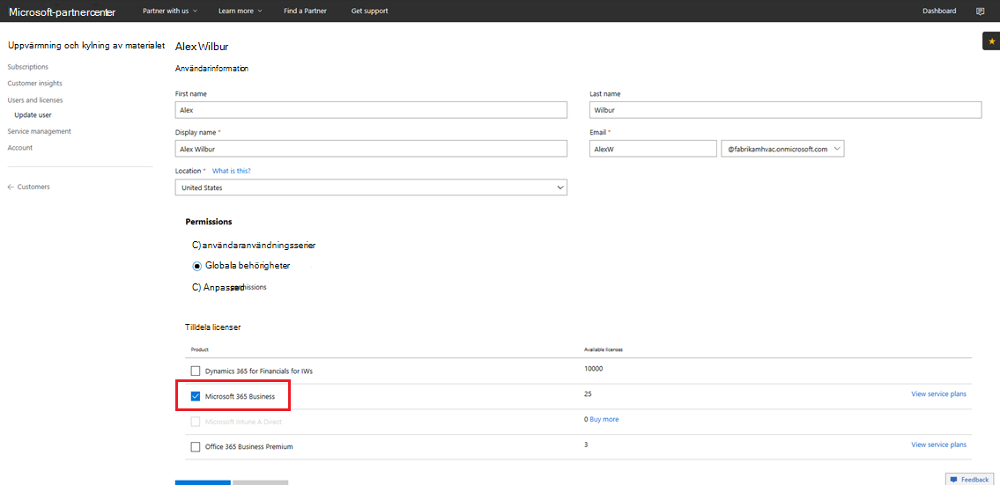

# Övergång till en Microsoft 365 Business prenumeration för CSP

Om du har en Microsoft 365 Business Preview CSP-prenumeration följer du den här guiden för att ta reda på hur du kan gå över din befintliga förhandsversion av prenumerationen till Microsoft 365 Business GA (allmän tillgänglighet).

**Så här går du över en förhandsgranskningsprenumeration till GA**

1. Logga in på <a href="https://partnercenter.microsoft.com" target="_blank">Partner Center.</a>
2. På instrumentpanelen väljer **du Kunder** och sedan företagsnamnet.

    Företagsprenumerationer visas.

    
    
3. På sidan Prenumerationer på företaget **väljer** du Lägg **till prenumeration.**
4. På sidan **Ny** prenumeration väljer du **Småföretag** och **sedan** Microsoft 365 Business i listan.
5. Lägg till antalet licenser och välj sedan **Nästa: Granska för** att granska prenumerationen och välj sedan **Skicka**.

    

    De **licensbaserade prenumerationerna visar** en **förhandsversion Microsoft 365 Business och** **Microsoft 365 Business**. Nästa gång kommer du att avbryta förhandsversionen av prenumerationen.

6. Välj **Microsoft 365 Business Förhandsgranska**.
7. På sidan **Microsoft 365 Business väljer du** **Inaktiverad om du vill** inaktivera förhandsgranskningsprenumerationen.

    

8. Välj **Skicka för** att bekräfta.

    På sidan **Prenumerationer** bekräftar du att statusen **för Microsoft 365 Business är** **Inaktiverad**.

    

9. Du kan också validera licensavtalet. Gör så här:
    1. Välj **Användare och** licenser på företagets **prenumerationssida.**
    2. Välj **en användare på** sidan Användare och licenser.
    3. På användarens sida markerar du avsnittet **Tilldela licenser** och bekräftar att det **Microsoft 365 Business.**

        

## Påverkan på kunder och användare under och efter övergången

Det påverkar inte kunder och användare under övergången eller efter övergången.

## Påverkan på kunder som inte går över

I följande tabell sammanfattas effekterna för kunder som inte går över från en förhandsversion av Microsoft 365 Business till en Microsoft 365 Business prenumeration.

|       | T-0 till T+30     | T+30 till T+60 | T+60 till T+120 | Mer än T+120  |
|-------|-----------------|--------------|---------------|---------------|
| **Region** | I respitperiod | Förfallen      | Inaktiverad      | Återkallad |
| **Tjänsten påverkar**                                                        |
| **Microsoft 365 Business administrationsportalen** | Ingen påverkan på funktioner | Ingen påverkan på funktioner | Kan lägga till/ta bort användare, köpa prenumerationer.  Det går inte att tilldela/återkalla licenser. | Kundens prenumeration och alla data tas bort. Administratören kan hantera andra betalda prenumerationer. |
| **Office appar**                         | Ingen påverkan på slutanvändarna | Ingen påverkan på slutanvändarna | Office i läget Nedsatt funktionalitet.  Användarna kan endast visa filer. | Office i läget Nedsatt funktionalitet.  Användarna kan endast visa filer. |
| **Molntjänster (SharePoint Online, Exchange Online, Skype, Teams med mera)** | Ingen påverkan på slutanvändarna | Ingen påverkan på slutanvändarna | Slutanvändare och administratörer har ingen åtkomst till data i molnet. | Kundens prenumeration och alla data tas bort. |
| **EM+S-komponenter** | Ingen administratörs påverkan  Ingen påverkan på slutanvändarna | Ingen administratörs påverkan  Ingen påverkan på slutanvändarna | Funktionen tillämpas inte längre.  Mer [information finns i Mobil enhet påverkar](#mobile-device-impacts-upon-subscription-expiration) när Windows 10 prenumerationen går ut och om datorn påverkas när [prenumerationen](#windows-10-pc-impacts-upon-subscription-expiration) går ut. | Funktionen tillämpas inte längre.  Mer [information finns i Mobil enhet påverkar](#mobile-device-impacts-upon-subscription-expiration) när Windows 10 prenumerationen går ut och om datorn påverkas när [prenumerationen](#windows-10-pc-impacts-upon-subscription-expiration) går ut. |
| **Windows 10 Business** | Ingen administratörs påverkan  Ingen påverkan på slutanvändarna | Ingen administratörs påverkan  Ingen påverkan på slutanvändarna | Funktionen tillämpas inte längre.  Mer [information finns i Mobil enhet påverkar](#mobile-device-impacts-upon-subscription-expiration) när Windows 10 prenumerationen går ut och om datorn påverkas när [prenumerationen](#windows-10-pc-impacts-upon-subscription-expiration) går ut. | Funktionen tillämpas inte längre.  Mer [information finns i Mobil enhet påverkar](#mobile-device-impacts-upon-subscription-expiration) när Windows 10 prenumerationen går ut och om datorn påverkas när [prenumerationen](#windows-10-pc-impacts-upon-subscription-expiration) går ut. |
| **Azure AD-inloggning på en Windows 10 dator** | Ingen administratörs påverkan  Ingen påverkan på slutanvändarna | Ingen administratörs påverkan  Ingen påverkan på slutanvändarna | Ingen administratörs påverkan  Ingen påverkan på slutanvändarna | När klientorganisationen har tagits bort kan en användare bara logga in med lokala autentiseringsuppgifter. Om det inte finns några lokala autentiseringsuppgifter bör du göra en ny bild av enheten. |

## Mobil enhet påverkar när prenumerationen går ut

I följande tabell sammanfattas påverkan på principer för programhantering på mobila enheter.

|                            | Fullt licensierad upplevelse                      | T+60 dagar efter utgångsdatum          |
|----------------------------|------------------------------------------------|------------------------------------|
| **Ta bort arbetsfiler från en inaktiv enhet** | Arbetsfiler tas bort efter valda dagar | Arbetsfiler finns kvar på användarens personliga enheter |
| **Tvinga användare att spara alla filer i OneDrive för företag** | Arbetsfiler kan endast sparas i OneDrive för företag | Arbetsfiler kan sparas var som helst |
| **Kryptera arbetsfiler** | Arbetsfiler krypteras | Arbetsfiler krypteras inte längre.  Säkerhetsprinciper tas bort och Office data i appar tas bort. |
| **Kräv PIN-kod eller fingeravtryck för åtkomst Office program** | Begränsad åtkomst till appar | Ingen åtkomstbegränsning på appnivå |
| **Återställa PIN-kod när inloggningen misslyckas** | Begränsad åtkomst till appar | Ingen åtkomstbegränsning på appnivå |
| **Kräv att användare loggar in igen Office inaktiva appar** | Inloggning krävs | Ingen inloggning krävs |
| **Neka åtkomst till arbetsfiler på jailbrokade eller rotade enheter** | Arbetsfiler kan inte nås på jailbroken/rotade enheter | Arbetsfiler kan nås på jailbroken/rotade enheter |
| **Tillåt användare att kopiera innehåll från Office till personliga appar** | Kopiera/klistra in begränsade till appar som är tillgängliga som en del Microsoft 365 prenumeration | Kopiera/klistra in tillgängligt för alla appar |

## Windows 10 Dator påverkar när prenumerationen går ut

I följande tabell sammanfattas påverkan på konfigurationsprinciperna Windows 10 enheter.

|                            | Fullt licensierad upplevelse                      | T+60 dagar efter utgångsdatum          |
|----------------------------|------------------------------------------------|------------------------------------|
| **Skydda datorer mot hot med hjälp av Windows Defender** | Aktivera/inaktivera är utanför användarkontrollen | Användaren kan aktivera/inaktivera Windows Defender på Windows 10 dator |
| **Skydda datorer från webbaserade hot i Microsoft Edge** | Datorskydd i Microsoft Edge | Användaren kan aktivera/inaktivera datorskydd i Microsoft Edge |
| **Stänga av enhetens skärm när du är inaktiv** | Admin definierar princip för skärmtidsintervall | Timeout för skärm kan konfigureras av slutanvändaren |
| **Tillåt användare att hämta appar från Microsoft Store** | Administratören definierar om en användare kan ladda ned appar Microsoft Store | Användaren kan ladda ned appar Microsoft Store helst |
| **Tillåt användare att använda Cortana** | Admin definierar princip för användaråtkomst till Cortana | Användarenheter för att aktivera/inaktivera Cortana |
| **Tillåt användare att ta emot tips och annonser från Microsoft** | Admin definierar princip för att användare ska få tips och annonser från Microsoft | Användaren kan aktivera/inaktivera tips och annonser från Microsoft |
| **Tillåt användare att kopiera innehåll från Office-program till personliga program** | Admin definierar princip för att Windows 10-enheter uppdaterade | Användarna kan bestämma när de vill uppdatera Windows |
