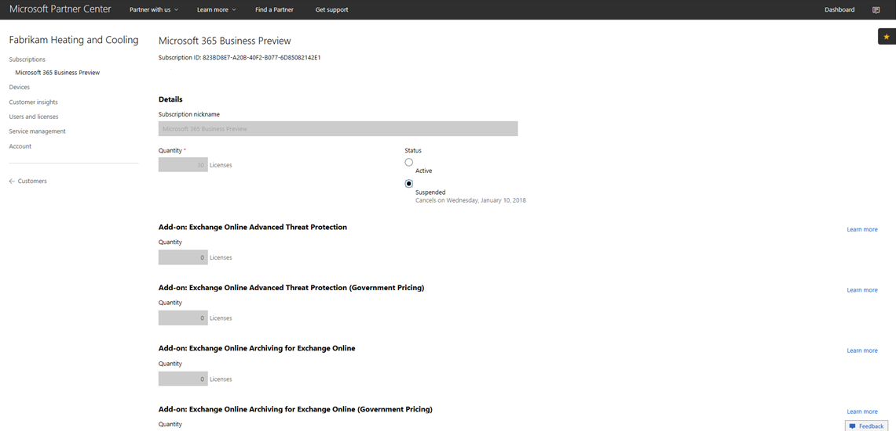
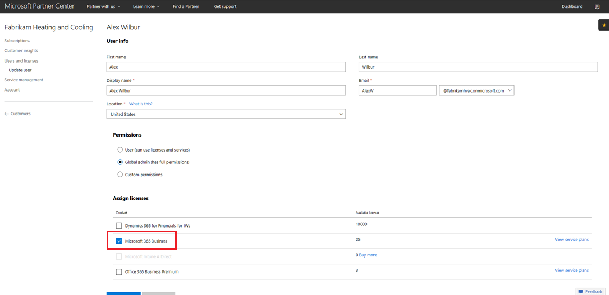

# Övergå en Microsoft 365 Business CSP-prenumeration

Om du har en Microsoft 365 Business Preview CSP-prenumeration följer du den här guiden för att ta reda på hur du kan överföra din befintliga förhandsprenumeration till Microsoft 365 Business GA (allmän tillgänglighet).

**Så här övergår du en förhandsprenumeration till GA**

1. Logga in på <a href="https://partnercenter.microsoft.com" target="_blank">Partner Center</a>.
2. På instrumentpanelen väljer du **Kunder**och sedan hittar och väljer företagsnamnet.

    Abonnemangen för bolaget kommer att noteras.

    
    
3. På sidan **Prenumerationer** väljer du **Lägg till prenumeration**.
4. På sidan **Ny prenumeration** väljer du **Småföretag** och väljer sedan **Microsoft 365 Business** i listan.
5. Lägg till antalet licenser och välj sedan **Nästa: Granska** för att granska prenumerationen och välj sedan **Skicka**.

    

    Licensbaserade **prenumerationer** visar **Microsoft 365 Business Preview** och **Microsoft 365 Business**. Du kommer att avbryta förhandsprenumerationen nästa.

6. Välj förhandsversion av **Microsoft 365 Business .**
7. På sidan **Microsoft 365 Business Preview** väljer du **Tillfälligt** för att avbryta förhandsversionen.

    

8. Välj **Skicka** för att bekräfta.

    På sidan **Prenumerationer** bekräftar du att statusen Förhandsgranskning av **Microsoft 365 Business** visar **Pausad**.

    

9. Du kan också validera licensavtalet. Gör så här:
    1. Välj **Användare och licenser** från företagets **prenumerationssida.**
    2. Välj en användare på sidan **Användare och licenser.**
    3. På användarens sida kontrollerar du avsnittet **Tilldela licenser** och bekräftar att den visar **Microsoft 365 Business**.

        

## Inverkan för kunder och användare under och efter övergången

Det finns ingen inverkan på kunder och användare under övergången och efter övergången.

## Inverkan på kunder som inte övergår

I följande tabell sammanfattas effekten för kunder som inte övergår från en Microsoft 365 Business Preview-prenumeration till en Microsoft 365 Business-prenumeration.

|       | T-0 till T+30     | T+30 till T+60 | T+60 till T+120 | Bortom T+120  |
|-------|-----------------|--------------|---------------|---------------|
| **Statligt** | Under respitperioden | Löpt ut      | Inaktiverad      | Avetablerad |
| **Serviceeffekter**                                                        |
| **Administratörsportal för Microsoft 365 Business** | Ingen påverkan på funktionaliteten | Ingen påverkan på funktionaliteten | Kan lägga till/ta bort användare, köpa prenumerationer.  Det går inte att tilldela/återkalla licenser. | Kundens prenumeration och alla data raderas. Administratören kan hantera andra betalda prenumerationer. |
| **Office-appar**                         | Ingen slutanvändares påverkan | Ingen slutanvändares påverkan | Office går in i läget nedsatt funktionalitet.  Användare kan bara visa filer. | Office går in i läget nedsatt funktionalitet.  Användare kan bara visa filer. |
| **Molntjänster (SharePoint Online, Exchange Online, Skype, Teams med mera)** | Ingen slutanvändares påverkan | Ingen slutanvändares påverkan | Slutanvändare och administratörer har ingen åtkomst till data i molnet. | Kundens prenumeration och alla data raderas. |
| **EM+S-komponenter** | Ingen admin inverkan  Ingen slutanvändares påverkan | Ingen admin inverkan  Ingen slutanvändares påverkan | Kapaciteten tillämpas inte längre.  Mer information finns i [Inverkan på mobila enheter vid prenumerationens utgång](#mobile-device-impacts-upon-subscription-expiration) och Windows [10 PC påverkar prenumerationens utgång.](#windows-10-pc-impacts-upon-subscription-expiration) | Kapaciteten tillämpas inte längre.  Mer information finns i [Inverkan på mobila enheter vid prenumerationens utgång](#mobile-device-impacts-upon-subscription-expiration) och Windows [10 PC påverkar prenumerationens utgång.](#windows-10-pc-impacts-upon-subscription-expiration) |
| **Windows 10 Företag** | Ingen admin inverkan  Ingen slutanvändares påverkan | Ingen admin inverkan  Ingen slutanvändares påverkan | Kapaciteten tillämpas inte längre.  Mer information finns i [Inverkan på mobila enheter vid prenumerationens utgång](#mobile-device-impacts-upon-subscription-expiration) och Windows [10 PC påverkar prenumerationens utgång.](#windows-10-pc-impacts-upon-subscription-expiration) | Kapaciteten tillämpas inte längre.  Mer information finns i [Inverkan på mobila enheter vid prenumerationens utgång](#mobile-device-impacts-upon-subscription-expiration) och Windows [10 PC påverkar prenumerationens utgång.](#windows-10-pc-impacts-upon-subscription-expiration) |
| **Azure AD-inloggning till en Windows 10-dator** | Ingen admin inverkan  Ingen slutanvändares påverkan | Ingen admin inverkan  Ingen slutanvändares påverkan | Ingen admin inverkan  Ingen slutanvändares påverkan | När klienten har tagits bort kan en användare logga in med endast lokala autentiseringsuppgifter. Återskapa enheten om det inte finns några lokala autentiseringsuppgifter. |

## Mobila enheter påverkar prenumerationens utgång

I följande tabell sammanfattas effekten på apphanteringsprinciperna på mobila enheter.

|                            | Fullt licensierad upplevelse                      | T+60 dagar efter utgångsdatum          |
|----------------------------|------------------------------------------------|------------------------------------|
| **Ta bort arbetsfiler från en inaktiv enhet** | Arbetsfiler tas bort efter valda dagar | Arbetsfiler finns kvar på användarens personliga enheter |
| **Tvinga användare att spara alla filer i OneDrive för företag** | Arbetsfiler kan bara sparas i OneDrive för företag | Arbetsfiler kan sparas var som helst |
| **Kryptera arbetsfiler** | Arbetsfiler krypteras | Arbetsfiler krypteras inte längre.  Säkerhetsprinciper tas bort och Office-data om appar tas bort. |
| **Kräv PIN-kod eller fingeravtryck för att komma åt Office-appar** | Begränsad åtkomst till appar | Ingen åtkomstbegränsning på appnivå |
| **Återställ PIN-kod när inloggningen misslyckas** | Begränsad åtkomst till appar | Ingen åtkomstbegränsning på appnivå |
| **Kräv att användare loggar in igen efter att Office-appar har ingåtts** | Inloggning krävs | Ingen inloggning krävs |
| **Neka åtkomst till arbetsfiler på jailbrokade eller rotade enheter** | Arbetsfiler kan inte nås på jailbroken /rooted enheter | Arbetsfiler kan nås på jailbroken/rooted enheter |
| **Tillåt användare att kopiera innehåll från Office-appar till personliga appar** | Kopiera/klistra in begränsat till appar som är tillgängliga som en del av Microsoft 365 Business-prenumerationen | Kopiera/klistra in tillgängligt för alla appar |

## Windows 10 PC påverkar prenumerationens utgång

I följande tabell sammanfattas effekten till konfigurationsprinciperna för Windows 10-enheter.

|                            | Fullt licensierad upplevelse                      | T+60 dagar efter utgångsdatum          |
|----------------------------|------------------------------------------------|------------------------------------|
| **Skydda datorer från hot med Windows Defender** | Slå på/av är utanför användarkontrollen | Förbrukaren kanna vända på/ bort Fönstren Försvara på det Fönstren 10 PC |
| **Skydda datorer från webbaserade hot i Microsoft Edge** | Pc-skydd i Microsoft Edge | Användaren kan aktivera/inaktivera datorskydd i Microsoft Edge |
| **Stäng av enhetens skärm när den är inaktiv** | Administratör definierar principen för tidsintervall för skärmtidsuteformat | Skärmtimeout kan konfigureras av slutanvändaren |
| **Tillåt användare att hämta appar från Microsoft Store** | Administratören definierar om en användare kan hämta appar från Microsoft Store | Användaren kan hämta appar från Microsoft Store när som helst |
| **Tillåt användare att använda Cortana** | Administratör definierar principen om användaråtkomst till Cortana | Användarenheter för att aktivera/inaktivera Cortana |
| **Tillåt användare att få tips och annonser från Microsoft** | Admin definierar policy för användare får tips och annonser från Microsoft | Användaren kan aktivera/inaktivera tips och annonser från Microsoft |
| **Tillåt användare att kopiera innehåll från Office-program till personliga program** | Admin definierar princip för att hålla Windows 10-enheter uppdaterade | Användare kan bestämma när windows ska uppdateras |
