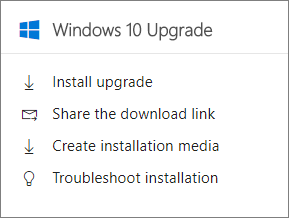

# Uppgradera Windows-enheter till Windows Pro Creators Update

## Uppgradera till Windows 10 Pro skapare uppdatera

1. Logga in på [Microsoft administratörscenter](https://portal.office.com/adminportal/home) och leta upp **Windows 10 uppgradera** kortet. 
    
    
  
2. Om du vill uppgradera till Windows 10 Pro skapare Update har du flera alternativ. Du kan:
    
- Installera uppgraderingen från webbplatsen Microsoft Software Download - Välj det här alternativet om den enhet som du är inloggad på samma enhet som du vill uppdatera.
    
  a. Välj **installera uppgraderingen**.
    
  b. från programvaran hämtningsplatsen, klickar du på **Uppdatera nu** om du vill börja uppgradera enheten till Windows 10 Pro skapare Update. 
    
- Dela länken download - Välj det här alternativet om du vill skicka ett e-postmeddelande till personer i din organisation så att de kan uppgradera till Windows 10 Pro själva.
 
   a. Välj **Dela hämta** länk för att öppna ett e-postmeddelande som innehåller en länk till Windows-programvara hämtningsplatsen. 
    
 - Skapa ett installationsmedium använder Verktyg för skapande av Media - välj det här alternativet om du vill skapa ett installationsmedium för Windows 10 Pro skapare Update (USB-flash-enhet eller ISO-fil) för att installera Windows 10 på en dator som skiljer sig från den som du använder.
    
    a. Välj **Skapa installationsmedia**.
    
    b. läsa instruktioner om hur du använder verktyget och skapa installationsmedia. 
    
Se [ställa in Windows-enheter för Microsoft 365 företagsanvändare](set-up-windows-devices.md) att slutföra konfigurationen av Windows 10 enheter. 
  
Klar att konfigurera Android och iOS enheter finns i [Konfigurera mobila enheter för Microsoft 365 företagsanvändare](set-up-mobile-devices.md) . 
  
