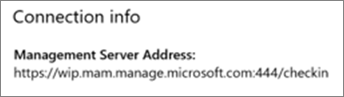

# Bekräfta programskyddsinställningar på PC-datorer med Windows 10

## Kontrollera att användarna inte kan kopiera företagsdata till personliga filer på företagets enheter

När du [ställt in principer för programskydd](protection-settings-for-windows-10-devices.md) kan det ta några timmar innan principen börjar gälla på användarnas enheter. Om du ställde in alternativet **På** för inställningen **Prevent users from copying company data to personal files and force them to save work files to OneDrive for Business** (hindra användare från att kopiera företagsdata till personliga filer och tvinga dem att spara arbetsfiler på OneDrive för företag) för enheter som ägs av företaget kan du kontrollera det på användarnas enheter när de har anslutit till Azure AD och loggat in. 
  
 **Kontrollera anslutningsinställningar**
  
1. När du har loggat in med Microsoft 365 Business-autentiseringsuppgifter och anslutit till Azure AD enligt beskrivningen i [Konfigurera Windows-enheter för Microsoft 365 Business-användare](set-up-windows-devices.md) går du till **Windows-inställningar** \> **Konton** \> **Åtkomst till arbete eller skola**. Välj **Ansluten till \<innehavarnamn\> Azure AD** och välj sedan **Info**.
    
    
  
2. På sidan **Hanteras av** \< innehavare namn \> kan du se den **anslutningsinformation** som innehåller en **hanteringsserveradress** som den som visas i följande bild. 
    
    
  
 **Kontrollera att du inte kan klistra in företagsdata i ett program som inte hanteras**
  
1. Öppna Outlook 2016 som installerades av Microsoft 365 Business.
    
2. Öppna ett e-postmeddelande och kopiera visst innehåll från det.
    
    Öppna Anteckningar och försök att klistra in innehållet där.
    
    Du får ett felmeddelande om att programmet inte kan få åtkomst till innehållet.
    
    
  
    Du kan dock klistra in samma innehåll i Word 2016.
    
## Kontrollera att användarna inte kan kopiera företagsdata till personliga filer på personliga enheter

 **Kontrollera anslutningsinställningar**
  
1. På din personliga enhet med Windows 10 där du är loggad som lokal användare går du till **Windows-inställningar** och klickar eller trycker på **Konton** \> **Åtkomst till arbete eller skola**.
    
2. Välj **Anslut** under **Åtkomst till arbete eller skola**.
    
3. Ange dina Microsoft 365 Business-autentiseringsuppgifter i dialogrutan **Konfigurera ett arbets- eller skolkonto** \> **Logga in**.
    
4. På sidan **Åtkomst till arbetet eller skolan** väljer du **Arbets- eller skolkonto** och väljer sedan **Info**.
    
    
  
5. På sidan **Åtkomst till arbete eller skola** kan du se den **anslutningsinformation** som innehåller en **hanteringsserveradress** som den som visas i följande bild och som innehåller orden  *wip*  och  *mam*  . 
    
    
  
 **Kontrollera att du inte kan klistra in företagsdata i ett program som inte hanteras**
  
1. Öppna Outlook 2016 och lägg till ditt Microsoft 365 Business-konto om det behövs, och logga in med dina Microsoft 365 Business-autentiseringsuppgifter.
    
2. Öppna ett e-postmeddelande och kopiera visst innehåll från det.
    
    Öppna Anteckningar och försök att klistra in innehållet där.
    
    Du får ett felmeddelande om att programmet inte kan få åtkomst till innehållet.
    
    
  
    Du kan dock klistra in samma innehåll i Word 2016.
    

