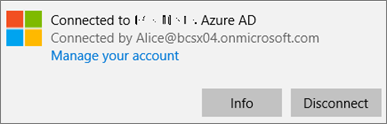
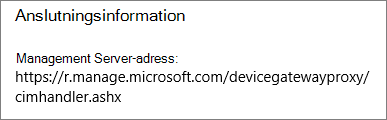
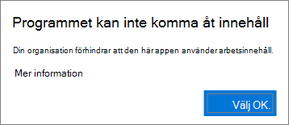
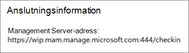

# Bekräfta programskyddsinställningar på PC-datorer med Windows 10

## Kontrollera att användarna inte kan kopiera företagsdata till personliga filer på företagets enheter

När du [ställt in principer för programskydd](protection-settings-for-windows-10-devices.md) kan det ta några timmar innan principen börjar gälla på användarnas enheter. Om du har **aktiverat Förhindra** att **användare kopierar företagsdata till personliga filer och tvingar dem att spara arbetsfiler till OneDrive för företag** för företagsägda enheter kan du kontrollera detta på användarens enhet när de har anslutit till Azure AD och loggat in. 
  
 **Kontrollera anslutningsinställningar**
  
1. När du har loggat in med Microsoft 365 Business-autentiseringsuppgifter och anslutit till Azure AD enligt beskrivningen i [Konfigurera Windows-enheter för Microsoft 365 Business-användare](set-up-windows-devices.md) går du till **Windows-inställningar** \> **Konton** \> **Åtkomst till arbete eller skola**. Välj **Ansluten till \<innehavarnamn\> Azure AD** och välj sedan **Info**.
    
    
  
2. På sidan **Hanterat efter** \<\> klientnamn kan du se **anslutningsinformationen** som innehåller en **hanteringsserveradress** som den som visas i följande bild. 
    
    
  
 **Kontrollera att du inte kan klistra in företagsdata i en icke-hanterad app**
  
1. Öppna Outlook 2016 som installerades av Microsoft 365 Business.
    
2. Öppna ett e-postmeddelande och kopiera visst innehåll från det.
    
    Öppna Anteckningar och försök att klistra in innehållet där.
    
    Du får ett felmeddelande om att appen inte kan komma åt innehåll.
    
    
  
    Du kan dock klistra in samma innehåll i Word 2016.
    
## Kontrollera att användarna inte kan kopiera företagsdata till personliga filer på personliga enheter

 **Kontrollera anslutningsinställningar**
  
1. På din personliga Windows 10-enhet där du är inloggad som lokal användare går du till **Windows-inställningar**och trycker på eller trycker på **Konton** \> **Åtkomst arbete eller skola**.
    
2. Välj **Anslut** under **Åtkomst till arbete eller skola**.
    
3. Ange dina Microsoft 365 Business-autentiseringsuppgifter i dialogrutan **Konfigurera ett arbets- eller skolkonto** \> **Logga in**.
    
4. På sidan **Åtkomst till arbetet eller skolan** väljer du **Arbets- eller skolkonto** och väljer sedan **Info**.
    
    
  
5. På sidan **Access-arbete eller skola** kan du se **anslutningsinformationen** som innehåller en **hanteringsserveradress** som den som visas i följande bild och innehåller orden *som raderar* och *mam* inuti. 
    
    
  
 **Kontrollera att du inte kan klistra in företagsdata i en icke-hanterad app**
  
1. Öppna Outlook 2016 och lägg till ditt Microsoft 365 Business-konto om det behövs, och logga in med dina Microsoft 365 Business-autentiseringsuppgifter.
    
2. Öppna ett e-postmeddelande och kopiera visst innehåll från det.
    
    Öppna Anteckningar och försök att klistra in innehållet där.
    
    Du får ett felmeddelande om att Appen inte kan komma åt innehåll.
    
    
  
    Du kan dock klistra in samma innehåll i Word 2016.
    

