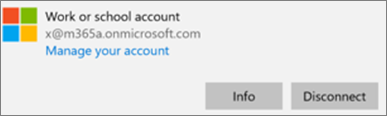

# Bekräfta programskyddsinställningar på PC-datorer med Windows 10

## Kontrollera att användarna inte kan kopiera företagsdata till personliga filer på företagets enheter

När du [ställt in principer för programskydd](protection-settings-for-windows-10-devices.md) kan det ta några timmar innan principen börjar gälla på användarnas enheter. Om du  inaktiverade inställningen På för inställningen Prevent **users from copying company data** to personal files and force them to save work files to OneDrive for Business (Hindra användare från att kopiera företagsdata till personliga filer och tvinga dem att spara arbetsfiler på OneDrive för företag) för enheter som ägs av företaget kan du kontrollera detta på användarens enhet när de har anslutit till Azure AD och loggat in. 
  
 **Kontrollera anslutningsinställningar**
  
1. När du har loggat in med Microsoft 365 Business Premium-autentiseringsuppgifter och ansluter till Azure AD enligt beskrivningen i Konfigurera Windows-enheter för [Microsoft 365 Business Premium-användare](set-up-windows-devices.md)går du till **Windows-inställningar** Konton Åtkomst till arbete eller \>  \> skola. Välj **Ansluten till Azure \<tenant name\> AD** och välj sedan **Info**.
    
    
  
2. På sidan **Hanteras av** kan du se den anslutningsinformation som innehåller en \<tenant name\> **hanteringsserveradress** som den som visas i följande bild.  
    
    
  
 **Kontrollera att det inte går att klistra in företagsdata i ett program som inte hanteras**
  
1. Öppna Outlook 2016 som installerades av Microsoft 365 Business Premium.
    
2. Öppna ett e-postmeddelande och kopiera visst innehåll från det.
    
    Öppna Anteckningar och försök att klistra in innehållet där.
    
    Du får ett felmeddelande om att programmet inte kan komma åt innehållet.
    
    
  
    Du kan dock klistra in samma innehåll i Word 2016.
    
## Kontrollera att användarna inte kan kopiera företagsdata till personliga filer på personliga enheter

 **Kontrollera anslutningsinställningar**
  
1. På din personliga enhet med Windows 10 där du är inloggad som lokal användare  går du till **Windows-inställningar** och klickar eller trycker på Konton Åtkomst till arbete \> **eller skola**.
    
2. Välj **Anslut** under **Åtkomst till arbete eller skola**.
    
3. Ange dina Microsoft 365 Business Premium-autentiseringsuppgifter i dialogrutan Konfigurera **ett arbets- eller skolkonto Logga** \> **in.**
    
4. På sidan **Åtkomst till arbetet eller skolan** väljer du **Arbets- eller skolkonto** och väljer sedan **Info**.
    
    
  
5. På sidan Åtkomst **till** arbete eller  skola kan du  se den anslutningsinformation som innehåller en hanteringsserveradress som den som visas i följande bild, och som innehåller orden *wip* och *mam.* 
    
    
  
 **Kontrollera att det inte går att klistra in företagsdata i ett program som inte hanteras**
  
1. Öppna Outlook 2016 och lägg till ditt Microsoft 365 Business Premium-konto om det behövs och logga in med dina Microsoft 365 Business Premium-autentiseringsuppgifter.
    
2. Öppna ett e-postmeddelande och kopiera visst innehåll från det.
    
    Öppna Anteckningar och försök att klistra in innehållet där.
    
    Du får ett felmeddelande om att programmet inte kan komma åt innehåll.
    
    
  
    Du kan dock klistra in samma innehåll i Word 2016.
    

