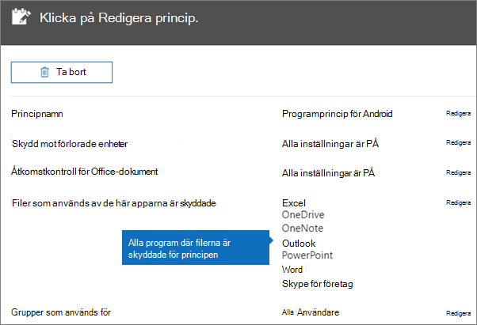
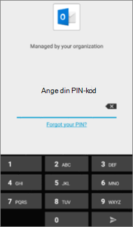
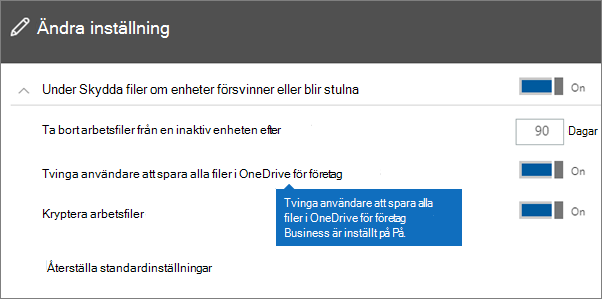
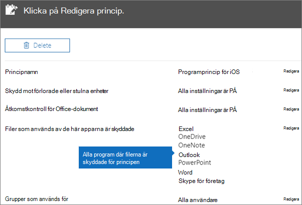
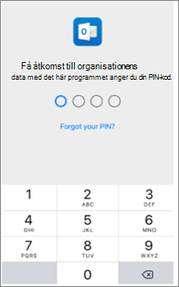

# Bekräfta programskyddsinställningar på Android- eller iOS-enheterValidate app protection settings on Android or iOS devices

Följ anvisningarna i följande avsnitt för att verifiera inställningarna för programskydd på Android- eller iOS-enheter.Follow the instructions in the following sections to validate app protection settings on Android or iOS devices.
  
## AndroidAndroid
  
### Kontrollera att programskyddsinställningarna fungerar på användarnas enheterCheck that the app protection settings are working on user devices

När du har [angett appkonfigurationer för Android-enheter](app-protection-settings-for-android-and-ios.md) för att skydda apparna kan du utföra stegen nedan för att verifiera att de inställningar du valde fungerar som de ska.After you [set app configurations for Android devices](app-protection-settings-for-android-and-ios.md) to protect the apps, you can follow these steps to validate that the settings you chose work. 
  
Kontrollera först att principen gäller för den app där du ska verifiera den.First, make sure that the policy applies to the app in which you're going to validate it.
  
1. Gå till Microsoft 365 Business Premium [Principer](https://admin.microsoft.com)Redigera princip **i** \> **administrationscentret.**In the Microsoft 365 Business Premium [admin center](https://admin.microsoft.com), go to **Policies** \> **Edit policy**.
    
2. Välj **Programprincip för Android** för de inställningar du skapade vid installationen eller någon annan princip du har skapat och kontrollera att den är tillämpad för Outlook till exempel.Choose **Application policy for Android** for the settings you created at setup, or another policy you created, and verify that it's enforced for Outlook, for example. 
    
    
  
### Verifiera Kräv PIN-kod eller fingeravtryck för åtkomst till Office-programValidate Require a PIN or a fingerprint to access Office apps

Välj **Redigera** bredvid **Åtkomstkontroll för Office-dokument** i fönstret **Redigera princip**, expandera **Hantera hur användare kommer åt Office-filer på mobila enheter** och se till att **Kräv PIN-kod eller fingeravtryck för åtkomst till Office-program** är angiven till **På**.In the **Edit policy** pane, choose **Edit** next to **Office documents access control**, expand **Manage how users access Office files on mobile devices**, and make sure that **Require a PIN or fingerprint to access Office apps** is set to **On**.
  

  
1. På användarens Android-enhet öppnar du Outlook loggar in med användarens inloggningsuppgifter Microsoft 365 Business Premium inloggningsuppgifter.In the user's Android device, open Outlook and sign in with the user's Microsoft 365 Business Premium credentials.
    
2. Du uppmanas även att ange en PIN-kod eller använda en fingeravtrycksläsare.You'll also be prompted to enter a PIN or use a fingerprint.
    
    
  
### Verifiera Återställ PIN-kod efter antal misslyckade försökValidate Reset PIN after number of failed attempts

I fönstret **Redigera princip** väljer du Redigera bredvid **Office** dokumentåtkomstkontroll , expanderar Hantera hur användare kommer åt **Office-filer** på mobila enheter och ser till att Återställ **PIN-kod** efter antal misslyckade försök är antingen ett tal. In the **Edit policy** pane, choose **Edit** next to **Office documents access control**, expand **Manage how users access Office files on mobile devices**, and make sure that **Reset PIN after number of failed attempts** is set to some number. Det här är 5 som standard.This is 5 by default. 
  
1. På användarens Android-enhet öppnar du Outlook loggar in med användarens inloggningsuppgifter Microsoft 365 Business Premium inloggningsuppgifter.In the user's Android device, open Outlook and sign in with the user's Microsoft 365 Business Premium credentials.
    
2. Ange en felaktig PIN-kod så många gånger som anges i principen.Enter an incorrect PIN as many times as specified by the policy. Du ser ett meddelande om att gränsen för **PIN-försök har uppnåtts om** återställning av PIN-koden.You'll see a prompt that states **PIN Attempt Limit Reached** to reset the PIN. 
    
    
  
3. Tryck på **Återställ PIN-kod**.Press **Reset PIN**. Du uppmanas att logga in med användarens inloggningsuppgifter och Microsoft 365 Business Premium ange en ny PIN-kod.You'll be prompted to sign in with the user's Microsoft 365 Business Premium credentials, and then required to set a new PIN.
    
### Verifiera Tvinga användare att spara alla filer i OneDrive för företagValidate Force users to save all work files to OneDrive for Business

Välj **Redigera** bredvid **Skydd mot förlorade eller stulna enheter** i fönstret **Redigera princip**, expandera **Skydda arbetsfiler om enheter försvinner eller blir stulna** och se till att **Tvinga användare att spara alla filer i OneDrive för företag** är angiven till **På**.In the **Edit policy** pane, choose **Edit** next to **Protection against lost or stolen devices**, expand **Protect work files when devices are lost or stolen**, and make sure that **Force users to save all work files to OneDrive for Business** is set to **On**.
  

  
1. På användarens Android-enhet öppnar du Outlook loggar in med användarens inloggningsuppgifter Microsoft 365 Business Premium och anger en PIN-kod om du uppmanas att göra det.In the user's Android device, open Outlook and sign in with the user's Microsoft 365 Business Premium credentials, and enter a PIN if requested.
    
2. Öppna ett e-postmeddelande som innehåller en bifogad fil och tryck på nedåtpilikonen bredvid den bifogade filens information.Open an email that contains an attachment and tap the down arrow icon next to the attachment's information.
    
    
  
    Det går inte **att spara på enheten** längst ned på skärmen.You'll see **Cannot save to device** on the bottom of the screen. 
    
    
  
    > [!NOTE]
    > Det går inte att spara till OneDrive för företag från Android för närvarande. Du kan bara se att funktionen för att spara lokalt är blockerad.Saving to OneDrive for Business is not enabled for Android at this time, so you can only see that saving locally is blocked. 
  
### Verifiera Kräv att användare loggar in igen efter att Office-appar har varit inaktiva under en angiven tidValidate Require user to sign in again if Office apps have been idle for a specified time

I fönstret Redigera **princip** väljer du Redigera bredvid **Office** dokumentåtkomstkontroll , expanderar Hantera hur användare får åtkomst till **Office-filer** på mobila enheter och ser till att Kräv att användare loggar in igen när **Office-appar** har varit inaktiva är inställt på ett antal minuter. In the **Edit policy** pane, choose **Edit** next to **Office documents access control**, expand **Manage how users access Office files on mobile devices**, and make sure that **Require users to sign in again after Office apps have been idle for** is set to some number of minutes. Det är 30 minuter som standard.This is 30 minutes by default. 
  
1. På användarens Android-enhet öppnar du Outlook loggar in med användarens inloggningsuppgifter Microsoft 365 Business Premium och anger en PIN-kod om du uppmanas att göra det.In the user's Android device, open Outlook and sign in with the user's Microsoft 365 Business Premium credentials, and enter a PIN if requested.
    
2. Du bör nu se Inkorgen i Outlook. Låt Android-enheten stå oanvänd i minst 30 minuter (eller annan tidsrymd som är längre än vad du angav i principen). Enhetens bildskärm kommer sannolikt att tonas ned.You should now see Outlook's inbox. Let the Android device idle untouched for at least 30 minutes (or some other amount of time, longer than what you specified in the policy). The device will likely dim.
    
3. Åtkomst Outlook på Android-enheten igen.Access Outlook on the Android device again.
    
4. Du uppmanas att ange din PIN-kod innan du kan komma åt Outlook igen.You'll be prompted to enter your PIN before you can access Outlook again.
    
### Verifiera Skydda arbetsfiler med krypteringValidate Protect work files with encryption

Välj **Redigera** bredvid **Skydd mot förlorade eller stulna enheter** i fönstret **Redigera princip**, expandera **Skydda arbetsfiler om enheter försvinner eller blir stulna** och se till att **Skydda arbetsfiler med kryptering** är angiven till **På** och att **Tvinga användare att spara alla filer i OneDrive för företag** är angiven till **Av**.In the **Edit policy** pane, choose **Edit** next to **Protection against lost or stolen devices**, expand **Protect work files when devices are lost or stolen**, and make sure that **Protect work files with encryption** is set to **On**, and **Force users to save all work files to OneDrive for Business** is set to **Off**.
  
1. På användarens Android-enhet öppnar du Outlook loggar in med användarens inloggningsuppgifter Microsoft 365 Business Premium och anger en PIN-kod om du uppmanas att göra det.In the user's Android device, open Outlook and sign in with the user's Microsoft 365 Business Premium credentials, and enter a PIN if requested.
    
2. Öppna ett e-postmeddelande som innehåller några bifogade bildfiler.Open an email that contains a few image file attachments.
    
3. Tryck på nedåtpilikonen bredvid den bifogade filen om du vill spara den.Tap the down arrow icon next to the attachment's info to save it.
    
    
  
4. Det kan hända att du uppmanas att tillåta Outlook att komma åt foton, media och filer på din enhet. Tryck på **Tillåt**.You may be prompted to allow Outlook to access photos, media, and files on your device. Tap **Allow**.
    
5. Längst ned på skärmen väljer du **Spara på enhet** och öppna sedan appen **Galleri**.At the bottom of the screen, choose to **Save to Device** and then open the **Gallery** app. 
    
6. Du bör nu se ett sparat, krypterat foto (eller flera, om du sparade flera bifogade bildfiler) i listan. Det kan hända att fotot visas i listan Bilder som en grå ruta med ett vitt utropstecken i en vit cirkel i mitten av den gråa rutan.You should see an encrypted photo (or more, if you saved multiple image file attachments) in the list. It may appear in the Pictures list as a gray square with a white exclamation point within a white circle in the center of the gray square.
    
    
  
## iOSiOS
  
### Kontrollera att inställningarna för appskydd fungerar på användarnas enheterCheck that the App protection settings are working on user devices

När du har [angett appkonfigurationer för iOS-enheter](app-protection-settings-for-android-and-ios.md) för att skydda appar kan du utföra stegen nedan för att verifiera att de inställningar du valde fungerar som de ska.After you [set app configurations for iOS devices](app-protection-settings-for-android-and-ios.md) to protect apps, you can follow these steps to validate that the settings you chose work. 
  
Kontrollera först att principen gäller för den app där du ska verifiera den.First, make sure that the policy applies to the app in which you're going to validate it.
  
1. Gå till Microsoft 365 Business Premium [Principer](https://admin.microsoft.com)Redigera princip **i** \> **administrationscentret.**In the Microsoft 365 Business Premium [admin center](https://admin.microsoft.com), go to **Policies** \> **Edit policy**.
    
2. Välj **Programprincip för iOS** för de inställningar du skapade vid installationen eller någon annan princip du har skapat och kontrollera att den är tillämpad för Outlook till exempel.Choose **Application policy for iOS** for the settings you created at setup, or another policy you created, and verify that it's enforced for Outlook for example. 
    
    
  
### Verifiera Kräv PIN-kod för åtkomst till Office-programValidate Require a PIN to access Office apps

Välj **Redigera** bredvid **Åtkomstkontroll för Office-dokument** i fönstret **Redigera princip**, expandera **Hantera hur användare kommer åt Office-filer på mobila enheter** och se till att **Kräv PIN-kod eller fingeravtryck för åtkomst till Office-program** är angiven till **På**.In the **Edit policy** pane, choose **Edit** next to **Office documents access control**, expand **Manage how users access Office files on mobile devices**, and make sure that **Require a PIN or fingerprint to access Office apps** is set to **On**.
  

  
1. På användarens iOS-enhet öppnar du Outlook loggar in med användarens inloggningsuppgifter Microsoft 365 Business Premium autentiseringsuppgifter.In the user's iOS device, open Outlook and sign in with the user's Microsoft 365 Business Premium credentials.
    
2. Du uppmanas även att ange en PIN-kod eller använda en fingeravtrycksläsare.You'll also be prompted to enter a PIN or use a fingerprint.
    
    
  
### Verifiera Återställ PIN-kod efter antal misslyckade försökValidate Reset PIN after number of failed attempts

I fönstret **Redigera princip** väljer du Redigera bredvid **Office** dokumentåtkomstkontroll , expanderar Hantera hur användare kommer åt **Office-filer** på mobila enheter och ser till att Återställ **PIN-kod** efter antal misslyckade försök är antingen ett tal. In the **Edit policy** pane, choose **Edit** next to **Office documents access control**, expand **Manage how users access Office files on mobile devices**, and make sure that **Reset PIN after number of failed attempts** is set to some number. Det här är 5 som standard.This is 5 by default. 
  
1. På användarens iOS-enhet öppnar du Outlook loggar in med användarens inloggningsuppgifter Microsoft 365 Business Premium autentiseringsuppgifter.In the user's iOS device, open Outlook and sign in with the user's Microsoft 365 Business Premium credentials.
    
2. Ange en felaktig PIN-kod så många gånger som anges i principen.Enter an incorrect PIN as many times as specified by the policy. Du ser ett meddelande om att gränsen för **PIN-försök har uppnåtts om** återställning av PIN-koden.You'll see a prompt that states **PIN Attempt Limit Reached** to reset the PIN. 
    
    
  
3. Tryck på **OK**.Press **OK**. Du uppmanas att logga in med användarens inloggningsuppgifter och Microsoft 365 Business Premium ange en ny PIN-kod.You'll be prompted to sign in with the user's Microsoft 365 Business Premium credentials, and then required to set a new PIN.
    
### Verifiera Tvinga användare att spara alla filer i OneDrive för företagValidate Force users to save all work files to OneDrive for Business

Välj **Redigera** bredvid **Skydd mot förlorade eller stulna enheter** i fönstret **Redigera princip**, expandera **Skydda arbetsfiler om enheter försvinner eller blir stulna** och se till att **Tvinga användare att spara alla filer i OneDrive för företag** är angiven till **På**.In the **Edit policy** pane, choose **Edit** next to **Protection against lost or stolen devices**, expand **Protect work files when devices are lost or stolen**, and make sure that **Force users to save all work files to OneDrive for Business** is set to **On**.
  

  
1. På användarens iOS-enhet öppnar du Outlook loggar in med användarens inloggningsuppgifter för Microsoft 365 Business Premium och anger en PIN-kod om du uppmanas att göra det.In the user's iOS device, open Outlook and sign in with the user's Microsoft 365 Business Premium credentials, and enter a PIN if requested.
    
2. Öppna ett e-postmeddelande som innehåller en bifogad fil, öppna den bifogade filen och välj **Spara** längst ned på skärmen.Open an email that contains an attachment, open the attachment and choose **Save** on the bottom of the screen. 
    
    
  
3. Du bör se endast ett alternativ för OneDrive för företag.You should only see an option for OneDrive for Business. Annars trycker du på **Lägg till konto** och **OneDrive för företag** på skärmen Lägg **Storage Konto.**If not, tap **Add Account** and select **OneDrive for Business** from the **Add Storage Account** screen. Ange användarens e-Microsoft 365 Business Premium logga in när du uppmanas att göra det.Provide the end user's Microsoft 365 Business Premium to sign in when prompted. 
    
    Tryck på **Spara** och välj **OneDrive för företag**.Tap **Save** and select **OneDrive for Business**.
    
### Verifiera Kräv att användare loggar in igen efter att Office-appar har varit inaktiva under en angiven tidValidate Require user to sign in again if Office apps have been idle for a specified time

I fönstret Redigera **princip** väljer du Redigera bredvid **Office** dokumentåtkomstkontroll , expanderar Hantera hur användare får åtkomst till **Office-filer** på mobila enheter och ser till att Kräv att användare loggar in igen när **Office-appar** har varit inaktiva är inställt på ett antal minuter. In the **Edit policy** pane, choose **Edit** next to **Office documents access control**, expand **Manage how users access Office files on mobile devices**, and make sure that **Require users to sign in again after Office apps have been idle for** is set to some number of minutes. Det är 30 minuter som standard.This is 30 minutes by default. 
  
1. På användarens iOS-enhet öppnar du Outlook loggar in med användarens inloggningsuppgifter för Microsoft 365 Business Premium och anger en PIN-kod om du uppmanas att göra det.In the user's iOS device, open Outlook and sign in with the user's Microsoft 365 Business Premium credentials, and enter a PIN if requested.
    
2. Du bör nu se Inkorgen i Outlook. Låt iOS-enheten stå oanvänd i minst 30 minuter (eller annan tidsrymd som är längre än vad du angav i principen). Enhetens bildskärm kommer sannolikt att tonas ned.You should now see Outlook's inbox. Let the iOS device untouched for at least 30 minutes (or some other amount of time, longer than what you specified in the policy). The device will likely dim.
    
3. Åtkomst Outlook på iOS-enheten igen.Access Outlook on the iOS device again.
    
4. Du uppmanas att ange din PIN-kod innan du kan komma åt Outlook igen.You'll be prompted to enter your PIN before you can access Outlook again.
    
### Verifiera Skydda arbetsfiler med krypteringValidate Protect work files with encryption

Välj **Redigera** bredvid **Skydd mot förlorade eller stulna enheter** i fönstret **Redigera princip**, expandera **Skydda arbetsfiler om enheter försvinner eller blir stulna** och se till att **Skydda arbetsfiler med kryptering** är angiven till **På** och att **Tvinga användare att spara alla filer i OneDrive för företag** är angiven till **Av**.In the **Edit policy** pane, choose **Edit** next to **Protection against lost or stolen devices**, expand **Protect work files when devices are lost or stolen**, and make sure that **Protect work files with encryption** is set to **On**, and **Force users to save all work files to OneDrive for Business** is set to **Off**.
  
1. På användarens iOS-enhet öppnar du Outlook loggar in med användarens inloggningsuppgifter för Microsoft 365 Business Premium och anger en PIN-kod om du uppmanas att göra det.In the user's iOS device, open Outlook and sign in with the user's Microsoft 365 Business Premium credentials, and enter a PIN if requested.
    
2. Öppna ett e-postmeddelande som innehåller några bifogade bildfiler.Open an email that contains a few image file attachments.
    
3. Tryck på den bifogade filen och tryck sedan på alternativet **Spara** under den.Tap the attachment and then tap the **Save** option under it. 
    
4. Öppna appen **Foton** från startskärmen. Du bör nu se ett sparat foto (eller flera, om du sparade flera bifogade bildfiler) som är krypterat.Open **Photos** app from the home screen. You should see an encrypted photo (or more, if you saved multiple image file attachments) saved, but encrypted. 
    
---

