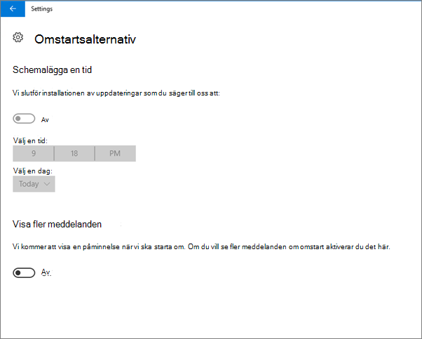
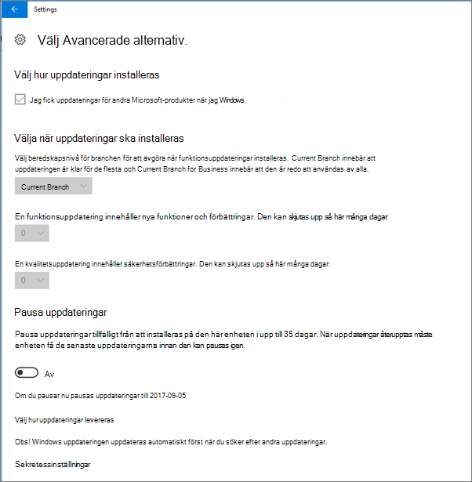
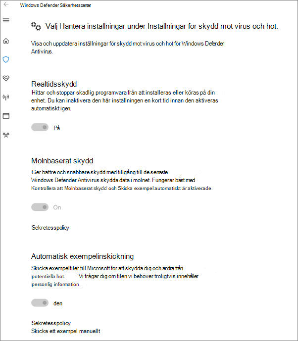

# Validera inställningar för enhetsskydd på PC-datorer med Windows 10

## Kontrollera att principer för Windows 10-enheter har angetts

När du [konfigurerat principer för enheter](protection-settings-for-windows-10-pcs.md) kan det ta några timmar innan principen börjar gälla på användarnas enheter. Du kan bekräfta att principerna har verkställts genom att titta på olika skärmar för Windows-inställningar på användarnas enheter. Eftersom användarna inte kan ändra inställningarna för Windows Update och Windows Defender Antivirus på sina Windows 10-enheter, kommer många alternativ att vara nedtonade.
  
1. Gå till alternativen **För inställningar** \> **Uppdatera &amp; säkerhet** \> **Windows Update** \> **Omstart** och bekräfta att alla inställningar är nedtonade. 
    
    
  
2. Gå till **Alternativ för Inställningar** \> **Uppdatera &amp; Windows** \> **Update** \> Avancerade **alternativ** och bekräfta att alla inställningar är nedtonade. 
    
    
  
3. Go to **Settings** \> **Update &amp; security** \> **Windows Update** \> **Advanced options** \> **Choose how updates are delivered**.
    
    Bekräfta att du kan se meddelandet (i rött) att vissa inställningar är dolda eller hanterade av din organisation, och alla alternativ är nedtonade.
    
    
  
4. To open the Windows Defender Security Center, go to **Settings** \> **Update &amp; security** \> **Windows Defender** \> click **Open Windows Defender Security Center** \> **Virus &amp; thread protection** \> **Virus &amp; threat protection settings**. 
    
5. Kontrollera att alla alternativ är nedtonade. 
    
    
  
## Relaterade ämnen

[Dokumentation och resurser för Microsoft 365 Business](https://go.microsoft.com/fwlink/p/?linkid=853701)
  
[Komma igång med Microsoft 365 Business](microsoft-365-business-overview.md)
  
[Hantera Microsoft 365 Business](manage.md)
  
[Ange enhetskonfigurationer för Windows 10-datorer](protection-settings-for-windows-10-pcs.md)
  

