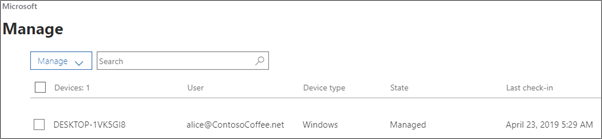

# Visa och hantera principer och enheterView and manage policies and devices

Den här artikeln gäller för Microsoft 365 Business Premium.This article applies to Microsoft 365 Business Premium.

## Visa och redigera principer för enheterView and edit device policies

1.  Gå till administrationscentret på <a href="https://go.microsoft.com/fwlink/p/?linkid=837890" target="_blank">https://admin.microsoft.com</a>.Go to the admin center at <a href="https://go.microsoft.com/fwlink/p/?linkid=837890" target="_blank">https://admin.microsoft.com</a>.
2. Välj Principer för enheter i **navigeringsfältet** \> **till vänster.**On the left nav, choose **Devices** \> **Policies**.

    På den här sidan kan du skapa, redigera, ändra målgruppen eller ta bort en princip.On this page, you can create, edit, change target group, or delete a policy.

    
  
## Visa och hantera enheterView and manage devices

1. Välj Enheter Hantera i **navigeringsfältet** \> **till vänster.**On the left nav, choose **Devices** \> **Manage**. 
    
    På den här sidan kan du välja en eller flera enheter och ta bort företagsdata.On this page, you can select one or more devices and remove company data. För Windows 10-enheter som du har angett skyddsinställningar för kan du också välja att återställa enheten till fabriksinställningarna.For Windows 10 devices that you have set device protections settings for, you can also choose to reset the device to factory settings.
  
   

