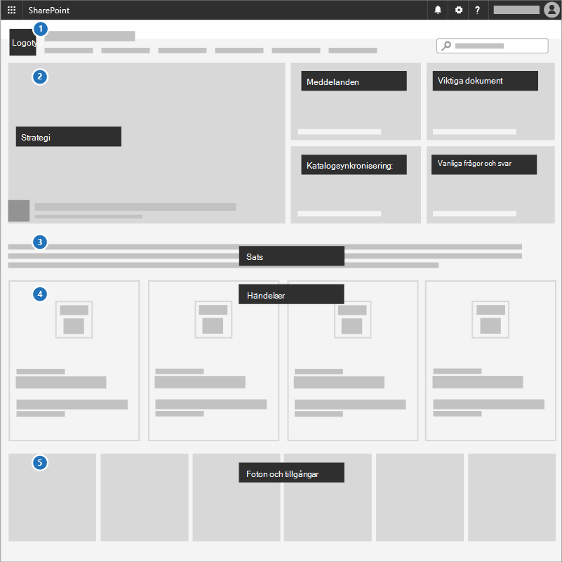
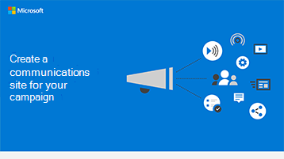

# Skapa en webbplats för kommunikation

Ett bra sätt att kommunicera prioriteringar, dela strategidokument och markera kommande evenemang är att använda en kommunikationswebbplats i SharePoint. Kommunikationswebbplatser är till för att dela saker med andra i hela företaget eller kampanjen. är det din interna strategiwebbplats.

## Metodtips

Ta med följande element på din kommunikationswebbplats:

1. Lägg till din logotyp och dina färger som en rubrikbild och ett tema.
2. Led din strategi, ditt meddelande, viktiga dokument, en katalog och vanliga frågor och svar i en **Hero-webbdel.**
3. Inkludera en VD eller ett kandidatutdrag i gruppen i en **textwebbdel**.
4. Lägg till händelser i **en webbdel för** händelser så att alla kan se vad som är på gång.
5. Lägga till foton som andra kan använda eller dela i en **webbdel av bildgalleriet**.

## Infografik: Skapa en infografik för en kommunikationswebbplats

Följande länkar för PowerPoint och PDF kan laddas ned och skrivas ut i tabloidformat (kallas även huvudbok, 11 x 17 eller A3).

[PDF](downloads/M365CampaignsCreateCommunicationSite.pdf)  |  [PowerPoint](downloads/M365CampaignsCreateCommunicationSite.pptx)

## Konfigurera

1. Logga in på https://Office.com.
2. Välj ikonen för startprogrammet i sidans övre **vänstra** hörn och välj sedan ikonen SharePoint panelen. Om du inte ser panelen **SharePoint** klickar du på **panelen Webbplatser** eller **Alla** om SharePoint inte visas.
3. Högst upp på SharePoint klickar du på **+ Skapa webbplats** och väljer alternativet **Kommunikationswebbplats.**

Läs mer [om webbplatser för kommunikation](https://support.office.com/article/What-is-a-SharePoint-communication-site-94A33429-E580-45C3-A090-5512A8070732) och hur du skapar en [kommunikationswebbplats i SharePoint Online.](https://support.microsoft.com/en-us/office/create-a-communication-site-in-sharepoint-online-7fb44b20-a72f-4d2c-9173-fc8f59ba50eb)

## Administratörsinställningar

Om du inte ser länken **+ Skapa** webbplats kanske du inte kan skapa webbplatser med självbetjäning i Microsoft 365. Om du vill skapa en gruppwebbplats kontaktar du den som administrerar Microsoft 365 i din organisation. Om du är Microsoft 365-administratör kan du gå till Hantera webbplatsskapande i [SharePoint Online](/sharepoint/manage-site-creation) för att aktivera att webbplatser skapas med självbetjäning för organisationen eller Hantera webbplatser i det nya administrationscentret för [SharePoint](/sharepoint/manage-sites-in-new-admin-center) för att skapa en webbplats från administrationscentret för SharePoint Online.