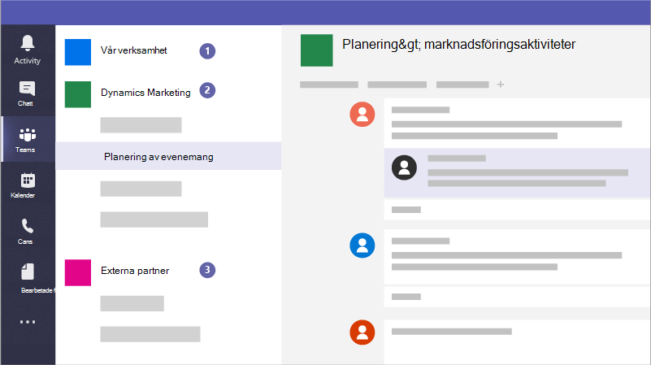

# Skapa team för samarbete i Microsoft TeamsCreate teams for collaboration in Microsoft Teams

Microsoft Teams är en samarbetsapp som hjälper din personal att organisera sig och samtala, från valfri enhet.Microsoft Teams is a collaboration app that helps your staff stay organized and have conversations, from any device. Du kan använda Microsoft Teams att ha snabbkonversationer med medlemmar i din personal eller gäster utanför organisationen.You can use Microsoft Teams to have instant conversations with members of your staff or guests outside your organization. Du kan också ringa telefonsamtal, hålla möten och dela filer.You can also make phone calls, host meetings, and share files.

## MetodtipsBest practices

1. Skapa privata team för känslig information.Create private teams for sensitive information.
1. Skapa ett organisationsomfattande team för kommunikation med alla i organisationen.Create an org-wide team for communication with everyone across your organization.
1. Skapa grupper för specifika projekt och tillämpa rätt skyddsnivå baserat på vem som ska ingå.Create teams for specific projects and apply the right amount of protection based on who should be included.
1. Skapa specifika team för kommunikation med externa partner för att skilja dem åt från allt känsligt för ditt företag.Create specific teams for communication with external partners to keep them separate from anything sensitive for your business.

En företags-, juristbyrå eller sjukvårdsbyrå kan till exempel skapa följande team:For example, a business, legal firm, or healthcare practice could create the following teams:

1. **Ett team för hela företaget, ett företag eller ett praktiskt team:** Den är till för att alla ska kunna använda den dagliga kommunikationen och arbeta i hela företaget.**A business-, firm-, or practice-wide team:** This is for everyone to use for day to day communications and work across your business. Du kan använda den här gruppen för att publicera meddelanden eller dela information som är intressant för hela företaget eller din verksamhet.You can use this team to post announcements or share information of interest for your whole firm or practice.
1. **Enskilda team:** Konfigurera grupper för mindre grupper för att samarbeta kring deras dagliga arbete.**Individual teams:** Set up teams for smaller groups to collaborate about their day to day work.
1. **Ett externt informationsteam eller grupper:** Samordna med dina leverantörer, partners eller kunder utan att tillåta dem till något känsligt.**An external communications team or teams:** Coordinate with your vendors, partners, or clients without allowing them into anything sensitive. Konfigurera olika kanaler för specifika grupper.Set up different channels for specific groups.

Och kampanjer kan skapa följande team för att kommunicera och samarbeta säkert:And campaigns could create the following teams to communicate and collaborate securely:

1. **Ett team som leder en kampanj:** Konfigurera det här som ett privat team så att endast de som är viktiga kampanjmedlemmar kan komma åt den och diskutera potentiellt känsliga problem.**A campaign Leads team:** Set this up as a private team so that only your key campaign members can access it and discuss potentially sensitive concerns.
2. **Ett allmänt kampanjteam:** Den är till för att alla ska kunna använda den dagliga kommunikationen och arbetet.**A general campaign team:** This is for everyone to use for day to day communications and work. Personer, grupper eller kommittéer kan konfigurera kanaler i teamet för att göra sitt arbete.Individuals, groups, or committees can set up channels in this team to do their work. Till exempel kan personer som planerar evenemanget konfigurera en kanal för att chatta och koordinera logistik för kampanjhändelser.For example, the event planning people can set up a channel to chat and coordinate logistics for campaign events.
3. **Ett partnerteam:** Samordna med dina leverantörer, partner eller frivilliga utan att tillåta dem till något känsligt.**A partners team:** Coordinate with your vendors, partners, or volunteers without allowing them into anything sensitive.

När du skapar ett team skapas följande:When you create a team, here's what else gets created:

- En ny [Microsoft 365 grupp](/MicrosoftTeams/office-365-groups)A new [Microsoft 365 group](/MicrosoftTeams/office-365-groups)
- En [SharePoint onlinewebbplats](/MicrosoftTeams/sharepoint-onedrive-interact) och dokumentbibliotek för att lagra gruppfilerA [SharePoint Online](/MicrosoftTeams/sharepoint-onedrive-interact) site and document library to store team files
- En [Exchange Online](/MicrosoftTeams/exchange-teams-interact) delad postlåda och kalenderAn [Exchange Online](/MicrosoftTeams/exchange-teams-interact) shared mailbox and calendar
- En OneNote anteckningsbokA OneNote notebook
- Även till andra Office 365 som Planner och Power BITies into other Office 365 apps such as Planner and Power BI

I Microsoft Teams kan du hitta:Inside Microsoft Teams, you can find:

1. **Teams:** Hitta kanaler att gå med i eller skapa dina egna.**Teams:** Find channels to belong to or create your own. I kanalerna kan du hålla direktmöten, samtala och dela filer.Inside channels you can hold on-the-spot meetings, have conversations, and share files.
2. **Möten:** Se allt du har ordnat för dagen eller veckan.**Meetings:** See everything you've got lined up for the day or week. Eller schemalägg ett möte.Or, schedule a meeting. Den här kalendern synkroniseras med din Outlook kalender.This calendar syncs with your Outlook calendar.
3. **Samtal:** Om organisationen har den konfigurerad kan du i vissa fall ringa vem som helst Microsoft Teams, även om organisationen inte använder Microsoft Teams.**Calls:** In some cases, if your organization has it set up, you can call anyone from Microsoft Teams, even if they're not using Microsoft Teams.
4. **Aktivitet:** Kom ikapp med alla dina olästa meddelanden, @mentions, svar och mycket mer.**Activity:** Catch up on all your unread messages, @mentions, replies, and more.

Använd kommandorutan högst upp för att söka efter specifika objekt eller personer, vidta snabbåtgärder och starta appar.Use the command box at the top to search for specific items or people, take quick actions, and launch apps.

## KonfigureraSet it up

Skapa ett privat team för bara företagsägaren och cheferna eller kampanjadministratören och kandidaten så här.Create a private team for just the business owner and managers, or campaign manager and candidate like this.

> [!VIDEO https://www.microsoft.com/videoplayer/embed/RWeqWA]

Skapa ett organisationsomfattande team som alla i företaget eller kampanjen kan använda för att kommunicera och dela filer.Create an organization-wide team that everyone in the business or campaign can use to communicate and share files.

> [!VIDEO https://www.microsoft.com/videoplayer/embed/RE2GCG9]

Skapa ett team som du delar med gäster utanför organisationen, till exempel för reklam eller ekonomi.Create a team that you share with guests outside your organization, such as for advertising or finances.

> [!VIDEO https://www.microsoft.com/videoplayer/embed/RE1FQMp]

Mer information om Microsoft Teams finns [Microsoft Teams tekniska dokumentationen](/microsoftteams/microsoft-teams)Learn more about Microsoft Teams at [Microsoft Teams technical documentation](/microsoftteams/microsoft-teams)

## AdministratörsinställningarAdmin settings

Du måste vara administratör för att skapa ett team för hela organisationen.You must be an admin to create an organization-wide team. Mer information finns i [Vad är en administratör i Microsoft 365?](https://support.office.com/article/what-is-an-admin-e123627e-4892-4461-b9aa-1b6d57a5cfa4?ui=en-US&rs=en-US&ad=US).For more information, see [What is an Admin in Microsoft 365?](https://support.office.com/article/what-is-an-admin-e123627e-4892-4461-b9aa-1b6d57a5cfa4?ui=en-US&rs=en-US&ad=US).