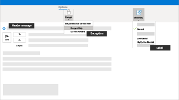

Microsoft 365 för mindre företag och campaigns
===========================

Att säkra data och kommunikation i dagens värld är en prioritering, särskilt för medicinska och juridiska metoder praxis, politiska kampanjer och många andra mindre branscher. Den här lösningen ger en uppsättning rekommendationer som hjälper till att skydda dig och din data. Det här biblioteket innehåller hjälp med konfiguration och användning av den här rekommenderade miljön, oavsett ditt företagstyp.

Den här konfigurationen innehåller följande riktlinjer för produktivitet, samarbete, fillagring, e-post, enheter och identitet för att skydda ditt företag:

| Skydd för | Beskrivning | Länkar |
| ----- | ----- | ----- | ----- |
|E-post | Använd multifaktorautentisering, ATP – avancerat skydd mot nätfiske och ATP – säkra länkar och säkra bifogade filer, och använd krypterad e-post för känslig information.| [Konfigurera multifaktorautentisering](m365-campaigns-multifactor-authenication.md), [Skydda mot nätfiskeattacker](m365-campaigns-phishing-and-attacks.md), [Kryptera eller märka känslig e-post](send-encrypted-email.md) |
|iPhone- och Android-enheter. |Använd multifaktorautentisering och konfigurera Microsoft-mobilappar och kräv en PIN-kod | [Konfigurera multifaktorautentisering](m365-campaigns-multifactor-authenication.md), [Konfigurera mobila enheter](../business/set-up-mobile-devices.md?toc=/microsoft-365/campaigns/toc.json)|
|Ta med egna enheter (BYOD) Mac- och Windows 10-datorer |Håll Office uppdaterat, håll operativsystemen uppdaterade och aktivera säkerhetsfunktioner. | [Skydda ohanterade Windows 10 PC- och Mac-datorer](m365-campaigns-protect-pcs-macs.md) |
|Lagra och dela filer på ett säkert sätt | Dela filer och videor från Microsoft Teams, OneDrive, SharePoint och Microsoft Stream samt skydda känsliga data.| [Dela filer och videor](share-files-and-videos.md) |
|Hanterade Windows 10-enheter |Använd hanterade enheter för viktig personal och skydda dessa enheter. | [Konfigurera hanterade enheter](../business/set-up-windows-devices.md?toc=/microsoft-365/campaigns/toc.json) |

En rekommenderad säkerhetskonfiguration för Microsoft 365 Business Premium
------------------------------------

Med den här rekommenderade säkra konfigurationen för Microsoft 365 Business Premium kan du:

- Lita på betrodda produktivitets- och samarbetsverktyg för företag, som Outlook, Word, Excel och andra Office-produkter.
- Skydda dina arbetsfiler på alla dina iOS-, Android- och Windows 10-enheter med säkerhet i företagsklass som är lätt att hantera.
- Tillämpa ytterligare skydd för användarkonton och identiteter.

> [!VIDEO https://www.microsoft.com/videoplayer/embed/RE3clbH]

Medan federala och vissa delstaters valkampanjer i USA kvalificera sig för [specialpriser](get-microsoft-365-campaigns.md) för Microsoft 365 for Campaigns-erbjudandet med Microsoft 365 Business Premium, kan alla organisationer med Business Premium-abonnemanget dra nytta av den här vägledningen och konfigurera ökad säkerhet och lära sig hur man samarbetar på ett säkert sätt.

Biblioteket innehåller följande:

- Bindande installationsinstruktioner för att öka säkerheten.
- Hjälp för användare att konfigurera enheter för säker åtkomst.
- Instruktioner för att säkert samarbeta och dela filer.

Mer information om innehållet finns i [Microsoft 365 Business Premium](https://www.microsoft.com/microsoft-365/business).

Komma igång
--------------------------

Följ dessa steg för att komma igång:

- För kampanjer: [Skaffa Microsoft 365 campaigns](get-microsoft-365-campaigns.md)
- För vilket företag som helst: [Lär dig hur dina användare kommer att jobba med Microsoft 365](m365-campaigns-users.md)
- För alla företag: [Konfigurera Microsoft 365](microsoft-365-campaigns-setup-overview.md)

Lösningar för ditt företag
--------------------------

När du har installerat din säkra Microsoft 365-miljö kan du börja arbeta med följande lösningar:

| Skapa team för samarbete | Konfigurera onlinemöten |
| ------------- | ------------- |
|  |  |
| Samarbeta med team för nyckelpersoner, alla anställda och partners eller leverantörer. [Skapa ditt team](create-teams-for-collaboration.md) | Planera ett möte med ljud-, video- och fildelning med Microsoft Teams. [Boka ett möte](set-up-meetings.md) |

| Kryptera eller märk dina konfidentiella e-postmeddelanden | Skapa en webbplats för kommunikation |
| ------------- | ------------- |
|  |  |
| Använd krypterings- eller sekretessetiketter för att skydda e-postmeddelanden med konfidentiell eller känslig information. [Skicka krypterade e-postmeddelanden](send-encrypted-email.md) | Skapa en intern kommunikationssida med SharePoint och dela händelser, meddelanden, bilder och mer med ditt team. [Skapa din webbplats](create-communications-site.md) |

| Dela filer och videor |
| ------------- |
|  |
| Lagra dina filer och videor i molnet så de är tillgängliga  för alla lämpliga personer. [Börja dela](share-files-and-videos.md) |
