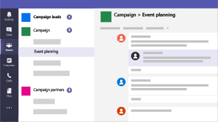

Microsoft 365 för kampanjer
===========================

I vår nuvarande värld är det en prioritet att hålla data och kommunikation säkra, särskilt för politiska kampanjer, medicinska och juridiska metoder och många andra företag. Microsoft 365 for Campaigns innehåller en uppsättning rekommendationer som är utformade för att skydda dig och dina data. Det här biblioteket innehåller hjälp med att konfigurera och använda den här rekommenderade miljön, även om du inte är en kampanj.

> [!VIDEO https://www.microsoft.com/videoplayer/embed/RE3clbH] 

**Vad är Microsoft 365 för kampanjer?** Det är en rekommenderad säker konfiguration som innehåller Microsoft 365 Business så att du kan:
- Förlita dig på tillförlitliga produktivitets- och samarbetsverktyg för företag, till exempel Outlook, Word, Excel och andra Office-produkter 
- Skydda dina arbetsfiler på alla dina iOS-, Android- och Windows 10-enheter med säkerhet i företagsklass som är enkel att hantera 
- Tillämpa extra skydd för användarkonton och identitet 

Medan federala valkampanjer i USA är berättigade till specialpriser för Microsoft 365 Business, kan alla organisationer med den här planen dra nytta av den här vägledningen för att konfigurera ökad säkerhet och lära sig att samarbeta på ett säkert sätt.

Det här biblioteket innehåller följande:
- Föreskrivande inställningsvägledning för att öka säkerheten.
- Hjälp för användare att konfigurera enheter för säker åtkomst.
- Vägledning om hur du samarbetar och delar säkert.

Mer information om vad som ingår finns i [Microsoft 365 Business](https://www.microsoft.com/microsoft-365/business). 

Komma igång
--------------------------

<ul class="panelContent cardsJ">
    <li>
        

            

                

                    

                        

                            
                        

                    

                    

                        
<b>Så här kommer du igång:</b>

                        
<a href="get-microsoft-365-campaigns.md">Få Microsoft 365-kampanjer</a>

                        
<a href="m365-campaigns-users.md">Läs om hur användarna kommer att arbeta med Microsoft 365</a>

                        
<a href="microsoft-365-campaigns-setup-overview.md">Konfigurera Microsoft 365-kampanjer</a>

                    

                

            

        

    </li>
</ul>

Lösningar för din kampanj eller småföretag
--------------------------

När du har konfigurerat din säkra Microsoft 365-miljö kan du använda följande lösningar för att komma igång:

<ul class="panelContent cardsW cols cols2">
    <li>
        

            

                

                    

                        

                            
                        

                    

                    

                        <h3>Skapa team för samarbete</h3>
                        
Skapa utrymme för kommunikation och samarbete med specifika team för nyckelpersonal, all personal och partner eller leverantörer med Microsoft Teams.

                        
<a href="create-teams-for-collaboration.md">Skapa ditt team</a>

                    

                

            

        

    </li>
    <li>
        

            

                

                    

                        

                            
                        

                    

                    

                        <h3>Konfigurera onlinemöten</h3>
                        
Schemalägg ett möte med ljud, video och delning med Microsoft Teams.

                        
<a href="set-up-meetings.md">Konfigurera ett möte</a>

                    

                

            

        

    </li>
    <li>
        

            

                

                    

                        

                            
                        

                    

                    

                        <h3>Kryptera eller märka din känsliga e-post</h3>
                        
Använd krypterings- och känslighetsetiketter för att skydda e-post som innehåller konfidentiell eller känslig information.

                        
<a href="send-encrypted-email.md">Skicka krypterad e-post</a>

                    

                

            

        

    </li>
    <li>
        

            

                

                    

                        

                            
                        

                    

                    

                        <h3>Skapa en kommunikationswebbplats</h3>
                        
Dela händelser, meddelanden, bilder med mera med ditt team på en intern kommunikationswebbplats som skapats med SharePoint.

                        
<a href="create-communications-site.md">Skapa din webbplats</a>

                    

                

            

        

    </li>
    <li>
        

            

                

                    

                        

                            
                        

                    

                    

                        <h3>Dela filer och videoklipp</h3>
                        
Spara dina filer och videoklipp i molnet så att de är tillgängliga för alla lämpliga personer.

                        
<a href="share-files-and-videos.md">Börja dela</a>

                    

                

            

        

    </li>
</ul>
