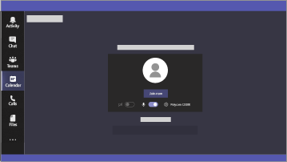

Microsoft 365 för Kampanjer
===========================

I dagens värld är att säkra data och kommunikation en prioritering, särskilt för politiska kampanjer, medicinska och juridiska metoder och många andra branscher. Microsoft 365 för kampanjer innehåller ett antal rekommendationer som hjälper dig att skydda dig själv och dina data. Biblioteket ger också instruktioner för att ställa in och använda den rekommenderade miljön, även om du inte är en kampanj.

> [!VIDEO https://www.microsoft.com/videoplayer/embed/RE3clbH] 

**Vad är Microsoft 365 för kampanjer?** Det är en rekommenderad säker konfiguration som inkluderar Microsoft 365 Business Premium så att du kan:
- Lita på pålitliga produktivitets- och samarbetsverktyg, som Outlook, Word, Excel och andra kontorsprodukter 
- Skydda dina arbetsfiler på alla dina iOS-, Android- och Windows 10-enheter med säkerhet i företagsklass som är lätt att hantera 
- Tillämpa ytterligare skydd för användarkonton och identiteter 

Det amerikanska presidentvalet kvalificerar sig för specialerbjudandet Microsoft 365 Business Premium, men alla med denna plan kan dra nytta av den här guiden för att konfigurera ökad säkerhet och arbeta säkert tillsammans.

Biblioteket innehåller följande:
- Bindande installationsinstruktioner för att öka säkerheten.
- Hjälp för användare att konfigurera enheter för säker åtkomst.
- Instruktioner för att säkert samarbeta och dela filer.

Mer information om innehållet finns i [Microsoft 365 Business Premium](https://www.microsoft.com/microsoft-365/business). 

Komma igång
--------------------------

 **Följ dessa steg för att komma igång:**  

- [Få Microsoft 365-kampanjer](get-microsoft-365-campaigns.md)
- [Lär dig hur dina användare arbetar med Microsoft 365](m365-campaigns-users.md)
- [Ställ in Microsoft 365-kampanjer](microsoft-365-campaigns-setup-overview.md)

Lösningar för din kampanj eller småföretag
--------------------------

När du har installerat din säkra Microsoft 365-miljö kan du börja arbeta med följande lösningar:

|               |               |
| ------------- | ------------- |
|  |  |
| **Skapa grupper för samarbete** Skapa ett utrymme för kommunikation och samarbete med specifika team för nyckelpersoner, alla anställda och partners eller leverantörer med Microsoft Teams. [Skapa ditt team](create-teams-for-collaboration.md) | **Konfigurera ett onlinemöte** Planera ett möte med ljud-, video- och fildelning med Microsoft Teams. [Boka ett möte](set-up-meetings.md) |
|  |  |
| **Kryptera eller etikettera känsliga e-postmeddelanden** Använd krypterings- eller sekretessetiketter för att skydda e-postmeddelanden med konfidentiell eller känslig information. [Skicka krypterade e-postmeddelanden](send-encrypted-email.md) | **Skapa en kommunikationswebbplats** Skapa en intern kommunikationssida med SharePoint och dela händelser, meddelanden, bilder och mer med ditt team. [Skapa din webbplats](create-communications-site.md) |
|  | |
| **Dela filer och videor** Lagra dina filer och videor i molnet så att de är tillgängliga för alla lämpliga användare. [Börja dela](share-files-and-videos.md) | |

