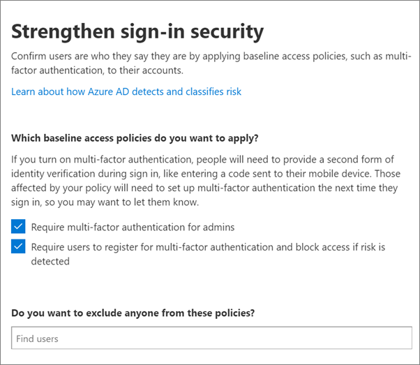

# Kräv multifaktorautentisering och konfigurera principer för villkorsstyrd åtkomstRequire multi-factor authentication and set up conditional access policies

Du skyddar åtkomsten till dina data med principer för multifaktorautentisering och villkorsstyrd åtkomst.You protect access to your data with multi-factor authentication and conditional access policies. Dessa tillägg till ökad säkerhet.These add substantial additional security. Microsoft tillhandahåller en uppsättning principer för villkorsstyrd åtkomst enligt grundläggande som rekommenderas för alla kunder.Microsoft provides a set of baseline conditional access policies that are recommended for all customers. Rikt linjer är en uppsättning fördefinierade principer som hjälper till att skydda organisationer mot många vanliga angrepp.Baseline policies are a set of predefined policies that help protect organizations against many common attacks. Dessa vanliga angrepp kan inkludera lösen ord, Replay och nätfiske.These common attacks can include password spray, replay, and phishing.

Dessa principer kräver att administratörer och användare anger en andra form av autentiseringsprocessen (kallas multifaktorautentisering) när vissa villkor uppfylls.These policies require admins and users to enter a second form of authentication (called multi-factor authentication, or MFA) when certain conditions are met. Om en användare i din organisation till exempel försöker logga in på Microsoft 365 från ett annat land eller från en okänd enhet kan inloggningen betraktas som riskfylld.For example, if a user in your organization tries to sign in to Microsoft 365 from a different country or from an unknown device, the sign-in might be considered risky. Användaren måste tillhandahålla en extra form av auktorisering (till exempel ett finger avtryck eller en kod) för att bevisa sin identitet.The user must provide an extra form of authentication (such as a fingerprint or a code) to prove their identity. 

För närvarande inkluderar grundläggande principer följande:Currently, baseline policies include the following:
- Konfigurera i Microsoft 365 Admin Center:Set up in Microsoft 365 admin center:
    - **KRÄV MFA för administratörer** – kräver multifaktorautentisering för de mest privilegierade administratörs rollerna, inklusive global administratör.**Require MFA for admins** — Requires multi-factor authentication for the most privileged administrator roles, including global administrator.
    - **Slutanvändarens skydd** – kräver multifaktorautentisering för användare endast när en inloggning är riskabel.**End user protection** — Requires multi-factor authentication for users only when a sign-in is risky. 
- Konfigurera i Azure Active Directory-portalen:Set up in Azure Active Directory portal:
    - **Blockera äldre verifierare** – äldre klient program och vissa nya appar använder inte nyare, säkrare autentiseringsprotokoll.**Block legacy authentication** — Older client apps and some new apps don't use newer, more secure, authentication protocols. Dessa äldre appar kan kringgå villkorsstyrda åtkomst principer och få obehörig åtkomst till din miljö.These older apps can bypass conditional access policies and gain unauthorized access to your environment. Denna princip blockerar åtkomst från klienter som inte stöder villkorlig åtkomst.This policy blocks access from clients that don't support conditional access. 
    - **KRÄV MFA för tjänst hantering** – kräver multifaktorautentisering för åtkomst till hanterings verktyg, inklusive Azure Portal (där du konfigurerar rikt linjer för principer).**Require MFA for Service Management** — Requires multi-factor authentication for access to management tools, including Azure portal (where you configure baseline policies). 

Microsoft rekommenderar att du aktiverar alla dessa rikt linjer.Microsoft recommends that you enable all of these baseline policies. När dessa principer är aktiverade uppmanas administratörer och användare att registrera dig för multifaktorautentisering med Azure AD.After these policies are enabled, admins and users will be prompted to register for Azure AD Multi-Factor authentication.

Mer information om dessa principer finns i [Vad är rikt linjer](https://docs.microsoft.com/azure/active-directory/conditional-access/concept-baseline-protection)?For more information about these policies, see [What are baseline policies](https://docs.microsoft.com/azure/active-directory/conditional-access/concept-baseline-protection)?

## Kräv MFARequire MFA

Om du vill att alla användare ska logga in med en andra form av ID:To require that all users sign in with a second form of ID:

1. Gå till administrations centret på <a href="https://go.microsoft.com/fwlink/p/?linkid=837890" target="_blank">https://admin.microsoft.com</a> och välj **installation**.Go to the admin center at <a href="https://go.microsoft.com/fwlink/p/?linkid=837890" target="_blank">https://admin.microsoft.com</a> and choose **Setup**.

2. På sidan Inställningar väljer du **Visa** i det **säkra kortet gör inloggning mer** .On the Setup page, choose **View** in the **Make sign-in more secure** card.

    
3. På sidan gör inloggning säkrare väljer du **Kom igång**.On the Make sign-in more secure page, choose **Get started**.
 
4. Markera kryss rutorna bredvid **Kräv multifaktorautentisering för administratörer** i fönstret Förstärk inloggnings säkerhet och **Kräv att användare registrerar multifaktorautentisering och blockera åtkomst om risken upptäcks**.On the Strengthen sign-in security pane, select the check boxes next to **Require multi-factor authentication for admins** and **Require users to register for multi-factor authentication and block access if risk is detected**.
    Se till att exkludera [katastrof](m365-campaigns-protect-admin-accounts.md#create-an-emergency-admin-account) -eller "brytar glas"-kontot från MFA-kravet i rutan **Sök efter användare** .Be sure to exclude the [emergency](m365-campaigns-protect-admin-accounts.md#create-an-emergency-admin-account) or "break-glass" admin account from the MFA requirement in the **Find users** box.
    
    

5. Välj **Skapa princip** längst ned på sidan.Choose **Create policy** on the bottom of the page.

## Konfigurera rikt linjerSet up baseline policies

1. Gå till [Azure-portalen](https://portal.azure.com)och gå till villkorlig åtkomst för **Azure Active Directory** \> **Conditional Access** för att skapa en **ny princip**.Go to the [Azure portal](https://portal.azure.com), and then navigate to **Azure Active Directory** \> **Conditional Access** to create a **new policy**.

Se följande anvisningar för varje princip:See the following specific instructions for each policy:  
    - [Kräv MFA för administratörerRequire MFA for admins](https://docs.microsoft.com/azure/active-directory/conditional-access/howto-baseline-protect-administrators)  
    - [Kräv MFA för användareRequire MFA for users](https://docs.microsoft.com/azure/active-directory/conditional-access/howto-baseline-protect-end-users)  
    - [Blockera äldre autentiseringBlock legacy authentication](https://docs.microsoft.com/azure/active-directory/conditional-access/howto-baseline-protect-legacy-auth)  
    - [Kräv MFA för tjänst hanteringRequire MFA for service management](https://docs.microsoft.com/azure/active-directory/conditional-access/howto-baseline-protect-azure)
    
> [!NOTE]
> För hands versions principer finns inte längre och användarna måste skapa sina egna principer.Preview policies no longer exist and users will need to create their own policies.

Du kan konfigurera ytterligare principer, till exempel för godkända klient program.You can set up extra policies, such as requiring approved client apps. Mer information finns i dokumentationen för [villkorlig åtkomst](https://docs.microsoft.com/azure/active-directory/conditional-access/).For more information, see the [Conditional Access documentation](https://docs.microsoft.com/azure/active-directory/conditional-access/).
