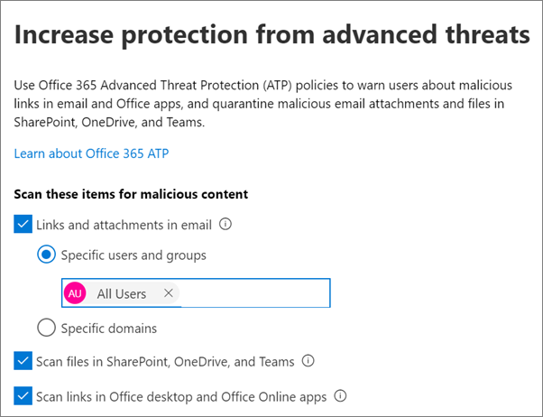
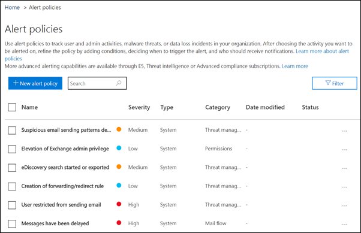

# Öka hotskyddet

Den här artikeln hjälper dig att öka skyddet i din Microsoft 365-prenumeration för att skydda mot nätfiske, skadlig programvara och andra hot. Dessa rekommendationer är lämpliga för organisationer med ett ökat behov av säkerhet, som politiska kampanjer, advokatbyråer och vårdcentraler. 

Innan du börjar kontrollerar du ditt säkra Office 365-resultat. Office 365 Secure Score analyserar organisationens säkerhet baserat på dina vanliga aktiviteter och säkerhetsinställningar och tilldelar en poäng. Börja med att notera din nuvarande poäng. Om du vidtar de åtgärder som rekommenderas i den här artikeln ökar du poängen. Målet är inte att uppnå maxpoäng, utan att vara medveten om möjligheter att skydda din miljö som inte negativt påverkar produktiviteten för användarna. 

Mer information finns i [Microsoft Secure Score](https://docs.microsoft.com/office365/securitycompliance/microsoft-secure-score).

## Höj skyddsnivån mot skadlig kod i post

Office 365- eller Microsoft 365-miljön innehåller skydd mot skadlig kod, men du kan öka det här skyddet genom att blockera bifogade filer med filtyper som ofta används för skadlig kod. Så här stöter du på skydd mot skadlig kod i e-post:
  
1. Gå [https://protection.office.com](https://protection.office.com) till och logga in med dina administratörskontouppgifter. 
    
2. &amp; Välj **Policy** \> **Anti-Malware**i det vänstra **Threat management**navigeringsfönstret i det vänstra navigeringsfönstret.
    
3. Dubbelklicka på standardprincipen om du vill redigera den här företagsövergripande principen.
    
4. Klicka på **Inställningar**.
    
5. Under **Filter för vanliga typer av bifogade filer**väljer du **På**. De filtyper som är blockerade visas i fönstret direkt under den här kontrollen.  Se till att du lägger till dessa filtyper:
   - ade, adp, ani, bas, bat, chm, cmd, com, cpl, crt, hlp, ht, hta, ins, isp, job, js, jse, lnk, mda, mdb, mde, mdz, msc, msi, msp, mst, pcd, reg, scr, sct, shs, url, vb, vbe, vbs, wsc, wsf, wsh, exe, pif    Du kan lägga till eller ta bort filtyper senare om det behövs.
    
6. Klicka på **Spara.**
    
Mer information finns i [Skydd mot skadlig kod](https://go.microsoft.com/fwlink/?linkid=2015692&amp;clcid=0x409).
  

## Skydda mot utpressningstrojaner

Ransomware begränsar åtkomsten till data genom att kryptera filer eller låsa datorskärmar. Det försöker sedan att pressa pengar från offer genom att be om "lösen", vanligtvis i form av kryptokurar som Bitcoin, i utbyte mot tillgång till data. 
  
Du kan skydda mot ransomware genom att skapa en eller flera regler för e-postflöde för att blockera filnamnstillägg som ofta används för ransomware (dessa lades till i [höjningen av skyddsnivån mot skadlig kod i e-poststeget)](#raise-the-level-of-protection-against-malware-in-mail) eller för att varna användare som tar emot dessa bilagor via e-post.

Förutom de filer som du blockerade i föregående steg är det också bra att skapa en regel för att varna användare innan du öppnar Office-bifogade filer som innehåller makron. Ransomware kan döljas i makron, så varna användarna att inte öppna dessa filer från personer de inte känner.

Så här skapar du en regel för e-posttransport:
  
1. Gå till administrationscentret <a href="https://go.microsoft.com/fwlink/p/?linkid=837890" target="_blank">https://admin.microsoft.com</a> på och välj **Administrationscenter** \> **Exchange**.
    
2. Klicka på **regler**i kategorin **e-postflöde.**
    
3. Klicka **+** på och sedan på **Skapa en ny regel**.
    
4. Klicka på **Fler alternativ** längst ned i dialogrutan om du vill se hela uppsättningen alternativ. 
    
5. Använd inställningarna i följande tabell för regeln. Lämna resten av inställningarna som standard, om du inte vill ändra dem.
    
6. Klicka på **Spara**.
    
|**Inställning**|**Varna användare innan du öppnar bifogade filer i Office-filer**||
|:-----|:-----|:-----|
|Namn    |Anti-ransomware regel: varna användare     |
|Använd den här regeln om . . .    |Alla bifogade filer . . . filändelsen matchar . . .    |
|Ange ord eller fraser    |Lägg till följande filtyper:    dotm, docm, xlsm, sltm, xla, xlam, xll, pptm, potm, ppam, ppsm, sldm   |
|Gör följande . . .    |Meddela mottagaren med ett meddelande    |
|Ange meddelandetext    |Öppna inte dessa typer av filer från personer som du inte känner eftersom de kan innehålla makron med skadlig kod.    |
   
Mer information finns i:
  
- [Hur man handskas med ransomware](https://go.microsoft.com/fwlink/?linkid=2016501&amp;clcid=0x409)
    
- [Återställa din OneDrive](https://support.office.com/article/fa231298-759d-41cf-bcd0-25ac53eb8a15.aspx)
    

## Stoppa automatisk vidarebefordran för e-post

Hackare som får tillgång till en användares postlåda kan stjäla din e-post genom att ställa in postlådan för att automatiskt vidarebefordra e-post. Detta kan hända även utan användarens medvetenhet. Du kan förhindra att detta händer genom att konfigurera en regel för e-postflöde. 
  
Så här skapar du en regel för e-posttransport genom att antingen titta på [den här korta videon](https://support.office.com/article/f9d693ba-5c78-47c0-b156-8e461e062aa7) eller så här:
  
1. Klicka på **Administrationscenter** \> för **Administrationscenter**i Microsoft 365.
    
2. Klicka på **regler**i kategorin **e-postflöde.**
    
3. Klicka **+** på och sedan på **Skapa en ny regel**.
    
4. Klicka på **Fler alternativ** längst ned i dialogrutan om du vill se hela uppsättningen alternativ. 
    
5. Använd inställningarna i följande tabell. Lämna resten av inställningarna som standard, om du inte vill ändra dem.
    
6. Klicka på **Spara**.
    
|**Inställning**|**Varna användare innan du öppnar bifogade filer i Office-filer**|
|:-----|:-----|
|Namn    |Förhindra automatisk vidarebefordran av e-post till externa domäner    |
|Tillämpa den här regeln om ...    |Avsändaren . . . är extern/intern . . . Inne i organisationen    |
|Lägg till villkor    |Meddelandeegenskaperna . . . inkludera meddelandetypen . . . Auto-framåt    |
|Gör följande ...    |Blockera meddelandet . . . avvisa meddelandet och inkludera en förklaring.    |
|Ange meddelandetext    |Automatisk vidarebefordran av e-post utanför den här organisationen förhindras av säkerhetsskäl.    |

## Skydda din e-post från nätfiskeattacker

Om du har konfigurerat en eller flera anpassade domäner för din Office 365- eller Microsoft 365-miljö kan du konfigurera riktat skydd mot nätfiske. ATP:s skydd mot nätfiske, som är en del av det avancerade skydd mot office 365, kan skydda din organisation från skadliga identitetsbaserade nätfiskeattacker och andra nätfiskeattacker. Om du inte har konfigurerat en anpassad domän behöver du inte göra detta.
  
Vi rekommenderar att du kommer igång med det här skyddet genom att skapa en princip för att skydda dina viktigaste användare och din anpassade domän. 

Om du vill skapa en ATP-policy mot nätfiske tittar du på [den här korta träningsvideon](https://support.office.com/article/86c425e1-1686-430a-9151-f7176cce4f2c)eller utför följande steg:
  
1. Gå till [https://protection.office.com](https://protection.office.com). 
    
2. Välj **Princip**i det **Threat management** &amp; vänstra navigeringsfönstret i det vänstra navigeringsfönstret.
    
3. På **sidan Policy** väljer du **ATP-anti-nätfiske**.
    
4. På sidan **Anti-phishing** väljer du **+ Skapa**. En guide startar som vägleder dig genom att definiera din anti-phishing-policy.
    
5. Ange namn, beskrivning och inställningar för principen enligt rekommendationen i diagrammet nedan. Mer information finns i [Lär dig mer om atp-alternativ för phishing-policyer](https://docs.microsoft.com/microsoft-365/security/office-365-security/set-up-anti-phishing-policies). 
    
6. När du har granskat dina inställningar väljer du **Skapa den här principen** eller **Spara**, beroende på vad som är lämpligt.
    

|**Inställning eller alternativ** |**Rekommenderad inställning**  |
|:-----|:-----|
|Namn    |Domän och mest värdefull kampanjpersonal    |
|Beskrivning    |Se till att den viktigaste personalen och vår domän inte personifieras.    |
|Lägga till användare som ska skyddas    |Välj **+ Lägg till ett villkor, Mottagaren är**. Skriv användarnamn eller ange kandidatens, kampanjchefens och andra viktiga medarbetares e-postadress. Du kan lägga till upp till 20 interna och externa adresser som du vill skydda mot personifiering.    |
|Lägga till domäner som ska skyddas    |Välj **+ Lägg till ett villkor, Mottagarens domän är**. Ange den anpassade domän som är kopplad till din Microsoft 365-prenumeration, om du har definierat en sådan. Du kan ange mer än en domän.    |
|Välj åtgärder    |Om e-post skickas av en personifierad användare: Välj **Omdirigera meddelande till en annan e-postadress**och skriv sedan säkerhetsadministratörens e-postadress. Till exempel *Alice @contoso.com*.          Om e-post skickas av en personifierad domän: Välj **karantänmeddelande**.    |
|Information om brevlåda    |Som standard väljs postlådeinformation när du skapar en ny anti-phishing-princip. Lämna den här inställningen **På** för bästa resultat.    |
|Lägga till betrodda avsändare och domäner    |Här kan du lägga till din egen domän eller andra betrodda domäner.    |
|Tillämpas på    |Välj **Mottagardomänen är**. Under **Något av dessa**väljer du **Välj**. Välj **+ Lägg till**. Markera kryssrutan bredvid namnet på domänen, till exempel *contoso. com *, i listan och välj sedan **Lägg till**. Välj **Klar**.    |
   
Mer information finns i [Konfigurera Office 365 ATP-principer mot nätfiske](https://docs.microsoft.com/microsoft-365/security/office-365-security/set-up-anti-phishing-policies).
  
## Skydda mot skadliga bilagor, filer och länkar med advanced threat protection (ATP)

Kontrollera först <a href="https://go.microsoft.com/fwlink/p/?linkid=837890" target="_blank">https://admin.microsoft.com</a> att du har aktiverat den nya förhandsversionen av administrationscentret i administrationscentret där du har aktiverat den nya förhandsversionen av administrationscentret. Aktivera växlingsknappen bredvid texten **Det nya administrationscentret**.

   

Om du inte ser **inställningssidan** med kort i din klientorganisation ännu &amp; läser du hur du utför de här stegen i Security Compliance Center. Se [Konfigurera ATP-säkra bilagor i Security & Compliance Center](#set-up-atp-safe-attachments-in-the-security--compliance-center) och Konfigurera SAFE Links för [ATP i Security & Compliance Center](#set-up-atp-safe-links-in-the-security--compliance-center).

1.  Välj **Installation i**den vänstra navigeringsfältet .
2. På sidan **Inställningar** väljer du **Visa** på **kortet Öka skydd mot avancerade hot.**  
     

3. På sidan **Öka skydd mot avancerade hot** väljer du Kom **igång**.
4. Markera kryssrutorna bredvid Länkar **och bifogade filer i e-post,** **Skanna filer i SharePoint, OneDrive och Teams och Skanna**i **Office-skrivbord och Office Online-appar i Office-datorer och Office Online-appar** under **Skanna objekt efter skadligt innehåll**.

      - Under **Länkar och bilagor i e-post**skriver du i Alla användare eller de specifika användare vars e-post du vill ska skannas.

    
5. Välj **Skapa principer** för att aktivera ATP-säkra bilagor och ATP-säkra länkar.

### Konfigurera ATP-säkra bilagor i Security & Compliance Center

Personer skickar, ta emot och delar regelbundet bifogade filer, till exempel dokument, presentationer, kalkylblad med mera. Det är inte alltid lätt att avgöra om en bifogad fil är säker eller skadlig bara genom att titta på ett e-postmeddelande. Office 365 Advanced Threat Protection innehåller ATP Safe Attachment protection, men det här skyddet är inte aktiverat som standard. Vi rekommenderar att du skapar en ny regel för att börja använda det här skyddet. Det här skyddet omfattar filer i SharePoint, OneDrive och Microsoft Teams.
  
Om du vill skapa en ATP-princip för säker bilaga tittar du antingen på [den här korta videon](https://support.office.com/article/e7e68934-23dc-4b9c-b714-e82e27a8f8a5)eller gör följande:
  
1. Gå [https://protection.office.com](https://protection.office.com) till och logga in med ditt administratörskonto. 
    
2. Välj **Princip**i det **Threat management** &amp; vänstra navigeringsfönstret i det vänstra navigeringsfönstret.
    
3. På sidan Princip väljer du **BETRODDa ATP-bilagor**.
    
4. På sidan Säkra bifogade filer använder du det här skyddet brett genom att markera kryssrutan **Aktivera ATP för SharePoint, OneDrive och Microsoft Teams.** 
    
5. Välj **+** det här om du vill skapa en ny princip. 
    
6. Använd inställningarna i följande tabell. 
    
7. När du har granskat inställningarna väljer du **Skapa den här principen** eller **Spara**, beroende på vad som är lämpligt.
    

|**Inställning eller alternativ**|**Rekommenderad inställning**  |
|:-----|:-----|
|Namn    |Blockera nuvarande och framtida e-postmeddelanden med upptäckt skadlig kod.    |
|Beskrivning    |Blockera aktuella och framtida e-postmeddelanden och bilagor med upptäckt skadlig kod.    |
|Spara okända skadliga filer för okänd skadlig kod    |Välj **Blockera - Blockera aktuella och framtida e-postmeddelanden och bilagor med upptäckt skadlig kod**.    |
|Omdirigera bifogad fil vid identifiering    |Aktivera omdirigering (välj den här rutan) Ange administratörskontot eller en postlåda för karantän.          Använd markeringen ovan om du söker efter bilagor eller fel uppstår (markera den här rutan).    |
|Tillämpas på    |Mottagardomänen är . . . välj domän.    |
   
Mer information finns i [Konfigurera Office 365 ATP-principer mot nätfiske](https://docs.microsoft.com/microsoft-365/security/office-365-security/set-up-anti-phishing-policies).
  
### Konfigurera ATP-säkra länkar i Security & Compliance Center

Hackare döljer ibland skadliga webbplatser i länkar i e-post eller andra filer. Office 365 ATP Safe Links (ATP Safe Links), en del av Office 365 Advanced Threat Protection, kan skydda din organisation genom att tillhandahålla snabbverifiering av webbadresser i e-postmeddelanden och Office-dokument. Skydd definieras via ATP Safe Links-principer.
  
Vi rekommenderar att du gör följande:
  
- Ändra standardprincipen för att öka skyddet.
    
- Lägg till en ny princip som riktar sig till alla mottagare på domänen.
    
Om du vill konfigurera ATP Safe Links tittar du på [den här korta träningsvideon](https://support.office.com/article/61492713-53c2-47da-a6e7-fa97479e97fa)eller utför följande steg:
  
1. Gå [https://protection.office.com](https://protection.office.com) till och logga in med ditt administratörskonto. 
    
2. Välj **Princip**i det **Threat management** &amp; vänstra navigeringsfönstret i det vänstra navigeringsfönstret.
    
3. På sidan Princip väljer du **BETRODDA ATP-länkar**.
    
Så här ändrar du standardprincipen:
  
1. Välj **standardprincipen** under **Principer som gäller för hela organisationen**på sidan Säkra länkar. 
    
2. Under **Inställningar som gäller för innehåll utom e-post**väljer du Microsoft **365 Apps för företag, Office för iOS och Android**.
    
3. Klicka på **Spara**. 
    
Så här skapar du en ny princip som riktar sig till alla mottagare på domänen:
  
1. Klicka på för att skapa en ny princip under **Principer som gäller för hela organisationen**på **+** sidan Säkra länkar. 
    
2. Använd inställningarna i följande tabell.
    
3. Klicka på **Spara**. 

|**Inställning eller alternativ**|**Rekommenderad inställning**  |
|:-----|:-----|
|Namn    |Princip för säkra länkar för alla mottagare i domänen    |
|Välj åtgärden för okända potentiellt skadliga url:er i meddelanden    |Välj **På - webbadresser skrivs om och kontrolleras mot en lista med kända skadliga länkar när användaren klickar på länken**.    |
|Använd säkra bilagor för att skanna nedladdningsbart innehåll    |Markera den här rutan.    |
|Tillämpas på    |Mottagardomänen är . . . välj domän.    |
   
Mer information finns i [säkra länkar till Office 365 ATP](https://go.microsoft.com/fwlink/?linkid=2016138&amp;clcid=0x409).
  
## Aktivera den enhetliga granskningsloggen

När du har aktiverat granskningsloggsökningen i säkerhetsorganisationscentret &amp; kan du behålla administratören och annan användaraktivitet i loggen och söka efter den. 

Du måste tilldelas rollen Granskningsloggar i Exchange Online för att aktivera eller inaktivera granskningsloggsökning i din Microsoft 365-prenumeration. Som standard tilldelas den här rollen till rollgrupperna Efterlevnadshantering och Organisationshantering på sidan Behörigheter i administrationscentret för Exchange. Globala administratörer i Microsoft 365 är som standard medlemmar i den här gruppen.

1. Om du vill aktivera granskningsloggsökningen går <a href="https://go.microsoft.com/fwlink/p/?linkid=837890" target="_blank">https://admin.microsoft.com</a> du till administrationscentret på och väljer sedan **Efterlevnad** under **Administrationscenter** i den vänstra navigeringscentralen. 
2. På sidan **Microsoft 365-efterlevnad** väljer du **Fler resurser**och sedan **öppna** på **säkerhetscenterkortet &amp; för Office 365.**

    
3. På sidan säkerhet och efterlevnad väljer du **Sök** och sedan **Granska loggsökning**.
1. Högst upp på **söksidan för granskningsloggen** väljer du **Aktivera granskning**.

När funktionen är aktiverad kan du söka efter filer, mappar och många aktiviteter. Mer information finns [i sök i granskningsloggen](https://docs.microsoft.com/office365/securitycompliance/search-the-audit-log-in-security-and-compliance).

## Justera inställningar för anonym delning för SharePoint- och OneDrive-filer och -mappar

(ändra standard anonym länk förfallodatum till 14 dagar, ändra standarddelningstyp till "Specifika personer") Så här ändrar du delningsinställningarna för OneDrive och SharePoint:
1. Gå till administrationscentret på <a href="https://go.microsoft.com/fwlink/p/?linkid=837890" target="_blank">https://admin.microsoft.com</a> och välj sedan **SharePoint** under **Administrationscenter** i den vänstra navigeringscentralen. 
2. Gå till \> **PolicyDelning**i **Policies** administrationscentret för SharePoint .
3. På sidan **Delning,** under **Fil- och mapplänkar,** väljer du **Specifika personer**och under **Avancerade inställningar för "Alla" länkar**väljer du Dessa länkar måste upphöra att gälla inom dessa många **dagar**och skriv in 14 (eller ett annat antal dagar som du vill begränsa länkens livstid till).

    

## Aktivitetsaviseringar

Du kan använda aktivitetsaviseringar för att spåra administratörs- och användaraktiviteter och upptäcka incidenter för att förhindra skadlig kod och dataförlust i organisationen. Din prenumeration innehåller en uppsättning standardprinciper, men du kan också skapa anpassade principer. Mer information finns i [varningsprinciper](https://docs.microsoft.com/office365/securitycompliance/alert-policies). Om du till exempel lagrar en viktig fil i SharePoint som du inte vill att någon ska dela externt kan du skapa ett meddelande som varnar dig om någon delar den.

Följande bild visar standardprinciper som ingår i Microsoft 365.   
    

## Inaktivera eller hantera kalenderdelning

Du kan förhindra att personer i organisationen delar sina kalendrar eller också hantera vad de kan dela. Du kan till exempel begränsa delningen till endast ledig/upptagen-tid.

1. Gå till administrationscentret <a href="https://go.microsoft.com/fwlink/p/?linkid=837890" target="_blank">https://admin.microsoft.com</a> på och välj **Inställningar** \> tjänster & **tillägg**.
2. På sidan **Tjänster & tillägg** väljer du **Kalender**och väljer om personer i organisationen kan dela sina kalendrar med personer utanför som har Office 365 eller Exchange eller med vem som helst. 
    Om du väljer alternativet Dela med vem som helst kan du välja att även bara dela ledig/upptagen-information.

3. Välj **Spara ändringar** längst ned på sidan.

    Följande bild visar kalenderdelning som inte är tillåten.   
    

    Följande bild visar inställningarna när kalenderdelning tillåts med en e-postlänk med endast ledig/upptagen-information.

   

Om användarna får dela sina kalendrar läser du [de här anvisningarna](https://support.office.com/article/7ecef8ae-139c-40d9-bae2-a23977ee58d5) för hur du delar från Outlook på webben.
