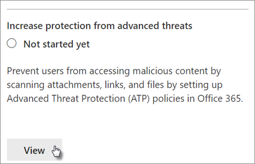

# Öka hotskyddetIncrease threat protection

Den här artikeln hjälper dig att öka skyddet i din Microsoft 365-prenumeration för att skydda mot nätfiske, skadlig programvara och andra hot.This article helps you increase the protection in your Microsoft 365 subscription to protect against phishing, malware, and other threats. Dessa rekommendationer är lämpliga för organisationer med ett ökat behov av säkerhet, som politiska kampanjer, advokatbyråer och vårdcentraler.These recommendations are appropriate for organizations with an increased need for security, like political campaigns, law offices, and health care clinics. 

Innan du börjar kontrollerar du ditt säkra Office 365-resultat.Before you begin, check your Office 365 Secure Score. Office 365 Secure Score analyserar organisationens säkerhet baserat på dina vanliga aktiviteter och säkerhetsinställningar och tilldelar en poäng.Office 365 Secure Score analyzes your organization's security based on your regular activities and security settings and assigns a score. Börja med att notera din nuvarande poäng.Begin by taking note of your current score. Om du vidtar de åtgärder som rekommenderas i den här artikeln ökar du poängen.Taking the actions recommended in this article increases your score. Målet är inte att uppnå maxpoäng, utan att vara medveten om möjligheter att skydda din miljö som inte negativt påverkar produktiviteten för användarna.The goal isn't to achieve the max score, but to be aware of opportunities to protect your environment that don't negatively affect productivity for your users. 

Mer information finns i [Microsoft Secure Score](https://docs.microsoft.com/office365/securitycompliance/microsoft-secure-score).For more information, see [Microsoft Secure Score](https://docs.microsoft.com/office365/securitycompliance/microsoft-secure-score).

## Höj skyddsnivån mot skadlig kod i postRaise the level of protection against malware in mail

Office 365- eller Microsoft 365-miljön innehåller skydd mot skadlig kod, men du kan öka det här skyddet genom att blockera bifogade filer med filtyper som ofta används för skadlig kod.Your Office 365 or Microsoft 365 environment includes protection against malware, but you can increase this protection by blocking attachments with file types that are commonly used for malware. Så här stöter du på skydd mot skadlig kod i e-post:To bump up malware protection in email:
  
1. Gå [https://protection.office.com](https://protection.office.com) till och logga in med dina administratörskontouppgifter.Go to [https://protection.office.com](https://protection.office.com) and sign in with your admin account credentials. 
    
2. &amp; Välj **Policy** \> **Anti-Malware**i det vänstra **Threat management**navigeringsfönstret i det vänstra navigeringsfönstret.In the Security &amp; Compliance Center, in the left navigation pane, under **Threat management**, choose **Policy** \> **Anti-Malware**.
    
3. Dubbelklicka på standardprincipen om du vill redigera den här företagsövergripande principen.Double-click the default policy to edit this company-wide policy.
    
4. Klicka på **Inställningar**.Click **Settings**.
    
5. Under **Filter för vanliga typer av bifogade filer**väljer du **På**.Under **Common Attachment Types Filter**, select **On**. De filtyper som är blockerade visas i fönstret direkt under den här kontrollen.The file types that are blocked are listed in the window directly below this control.  Se till att du lägger till dessa filtyper:Make sure you add these filetypes:
   - ade, adp, ani, bas, bat, chm, cmd, com, cpl, crt, hlp, ht, hta, ins, isp, job, js, jse, lnk, mda, mdb, mde, mdz, msc, msi, msp, mst, pcd, reg, scr, sct, shs, url, vb, vbe, vbs, wsc, wsf, wsh, exe, pifade, adp, ani, bas, bat, chm, cmd, com, cpl, crt, hlp, ht, hta, inf, ins, isp, job, js, jse, lnk, mda, mdb, mde, mdz, msc, msi, msp, mst, pcd, reg, scr, sct, shs, url, vb, vbe, vbs, wsc, wsf, wsh, exe, pif    Du kan lägga till eller ta bort filtyper senare om det behövs.You can add or delete file types later, if needed.
    
6. Klicka på **Spara.**Click **Save.**
    
Mer information finns i [Skydd mot skadlig kod](https://go.microsoft.com/fwlink/?linkid=2015692&amp;clcid=0x409).For more information, see [Anti-malware protection](https://go.microsoft.com/fwlink/?linkid=2015692&amp;clcid=0x409).
  

## Skydda mot utpressningstrojanerProtect against ransomware

Ransomware begränsar åtkomsten till data genom att kryptera filer eller låsa datorskärmar.Ransomware restricts access to data by encrypting files or locking computer screens. Det försöker sedan att pressa pengar från offer genom att be om "lösen", vanligtvis i form av kryptokurar som Bitcoin, i utbyte mot tillgång till data.It then attempts to extort money from victims by asking for "ransom," usually in the form of cryptocurrencies like Bitcoin, in exchange for access to data. 
  
Du kan skydda mot ransomware genom att skapa en eller flera regler för e-postflöde för att blockera filnamnstillägg som ofta används för ransomware (dessa lades till i [höjningen av skyddsnivån mot skadlig kod i e-poststeget)](#raise-the-level-of-protection-against-malware-in-mail) eller för att varna användare som tar emot dessa bilagor via e-post.You can protect against ransomware by creating one or more mail flow rules to block file extensions that are commonly used for ransomware (these were added in the [raise the level of protection against malware in mail](#raise-the-level-of-protection-against-malware-in-mail) step), or to warn users who receive these attachments in email.

Förutom de filer som du blockerade i föregående steg är det också bra att skapa en regel för att varna användare innan du öppnar Office-bifogade filer som innehåller makron.In addition to the files that you blocked in the previous step, it's also good practice to create a rule to warn users before opening Office file attachments that include macros. Ransomware kan döljas i makron, så varna användarna att inte öppna dessa filer från personer de inte känner.Ransomware can be hidden inside macros, so warn users to not open these files from people they don't know.

Så här skapar du en regel för e-posttransport:To create a mail transport rule:
  
1. Gå till administrationscentret <a href="https://go.microsoft.com/fwlink/p/?linkid=837890" target="_blank">https://admin.microsoft.com</a> på och välj **Administrationscenter** \> **Exchange**.Go to the admin center at <a href="https://go.microsoft.com/fwlink/p/?linkid=837890" target="_blank">https://admin.microsoft.com</a> and choose **Admin centers** \> **Exchange**.
    
2. Klicka på **regler**i kategorin **e-postflöde.**In the **mail flow** category, click **rules**.
    
3. Klicka **+** på och sedan på **Skapa en ny regel**.Click **+**, and then click **Create a new rule**.
    
4. Klicka på **Fler alternativ** längst ned i dialogrutan om du vill se hela uppsättningen alternativ.Click **More options** at the bottom of the dialog box to see the full set of options. 
    
5. Använd inställningarna i följande tabell för regeln.Apply the settings in the following table for the rule. Lämna resten av inställningarna som standard, om du inte vill ändra dem.Leave the rest of the settings at the default, unless you want to change them.
    
6. Klicka på **Spara**.Click **Save**.
    
|**Inställning****Setting**|**Varna användare innan du öppnar bifogade filer i Office-filer****Warn users before opening attachments of Office files**||
|:-----|:-----|:-----|
|NamnName    |Anti-ransomware regel: varna användareAnti-ransomware rule: warn users     |
|Använd den här regeln om .Apply this rule if . .. ..    |Alla bifogade filer .Any attachment . .. .. filändelsen matchar .file extension matches . .. ..    |
|Ange ord eller fraserSpecify words or phrases    |Lägg till följande filtyper:Add these file types:    dotm, docm, xlsm, sltm, xla, xlam, xll, pptm, potm, ppam, ppsm, sldmdotm, docm, xlsm, sltm, xla, xlam, xll, pptm, potm, ppam, ppsm, sldm   |
|Gör följande .Do the following . .. ..    |Meddela mottagaren med ett meddelandeNotify the recipient with a message    |
|Ange meddelandetextProvide message text    |Öppna inte dessa typer av filer från personer som du inte känner eftersom de kan innehålla makron med skadlig kod.Do not open these types of files from people you do not know because they might contain macros with malicious code.    |
   
Mer information finns i:For more information, see:
  
- [Hur man handskas med ransomwareHow to deal with ransomware](https://go.microsoft.com/fwlink/?linkid=2016501&amp;clcid=0x409)
    
- [Återställa din OneDriveRestore your OneDrive](https://support.office.com/article/fa231298-759d-41cf-bcd0-25ac53eb8a15.aspx)
    

## Stoppa automatisk vidarebefordran för e-postStop auto-forwarding for email

Hackare som får tillgång till en användares postlåda kan stjäla din e-post genom att ställa in postlådan för att automatiskt vidarebefordra e-post.Hackers who gain access to a user's mailbox can steal your mail by setting the mailbox to automatically forward email. Detta kan hända även utan användarens medvetenhet.This can happen even without the user's awareness. Du kan förhindra att detta händer genom att konfigurera en regel för e-postflöde.You can prevent this from happening by configuring a mail flow rule. 
  
Så här skapar du en regel för e-posttransport genom att antingen titta på [den här korta videon](https://support.office.com/article/f9d693ba-5c78-47c0-b156-8e461e062aa7) eller så här:To create a mail transport rule, either watch [this short video](https://support.office.com/article/f9d693ba-5c78-47c0-b156-8e461e062aa7) or follow these steps:
  
1. Klicka på **Administrationscenter** \> för **Administrationscenter**i Microsoft 365.In the Microsoft 365 admin center, click **Admin centers** \> **Exchange**.
    
2. Klicka på **regler**i kategorin **e-postflöde.**In the **mail flow** category, click **rules**.
    
3. Klicka **+** på och sedan på **Skapa en ny regel**.Click **+**, and then click **Create a new rule**.
    
4. Klicka på **Fler alternativ** längst ned i dialogrutan om du vill se hela uppsättningen alternativ.Click **More options** at the bottom of the dialog box to see the full set of options. 
    
5. Använd inställningarna i följande tabell.Apply the settings in the following table. Lämna resten av inställningarna som standard, om du inte vill ändra dem.Leave the rest of the settings at the default, unless you want to change them.
    
6. Klicka på **Spara**.Click **Save**.
    
|**Inställning****Setting**|**Varna användare innan du öppnar bifogade filer i Office-filer****Warn users before opening attachments of Office files**|
|:-----|:-----|
|NamnName    |Förhindra automatisk vidarebefordran av e-post till externa domänerPrevent auto forwarding of email to external domains    |
|Tillämpa den här regeln om ...Apply this rule if ...    |Avsändaren .The sender . .. .. är extern/intern .is external/internal . .. .. Inne i organisationenInside the organization    |
|Lägg till villkorAdd condition    |Meddelandeegenskaperna .The message properties . .. .. inkludera meddelandetypen .include the message type . .. .. Auto-framåtAuto-forward    |
|Gör följande ...Do the following ...    |Blockera meddelandet .Block the message . .. .. avvisa meddelandet och inkludera en förklaring.reject the message and include an explanation.    |
|Ange meddelandetextProvide message text    |Automatisk vidarebefordran av e-post utanför den här organisationen förhindras av säkerhetsskäl.Auto-forwarding email outside this organization is prevented for security reasons.    |

## Skydda din e-post från nätfiskeattackerProtect your email from phishing attacks

Om du har konfigurerat en eller flera anpassade domäner för din Office 365- eller Microsoft 365-miljö kan du konfigurera riktat skydd mot nätfiske.If you've configured one or more custom domains for your Office 365 or Microsoft 365 environment, you can configure targeted anti-phishing protection. ATP:s skydd mot nätfiske, som är en del av det avancerade skydd mot office 365, kan skydda din organisation från skadliga identitetsbaserade nätfiskeattacker och andra nätfiskeattacker.ATP anti-phishing protection, part of Office 365 Advanced Threat Protection, can help protect your organization from malicious impersonation-based phishing attacks and other phishing attacks. Om du inte har konfigurerat en anpassad domän behöver du inte göra detta.If you haven't configured a custom domain, you don't need to do this.
  
Vi rekommenderar att du kommer igång med det här skyddet genom att skapa en princip för att skydda dina viktigaste användare och din anpassade domän.We recommend that you get started with this protection by creating a policy to protect your most important users and your custom domain. 

Om du vill skapa en ATP-policy mot nätfiske tittar du på [den här korta träningsvideon](https://support.office.com/article/86c425e1-1686-430a-9151-f7176cce4f2c)eller utför följande steg:To create an ATP anti-phishing policy, watch  [this short training video](https://support.office.com/article/86c425e1-1686-430a-9151-f7176cce4f2c), or complete the following steps:
  
1. Gå till [https://protection.office.com](https://protection.office.com).Go to [https://protection.office.com](https://protection.office.com). 
    
2. Välj **Princip**i det **Threat management** &amp; vänstra navigeringsfönstret i det vänstra navigeringsfönstret.In the Security &amp; Compliance Center, in the left navigation pane, under **Threat management**, choose **Policy**.
    
3. På **sidan Policy** väljer du **ATP-anti-nätfiske**.On the **Policy** page, choose **ATP anti-phishing**.
    
4. På sidan **Anti-phishing** väljer du **+ Skapa**.On the **Anti-phishing** page, select **+ Create**. En guide startar som vägleder dig genom att definiera din anti-phishing-policy.A wizard launches that steps you through defining your anti-phishing policy.
    
5. Ange namn, beskrivning och inställningar för principen enligt rekommendationen i diagrammet nedan.Specify the name, description, and settings for your policy as recommended in the chart below. Mer information finns i [Lär dig mer om atp-alternativ för phishing-policyer](https://docs.microsoft.com/microsoft-365/security/office-365-security/set-up-anti-phishing-policies).For more information, see [Learn about ATP anti-phishing policy options](https://docs.microsoft.com/microsoft-365/security/office-365-security/set-up-anti-phishing-policies). 
    
6. När du har granskat dina inställningar väljer du **Skapa den här principen** eller **Spara**, beroende på vad som är lämpligt.After you've reviewed your settings, choose **Create this policy** or **Save**, as appropriate.
    

|**Inställning eller alternativ****Setting or option** |**Rekommenderad inställning****Recommended setting**  |
|:-----|:-----|
|NamnName    |Domän och mest värdefull kampanjpersonalDomain and most valuable campaign staff    |
|BeskrivningDescription    |Se till att den viktigaste personalen och vår domän inte personifieras.Ensure most important staff and our domain are not being impersonated.    |
|Lägga till användare som ska skyddasAdd users to protect    |Välj **+ Lägg till ett villkor, Mottagaren är**.Select **+ Add a condition, The recipient is**. Skriv användarnamn eller ange kandidatens, kampanjchefens och andra viktiga medarbetares e-postadress.Type user names or enter the email address of the candidate, campaign manager, and other important staff members. Du kan lägga till upp till 20 interna och externa adresser som du vill skydda mot personifiering.You can add up to 20 internal and external addresses that you want to protect from impersonation.    |
|Lägga till domäner som ska skyddasAdd domains to protect    |Välj **+ Lägg till ett villkor, Mottagarens domän är**.Select **+ Add a condition, The recipient domain is**. Ange den anpassade domän som är kopplad till din Microsoft 365-prenumeration, om du har definierat en sådan.Enter the custom domain associated with your Microsoft 365 subscription, if you defined one. Du kan ange mer än en domän.You can enter more than one domain.    |
|Välj åtgärderChoose actions    |Om e-post skickas av en personifierad användare: Välj **Omdirigera meddelande till en annan e-postadress**och skriv sedan säkerhetsadministratörens e-postadress. Till exempel *Alice @contoso.com*.If email is sent by an impersonated user: Choose **Redirect message to another email address**, and then type the email address of the security administrator; for example, *Alice@contoso.com*.          Om e-post skickas av en personifierad domän: Välj **karantänmeddelande**.If email is sent by an impersonated domain: Choose **Quarantine message**.    |
|Information om brevlådaMailbox intelligence    |Som standard väljs postlådeinformation när du skapar en ny anti-phishing-princip.By default, mailbox intelligence is selected when you create a new anti-phishing policy. Lämna den här inställningen **På** för bästa resultat.Leave this setting **On** for best results.    |
|Lägga till betrodda avsändare och domänerAdd trusted senders and domains    |Här kan du lägga till din egen domän eller andra betrodda domäner.Here you can add your own domain, or any other trusted domains.    |
|Tillämpas påApplied to    |Välj **Mottagardomänen är**.Select **The recipient domain is**. Under **Något av dessa**väljer du **Välj**.Under **Any of these**, select **Choose**. Välj **+ Lägg till**.Select **+ Add**. Markera kryssrutan bredvid namnet på domänen, till exempel *contoso. com *, i listan och välj sedan **Lägg till**.Select the check box next to the name of the domain, for example, *contoso.com*, in the list, and then select **Add**. Välj **Klar**.Select **Done**.    |
   
Mer information finns i [Konfigurera Office 365 ATP-principer mot nätfiske](https://docs.microsoft.com/microsoft-365/security/office-365-security/set-up-anti-phishing-policies).For more information, see [Set up Office 365 ATP anti-phishing policies](https://docs.microsoft.com/microsoft-365/security/office-365-security/set-up-anti-phishing-policies).
  
## Skydda mot skadliga bilagor, filer och länkar med advanced threat protection (ATP)Protect against malicious attachments, files, and links with Advanced Threat Protection (ATP)

Kontrollera först <a href="https://go.microsoft.com/fwlink/p/?linkid=837890" target="_blank">https://admin.microsoft.com</a> att du har aktiverat den nya förhandsversionen av administrationscentret i administrationscentret där du har aktiverat den nya förhandsversionen av administrationscentret.First, make sure, in the admin center at <a href="https://go.microsoft.com/fwlink/p/?linkid=837890" target="_blank">https://admin.microsoft.com</a> that you have the new admin center preview turned on. Aktivera växlingsknappen bredvid texten **Det nya administrationscentret**.Turn on the toggle next to the text **The new admin center**.

   

Om du inte ser **inställningssidan** med kort i din klientorganisation ännu &amp; läser du hur du utför de här stegen i Security Compliance Center.If you don't see the **Setup** page with cards in your tenant yet, see how to complete these steps in Security &amp; Compliance Center. Se [Konfigurera ATP-säkra bilagor i Security & Compliance Center](#set-up-atp-safe-attachments-in-the-security--compliance-center) och Konfigurera SAFE Links för [ATP i Security & Compliance Center](#set-up-atp-safe-links-in-the-security--compliance-center).See [Set up ATP safe attachments in the Security & Compliance Center](#set-up-atp-safe-attachments-in-the-security--compliance-center) and [Set up ATP Safe Links in the Security & Compliance Center](#set-up-atp-safe-links-in-the-security--compliance-center).

1.  Välj **Installation i**den vänstra navigeringsfältet .In the left nav, choose **Setup**.
2. På sidan **Inställningar** väljer du **Visa** på **kortet Öka skydd mot avancerade hot.**On the **Setup** page, choose **View** on the **Increase protection from advanced threats** card.  
     

3. På sidan **Öka skydd mot avancerade hot** väljer du Kom **igång**.On the **Increase protection from advanced threats** page, choose **Get started**.
4. Markera kryssrutorna bredvid Länkar **och bifogade filer i e-post,** **Skanna filer i SharePoint, OneDrive och Teams och Skanna**i **Office-skrivbord och Office Online-appar i Office-datorer och Office Online-appar** under **Skanna objekt efter skadligt innehåll**.On the pane that opens, select the check boxes next to **Links and attachments in email**, **Scan files in SharePoint, OneDrive, and Teams**, and **Scan links in Office desktop and Office Online apps** under **Scan items for malicious content**.

      - Under **Länkar och bilagor i e-post**skriver du i Alla användare eller de specifika användare vars e-post du vill ska skannas.Under **Links and attachments in email**, Type in All Users, or the specific users whose email you want scanned.

    
5. Välj **Skapa principer** för att aktivera ATP-säkra bilagor och ATP-säkra länkar.Choose **Create policies** to turn on ATP safe attachments and ATP safe links.

### Konfigurera ATP-säkra bilagor i Security & Compliance CenterSet up ATP safe attachments in the Security & Compliance Center

Personer skickar, ta emot och delar regelbundet bifogade filer, till exempel dokument, presentationer, kalkylblad med mera.People regularly send, receive, and share attachments, such as documents, presentations, spreadsheets, and more. Det är inte alltid lätt att avgöra om en bifogad fil är säker eller skadlig bara genom att titta på ett e-postmeddelande.It's not always easy to tell whether an attachment is safe or malicious just by looking at an email message. Office 365 Advanced Threat Protection innehåller ATP Safe Attachment protection, men det här skyddet är inte aktiverat som standard.Office 365 Advanced Threat Protection includes ATP Safe Attachment protection, but this protection is not turned on by default. Vi rekommenderar att du skapar en ny regel för att börja använda det här skyddet.We recommend that you create a new rule to begin using this protection. Det här skyddet omfattar filer i SharePoint, OneDrive och Microsoft Teams.This protection extends to files in SharePoint, OneDrive, and Microsoft Teams.
  
Om du vill skapa en ATP-princip för säker bilaga tittar du antingen på [den här korta videon](https://support.office.com/article/e7e68934-23dc-4b9c-b714-e82e27a8f8a5)eller gör följande:To create an ATP safe attachment policy, either watch [this short video](https://support.office.com/article/e7e68934-23dc-4b9c-b714-e82e27a8f8a5), or complete the following steps:
  
1. Gå [https://protection.office.com](https://protection.office.com) till och logga in med ditt administratörskonto.Go to [https://protection.office.com](https://protection.office.com) and sign in with your admin account. 
    
2. Välj **Princip**i det **Threat management** &amp; vänstra navigeringsfönstret i det vänstra navigeringsfönstret.In the Security &amp; Compliance Center, in the left navigation pane, under **Threat management**, choose **Policy**.
    
3. På sidan Princip väljer du **BETRODDa ATP-bilagor**.On the Policy page, choose **ATP safe attachments**.
    
4. På sidan Säkra bifogade filer använder du det här skyddet brett genom att markera kryssrutan **Aktivera ATP för SharePoint, OneDrive och Microsoft Teams.**On the Safe attachments page, apply this protection broadly by selecting the **Turn on ATP for SharePoint, OneDrive, and Microsoft Teams** check box. 
    
5. Välj **+** det här om du vill skapa en ny princip.Select **+** to create a new policy. 
    
6. Använd inställningarna i följande tabell.Apply the settings in the following table. 
    
7. När du har granskat inställningarna väljer du **Skapa den här principen** eller **Spara**, beroende på vad som är lämpligt.After you review your settings, choose **Create this policy** or **Save**, as appropriate.
    

|**Inställning eller alternativ****Setting or option**|**Rekommenderad inställning****Recommended setting**  |
|:-----|:-----|
|NamnName    |Blockera nuvarande och framtida e-postmeddelanden med upptäckt skadlig kod.Block current and future emails with detected malware.    |
|BeskrivningDescription    |Blockera aktuella och framtida e-postmeddelanden och bilagor med upptäckt skadlig kod.Block current and future emails and attachments with detected malware.    |
|Spara okända skadliga filer för okänd skadlig kodSave attachments unknown malware response    |Välj **Blockera - Blockera aktuella och framtida e-postmeddelanden och bilagor med upptäckt skadlig kod**.Select **Block - Block the current and future emails and attachments with detected malware**.    |
|Omdirigera bifogad fil vid identifieringRedirect attachment on detection    |Aktivera omdirigering (välj den här rutan) Ange administratörskontot eller en postlåda för karantän.Enable redirection (select this box)          Enter the admin account or a mailbox setup for quarantine.          Använd markeringen ovan om du söker efter bilagor eller fel uppstår (markera den här rutan).Apply the above selection if malware scanning for attachments times out or error occurs (select this box).    |
|Tillämpas påApplied to    |Mottagardomänen är .The recipient domain is . .. .. välj domän.select your domain.    |
   
Mer information finns i [Konfigurera Office 365 ATP-principer mot nätfiske](https://docs.microsoft.com/microsoft-365/security/office-365-security/set-up-anti-phishing-policies).For more information, see [Set up Office 365 ATP anti-phishing policies](https://docs.microsoft.com/microsoft-365/security/office-365-security/set-up-anti-phishing-policies).
  
### Konfigurera ATP-säkra länkar i Security & Compliance CenterSet up ATP Safe Links in the Security & Compliance Center

Hackare döljer ibland skadliga webbplatser i länkar i e-post eller andra filer.Hackers sometimes hide malicious websites in links in email or other files. Office 365 ATP Safe Links (ATP Safe Links), en del av Office 365 Advanced Threat Protection, kan skydda din organisation genom att tillhandahålla snabbverifiering av webbadresser i e-postmeddelanden och Office-dokument.Office 365 ATP Safe Links (ATP Safe Links), part of Office 365 Advanced Threat Protection, can help protect your organization by providing time-of-click verification of web addresses (URLs) in email messages and Office documents. Skydd definieras via ATP Safe Links-principer.Protection is defined through ATP Safe Links policies.
  
Vi rekommenderar att du gör följande:We recommend that you do the following:
  
- Ändra standardprincipen för att öka skyddet.Modify the default policy to increase protection.
    
- Lägg till en ny princip som riktar sig till alla mottagare på domänen.Add a new policy targeted to all recipients in your domain.
    
Om du vill konfigurera ATP Safe Links tittar du på [den här korta träningsvideon](https://support.office.com/article/61492713-53c2-47da-a6e7-fa97479e97fa)eller utför följande steg:To set up ATP Safe Links, watch [this short training video](https://support.office.com/article/61492713-53c2-47da-a6e7-fa97479e97fa), or complete the following steps:
  
1. Gå [https://protection.office.com](https://protection.office.com) till och logga in med ditt administratörskonto.Go to [https://protection.office.com](https://protection.office.com) and sign in with your admin account. 
    
2. Välj **Princip**i det **Threat management** &amp; vänstra navigeringsfönstret i det vänstra navigeringsfönstret.In the Security &amp; Compliance Center, in the left navigation pane, under **Threat management**, choose **Policy**.
    
3. På sidan Princip väljer du **BETRODDA ATP-länkar**.On the Policy page, choose **ATP Safe Links**.
    
Så här ändrar du standardprincipen:To modify the default policy:
  
1. Välj **standardprincipen** under **Principer som gäller för hela organisationen**på sidan Säkra länkar.On the Safe links page, under **Policies that apply to the entire organization**, select the **Default** policy. 
    
2. Under **Inställningar som gäller för innehåll utom e-post**väljer du Microsoft **365 Apps för företag, Office för iOS och Android**.Under **Settings that apply to content except email**, select **Microsoft 365 Apps for enterprise, Office for iOS and Android**.
    
3. Klicka på **Spara**.Click **Save**. 
    
Så här skapar du en ny princip som riktar sig till alla mottagare på domänen:To create a new policy targeted to all recipients in your domain:
  
1. Klicka på för att skapa en ny princip under **Principer som gäller för hela organisationen**på **+** sidan Säkra länkar.On the Safe links page, under **Policies that apply to the entire organization**, click **+** to create a new policy. 
    
2. Använd inställningarna i följande tabell.Apply the settings listed in the following table.
    
3. Klicka på **Spara**.Click **Save**. 

|**Inställning eller alternativ****Setting or option**|**Rekommenderad inställning****Recommended setting**  |
|:-----|:-----|
|NamnName    |Princip för säkra länkar för alla mottagare i domänenSafe links policy for all recipients in the domain    |
|Välj åtgärden för okända potentiellt skadliga url:er i meddelandenSelect the action for unknown potentially malicious URLs in messages    |Välj **På - webbadresser skrivs om och kontrolleras mot en lista med kända skadliga länkar när användaren klickar på länken**.Select **On - URLs will be rewritten and checked against a list of known malicious links when user clicks on the link**.    |
|Använd säkra bilagor för att skanna nedladdningsbart innehållUse Safe Attachments to scan downloadable content    |Markera den här rutan.Select this box.    |
|Tillämpas påApplied to    |Mottagardomänen är .The recipient domain is . .. .. välj domän.select your domain.    |
   
Mer information finns i [säkra länkar till Office 365 ATP](https://go.microsoft.com/fwlink/?linkid=2016138&amp;clcid=0x409).For more information, see [Office 365 ATP safe links](https://go.microsoft.com/fwlink/?linkid=2016138&amp;clcid=0x409).
  
## Aktivera den enhetliga granskningsloggenTurn on the Unified Audit Log

När du har aktiverat granskningsloggsökningen i säkerhetsorganisationscentret &amp; kan du behålla administratören och annan användaraktivitet i loggen och söka efter den.After you turn on the audit log search in the Security &amp; Compliance center, you can retain the admin and other user activity in the log and search it. 

Du måste tilldelas rollen Granskningsloggar i Exchange Online för att aktivera eller inaktivera granskningsloggsökning i din Microsoft 365-prenumeration.You must be assigned the Audit Logs role in Exchange Online to turn audit log search on or off in your Microsoft 365 subscription. Som standard tilldelas den här rollen till rollgrupperna Efterlevnadshantering och Organisationshantering på sidan Behörigheter i administrationscentret för Exchange.By default, this role is assigned to the Compliance Management and Organization Management role groups on the Permissions page in the Exchange admin center. Globala administratörer i Microsoft 365 är som standard medlemmar i den här gruppen.Global admins in Microsoft 365 are members of this group by default.

1. Om du vill aktivera granskningsloggsökningen går <a href="https://go.microsoft.com/fwlink/p/?linkid=837890" target="_blank">https://admin.microsoft.com</a> du till administrationscentret på och väljer sedan **Efterlevnad** under **Administrationscenter** i den vänstra navigeringscentralen.To turn on the audit log search on, go to the admin center at <a href="https://go.microsoft.com/fwlink/p/?linkid=837890" target="_blank">https://admin.microsoft.com</a> and then choose **Compliance** under **Admin centers** in the left nav. 
2. På sidan **Microsoft 365-efterlevnad** väljer du **Fler resurser**och sedan **öppna** på **säkerhetscenterkortet &amp; för Office 365.**On the **Microsoft 365 compliance** page, choose **More resources**, and then **Open** on the **Office 365 security &amp; center** card.

    
3. På sidan säkerhet och efterlevnad väljer du **Sök** och sedan **Granska loggsökning**.On the security and compliance page, choose **Search** and then **Audit log search**.
1. Högst upp på **söksidan för granskningsloggen** väljer du **Aktivera granskning**.On the top of the **Audit log search** page, choose **Turn on auditing**.

När funktionen är aktiverad kan du söka efter filer, mappar och många aktiviteter.After the feature is turned on, you can search for files, folders, and many activities. Mer information finns [i sök i granskningsloggen](https://docs.microsoft.com/office365/securitycompliance/search-the-audit-log-in-security-and-compliance).For more information, see [search the audit log](https://docs.microsoft.com/office365/securitycompliance/search-the-audit-log-in-security-and-compliance).

## Justera inställningar för anonym delning för SharePoint- och OneDrive-filer och -mapparTune-up anonymous sharing settings for SharePoint and OneDrive files and folders

(ändra standard anonym länk förfallodatum till 14 dagar, ändra standarddelningstyp till "Specifika personer") Så här ändrar du delningsinställningarna för OneDrive och SharePoint:(change default anonymous link expiration to 14 days, change default sharing type to "Specific People") To change the sharing settings for OneDrive and SharePoint:
1. Gå till administrationscentret på <a href="https://go.microsoft.com/fwlink/p/?linkid=837890" target="_blank">https://admin.microsoft.com</a> och välj sedan **SharePoint** under **Administrationscenter** i den vänstra navigeringscentralen.Go to the admin center at <a href="https://go.microsoft.com/fwlink/p/?linkid=837890" target="_blank">https://admin.microsoft.com</a> and then choose **SharePoint** under **Admin centers** in the left nav. 
2. Gå till \> **PolicyDelning**i **Policies** administrationscentret för SharePoint .In the SharePoint admin center, go to **Policies** \> **Sharing**.
3. På sidan **Delning,** under **Fil- och mapplänkar,** väljer du **Specifika personer**och under **Avancerade inställningar för "Alla" länkar**väljer du Dessa länkar måste upphöra att gälla inom dessa många **dagar**och skriv in 14 (eller ett annat antal dagar som du vill begränsa länkens livstid till).On the **Sharing** page, under **File and folder links**, select **Specific people**, and under **Advanced settings for "Anyone" links**, select **These links must expire within this many days**, and type in 14 (or another number of days you want to restrict the link lifetime to).

    

## AktivitetsaviseringarActivity alerts

Du kan använda aktivitetsaviseringar för att spåra administratörs- och användaraktiviteter och upptäcka incidenter för att förhindra skadlig kod och dataförlust i organisationen.You can use activity alerts to track admin and user activities and detect malware and data loss prevention incidents in your organization. Din prenumeration innehåller en uppsättning standardprinciper, men du kan också skapa anpassade principer.Your subscription includes a set of default policies, but you can also create custom ones. Mer information finns i [varningsprinciper](https://docs.microsoft.com/office365/securitycompliance/alert-policies).For more information, see [alert policies](https://docs.microsoft.com/office365/securitycompliance/alert-policies). Om du till exempel lagrar en viktig fil i SharePoint som du inte vill att någon ska dela externt kan du skapa ett meddelande som varnar dig om någon delar den.For example, if you store an important file in SharePoint that you don't want anyone to share externally, you can create a notification that alerts you if someone does share it.

Följande bild visar standardprinciper som ingår i Microsoft 365.The following figure shows the default policies that are included with Microsoft 365.   
    

## Inaktivera eller hantera kalenderdelningDisable or manage calendar sharing

Du kan förhindra att personer i organisationen delar sina kalendrar eller också hantera vad de kan dela.You can prevent people in your organization from sharing their calendars, or you can also manage what they can share. Du kan till exempel begränsa delningen till endast ledig/upptagen-tid.For example, you can restrict the sharing to free/busy times only.

1. Gå till administrationscentret <a href="https://go.microsoft.com/fwlink/p/?linkid=837890" target="_blank">https://admin.microsoft.com</a> på och välj **Inställningar** \> tjänster & **tillägg**.Go to the admin center at <a href="https://go.microsoft.com/fwlink/p/?linkid=837890" target="_blank">https://admin.microsoft.com</a> and choose **Settings** \> **Services & add-ins**.
2. På sidan **Tjänster & tillägg** väljer du **Kalender**och väljer om personer i organisationen kan dela sina kalendrar med personer utanför som har Office 365 eller Exchange eller med vem som helst.On the **Services & add-ins** page, choose **Calendar**, and choose whether people in your organization can share their calendars with people outside who have Office 365 or Exchange, or with anyone. 
    Om du väljer alternativet Dela med vem som helst kan du välja att även bara dela ledig/upptagen-information.If you choose the share with anyone option, you can decide to also only share free/busy information.

3. Välj **Spara ändringar** längst ned på sidan.Choose **Save changes** on the bottom of the page.

    Följande bild visar kalenderdelning som inte är tillåten.The following figure shows calendar sharing not allowed.   
    

    Följande bild visar inställningarna när kalenderdelning tillåts med en e-postlänk med endast ledig/upptagen-information.The following figure shows the settings when calendar sharing is allowed with an email link with only free/busy information.

   

Om användarna får dela sina kalendrar läser du [de här anvisningarna](https://support.office.com/article/7ecef8ae-139c-40d9-bae2-a23977ee58d5) för hur du delar från Outlook på webben.If your users are allowed to share their calendars, see [these instructions](https://support.office.com/article/7ecef8ae-139c-40d9-bae2-a23977ee58d5) for how to share from Outlook on the web.
