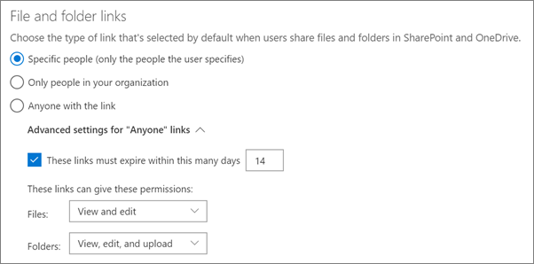

# Öka hotskyddet för Microsoft 365-prenumerationenIncrease threat protection for Microsoft 365 subscription

Den här artikeln hjälper dig att öka skyddet i Microsoft 365-prenumerationen för att skydda mot nätfiske, skadlig programvara och andra hot.This article helps you increase the protection in your Microsoft 365 subscription to protect against phishing, malware, and other threats. De här rekommendationerna är lämpliga för organisationer med ett ökat behov av säkerhet, t.ex. politiska kampanjer, juristkontor och hälsovårdscentraler.These recommendations are appropriate for organizations with an increased need for security, like political campaigns, law offices, and health care clinics.

Kontrollera Microsoft Secure Score innan du börjar.Before you begin, check your Microsoft Secure Score. Microsoft Secure Score analyserar din organisations säkerhet baserat på dina vanliga aktiviteter och säkerhetsinställningar och tilldelar ett poäng.Microsoft Secure Score analyzes your organization's security based on your regular activities and security settings and assigns a score. Börja med att anteckna det aktuella resultatet.Begin by taking note of your current score. Om du vidtar de åtgärder som rekommenderas i den här artikeln ökar poängen.Taking the actions recommended in this article increases your score. Målet är inte att uppnå maxresultatet, utan att vara medveten om möjligheter att skydda din miljö som inte negativt påverkar produktiviteten för användarna.The goal isn't to achieve the max score, but to be aware of opportunities to protect your environment that don't negatively affect productivity for your users.

Mer information finns i [Microsoft Secure Score.](https://docs.microsoft.com/microsoft-365/security/mtp/microsoft-secure-score)For more information, see [Microsoft Secure Score](https://docs.microsoft.com/microsoft-365/security/mtp/microsoft-secure-score).

## Höja skyddsnivån för skadlig programvara i e-postRaise the level of protection against malware in mail

Din Office 365- eller Microsoft 365-miljö innehåller skydd mot skadlig programvara, men du kan öka skyddet genom att blockera bifogade filer med filtyper som ofta används för skadlig programvara.Your Office 365 or Microsoft 365 environment includes protection against malware, but you can increase this protection by blocking attachments with file types that are commonly used for malware. Så här kan du stöta på skydd mot skadlig programvara i e-post:To bump up malware protection in email:

1. Gå till <https://protection.office.com> och logga in med autentiseringsuppgifterna för ditt administratörskonto.Go to <https://protection.office.com> and sign in with your admin account credentials.

2. Välj Policy Anti-Malware & i det vänstra navigeringsfönstret, under **Hothantering,** i säkerhets- och **efterlevnadscentret.** \> In the Security & Compliance Center, in the left navigation pane, under **Threat management**, choose **Policy** \> **Anti-Malware**.

3. Dubbelklicka på standardprincipen om du vill redigera den här företagsövergripande principen.Double-click the default policy to edit this company-wide policy.

4. Klicka på **Inställningar**.Click **Settings**.

5. Välj På **under Vanliga typer av** bifogade **filer.**Under **Common Attachment Types Filter**, select **On**. De filtyper som är blockerade visas i fönstret direkt under den här kontrollen.The file types that are blocked are listed in the window directly below this control. Se till att du lägger till de här filtyperna:Make sure you add these filetypes:

   `ade, adp, ani, bas, bat, chm, cmd, com, cpl, crt, hlp, ht, hta, inf, ins, isp, job, js, jse, lnk, mda, mdb, mde, mdz, msc, msi, msp, mst, pcd, reg, scr, sct, shs, url, vb, vbe, vbs, wsc, wsf, wsh, exe, pif`

   Du kan lägga till eller ta bort filtyper senare om det behövs.You can add or delete file types later, if needed.

6. Klicka **på Spara.**Click **Save.**

Mer information finns i Skydd [mot skadlig programvara i EOP.](https://docs.microsoft.com/microsoft-365/security/office-365-security/anti-malware-protection)For more information, see [Anti-malware protection in EOP](https://docs.microsoft.com/microsoft-365/security/office-365-security/anti-malware-protection).

## Skydda mot utpressningstrojanerProtect against ransomware

Utpressningstrojaner begränsar åtkomsten till data genom att kryptera filer eller låsa datorskärmar.Ransomware restricts access to data by encrypting files or locking computer screens. Den försöker sedan utträlja pengar från att kräva "utpressning", vanligtvis i form av cryptocurrencies som Cryptocurrencies, i utbyte mot åtkomst till data.It then attempts to extort money from victims by asking for "ransom," usually in the form of cryptocurrencies like Bitcoin, in exchange for access to data.

Du kan skydda mot utpressningstrojaner genom att skapa en eller flera e-postflödesregler  för att blockera filnamnstillägg som ofta används för utpressningstrojaner (dessa har lagts till för att höja skyddsnivån mot skadlig programvara i e-poststeget) eller för att varna användare som får dessa bifogade filer i e-post.You can protect against ransomware by creating one or more mail flow rules to block file extensions that are commonly used for ransomware (these were added in the [raise the level of protection against malware in mail](#raise-the-level-of-protection-against-malware-in-mail) step), or to warn users who receive these attachments in email.

Utöver de filer som du blockerade i föregående steg är det också bra att skapa en regel som varnar användare innan de öppnar bifogade Office-filer som innehåller makron.In addition to the files that you blocked in the previous step, it's also good practice to create a rule to warn users before opening Office file attachments that include macros. Utpressningstrojaner kan vara dolda i makron, så varna användarna för att inte öppna dessa filer från personer de inte känner.Ransomware can be hidden inside macros, so warn users to not open these files from people they don't know.

Så här skapar du en regel för e-posttransport:To create a mail transport rule:

1. Gå till administrationscentret och <https://admin.microsoft.com> välj **Administrationscenter** \> **Exchange.**Go to the admin center at <https://admin.microsoft.com> and choose **Admin centers** \> **Exchange**.

2. Klicka på **regler i** e-postflödeskategorin. In the **mail flow** category, click **rules**.

3. Klicka **+** på och klicka sedan på Skapa en ny **regel.**Click **+**, and then click **Create a new rule**.

4. Klicka **på Fler** alternativ längst ned i dialogrutan om du vill se alla alternativ.Click **More options** at the bottom of the dialog box to see the full set of options.

5. Tillämpa inställningarna i följande tabell för regeln.Apply the settings in the following table for the rule. Låt resten av inställningarna vara som standard, såvida du inte vill ändra dem.Leave the rest of the settings at the default, unless you want to change them.

6. Klicka på **Spara**.Click **Save**.

|InställningSetting|Varna användare innan bifogade filer öppnas i Office-filerWarn users before opening attachments of Office files|
|---|---|
|NamnName|Regel för utpressningstrojaner: varna användareAnti-ransomware rule: warn users|
|Använd den här regeln om.Apply this rule if . .. ..|Alla bifogade filer.Any attachment . .. .. filtillägg matchar.file extension matches . .. ..|
|Ange ord eller fraserSpecify words or phrases|Lägg till följande filtyper:Add these file types:   `dotm, docm, xlsm, sltm, xla, xlam, xll, pptm, potm, ppam, ppsm, sldm`|
|Gör följande.Do the following . .. ..|Meddela mottagaren med ett meddelandeNotify the recipient with a message|
|Ange meddelandetextProvide message text|Öppna inte den här typen av filer från personer du inte känner eftersom de kan innehålla makron med skadlig kod.Do not open these types of files from people you do not know because they might contain macros with malicious code.|

Mer information finns i:For more information, see:

- [Utpressningstrojaner: minska riskernaRansomware: how to reduce risk](https://www.microsoft.com/security/blog/2020/04/28/ransomware-groups-continue-to-target-healthcare-critical-services-heres-how-to-reduce-risk/)

- [Återställa OneDriveRestore your OneDrive](https://support.microsoft.com//office/fa231298-759d-41cf-bcd0-25ac53eb8a15)

## Stoppa automatisk vidarebefordran av e-postStop auto-forwarding for email

Hackare som får åtkomst till en användares postlåda kan stjäla din e-post genom att ställa in postlådan på att automatiskt vidarebefordra e-post.Hackers who gain access to a user's mailbox can steal your mail by setting the mailbox to automatically forward email. Detta kan inträffa även utan användarens uppmärksamhet.This can happen even without the user's awareness. Du kan förhindra detta genom att konfigurera en e-postflödesregel.You can prevent this from happening by configuring a mail flow rule.

Om du vill skapa en e-posttransportregel kan du [antingen titta på den här korta videon](https://support.office.com/article/f9d693ba-5c78-47c0-b156-8e461e062aa7) eller följa de här stegen:To create a mail transport rule, either watch [this short video](https://support.office.com/article/f9d693ba-5c78-47c0-b156-8e461e062aa7) or follow these steps:

1. Klicka på Administrationscenter för Exchange i administrationscentret **för** \> **Microsoft** 365.In the Microsoft 365 admin center, click **Admin centers** \> **Exchange**.

2. Klicka på **regler i** e-postflödeskategorin. In the **mail flow** category, click **rules**.

3. Klicka **+** på och klicka sedan på Skapa en ny **regel.**Click **+**, and then click **Create a new rule**.

4. Klicka **på Fler** alternativ längst ned i dialogrutan om du vill se alla alternativ.Click **More options** at the bottom of the dialog box to see the full set of options.

5. Använd inställningarna i följande tabell.Apply the settings in the following table. Låt resten av inställningarna vara som standard, såvida du inte vill ändra dem.Leave the rest of the settings at the default, unless you want to change them.

6. Klicka på **Spara**.Click **Save**.

|InställningSetting|Varna användare innan bifogade filer öppnas i Office-filerWarn users before opening attachments of Office files|
|---|---|
|NamnName|Förhindra automatisk vidarebefordran av e-post till externa domänerPrevent auto forwarding of email to external domains|
|Använd den här regeln om ...Apply this rule if ...|Avsändaren.The sender . .. .. är extern/intern.is external/internal . .. .. Inom organisationenInside the organization|
|Lägg till villkorAdd condition|Meddelandeegenskaperna.The message properties . .. .. ange meddelandetypen.include the message type . .. .. Vidarebefordra automatisktAuto-forward|
|Gör följande ...Do the following ...|Spärra meddelandet.Block the message . .. .. avvisa meddelandet och ge en förklaring.reject the message and include an explanation.|
|Ange meddelandetextProvide message text|Automatisk vidarebefordran av e-post utanför den här organisationen förhindras av säkerhetsskäl.Auto-forwarding email outside this organization is prevented for security reasons.|

## Skydda din e-post från nätfiskeattackerProtect your email from phishing attacks

Om du har konfigurerat en eller flera anpassade domäner för Office 365- eller Microsoft 365-miljön kan du konfigurera riktad skydd mot nätfiske.If you've configured one or more custom domains for your Office 365 or Microsoft 365 environment, you can configure targeted anti-phishing protection. Skydd mot nätfiske, en del av Microsoft Defender för Office 365, kan skydda organisationen från skadliga personifieringsbaserade nätfiskeattacker och andra nätfiskeattacker.Anti-phishing protection, part of Microsoft Defender for Office 365, can help protect your organization from malicious impersonation-based phishing attacks and other phishing attacks. Om du inte har konfigurerat en egen domän behöver du inte göra det.If you haven't configured a custom domain, you don't need to do this.

Vi rekommenderar att du kommer igång med det här skyddet genom att skapa en princip som skyddar dina viktigaste användare och din anpassade domän.We recommend that you get started with this protection by creating a policy to protect your most important users and your custom domain.

Om du vill skapa en policy mot nätfiske i Defender för Office 365 kan du titta på den här korta utbildningsvideon eller utföra följande steg:To create an anti-phishing policy in Defender for Office 365, watch [this short training video](https://support.office.com/article/86c425e1-1686-430a-9151-f7176cce4f2c), or complete the following steps:

1. Gå till <https://protection.office.com>.Go to <https://protection.office.com>.

2. I säkerhets- &, i det vänstra navigeringsfönstret under **Hothantering,** väljer du **Princip.**In the Security & Compliance Center, in the left navigation pane, under **Threat management**, choose **Policy**.

3. Välj **Skydd mot** nätfiske **på sidan Princip.**On the **Policy** page, choose **Anti-phishing**.

4. Välj + **Skapa på** sidan **Mot nätfiske.**On the **Anti-phishing** page, select **+ Create**. En guide startar stegen för att definiera din nätfiskeprincip.A wizard launches that steps you through defining your anti-phishing policy.

5. Ange namn, beskrivning och inställningar för principen enligt rekommendationer i diagrammet nedan.Specify the name, description, and settings for your policy as recommended in the chart below. Mer information finns i Läs [mer om policy mot nätfiske i alternativen i Microsoft Defender för Office 365.](https://docs.microsoft.com/microsoft-365/security/office-365-security/set-up-anti-phishing-policies)For more information, see [Learn about anti-phishing policy in Microsoft Defender for Office 365 options](https://docs.microsoft.com/microsoft-365/security/office-365-security/set-up-anti-phishing-policies).

6. När du har granskat inställningarna väljer du Skapa den **här principen eller** **Spara** efter behov.After you've reviewed your settings, choose **Create this policy** or **Save**, as appropriate.

|Inställning eller alternativSetting or option|Rekommenderad inställningRecommended setting|
|---|---|
|NamnName|Domän och mest värdefull personalDomain and most valuable staff|
|BeskrivningDescription|Se till att den viktigaste personalen och vår domän inte personifieras.Ensure most important staff and our domain are not being impersonated.|
|Lägga till användare som ska skyddasAdd users to protect|Välj **+ Lägg till ett villkor, mottagaren är**.Select **+ Add a condition, The recipient is**. Skriv användarnamn eller ange e-postadressen till företagsägare, partner eller kandidat, chefer och andra viktiga personalmedlemmar.Type user names or enter the email address of the business owners, partners, or candidate, managers, and other important staff members. Du kan lägga till upp till 20 interna och externa adresser som du vill skydda från personifiering.You can add up to 20 internal and external addresses that you want to protect from impersonation.|
|Lägga till domäner att skyddaAdd domains to protect|Välj **+ Lägg till ett villkor, mottagarens domän är.**Select **+ Add a condition, The recipient domain is**. Ange den anpassade domän som är kopplad till Microsoft 365-prenumerationen, om du har definierat en.Enter the custom domain associated with your Microsoft 365 subscription, if you defined one. Du kan ange mer än en domän.You can enter more than one domain.|
|Välj åtgärderChoose actions|Om e-post skickas av en imiterad användare: Välj Omdirigera meddelande till en annan e-postadress och skriv sedan säkerhetsadministratörens e-postadress. Till exempel *Förn eller   @contoso.com.*If email is sent by an impersonated user: Choose **Redirect message to another email address**, and then type the email address of the security administrator; for example, *Alice@contoso.com*.   Om e-post skickas med en imiterad domän: Välj **karantänmeddelande.**If email is sent by an impersonated domain: Choose **Quarantine message**.|
|PostlådeinformationMailbox intelligence|Postlådeinformation väljs som standard när du skapar en ny princip mot nätfiske.By default, mailbox intelligence is selected when you create a new anti-phishing policy. Låt inställningen vara **på för** bästa resultat.Leave this setting **On** for best results.|
|Lägga till betrodda avsändare och domänerAdd trusted senders and domains|Här kan du lägga till din egen domän eller andra betrodda domäner.Here you can add your own domain, or any other trusted domains.|
|Används påApplied to|Välj **mottagarens domän är.**Select **The recipient domain is**. Under **Valfri av dessa** väljer du **Välj.**Under **Any of these**, select **Choose**. Välj **+ Lägg till.**Select **+ Add**. Markera kryssrutan bredvid namnet på domänen, till exempel *contoso.   com,* i listan och väljer sedan Lägg **till.**Select the check box next to the name of the domain, for example, *contoso.com*, in the list, and then select **Add**. Välj **Klar**.Select **Done**.|

Mer information finns i Konfigurera [principer för skydd mot nätfiske i Defender för Office 365.](https://docs.microsoft.com/microsoft-365/security/office-365-security/set-up-anti-phishing-policies)For more information, see [Set up anti-phishing policies in Defender for Office 365](https://docs.microsoft.com/microsoft-365/security/office-365-security/set-up-anti-phishing-policies).

## Skydda mot skadliga bifogade filer, filer och länkar med Defender för Office 365Protect against malicious attachments, files, and links with Defender for Office 365

Kontrollera först att du har aktiverat den nya förhandsversionen av administrationscentret i <https://admin.microsoft.com> administrationscentret.First, make sure, in the admin center at <https://admin.microsoft.com> that you have the new admin center preview turned on. Aktivera växlingsknappen bredvid texten **I det nya administrationscentret.**Turn on the toggle next to the text **The new admin center**.

   

Om du inte ser sidan **Inställningar** med kort i klientorganisationen ännu kan du se hur du slutför de här stegen i Säkerhets- & Efterlevnadscenter.If you don't see the **Setup** page with cards in your tenant yet, see how to complete these steps in Security & Compliance Center. Se [Konfigurera säkra bifogade filer i Säkerhets- & Säkerhetscenter](#set-up-safe-attachments-in-the-security--compliance-center) och Konfigurera säkra länkar i Säkerhets- & [Efterlevnadscenter.](#set-up-safe-links-in-the-security--compliance-center)See [Set up Safe Attachments in the Security & Compliance Center](#set-up-safe-attachments-in-the-security--compliance-center) and [Set up Safe Links in the Security & Compliance Center](#set-up-safe-links-in-the-security--compliance-center).

1. Välj Installation i navigeringsfältet **till vänster.**In the left nav, choose **Setup**.
2. På sidan **Konfigurera** väljer du **Visa** på kortet **Öka skyddet mot avancerade** hot.On the **Setup** page, choose **View** on the **Increase protection from advanced threats** card.

   

3. Välj **Kom igång på sidan Öka skyddet mot** avancerade **hot.**On the **Increase protection from advanced threats** page, choose **Get started**.
4. I fönstret som öppnas markerar du kryssrutorna bredvid Länkar och bifogade filer i e-post, Skanna filer i **SharePoint, OneDrive** och Teams samt genomsökningslänkar i Office-skrivbordsappar och **Office Online-appar** under Sök igenom objekt efter skadligt **innehåll.**On the pane that opens, select the check boxes next to **Links and attachments in email**, **Scan files in SharePoint, OneDrive, and Teams**, and **Scan links in Office desktop and Office Online apps** under **Scan items for malicious content**.

   Under **Länkar och bifogade filer i e-postmeddelanden** skriver du alla användare eller de användare vars e-post du vill skanna.Under **Links and attachments in email**, Type in All Users, or the specific users whose email you want scanned.

   

5. Välj **Skapa principer för** att aktivera Säkra bifogade filer och Säkra länkar.Choose **Create policies** to turn on Safe Attachments and Safe Links.

### Konfigurera säkra bifogade filer i Säkerhets- & Säkerhets- och efterlevnadscenterSet up Safe Attachments in the Security & Compliance Center

Personer skickar, tar emot och delar regelbundet bifogade filer, till exempel dokument, presentationer, kalkylblad med mera.People regularly send, receive, and share attachments, such as documents, presentations, spreadsheets, and more. Det är inte alltid lätt att avgöra om en bifogad fil är säker eller skadlig genom att bara titta på ett e-postmeddelande.It's not always easy to tell whether an attachment is safe or malicious just by looking at an email message. Microsoft Defender för Office 365 har skydd mot säkra bifogade filer, men det här skyddet är inte aktiverat som standard.Microsoft Defender for Office 365 includes Safe Attachment protection, but this protection is not turned on by default. Vi rekommenderar att du skapar en ny regel för att börja använda det här skyddet.We recommend that you create a new rule to begin using this protection. Skyddet omfattar även filer i SharePoint, OneDrive och Microsoft Teams.This protection extends to files in SharePoint, OneDrive, and Microsoft Teams.

Om du vill skapa en princip för säkra bifogade filer kan du [antingen titta på den här](https://support.office.com/article/e7e68934-23dc-4b9c-b714-e82e27a8f8a5)korta videon eller utföra följande steg:To create an Safe Attachment policy, either watch [this short video](https://support.office.com/article/e7e68934-23dc-4b9c-b714-e82e27a8f8a5), or complete the following steps:

1. Gå till <https://protection.office.com> och logga in med ditt administratörskonto.Go to <https://protection.office.com> and sign in with your admin account.

2. I säkerhets- &, i det vänstra navigeringsfönstret under **Hothantering,** väljer du **Princip.**In the Security & Compliance Center, in the left navigation pane, under **Threat management**, choose **Policy**.

3. Välj Säkra bifogade filer på **principsidan.**On the Policy page, choose **Safe Attachments**.

4. På sidan Säkra bifogade filer tillämpar du det här skyddet brett genom att markera kryssrutan Aktivera ATP för **SharePoint, OneDrive och Microsoft Teams.**On the Safe attachments page, apply this protection broadly by selecting the **Turn on ATP for SharePoint, OneDrive, and Microsoft Teams** check box.

5. Välj **+** den här om du vill skapa en ny princip.Select **+** to create a new policy.

6. Använd inställningarna i följande tabell.Apply the settings in the following table.

7. När du har granskat inställningarna väljer du **Skapa den här principen** eller **Spara** efter behov.After you review your settings, choose **Create this policy** or **Save**, as appropriate.

|Inställning eller alternativSetting or option|Rekommenderad inställningRecommended setting|
|---|---|
|NamnName|Blockera aktuella och framtida e-postmeddelanden med upptäckt skadlig programvara.Block current and future emails with detected malware.|
|BeskrivningDescription|Blockera aktuella och framtida e-postmeddelanden och bifogade filer med identifierade skadlig programvara.Block current and future emails and attachments with detected malware.|
|Spara bifogade filer som är okända skadlig kodSave attachments unknown malware response|Välj **Blockera – blockera aktuella och framtida e-postmeddelanden och bifogade filer med upptäckt skadlig kod.**Select **Block - Block the current and future emails and attachments with detected malware**.|
|Omdirigera bifogad fil vid identifieringRedirect attachment on detection|Aktivera omdirigering (markera den här rutan)Enable redirection (select this box)   Ange administratörskontot eller en postlådekonfiguration för karantän.Enter the admin account or a mailbox setup for quarantine.   Använd ovanstående val om skadlig kod söker efter bifogade filer på en gång eller om det uppstår fel (markera den här rutan).Apply the above selection if malware scanning for attachments times out or error occurs (select this box).|
|Används påApplied to|Mottagarens domän är.The recipient domain is . .. .. väljer du din domän.select your domain.|

Mer information finns i Konfigurera [principer för skydd mot nätfiske i Defender för Office 365.](https://docs.microsoft.com/microsoft-365/security/office-365-security/set-up-anti-phishing-policies)For more information, see [Set up anti-phishing policies in Defender for Office 365](https://docs.microsoft.com/microsoft-365/security/office-365-security/set-up-anti-phishing-policies).

### Konfigurera säkra länkar i Säkerhets- & EfterlevnadscenterSet up Safe Links in the Security & Compliance Center

Hackare döljer ibland skadliga webbplatser i länkar i e-postmeddelanden och andra filer.Hackers sometimes hide malicious websites in links in email or other files. Säkra länkar, en del av Microsoft Defender för Office 365, kan skydda organisationen genom att tillhandahålla tidsbe klickar-verifiering av webbadresser (URL:er) i e-postmeddelanden och Office-dokument.Safe Links, part of Microsoft Defender for Office 365, can help protect your organization by providing time-of-click verification of web addresses (URLs) in email messages and Office documents. Skydd definieras genom principer för säkra länkar.Protection is defined through Safe Links policies.

Vi rekommenderar att du gör följande:We recommend that you do the following:

- Ändra standardprincipen för att öka skyddet.Modify the default policy to increase protection.

- Lägg till en ny princip som är riktad till alla mottagare i din domän.Add a new policy targeted to all recipients in your domain.

Om du vill konfigurera säkra länkar kan du [titta på den här korta utbildningsvideon](https://support.office.com/article/61492713-53c2-47da-a6e7-fa97479e97fa)eller utföra följande steg:To set up Safe Links, watch [this short training video](https://support.office.com/article/61492713-53c2-47da-a6e7-fa97479e97fa), or complete the following steps:

1. Gå till <https://protection.office.com> och logga in med ditt administratörskonto.Go to <https://protection.office.com> and sign in with your admin account.

2. I säkerhets- &, i det vänstra navigeringsfönstret under **Hothantering,** väljer du **Princip.**In the Security & Compliance Center, in the left navigation pane, under **Threat management**, choose **Policy**.

3. Välj Säkra länkar på **sidan Princip.**On the Policy page, choose **Safe Links**.

Så här ändrar du standardprincipen:To modify the default policy:

1. Välj Standardprincip under Principer **som gäller för** hela organisationen på sidan **Säkra** länkar.On the Safe links page, under **Policies that apply to the entire organization**, select the **Default** policy.

2. Under **Inställningar som gäller för innehåll utom e-post** väljer du Microsoft **365-program för företag, Office för iOS och Android.**Under **Settings that apply to content except email**, select **Microsoft 365 Apps for enterprise, Office for iOS and Android**.

3. Klicka på **Spara**.Click **Save**.

Så här skapar du en ny princip som är riktad till alla mottagare i din domän:To create a new policy targeted to all recipients in your domain:

1. Klicka för att skapa en ny princip under **Principer** som gäller för hela organisationen på sidan **+** Säkra länkar.On the Safe links page, under **Policies that apply to the entire organization**, click **+** to create a new policy.

2. Använd inställningarna som visas i följande tabell.Apply the settings listed in the following table.

3. Klicka på **Spara**.Click **Save**.

|Inställning eller alternativSetting or option|Rekommenderad inställningRecommended setting|
|---|---|
|NamnName|Princip för säkra länkar för alla mottagare i domänenSafe links policy for all recipients in the domain|
|Välj åtgärden för okända potentiellt skadliga URL:er i meddelandenSelect the action for unknown potentially malicious URLs in messages|Välj **På – URL:er skrivs om och kontrolleras mot en lista** med kända skadliga länkar när användaren klickar på länken.Select **On - URLs will be rewritten and checked against a list of known malicious links when user clicks on the link**.|
|Använda Säkra bifogade filer för att söka i nedladdningsbart innehållUse Safe Attachments to scan downloadable content|Markera den här rutan.Select this box.|
|Används påApplied to|Mottagarens domän är.The recipient domain is . .. .. väljer du din domän.select your domain.|

Mer information finns i [Säkra länkar i Defender för Office 365.](https://docs.microsoft.com/microsoft-365/security/office-365-security/atp-safe-links)For more information, see [Safe Links in Defender for Office 365](https://docs.microsoft.com/microsoft-365/security/office-365-security/atp-safe-links).

## Aktivera Den enhetliga granskningsloggenTurn on the Unified Audit Log

När du har aktiverar granskningsloggsökningen i Säkerhets- & Efterlevnadscenter kan du behålla administratör och annan användaraktivitet i loggen och söka i den.After you turn on the audit log search in the Security & Compliance Center, you can retain the admin and other user activity in the log and search it.

Du måste ha tilldelats rollen Granskningsloggar i Exchange Online för att kunna aktivera eller inaktivera granskningsloggsökning i Microsoft 365-prenumerationen.You must be assigned the Audit Logs role in Exchange Online to turn audit log search on or off in your Microsoft 365 subscription. Som standard tilldelas den här rollen rollgrupperna Efterlevnadshantering och Organisationshantering på behörighetssidan i administrationscentret för Exchange.By default, this role is assigned to the Compliance Management and Organization Management role groups on the Permissions page in the Exchange admin center. Globala administratörer i Microsoft 365 är medlemmar i den här gruppen som standard.Global admins in Microsoft 365 are members of this group by default.

1. Om du vill aktivera granskningsloggsökningen går du till administrationscentret och väljer <https://admin.microsoft.com> säkerhet under Administrationscenter i det vänstra  navigeringsfältet. To turn on the audit log search, go to the admin center at <https://admin.microsoft.com> and then choose **Security** under **Admin centers** in the left nav.
2. På sidan Säkerhet **i Microsoft 365** väljer  du Fler resurser och sedan Öppna på kortet Säkerhets- och & **Office 365.** On the **Microsoft 365 Security** page, choose **More resources**, and then **Open** on the **Office 365 Security & Compliance Center** card.

    
3. Välj Sök och sedan Granskningsloggsökning på **sidan** **Säkerhet och efterlevnad.**On the security and compliance page, choose **Search** and then **Audit log search**.
4. Välj Aktivera granskning högst **upp på sidan** Granskningsloggsökning. On the top of the **Audit log search** page, choose **Turn on auditing**.

När funktionen är aktiverad kan du söka efter filer, mappar och många aktiviteter.After the feature is turned on, you can search for files, folders, and many activities. Mer information finns i söka [i granskningsloggen.](https://docs.microsoft.com/microsoft-365/compliance/search-the-audit-log-in-security-and-compliance)For more information, see [search the audit log](https://docs.microsoft.com/microsoft-365/compliance/search-the-audit-log-in-security-and-compliance).

## Ställa in inställningar för anonym delning av SharePoint- och OneDrive-filer och -mapparTune-up anonymous sharing settings for SharePoint and OneDrive files and folders

(Ändra standardinställningen för anonym länk till 14 dagar, ändra standarddelningstypen till "Vissa personer") Så här ändrar du delningsinställningarna för OneDrive och SharePoint:(change default anonymous link expiration to 14 days, change default sharing type to "Specific People") To change the sharing settings for OneDrive and SharePoint:

1. Gå till administrationscentret och välj <https://admin.microsoft.com> sedan **SharePoint** under **Administrationscenter i** det vänstra navigeringsfältet.Go to the admin center at <https://admin.microsoft.com> and then choose **SharePoint** under **Admin centers** in the left nav.
2. Gå till Delning av principer i **administrationscentret för** SharePoint. \> In the SharePoint admin center, go to **Policies** \> **Sharing**.
3. Under Fil- **och** **mapplänkar** på sidan Delning väljer du Specifika personer och under Avancerade inställningar för **alla-länkar** måste dessa länkar upphöra att gälla inom så här många dagar och skriv in 14 (eller ett annat antal dagar som du vill begränsa länkens livslängd till).On the **Sharing** page, under **File and folder links**, select **Specific people**, and under **Advanced settings for "Anyone" links**, select **These links must expire within this many days**, and type in 14 (or another number of days you want to restrict the link lifetime to).

   

## AktivitetsaviseringarActivity alerts

Du kan använda aktivitetsaviseringar för att spåra administratörs- och användaraktiviteter och identifiera skadlig kod och incidenter för dataförlustskydd i organisationen.You can use activity alerts to track admin and user activities and detect malware and data loss prevention incidents in your organization. Din prenumeration innehåller en uppsättning standardprinciper, men du kan också skapa egna.Your subscription includes a set of default policies, but you can also create custom ones. Mer information finns i [aviseringsprinciper.](https://docs.microsoft.com/microsoft-365/compliance/alert-policies)For more information, see [alert policies](https://docs.microsoft.com/microsoft-365/compliance/alert-policies). Om du till exempel lagrar en viktig fil i SharePoint som du inte vill att någon ska dela externt kan du skapa ett meddelande som meddelar dig om någon delar den.For example, if you store an important file in SharePoint that you don't want anyone to share externally, you can create a notification that alerts you if someone does share it.

I följande bild visas standardprinciperna som ingår i Microsoft 365.The following figure shows the default policies that are included with Microsoft 365.

## Inaktivera eller hantera kalenderdelningDisable or manage calendar sharing

Du kan förhindra att personer i organisationen delar sina kalendrar eller så kan du hantera vad de kan dela.You can prevent people in your organization from sharing their calendars, or you can also manage what they can share. Du kan till exempel begränsa delning till endast ledig/upptagen tid.For example, you can restrict the sharing to free/busy times only.

1. Gå till administrationscentret och <https://admin.microsoft.com> välj **Inställningar** \> **för org.**Go to the admin center at <https://admin.microsoft.com> and choose **Settings** \> **Org Settings**.
2. På sidan **Tjänster** väljer du Kalender och väljer om personer i organisationen ska kunna dela sina kalendrar med personer utanför som har Office 365 eller Exchange eller med vem som helst.On the **Services** page, choose **Calendar**, and choose whether people in your organization can share their calendars with people outside who have Office 365 or Exchange, or with anyone.

   Om du väljer alternativet Dela med vem som helst kan du välja att också bara dela ledig/upptagen-information.If you choose the share with anyone option, you can decide to also only share free/busy information.

3. Välj **Spara ändringar** längst ned på sidan.Choose **Save changes** on the bottom of the page.

   I följande bild visas kalenderdelning som inte är tillåten.The following figure shows calendar sharing not allowed.

   

   I följande bild visas inställningarna när kalenderdelning tillåts med en e-postlänk med endast ledig/upptagen-information.The following figure shows the settings when calendar sharing is allowed with an email link with only free/busy information.

   

Om användarna tillåts dela sina kalendrar kan du läsa [de här anvisningarna](https://support.office.com/article/7ecef8ae-139c-40d9-bae2-a23977ee58d5) för hur du delar från Outlook på webben.If your users are allowed to share their calendars, see [these instructions](https://support.office.com/article/7ecef8ae-139c-40d9-bae2-a23977ee58d5) for how to share from Outlook on the web.
