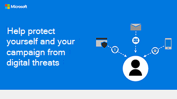

# Skydda dig mot nätfiske och andra attacker

Microsoft 365 innehåller många skydd för att skydda mot attacker, men det finns saker du kan göra själv för att begränsa och minimera risken för online-attacker.

- **Skräppost eller skräppost** Det finns många anledningar till att du kan få skräppost och inte alla skräppost är desamma. Du kan dock minska det som når fram till dig och därmed minska risken för attacker genom att filtrera bort skräppost.
- **Nätfiske** Ett nätfiskebedrägeri är ett e-postmeddelande som verkar legitimt men som är ett försök att få din personliga information eller stjäla dina pengar.
- **Spoofing (Spoofing)** Bedragare kan också använda en teknik som kallas spoofing för att få det att se ut som om du har fått ett e-postmeddelande från dig själv. 
- **Skadlig programvara** är skadlig programvara som kan installeras på datorn, vanligtvis installeras efter att du har klickat på en länk eller öppnat ett dokument från ett e-postmeddelande. Det finns olika typer av skadlig kod (till exempel ransomware, när datorn tas över), men du vill inte ha någon av dem. 

## Metodtips

**Minska skräppost**

Följ dessa [10 tips om hur man kan bidra till att minska spam](https://support.microsoft.com/en-us/office/10-tips-on-how-to-help-reduce-spam-55f756e8-688b-41c3-a086-8f68ccc592f6).

**Rapportera det!**

Rapportera alla nätfiskemeddelanden eller andra bluffmeddelanden som du får. Markera meddelandet och välj **Rapportera meddelande** i menyfliksområdet.
Här finns mer information om [hur du anmäler skräppost och skräppost.](https://support.office.com/article/Use-the-Report-Message-add-in-b5caa9f1-cdf3-4443-af8c-ff724ea719d2)

**Undvik nätfiske**
- Svara aldrig på ett e-postmeddelande som ber dig att skicka personlig information eller kontoinformation.
- Om du får ett e-postmeddelande som ser misstänkt ut eller ber dig om den här typen av information klickar du aldrig på länkar som ska ta dig till en företagswebbplats.
- Öppna aldrig någon fil som är kopplad till ett e-postmeddelande med misstänkt utseende.
- Om e-postmeddelandet verkar komma från ett företag kontaktar du företagets kundtjänst via telefon eller webbläsare för att se om e-postmeddelandet är legitimt.
- Sök på webben efter e ämnesraden följt av ordet bluff för att se om någon annan har rapporterat denna bluff.

Läs om fem vanliga typer av bedrägerier i [Hantera missbruk, nätfiske eller förfalskning](https://support.office.com/article/Deal-with-abuse-phishing-or-spoofing-in-Outlook-com-0d882ea5-eedc-4bed-aebc-079ffa1105a3).

**Se till att dina e-postmeddelanden ser legitima ut för andra**

Hjälp dina kunder att lita på din kommunikation genom att lägga till en digital signatur för att bevisa att den kommer från dig. Se [Säkra meddelanden med hjälp av en digital signatur](https://support.office.com/article/secure-messages-by-using-a-digital-signature-549ca2f1-a68f-4366-85fa-b3f4b5856fc6).

## Skydda din kampanj från onlinehot

Ladda ner den här infografiken med tips för dig och medlemmarna i ditt kampanjteam:

[PDF-dokument](downloads/M365CampaignsWhatCanUsersDoToSecure.pdf)  |  [PowerPoint (på andra)](https://github.com/MicrosoftDocs/microsoft-365-docs-pr/raw/live/m365-democracy/microsoft-365/campaigns/downloads/M365CampaignsWhatCanUsersDoToSecure.pptx)

## Konfigurera

Läs mer om hur du:
- [Skydda dina filer och din kommunikation med Office](https://support.microsoft.com/en-us/office/keep-your-files-and-communications-safe-with-office-c4ddc381-7395-42da-887c-8836a3bb975f).
- [Håll dig säker och privat på jobbet.](https://support.office.com/article/stay-secure-and-private-at-work-104c7d91-b25a-453d-beee-ba64b6c6fc2d)
  
