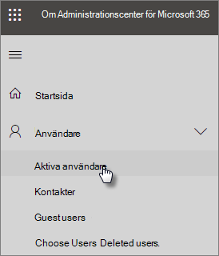

# Skydda dina administratörskontonProtect your administrator accounts

Eftersom administratörskonton har förhöjd behörighet är de värdefulla mål för hackare och cyberbrottsligheter.Because admin accounts come with elevated privileges, they're valuable targets for hackers and cyber criminals. I den här artikeln beskrivs:This article describes:

- Konfigurera ytterligare ett administratörskonto för nödsituationer.How to set up an additional administrator account for emergencies.
- Hur du skyddar dessa konton.How to protect these accounts.

När du registrerar dig för Microsoft 365 och anger din information blir du automatiskt global administratör. En global administratör har den slutgiltiga kontrollen över användarkonton och alla andra inställningar i administrationscentret för Microsoft, men det finns många olika typer av administratörskonton med varierande åtkomstgrad.When you sign up for Microsoft 365 and enter your information, you automatically become the Global admin. A Global admin has the ultimate control of user accounts and all the other settings in the Microsoft admin center, but there are many different kinds of admin accounts with varying degrees of access. Mer [information om de](/office365/admin/add-users/about-admin-roles) olika åtkomstnivåerna för varje typ av administratörsroll finns i om administratörsroller.See [about admin roles](/office365/admin/add-users/about-admin-roles) for information about the different access levels for each kind of admin role.

## Skapa ytterligare administratörskontonCreate additional admin accounts

Använd endast administratörskonton för administration.Use admin accounts only for administration. Administratörer bör ha ett separat användarkonto för normal användning av Office-appar och bara använda sitt administratörskonto när det behövs för att hantera konton och enheter och medan de arbetar med andra administratörsfunktioner.Admins should have a separate user account for regular use of Office apps and only use their administrative account when necessary to manage accounts and devices, and while working on other admin functions. Det är också en bra idé att ta Microsoft 365 licens från administratörskontona så att du inte behöver betala för dem.It's also a good idea to remove the Microsoft 365 license from the admin accounts so you don't have to pay for them.

Du bör konfigurera minst ett globalt administratörskonto för att ge administratörsåtkomst till en annan betrodd anställd.You'll want to set up at least one additional Global admin account to give admin access to another trusted employee. Du kan också skapa separata administratörskonton för användarhantering (den här rollen kallas **användarhanteringsadministratör).**You can also create separate admin accounts for user management (this role is called **User management administrator**). Mer information finns i om [administratörsroller](/office365/admin/add-users/about-admin-roles).For more information, see [about admin roles](/office365/admin/add-users/about-admin-roles).

Så här skapar du ytterligare administratörskonton:To create additional admin accounts:

 1. Gå till <a href="https://go.microsoft.com/fwlink/p/?linkid=837890" target="_blank">administrationscentret och</a> välj sedan **Användare aktiva** användare \> **i** det vänstra navigeringsfältet.Go to the <a href="https://go.microsoft.com/fwlink/p/?linkid=837890" target="_blank">admin center</a> and then choose **Users** \> **Active users** in the left nav.

    

 2. På sidan **Aktiva** användare väljer du **Lägg** till en användare  längst upp på sidan. På panelen Ny användare anger du namn och annan information.On the **Active users** page, select **Add a user** at the top of the page, and on the **New user** panel, enter the name and other information.
 3. Expandera avsnittet **Roller** och välj Global **administratör för att ge** användaren global administratörsåtkomst.Expand the **Roles** section, and choose **Global administrator** to give this user global admin access. Du kan också **välja Anpassad administratör** och välja någon av rollerna som visas.You can also choose **Customized administrator** and choose any of the roles that are displayed.

    Ange ett alternativt e-postmeddelande i **textrutan Alternativ e-postadress.**Enter an alternate email in the **Alternative email address** text box. Du kan använda den här adressen för att återställa lösenordsinformationen om du blir utelåst. För globala administratörer skickas även ett faktureringsutdrag till den här adressen.You can use this address to recover your password information if you get locked out. For Global admins, a billing statement will also be sent to this address.

    

 4. I avsnittet **Produktlicenser** flyttar du väljaren för **att Microsoft 365 Business** **till Av** och Skapa användare utan **produktlicens** till **På.**In the **Product licenses** section, move the selector for **Microsoft 365 Business** to **Off** and the **Create user without product license** to **On**.

    

## Skapa ett nödsituationsadministratörskontoCreate an emergency admin account

Du bör också skapa ett konto för säkerhetskopiering som inte är konfigurerat med multifaktorautentisering (MFA) så att du inte oavsiktligt låser ut dig själv (till exempel om du förlorar telefonen som du använder som en andra form av verifiering).You should also create a backup account that isn't set up with multi-factor authentication (MFA) so you don't accidentally lock yourself out (for example if you lose your phone that you're using as a second form of verification). Kontrollera att lösenordet för det här kontot är en fras eller minst 16 tecken långt.Make sure that the password for this account is a phrase or at least 16 characters long. Det här kallas ofta för ett "break-glass-konto".This is often referred to as a "break-glass account."

## Skapa ett användarkonto åt dig självCreate a user account for yourself

Använd ditt användarkonto för att delta i samarbete med din organisation, inklusive att kontrollera e-post.Use your user account to participate in collaboration with your organization, including checking mail. Det innebär att dina administratörsautentiseringsuppgifter kan vara ungefär som  *Chavez  @Contoso.org* och ditt vanliga användarkonto kan vara ungefär som * @Contoso.com*.This means your admin credentials might be similar to  *Alice.Chavez @Contoso.org* and your regular user account might be similar to *Alice@Contoso.com*.

Så här skapar du ett nytt användarkonto:To create a new user account:

1. Gå till <a href="https://go.microsoft.com/fwlink/p/?linkid=837890" target="_blank">administrationscentret och</a> välj sedan **Användare aktiva** användare \> **i** det vänstra navigeringsfältet.Go to the <a href="https://go.microsoft.com/fwlink/p/?linkid=837890" target="_blank">admin center</a> and then choose **Users** \> **Active users** in the left nav.
2. På sidan **Aktiva** användare väljer du **Lägg** till en användare  längst upp på sidan. På panelen Ny användare anger du namn och annan information.On the **Active users** page, select **Add a user** at the top of the page, and on the **New user** panel, enter the name and other information.
3. Expandera avsnittet **Roller** och välj **Användare (ingen administrativ åtkomst).**Expand the **Roles** section, and choose **User (no administrative access)**.
4. I avsnittet **Produktlicenser** flyttar du väljaren för att **Microsoft 365 Business** till **På**.In the **Product licenses** section, move the selector for **Microsoft 365 Business** to **On**.

## Aktivera säkerhetsstandarderTurn on security defaults

Säkerhetsstandarder hjälper till att skydda organisationen från identitetsrelaterade attacker genom att tillhandahålla förkonfigurerade säkerhetsinställningar som Microsoft hanterar för din organisations räkning.Security defaults help protect your organization from identity-related attacks by providing preconfigured security settings that Microsoft manages on behalf of your organization. De här inställningarna omfattar aktivering av multifaktorautentisering (MFA) för alla administratörer och användarkonton.These settings include enabling multi-factor authentication (MFA) for all admins and user accounts. Mer information om standardinställningar för säkerhet och hur du aktiverar dem finns i [Aktivera standardinställningar för säkerhet.](m365-campaigns-conditional-access.md)For more information about security defaults and to learn how to enable them on, see [Turn on security defaults](m365-campaigns-conditional-access.md).

## Ytterligare rekommendationerAdditional recommendations

- Stäng alla orelaterade webbläsarsessioner och appar, inklusive personliga e-postkonton, innan du använder administratörskonton.Before using admin accounts, close out all unrelated browser sessions and apps, including personal email accounts. Du kan också använda i privata webbläsarfönster eller inkognitofönster.You can also use in private, or incognito browser windows.
- Se till att logga ut från webbläsarsessionen när du har slutfört administratörsuppgifter.After completing admin tasks, be sure to sign out of the browser session.
