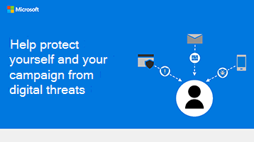

# Infografik: Skydda dig och din kampanj mot digitala hot

Följande länkar för PowerPoint och PDF kan laddas ned och skrivas ut i tabloidformat (kallas även huvudbok, 11 x 17 eller A3).

[PDF](downloads/M365CampaignsWhatCanUsersDoToSecure.pdf)  |  [PowerPoint](https://github.com/MicrosoftDocs/microsoft-365-docs-pr/raw/live/m365-democracy/microsoft-365/campaigns/downloads/M365CampaignsWhatCanUsersDoToSecure.pptx)
