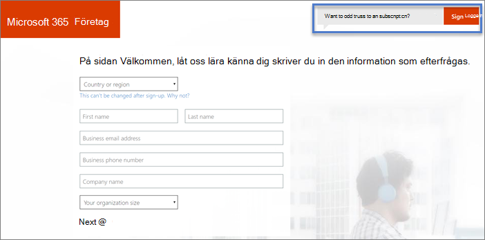

# Registrera dig för Microsoft 365 för kampanjer 

Så här utför du registreringen av Microsoft 365 för kampanjer.

## Innan du börjar: 
- Hämta din inbjudan till Microsoft 365 för kampanjer genom att slutföra stegen i [Hämta Microsoft 365 för kampanjer](get-microsoft-365-campaigns.md#get-microsoft-365-for-campaigns). 
- Öppna din e-postinbjudan från Microsoft. Inbjudan har en unik anmälnings länk för din organisation. Du behöver detta för att få kampanjer med särskild prissättning.
- Ha ditt företags kredit kort och en telefon. 

    > [!TIP]
    > Din registrerings länk är unik för kampanjen. Den fungerar bara en gång, så se till att du har tillräckligt med tid för att slutföra registreringen. Du behöver ca tio minuter. 

## Steg för att registrera dig

1. I inbjudan till Microsoft 365 för e-post för kampanjer väljer **du registrera din organisation >**. Då kommer du till Microsoft 365-registrering.
    > [!NOTE]
    > Om du redan har en Microsoft 365 för företag-prenumeration och du vill lägga till Microsoft 365 för kampanjer kan du gå till [lägga till microsoft 365 för kampanjer till ett befintligt abonnemang](#steps-to-add-microsoft-365-for-campaigns-to-an-existing-subscription).
1. Ange dina företags uppgifter **på sidan Microsoft 365 Business**. Använd en aktuell e-postadress för **företagets e-postadress**. Vi behöver bara denna adress för att hålla kontakten med dig under inställnings processen. Välj **Nästa**.
1. **På sidan Skapa ett användar-ID**:
    1. Ange namnet eller aliaset du vill använda för din e-postadress i **användar namn**. Du kanske till exempel vill vara känd som bara Alice eller Rob. I en större kampanj kan AliceC och AliceChavez vara mer begripliga.
    2. Ange namnet på den kampanj du arbetar med i **ditt företag**. Till exempel ContosoCampaign. Om du redan äger en domän kan du använda det namnet här. 
    3. I **Välj en domän**väljer du **. onmicrosoft.com** för nu. Vi kan konfigurera dig med en domän senare eller hjälpa dig att få Microsoft 365 kopplat till en domän som du redan äger.
    4. Skapa ett lösen ord och välj **skapa mitt konto**. 
    > [!NOTE]
    > Om kampanjen eller parten inte äger en domän och du har bestämt vilken domän du vill ha kan du köpa en nu genom att välja den.

4. **Bevisa. Du är. Inte. robot. sida**:
    1. Låt telefonen vara klar och välj **SMS** (eller **Ring mig** om du vill). Skriv sedan in ditt telefonnummer. 
    2. När du väljer **SMS**skickar vi en verifierings kod. Eller så ringer vi upp dig med en kod om du väljer **Ring upp mig**.
    3. Ange koden från textmeddelandet (eller samtalet) och välj **Nästa**. Vänta lite. 
5. **Var kommer du att använda den här sidan**: Ange kampanjens primära arbets plats uppgifter och telefonnummer. Välj **Nästa**.
6. **Hur ser den här sidan ut**:
    1. Kontrol lera att kostnaden per användare är $5,00. 
    2. Om du bara vill ställa in dig själv väljer du **Nästa**. 
    3. Valfritt: Lägg till några extra licenser nu genom att ändra numret i fältet **användare** . [Personalen som du arbetar med kan tilldelas licenser till Microsoft 365](../business/add-users-m365b.md?toc=/microsoft-365/campaigns/toc.json) när som helst.
7. **Hur vill du betala? sida**: Välj **nytt kredit kort**, ange dina kreditkorts uppgifter och välj **Lägg order**. Om du föredrar kan du även använda ett bank konto.
8. **Det kan ta en liten stund**: du hittar information om var du loggar in och ditt användar-ID. Vi skickar också informationen till den e-postadress som du angav under steg 2 ovan.

Dina registrerings anvisningar är klara! Om du vill fortsätta med nästa steg väljer du **starta installationen**eller går tillbaka senare för att slutföra stegen. När du är redo kontrollerar du din e-post (från steg 2) för att hitta ditt användar namn och lösen ord så att du kan logga in nästa gång. Dessa kallas administratörs-eller administratörs behörighet.

## Steg för att lägga till Microsoft 365 för kampanjer i en befintlig prenumeration

Om du redan har en prenumeration på Microsoft 365 för företag, till exempel Microsoft 365 Business Standard, kan du använda Microsoft 365 för kampanjer för att lägga till licenser.
> [!IMPORTANT]
> Du kan inte lägga till Microsoft 365 för kampanjer med ett befintligt Microsoft 365-konto.

1. I inbjudan till Microsoft 365 för e-post för kampanjer väljer **du registrera din organisation >**. Då kommer du till Microsoft 365-registrering.
2. Gå till **välkomst** sidan och klicka eller tryck på om du vill **lägga till det i en befintlig prenumeration? Logga in**.
    
    
3. På inloggnings sidan anger du administratörs Ali Aset för din befintliga prenumeration, till exempel *Alice@VoteContoso  . org*, väljer **Nästa**, anger ditt lösen ord och väljer sedan **Logga in**.
4. **Hur ser det ut?** ange antalet användare du har och välj **Nästa**. Du behöver inte ange en kampanj kod här eftersom den redan ingår i URL: en för inbjudan.
5. På sidan **Hur vill du betala? anger du** betalnings metod och väljer **Lägg order**.

När du har utfört de här stegen är det dags att [tilldela de nya licenserna](../admin/manage/assign-licenses-to-users.md) till din kampanj personal.

## Hur går jag vidare?
- [Konfigurera microsoft 365](../business/set-up.md?toc=/microsoft-365/campaigns/toc.json) för att slutföra Microsoft 365 för kampanjer. 
- [Lägg till användare](../business/add-users-m365b.md?toc=/microsoft-365/campaigns/toc.json) i abonnemanget. Inkludera kampanj kandidat, alla arbets kampanj personal och alla som har till gång till känslig information om kampanjen eller parten.
- [Öka skyddet för din kampanj](m365-campaigns-security-overview.md)