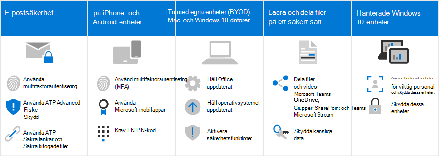

# Hur dessa säkerhetsrekommendationer påverkar dina användare

Säkerhetsrekommendationerna för Microsoft 365 i den här lösningen gör det mycket svårare för hackare att få åtkomst till din miljö. Men när du gör det måste användarna vara medvetna om hur de arbetar i den här säkrare miljön. Vi förstår att det krävs lite extra tålamod, men det är värt att skydda din organisation.

## Använd säkra e-postrutiner

Alla användare bör känna till och använda de här e-postmetoderna för att skydda sin e-post:

- Konfigurera e-post för användning av multifaktorautentisering med autentiseringsappen.
- Verifiera legitima e-postmeddelanden och leta efter säkerhetstips från Avancerad nätfiske i Defender för Office 365 skydd.
- Öppna endast säkra länkar och bifogade filer, som verifierats Valv länkar och bifogade filer Valv bifogade filer.

Läs mer om [multifaktorautentisering](m365-campaigns-multifactor-authenication.md) och [nätfiske och andra attacker.](m365-campaigns-phishing-and-attacks.md)

Ladda ned [en infografik](m365-campaigns-protect-campaign-infographic.md) med tips för dig och medlemmarna i ditt team.

## Konfigurera iPhone- och Android-enheter

Det tar några minuter för alla användare som du lägger till i din miljö att konfigurera [iPhone-](../business/set-up-mobile-devices.md?toc=%2Fmicrosoft-365%2Fcampaigns%2Ftoc.json) och Android-enheter så att de fungerar säkert:

- Konfigurera enheter för multifaktorautentisering med autentiseringsappen.
- Använd Microsoft-mobilappar, bland annat Outlook Mobile, Word OneDrive och andra Microsoft-appar från appbutiken. De inbyggda e-postapparna som ingår på iPhone- och Android-enheter stöds inte. 
- Kräv en PIN-kod för att användare ska kunna låsa upp sin enhet.

När du har konfigurerat dem uppmanas användarna att använda autentiseringsappen när de får åtkomst till organisationens data på dessa enheter, inklusive e-post.

## Håll BYOD-mac och Windows 10 datorer helt nya

Det är också viktigt att användarna håller sin primära arbetsenhet uppdaterad:

- Installera de senaste versionerna av Office och uppdatera dem när du uppmanas att göra det.
- Håll dig på operativsystemets uppdateringar, till exempel Windows uppdateringar.

För [ohanterade Windows 10- och Mac-enheter](m365-campaigns-protect-pcs-macs.md)har användarna ansvar att säkerställa att grundläggande säkerhetsfunktioner är aktiverade.

**Aktivera grundläggande säkerhetsfunktioner på BYOD-Windows 10- och Mac-enheter**

| |**Windows 10**|**Mac**|
|:-----|:-----|:------|
|Säkerhetsfunktioner|Aktivera BitLocker enhetsskydd

 Se Windows Defender förblir på 
Aktivera Windows brandväggen| Använda FileVault för att kryptera Mac-hårddisken 

Använda ett tillförlitligt antivirusprogram 
Aktivera brandväggsskydd|

Mer information om dessa rekommendationer finns [i Skydda ditt konto och dina enheter från hackare och skadlig programvara.](https://support.office.com/article/Protect-your-account-and-devices-from-hackers-and-malware-066d6216-a56b-4f90-9af3-b3a1e9a327d6#ID0EAABAAA=Windows_10)

## Samarbeta med Microsoft Teams, OneDrive, SharePoint Online och andra verktyg

Användarna kanske frestas att dela och lagra organisationsfiler på andra platser än i Microsoft 365. Microsoft 365 gör det så enkelt som möjligt att samarbeta och dela säkert. Du kan [dela filer och videor](share-files-and-videos.md) direkt Microsoft Teams, OneDrive, streama och även inifrån en fil. Delning inifrån dessa verktyg ser till att dina data inte läcker ut. Du kan lägga till ytterligare skydd för känsliga data för att förhindra delning utanför organisationen.

## Konfigurera hanterade Windows 10 enheter

Vi rekommenderar att din viktigaste personal använder nyligen köpta Windows 10 enheter som du hanterar. Vi visar dig hur du hanterar [och skyddar dessa enheter.](../business/set-up-windows-devices.md?toc=/microsoft-365/campaigns/toc.json) Det säkerställer att personal som är bäst värde på att bli hackare får mest skydd.
