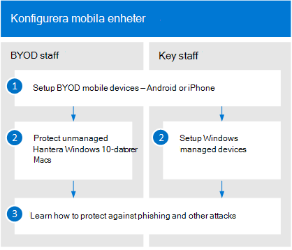

# Konfigurera Microsoft 365Set up Microsoft 365

I den här artikeln beskrivs processen med att konfigurera Microsoft 365.This article describes the process of setting up Microsoft 365. Alla med Microsoft 365 Business Premium kan använda den här vägledningen för att öka säkerheten.Anybody with Microsoft 365 Business Premium can use this guidance to step up security.

## Administratörer: Konfigurera Microsoft 365Admins: Set up Microsoft 365

I följande diagram beskrivs hur administratörer konfigurerar Microsoft 365.The following diagram describes how admins set up Microsoft 365.

För kampanjer som är kvalificerade för specialpriser kan du komma igång genom att begära en inbjudan från [Microsoft](https://m365forcampaigns.microsoft.com/)och sedan registrera dig för [Microsoft 365 för kampanjer.](m365-campaigns-sign-up.md)For campaigns that qualify for special pricing, get started by [requesting an invite from Microsoft](https://m365forcampaigns.microsoft.com/), then [signing up for Microsoft 365 for Campaigns](m365-campaigns-sign-up.md). Slutför konfigurationen genom att [köra installationsguiden och](../business/set-up.md?toc=/microsoft-365/campaigns/toc.json) konfigurera basinställningarna.To complete setup, [run the setup wizard](../business/set-up.md?toc=/microsoft-365/campaigns/toc.json) to configure the core settings.

När du har registrerat dig för [Microsoft 365 Business Premium](../business/sign-up.md)  slutför du konfigurationen för alla andra organisationer genom att köra installationsguiden för att konfigurera basinställningarna.For all other organizations, after you've [signed up for Microsoft 365 Business Premium](../business/sign-up.md), complete setup by [running the setup wizard](../business/set-up.md?toc=/microsoft-365/campaigns/toc.json) to configure the core settings.

För alla organisationer kan du öka säkerhetsskyddet genom att skydda [administratörskonton,](m365-campaigns-protect-admin-accounts.md)skydda [åtkomsten till e-post och data](m365-campaigns-conditional-access.md)och [öka skyddet mot hot.](m365-campaigns-increase-protection.md)For all organizations, bump up security protection by: [protecting admin accounts](m365-campaigns-protect-admin-accounts.md), [protecting access to mail and data](m365-campaigns-conditional-access.md), and [increasing threat protection](m365-campaigns-increase-protection.md).

## Alla: Konfigurera dina enheterEveryone: Set up your devices

Det tar några minuter för användarna att konfigurera enheter så att de fungerar med den här miljön.Users will need to take a few minutes to set up devices to work with this environment. För viktiga användare (de som är de högsta värdemålen för hackare) kan du konfigurera och förkonfigurera nya enheter.For your key users (those who are the highest value targets for hackers), you can set up and pre-configure new devices. Det hjälper dem att komma igång när de loggar in med sina Microsoft 365-inloggningsuppgifter.This helps them to get started when they sign in with their Microsoft 365 credentials.

  
Så här ställer du in användarenheter:To set up user devices:

1. Varje användare [uppsättningar sina mobila enheter.](../business/set-up-mobile-devices.md?toc=%2Fmicrosoft-365%2Fcampaigns%2Ftoc.json)Each user [sets up their mobile devices](../business/set-up-mobile-devices.md?toc=%2Fmicrosoft-365%2Fcampaigns%2Ftoc.json).
2. För ohanterade enheter ställer användarna in [sina PC- och Mac-datorer.](m365-campaigns-protect-pcs-macs.md)For unmanaged devices, users set up their [PCs and Macs](m365-campaigns-protect-pcs-macs.md).
För viktig personal rekommenderar vi att du använder [hanterade enheter](../business/set-up-windows-devices.md?toc=/microsoft-365/campaigns/toc.json) för att få ännu bättre skydd.For key staff, we recommend that you use [managed devices](../business/set-up-windows-devices.md?toc=/microsoft-365/campaigns/toc.json) for even better protection. För alla enheter bör du konfigurera [multifaktorautentisering.](m365-campaigns-multifactor-authenication.md)For all devices, you'll want to set up [multifactor authentication](m365-campaigns-multifactor-authenication.md).
3. Alla användare bör lära sig att skydda sig själva och din kampanj genom att lära sig [om nätfiske och andra attacker.](m365-campaigns-phishing-and-attacks.md)All users should learn how to protect themselves and your campaign by learning about [phishing and other attacks](m365-campaigns-phishing-and-attacks.md). Den [här infografiken](m365-campaigns-protect-campaign-infographic.md) kan också hjälpa användarna att förstå hur de kan skydda kampanjen mot onlinehot.This [infographic](m365-campaigns-protect-campaign-infographic.md) can also help your users understand how to help protect your campaign from online threats.

## Kontakta supportContact support

 **Om du behöver kontakta supporten:****If you need to contact support:**
  
Som Microsoft 365-administratör har du tillgång till vår kundtjänst. Kontakta supporten för **[företagsprodukter – hjälp för administratörer](https://docs.microsoft.com/microsoft-365/admin/contact-support-for-business-products)**As a Microsoft 365 admin, you have access to our customer support team, **[Contact support for business products - Admin Help](https://docs.microsoft.com/microsoft-365/admin/contact-support-for-business-products)**
