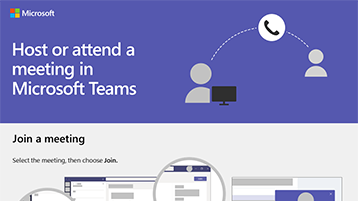

# Skapa mötenSet up meetings

Möten i Microsoft Teams inkluderar ljud, video och delning.Meetings in Microsoft Teams include audio, video, and sharing. Och eftersom de är online har du alltid ett mötesrum och behöver aldrig ett rum eller en projektor för kampanjen.And because they're online, you'll always have a meeting space and never need a room or projector for your campaign.Microsoft Teams-möten är ett bra sätt att komma tillsammans med personalen och frivilliga både inom och utanför organisationen. Microsoft Teams meetings are a great way to come together with your staff and volunteers both inside and outside of your organization. Du behöver inte vara medlem i din organisation eller ens ha ett konto för att ansluta till ett möte.You don’t need to be a member of your organization or even have an account to join a meeting. För din politiska kampanj kan du schemalägga och köra onlinemöten med Microsoft Teams.For your political campaign, you can schedule and run online meetings using Microsoft Teams. Du kan ta med personal, frivilliga och gäster utanför organisationen.You can include staff, volunteers, and guests outside your organization. Under ett möte kan du dela din skärm, dela filer, tilldela uppgifter och mycket mer.During a meeting, you can share your screen, share files, assign tasks, and more.

Ladda ned en infografik i [PDF](https://go.microsoft.com/fwlink/?linkid=2078712) eller [PowerPoint](https://go.microsoft.com/fwlink/?linkid=2079515) för att få en snabb överblick över hur du ansluter till eller är värd för ett onlinemöte med Microsoft Teams.Download an infographic in [PDF](https://go.microsoft.com/fwlink/?linkid=2078712) or [PowerPoint](https://go.microsoft.com/fwlink/?linkid=2079515) to get a quick overview of how to join or host an online meeting with Microsoft Teams.

## MetodtipsBest practices

Följ de här rekommendationerna för onlinemöten:Follow these best practices for your online meetings:
- Schemalägg dina onlinemöten direkt i Microsoft Teams.Schedule your online meetings right in Microsoft Teams. Du kan välja ett team och en kanal så bjuds deltagarna automatiskt till den gruppen.You can choose a team and channel, and Teams will invite the participants in that team or channel automatically.
- Behöver du ett improviserat-möte?Need an impromptu meeting? Om du är i en chatt med en person väljer du **möte nu** för att starta ett video-eller ljud samtal med den du chattar med.If you're in a one-on-one chat, choose **Meet now** to start a video or audio call with the person you're chatting with. 

## Schemalägga ett möteSchedule a meeting

> [!VIDEO https://www.microsoft.com/videoplayer/embed/RE1FOhP]

## Ansluta till ett möteJoin a meeting

> [!VIDEO https://www.microsoft.com/videoplayer/embed/RE1FYWn]

Lär dig mer om ett möte i Microsoft Teams:Learn more about meeting in Microsoft Teams:

> [!VIDEO https://www.microsoft.com/videoplayer/embed/RWeokQ]
