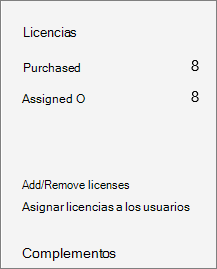
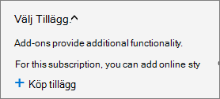
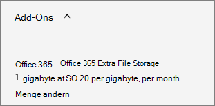

# Lägga till lagringsutrymme för din prenumeration

::: moniker range="o365-21vianet"

> [!NOTE]
> Administrationscentret förändras. Om dina erfarenheter inte överensstämmer med uppgifterna som visas här kan du läsa mer i [Om det nya administrationscentret för Microsoft 365](https://docs.microsoft.com/microsoft-365/admin/microsoft-365-admin-center-preview?view=o365-21vianet).

::: moniker-end

Om du börjar få slut på lagringsutrymme för webbplatssamlingar i SharePoint Online kan du lägga till lagringsutrymme för din prenumeration om prenumerationen är berättigad till det. Om du inte ser extra fillagring för **Office 365** i listan över tillgängliga tillägg betyder det att ditt abonnemang inte är kvalificerat. Mer information finns i [Är min plan berättigad?](#is-my-plan-eligible-for-office-365-extra-file-storage)

## Visa tillgängligt lagringsutrymme

::: moniker range="o365-worldwide"

1. Gå till [sidan Aktiva webbplatser i det nya Administrationscentret](https://admin.microsoft.com/sharepoint?page=siteManagement&modern=true)för SharePoint och logga in med ett konto som har [administratörsbehörighet](https://docs.microsoft.com/sharepoint/sharepoint-admin-role) för din organisation.

2. Längst upp till höger på sidan läser du hur mycket lagringsutrymme som används på alla platser och det totala lagringsutrymmet för din prenumeration. (Om din organisation har konfigurerat Multi-Geo i Office 365 visar fältet också hur mycket lagringsutrymme som används på alla geografiska platser.) 

::: moniker-end

::: moniker range="o365-germany"

1. Logga in https://portal.office.de på som global administratör eller SharePoint-administratör och välj sedan panelen Admin för att öppna administrationscentret. (Om du ser ett meddelande om att du inte har behörighet att komma åt sidan har du inte administratörsbehörighet för Microsoft 365 i organisationen.)

2. Välj **SharePoint**under **Administrationscenter**i den vänstra rutan. Om det klassiska Administrationscentret för SharePoint visas väljer du **Öppna det nu** högst upp på sidan för att öppna det nya Administrationscentret för SharePoint.

3. Välj **Aktiva webbplatser**i den vänstra rutan i det nya administrationscentret för SharePoint .

4. Längst upp till höger på sidan läser du hur mycket lagringsutrymme som används på alla platser och det totala lagringsutrymmet för din prenumeration.

::: moniker-end

::: moniker range="o365-21vianet"

1. Logga in https://login.partner.microsoftonline.cn/ på som global administratör eller SharePoint-administratör och välj sedan panelen Admin för att öppna administrationscentret. (Om du ser ett meddelande om att du inte har behörighet att komma åt sidan har du inte administratörsbehörighet för Microsoft 365 i organisationen.)

2. Välj **SharePoint**under **Administrationscenter**i den vänstra rutan. Om det klassiska Administrationscentret för SharePoint visas väljer du **Öppna det nu** högst upp på sidan för att öppna det nya Administrationscentret för SharePoint.

3. Välj **Aktiva webbplatser**i den vänstra rutan i det nya administrationscentret för SharePoint .

4. Längst upp till höger på sidan läser du hur mycket lagringsutrymme som används på alla platser och det totala lagringsutrymmet för din prenumeration.  

::: moniker-end

> [!NOTE]
> Den lagring som används innehåller inte ändringar som gjorts under de senaste 24-48 timmarna.

När du har fastställt hur mycket lagringsutrymme du använder kan du lägga till eller ta bort lagringsutrymme för din prenumeration. Följ stegen i den här artikeln om du vill ta reda på hur mycket det kostar att lägga till lagringsutrymme och kontrollera prisinformationen innan köpet.
  
Information om hur du anger lagringsgränser för webbplatssamlingar finns i [Hantera lagringsgränser för webbplatssamlingar](https://docs.microsoft.com/sharepoint/manage-site-collection-storage-limits).
  
## Lägga till lagringsutrymme i din prenumeration

Om du ännu inte har köpt extra lagringsutrymme för din prenumeration kan du göra det.

::: moniker range="o365-worldwide"

1. Gå till sidan **Billing** \> <a href="https://go.microsoft.com/fwlink/p/?linkid=868433" target="_blank">Faktureringsköpstjänster</a> i administrationscentret.

2. Längst ned på sidan **Köptjänster** väljer du **Tillägg**.

3. Välj **Extra fillagring för Office 365**.

4. På sidan Extra fillagring i **Office 365** väljer du basprenumerationen om den visas och anger sedan antalet gigabyte lagringsutrymme som du vill lägga till.

5. Välj **Checka ut nu**.

6. På sidan **Hur ser det ut?** **Next**

7. Kontrollera summan på sidan **Slutför order.** Om du behöver göra några ändringar väljer du **Redigera ordning**. Om ordern kräver en kreditkontroll markerar du kryssrutan. När du är klar **Place order** väljer du \> **Gå till Admin Home**.

::: moniker-end

::: moniker range="o365-germany"

1. Gå till sidan **Billing** \> <a href="https://go.microsoft.com/fwlink/p/?linkid=847745" target="_blank">Faktureringsprenumerationer</a> i administrationscentret.  

2. På sidan **Prenumerationer** väljer du den prenumeration som du vill lägga till lagringsutrymme på och väljer sedan **Tillägg**.

    
  
    > [!NOTE]
    > Om du inte ser **tillägg**och din prenumeration köptes via en partner väljer du **VLSC (Volume Licensing Service Center).**
  
3. Välj **Köp tillägg**.

    
  
4. På sidan **Köp tjänster** väljer du Över eller trycker på Extra fillagring för **Office 365**och väljer sedan **Köp nu**.
  
5. Ange antalet användarlicenser som du behöver och välj, om det visas, en basprenumeration. Välj **Checka ut nu**.
  
6. På sidan **Hur ser det ut?** **Next**

7. På sidan **Slutför beställning** väljer du **Beställ**.

::: moniker-end

::: moniker range="o365-21vianet"

1. Gå till sidan **Fakturering** \> <a href="https://go.microsoft.com/fwlink/p/?linkid=850626" target="_blank">Prenumerationer</a> i administrationscentret.

2. På sidan **Prenumerationer** väljer du den prenumeration som du vill lägga till lagringsutrymme på och väljer sedan **Tillägg**.

    
  
    > [!NOTE]
    > Om du inte ser **tillägg**och din prenumeration köptes via en partner väljer du **VLSC (Volume Licensing Service Center).**
  
3. Välj **Köp tillägg**.

    
  
4. På sidan **Köp tjänster** väljer du Över eller trycker på Extra fillagring för **Office 365**och väljer sedan **Köp nu**.
  
5. Ange antalet användarlicenser som du behöver och välj, om det visas, en basprenumeration. Välj **Checka ut nu**.
  
6. På sidan **Hur ser det ut?** **Next**

7. På sidan **Slutför beställning** väljer du **Beställ**.

::: moniker-end

## Öka eller minska lagringsutrymme

Om du redan har köpt extra fillagring via tillägget Extra fillagring i **Office 365** kan du använda de här stegen för att öka eller minska det extra lagringsutrymmet för din prenumeration. Du kan minska lagringsutrymmet till så lågt som 1 gigabyte. Om du vill ta bort allt extra lagringsutrymme måste du [kontakta supporten](../admin/contact-support-for-business-products.md).

::: moniker range="o365-worldwide"

1. I administrationscentret går du till sidan **Fakturering** \> <a href="https://go.microsoft.com/fwlink/p/?linkid=842054" target="_blank">Dina produkter</a>.

2. Välj den prenumeration som innehåller tillägget **Extra fillagring i Office 365.**

3. Välj **Tillägg**och välj sedan **Ändra kvantitet**.

4. I fönstret **Lägg till/ta bort gigabyte** anger du den totala gigabyte som du vill ha för prenumerationen och väljer sedan Skicka **ändring**.

::: moniker-end

::: moniker range="o365-germany"

1. Gå till sidan **Fakturering** \> <a href="https://go.microsoft.com/fwlink/p/?linkid=847745" target="_blank">Prenumerationer</a> i administrationscentret.

2. På sidan **Prenumerationer** väljer du **Tillägg**.

    
  
    > [!NOTE]
    > Om du inte ser **tillägg**och din prenumeration köptes via en partner väljer du **VLSC (Volume Licensing Service Center).**
  
3. Under **Extra fillagring i Office 365**väljer du **Ändra kvantitet**.

    
  
4. I den högra rutan anger du det totala antalet gigabyte som du behöver och väljer sedan **Skicka**.

    Om du för närvarande till exempel har 200 GB extra lagringsutrymme men bara behöver 100 GB ska du ange **100** i rutan.

5. Välj **Stäng**.

::: moniker-end

::: moniker range="o365-21vianet"

1. Gå till sidan **Fakturering** \> <a href="https://go.microsoft.com/fwlink/p/?linkid=850626" target="_blank">Prenumerationer</a> i administrationscentret.

2. På sidan **Prenumerationer** väljer du **Tillägg**.

    
  
    > [!NOTE]
    > Om du inte ser **tillägg**och din prenumeration köptes via en partner väljer du **VLSC (Volume Licensing Service Center).**
  
3. Under **Extra fillagring i Office 365**väljer du **Ändra kvantitet**.

    
  
4. I den högra rutan anger du det totala antalet gigabyte som du behöver och väljer sedan **Skicka**.

    Om du för närvarande till exempel har 200 GB extra lagringsutrymme men bara behöver 100 GB ska du ange **100** i rutan.

5. Välj **Stäng**.

::: moniker-end

## Berättigar mitt abonnemang till Office 365 extra fillagring?

Office 365 extra fillagring är tillgängligt för följande prenumerationer:
  
- Office 365 Enterprise E1

- Office 365 Enterprise, E2

- Office 365 Enterprise, E3

- Office 365 Enterprise E4

- Office 365 Enterprise E5

- Office för webben med SharePoint-abonnemang 1

- Office för webben med SharePoint-abonnemang 2

- SharePoint Online (abonnemang 1)

- SharePoint Online (abonnemang 2)

- Microsoft 365 Business Basic

- Microsoft 365 Business Standard

- Microsoft 365 Business Premium

- Microsoft 365 E3

- Microsoft 365 E5

- Microsoft 365 F1

> [!NOTE]
> Extra fillagring i Office 365 är också tillgängligt för GCC-, GCC-hög- och DOD-abonnemang.
