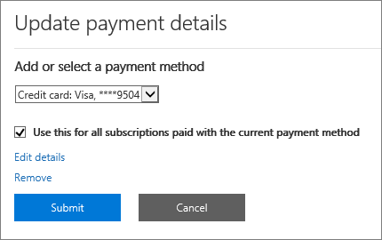
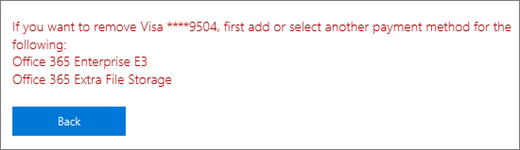

# Lägga till, uppdatera eller ta bort dina betalningsmetoderAdd, update, or remove your payment methods

::: moniker range="o365-worldwide"
Du kan köpa produkter och tjänster från Microsoft med ett kredit- eller betalkort eller bankkonto.You can purchase products and services from Microsoft with a credit or debit card, or bank account. Du kan ange din betalningsinformation på sidan **Betalningsmetoder** eller när du gör ett köp.You can enter your payment information on the **Payment methods** page, or when you make a purchase.

Du kan bara hantera betalningsmetoder som du har lagt till.You can only manage payment methods that you've added.

> [!NOTE]
> Alternativet att betala med ett bankkonto är inte tillgängligt i vissa länder eller regioner.The option to pay with a bank account is not available in some countries or regions.
>
> Du måste använda ett kreditkort som utfärdats från samma land som din klient.You must use a credit card issued from the same country as your tenant.

**Matchar gränssnittet som du ser inte det som beskrivs i den här artikeln?****Does the interface you see not match the one described in this article?** I så fall läser du [Hantera betalningsmetoder](manage-payment-methods.md).If so, see [Manage payment methods](manage-payment-methods.md).

## Lägga till en betalningsmetodAdd a payment method

1. Gå till sidan > **Faktureringsfakturor &** > <a href="https://go.microsoft.com/fwlink/p/?linkid=2018806" target="_blank">betalningsmetoder</a> i administrationscentret. **Billing**In the admin center, go to the **Billing** > **Bills & payments** > <a href="https://go.microsoft.com/fwlink/p/?linkid=2018806" target="_blank">Payment methods</a> page.
2. Välj **Lägg till en betalningsmetod**.Select **Add a payment method**.
3. På sidan **Betalningsmetoder** väljer du ett betalningssätt i listrutan. On the **Payment methods** page, pick a payment method from the drop-down menu.
4. Ange informationen för det nya kortet eller bankkontot och välj sedan **Lägg till**.Enter the information for the new card or bank account, then select **Add**.

## Uppdatera en befintlig betalningsmetodUpdate an existing payment method

Du kan inte ändra numret på ett befintligt kort eller bankkonto.You can't change the number on an existing card or bank account. Om kortet eller bankkontonumret har ändrats lägger du till det som en ny betalningsmetod.If the card or bank account number has changed, add it as a new payment method. Välj det sedan som betalningsalternativ för din prenumeration och ta sedan bort det befintliga kortet eller bankkontot.Next, pick it as the payment option for your subscription, then remove the existing card or bank account. Du måste använda ett kort som utfärdats från samma land som din klient.You must use a card issued from the same country as your tenant.

1. Gå till sidan > **Faktureringsfakturor &** > <a href="https://go.microsoft.com/fwlink/p/?linkid=2018806" target="_blank">betalningsmetoder</a> i administrationscentret. **Billing**In the admin center, go to the **Billing** > **Bills & payments** > <a href="https://go.microsoft.com/fwlink/p/?linkid=2018806" target="_blank">Payment methods</a> page.
2. På sidan **Betalningsmetoder** väljer du kortet eller bankkontot som ska uppdateras och väljer sedan **Redigera**.On the **Payment methods** page, pick the card or bank account to update, then select **Edit**.
3. Uppdatera din betalningsmetodsinformation (namn på kortet eller bankkontot, faktureringsadress, telefonnummer eller utgångsdatum) och välj sedan **Spara**.Update your payment method information (name on the card or bank account, billing address, phone number, or expiration date), then select **Save**.

## Ändra en betalningsmetodChange a payment method

Du kan ändra betalningsmetoden som används för att betala för en enskild prenumeration.You can change the payment method that is used to pay for a single subscription. Du kan också flytta alla prenumerationer från en betalningsmetod till en annan.You can also move all subscriptions from one payment method to another.

### Ändra betalningsmetod som används för en enskild prenumerationChange the payment method used for a single subscription

1. I administrationscentret går du till sidan **Fakturering** > <a href="https://go.microsoft.com/fwlink/p/?linkid=842054" target="_blank">Produkter och tjänster</a>.In the admin center, go to the **Billing** > <a href="https://go.microsoft.com/fwlink/p/?linkid=842054" target="_blank">Products & services</a> page.
2. Välj den prenumeration som du vill betala för med det nya kortet eller bankkontot.Select the subscription that you want to pay for with the new card or bank account. Välj **Billing** **Redigera**bredvid betalningsmetoden.Under **Billing**, next to the payment method, select **Edit**.
3. Välj Ändra **bredvid**din befintliga betalningsmetod .Next to your existing payment method, select **Change**.
4. Välj en alternativ betalningsmetod på den nedrullningsbara menyn eller välj att lägga till en betalningsmetod.From the drop-down menu, select an alternate payment method, or choose to add a payment method.
5. Om du lägger till en betalningsmetod anger du kort- eller kontouppgifterna och väljer sedan **Spara**.If you add a payment method, enter the card or account details, then select **Save**.
6. Kontrollera att den valda betalningsmetoden är korrekt och välj sedan **Spara**.Verify that the selected payment method is correct, then select **Save**.

### Ändra betalningsmetod som används för flera prenumerationerChange the payment method used for multiple subscriptions

1. Gå till sidan > **Faktureringsfakturor &** > <a href="https://go.microsoft.com/fwlink/p/?linkid=2018806" target="_blank">betalningsmetoder</a> i administrationscentret. **Billing**In the admin center, go to the **Billing** > **Bills & payments** > <a href="https://go.microsoft.com/fwlink/p/?linkid=2018806" target="_blank">Payment methods</a> page.
2. Bredvid betalningsmetoden som du vill ändra väljer du **menyn Mer** (tre punkter) och väljer sedan **Ändra prenumerationer**.Next to the payment method you want to change, select the **More** menu (three dots), and then select **Change subscriptions**.
3. I fönstret **Ändra betalningsmetod** visas befintliga prenumerationer som använder den betalningsmetoden.The **Change payment method** pane lists existing subscriptions that use that payment method.
4. Välj en annan betalningsmetod i listrutan **Välj betalningsmetod** och välj sedan **Spara**.From the **Select payment method** drop-down, select a different payment method, then select **Save**.

> [!NOTE]
> Du kan bara ändra mellan befintliga betalningsmetoder i fönstret **Ändra betalningsmetod.**You can only change between existing payment methods in the **Change payment method** pane. Om du vill ändra till betalning med faktura läser du [Ändra från kreditkort eller bankkonto till faktura](change-payment-method.md#change-from-credit-card-or-bank-account-to-invoice).If you want to change to pay by invoice, see [Change from credit card or bank account to invoice](change-payment-method.md#change-from-credit-card-or-bank-account-to-invoice).

## Ta bort en betalningsmetodRemove a payment method

Du kan bara ta bort ett kredit- eller betalkort eller bankkonto från listan över betalningsmetoder om det inte är kopplat till en prenumeration.You can only remove a credit or debit card or bank account from your list of payment methods if it's not attached to a subscription. Detta gäller alla prenumerationer, oavsett deras status.This applies to all subscriptions, whatever their status. Lägg till en betalningsmetod för prenumerationen och ta sedan bort den gamla från den prenumerationen.Add a payment method for the subscription, then remove the old one from that subscription. Om betalningsmetoden är kopplad till en faktureringsprofil ändrar du betalningsmetoden som används för faktureringsprofilen och tar sedan bort betalningsmetoden.If the payment method is associated with a billing profile, change the payment method used for the billing profile, and then remove the payment method.

### Ta bort en betalningsmetodDelete a payment method

Om din betalningsmetod inte är kopplad till några prenumerationer kan du omedelbart ta bort den.If your payment method isn't associated with any subscriptions, you can immediately delete it.

1. Gå till sidan > **Faktureringsfakturor &** > <a href="https://go.microsoft.com/fwlink/p/?linkid=2018806" target="_blank">betalningsmetoder</a> i administrationscentret. **Billing**In the admin center, go to the **Billing** > **Bills & payments** > <a href="https://go.microsoft.com/fwlink/p/?linkid=2018806" target="_blank">Payment methods</a> page.
2. Hovra över kortet eller bankkontot och välj sedan borttagningsikonen.Hover over the card or bank account, then select the delete icon.
3. Längst ned i fönstret **Ta bort betalningsmetod** väljer du Ta **bort**.At the bottom of the **Delete payment method** pane, select **Delete**.

### Lägga till en alternativ betalningsmetod som används för att betala för prenumerationerAdd an alternate payment method used to pay for subscriptions

Om din betalningsmetod är kopplad till prenumerationer och du inte har någon alternativ betalningsmetod registrerad lägger du först till en betalningsmetod.If your payment method is associated with any subscriptions and you don't have an alternate payment method on file, first add a payment method. Ändra sedan betalningsmetoden som används för att betala för prenumerationerna.Next, change the payment method used to pay for the subscriptions. Sedan kan du ta bort betalningsmetoden.Then you can delete the payment method.

1. Gå till sidan > **Faktureringsfakturor &** > <a href="https://go.microsoft.com/fwlink/p/?linkid=2018806" target="_blank">betalningsmetoder</a> i administrationscentret. **Billing**In the admin center, go to the **Billing** > **Bills & payments** > <a href="https://go.microsoft.com/fwlink/p/?linkid=2018806" target="_blank">Payment methods</a> page.
2. Hovra över kortet eller bankkontot och välj sedan borttagningsikonen.Hover over the card or bank account, then select the delete icon.
3. I fönstret **Ta bort betalningsmetod** visas befintliga prenumerationer som använder den betalningsmetoden.The **Delete payment method** pane lists existing subscriptions that use that payment method.
4. Välj **Lägg till en betalningsmetod**.Select **Add a payment method**.
5. Välj den typ av betalningsmetod du vill lägga till, ange kontoinformation och välj sedan **Lägg till**.Select the type of payment method you want to add, enter the account information, then select **Add**.
6. Välj den nya betalningsmetoden i listrutan och välj sedan **Ändra**.Select the new payment method from the drop-down list, then select **Change**.
    > [!WARNING]
    > Då flyttas alla prenumerationer till den nya betalningsmetoden.This will move all subscriptions to the new payment method.
7. Välj **Ta bort**.Select **Delete**.

### Ändra betalningsmetod som används för att betala för prenumerationerChange the payment method used to pay for subscriptions

Om din betalningsmetod är kopplad till prenumerationer och du har minst en alternativ betalningsmetod registrerad, ändrar du först betalningsmetoden som används för att betala för prenumerationerna.If your payment method is associated with any subscriptions, and you have at least one alternate payment method on file, first change the payment method used to pay for the subscriptions. Sedan kan du ta bort betalningsmetoden.Then you can delete the payment method.

1. Gå till sidan > **Faktureringsfakturor &** > <a href="https://go.microsoft.com/fwlink/p/?linkid=2018806" target="_blank">betalningsmetoder</a> i administrationscentret. **Billing**In the admin center, go to the **Billing** > **Bills & payments** > <a href="https://go.microsoft.com/fwlink/p/?linkid=2018806" target="_blank">Payment methods</a> page.
2. Hovra över kortet eller bankkontot och välj sedan borttagningsikonen.Hover over the card or bank account, then select the delete icon.
3. I fönstret **Ta bort betalningsmetod** visas befintliga prenumerationer som använder den betalningsmetoden.The **Delete payment method** pane lists existing subscriptions that use that payment method.
4. Välj **Ändra betalningsmetod**.Select **Change payment method**.
5. Välj en alternativ betalningsmetod i listrutan och välj sedan **Ändra**.Select an alternate payment method from the drop-down list, then select **Change**.
    > [!WARNING]
    > Då flyttas alla prenumerationer till den alternativa betalningsmetoden.This will move all subscriptions to the alternate payment method.
6. Välj **Ta bort**.Select **Delete**.

### Ändra betalningsmetod för en faktureringsprofilChange the payment method for a billing profile

Om din betalningsmetod är kopplad till en faktureringsprofil och inte också används för att direkt betala för andra prenumerationer ändrar du först betalningsmetoden som är kopplad till den.If your payment method is associated with a billing profile and isn't also used to directly pay for other subscriptions, first change the payment method associated with it. Sedan kan du ta bort betalningsmetoden.Then you can delete the payment method.

1. Gå till sidan **Faktureringsprofiler &amp; för faktureringsprofiler** **Billing** > i administrationscentret. > <a href="https://go.microsoft.com/fwlink/p/?linkid=2103629" target="_blank">Billing profiles</a>In the admin center, go to the **Billing** > **Bills &amp; payments** > <a href="https://go.microsoft.com/fwlink/p/?linkid=2103629" target="_blank">Billing profiles</a> page.
2. Välj den faktureringsprofil som du vill uppdatera.Select the billing profile you want to update.
3. Välj **Redigera**under Betalningsmetod på sidan **Faktureringsprofilinformation**.On the billing profile details page, under **Payment method**, select **Edit**.
4. Om du lägger till en alternativ betalningsmetod väljer du **Lägg till en betalningsmetod**.If you add an alternate payment method, select **Add a payment method**. Ange din kontoinformation och välj sedan **Lägg till**.Enter your account information, then select **Add**.
5. Välj **en** annan betalningsmetod i listrutan Välj en betalningsmetod och välj sedan **Spara**.From the **Select a payment method** drop-down, select a different payment method, then select **Save**.
6. Följ stegen i [Ta bort en betalningsmetod](#delete-a-payment-method).Follow the steps in [Delete a payment method](#delete-a-payment-method).

### Ändra betalningsmetod som används för både en faktureringsprofil och prenumerationerChange the payment method used for both a billing profile and subscriptions

Om din betalningsmetod är kopplad till en faktureringsprofil och även används för att direkt betala för prenumerationer ändrar du först betalningsmetoden som är kopplad till faktureringsprofilen.If your payment method is associated with a billing profile and is also used to directly pay for any subscriptions, first change the payment method associated with the billing profile. Ändra sedan betalningsmetoden som används för att betala för prenumerationerna.Next, change the payment method used to pay for the subscriptions. Sedan kan du ta bort betalningsmetoden.Then you can delete the payment method.

1. Följ steg 1 till 5 i [Ändra betalningsmetod för en faktureringsprofil](#change-the-payment-method-for-a-billing-profile).Follow steps 1 through 5 in [Change the payment method for a billing profile](#change-the-payment-method-for-a-billing-profile).
2. Om du inte har någon alternativ betalningsmetod följer du stegen i [Lägg till en alternativ betalningsmetod som används för att betala för prenumerationer](#add-an-alternate-payment-method-used-to-pay-for-subscriptions).If you have no alternate payment method, follow the steps in [Add an alternate payment method used to pay for subscriptions](#add-an-alternate-payment-method-used-to-pay-for-subscriptions).
3. Om du redan har andra betalningsmetoder tillgängliga följer du stegen i [Ändra en betalningsmetod](#change-a-payment-method).If you already have other payment methods available, follow the steps in [Change a payment method](#change-a-payment-method).

## Felsöka betalningsmetoderTroubleshoot payment methods

|**Problem****Issue**|**Felsökningssteg****Troubleshooting steps**|
|:-----|:-----|
|**Jag får ett felmeddelande som säger: "Webbläsaren är för närvarande inställd på att blockera cookies."****I get an error message that says, "The browser is currently set to block cookies."**   |Konfigurera din webbläsare så att den tillåter cookies från tredje part och försök igen.Set your browser to allow third-party cookies and try again.    |
|**Mitt kredit- eller betalkort avvisades.****My credit or debit card was declined.**   |Om du betalar med kredit- eller betalkort och kortet avvisas får du ett e-postmeddelande där det står att Microsoft inte kunde behandla betalningen.If you pay by credit or debit card, and your card is declined, you receive an email that says Microsoft was unable to process the payment. Dubbelkolla att &mdash; kortnummer, utgångsdatum, namn på kortet och adress, inklusive ort, delstat och postnummer , visas precis som de gör på kortet och ditt utdrag.Double-check that the card details &mdash; card number, expiration date, name on the card, and address, including city, state, and ZIP code — appear exactly as they do on the card and your statement. Du kan uppdatera din kortinformation och omedelbart skicka betalningen med hjälp av länken **Kvitta saldo** i avsnittet **Fakturering** på sidan Prenumerationsinformation.You can update your card information and immediately submit the payment by using the **Settle balance** link in the **Billing** section of the subscription details page. Mer information finns i [Vad händer om mitt kreditkort avvisades och min betalning förfaller till betalning?](pay-for-your-subscription.md#what-if-my-credit-card-was-declined-and-my-payment-is-past-due).For more information, see [What if my credit card was declined and my payment is past due?](pay-for-your-subscription.md#what-if-my-credit-card-was-declined-and-my-payment-is-past-due).      Om meddelandet om nekat kort fortfarande visas kontaktar du banken.If you continue to see the "declined" message, contact your bank. Det är möjligt att ditt kort inte är aktivt.It's possible that your card isn't active. Om du nyligen har fått kortet med ett uppdaterat utgångsdatum kontrollerar du att det är aktiverat.If you recently received the card in the mail with an updated expiration date, make sure it's activated. Din bank kan också berätta om ditt kort inte är godkänt för online-, internationella eller återkommande transaktioner.Your bank can also tell you whether your card isn't approved for online, international, or recurring transactions.    |
|**Jag vill uppdatera ett kort- eller bankkontonummer.****I want to update a card or bank account number.**   |Du kan inte ändra numret på ett befintligt kort eller bankkonto.You can't change the number on an existing card or bank account. Om ditt kort- eller bankkontonummer har ändrats lägger du till ytterligare ett kortnummer eller bankkonto.If your card or bank account number has changed, add another card number or bank account. Flytta sedan alla aktiva prenumerationer från det gamla kortet eller kontot till det nya.Next, move any active subscriptions from the old card or account to the new one. Ta sedan bort det gamla kortet eller kontot.Then delete the old card or account. Mer information finns i [Lägga till en betalningsmetod](#add-a-payment-method) eller Ändra en [betalningsmetod](#change-a-payment-method).For more information, see [Add a payment method](#add-a-payment-method) or [Change a payment method](#change-a-payment-method). |
|**Jag har bara ett kort eller bankkonto på mitt konto och jag vill ta bort det.****I only have one card or bank account on my account and I want to remove it.**   |Om du bara har ett kort eller ett bankkonto visas ett felmeddelande när du försöker ta bort det.If you only have one card or bank account, you see an error message when you try to remove it. Du åtgärdar felet genom att se till att du använder en annan betalningsmetod för att betala för alla dina prenumerationer och försök sedan ta bort kortet eller bankkontot igen.To fix the error, make sure that you're using a different payment method to pay for all your subscriptions, then try removing the card or bank account again.    |
|**Jag kan inte lägga till mitt kort eller bankkonto.****I can't add my card or bank account.**   |Om du har problem med att ange kort- eller bankkontoinformation kan du [kontakta supporten](../../admin/contact-support-for-business-products.md).If you have trouble entering your card or bank account information, you can [contact support](../../admin/contact-support-for-business-products.md).    |

::: moniker-end

::: moniker range="o365-21vianet"

Du måste vara global administratör eller faktureringsadministratörer för att kunna utföra åtgärder som beskrivs i den här artikeln.You must be a Global Admin or a Billing Admin to do the tasks described in this article.
  
 **Är du inte administratör?****Not an admin?** Kontakta IT-administratören för hjälp. [Vem har administratörsbehörighet i mitt företag?](../../admin/admin-overview/admin-overview.md#who-has-admin-permissions-in-my-business)Contact your IT administrator for help.[Who has admin permissions in my business?](../../admin/admin-overview/admin-overview.md#who-has-admin-permissions-in-my-business)

> [!NOTE]
> Alternativet att betala med ett bankkonto är inte tillgängligt i vissa länder eller regioner.The option to pay with a bank account is not available in some countries or regions.
>
> Du måste använda ett kreditkort som utfärdats från samma land som din klient.You must use a credit card issued from the same country as your tenant.

## Lägga till ett kreditkort eller bankkontoAdd a credit card or bank account

1. Gå till sidan **Fakturering** \> <a href="https://go.microsoft.com/fwlink/p/?linkid=850626" target="_blank">Prenumerationer</a> i administrationscentret.In the admin center, go to the **Billing** \> <a href="https://go.microsoft.com/fwlink/p/?linkid=850626" target="_blank">Subscriptions</a> page.

2. Välj den prenumeration som du vill betala för med det nya kreditkortet eller bankkontot och välj sedan **Uppdatera betalningsinformation**.Pick the subscription you want to pay for with the new credit card or bank account, then select **Update payment details**.

    
  
3. Välj nedrullningsbar pil under **Lägg till eller välj en betalningsmetod**och välj sedan Nytt **kreditkort** eller **Nytt bankkonto**.Select the drop-down arrow under **Add or select a payment method**, then select **New credit card** or **New bank account**.

    
  
4. Ange informationen för det nya kreditkortet eller bankkontot och välj sedan **Skicka**.Enter the information for the new credit card or bank account, then select **Submit**.

    > [!NOTE]
    > Det nya kreditkortet eller bankkontot används endast för den prenumeration du valde i steg 2.The new credit card or bank account will only be used for the subscription you chose in step 2. Om du vill använda det nya kreditkortet eller bankkontot för andra prenumerationer följer du stegen i den här artikeln och ändrar kreditkort eller bankkonto för betalning för varje prenumeration.If you have other subscriptions that you want to use the new credit card or bank account for, follow the steps in this article to change the credit card or bank account used to pay for each subscription.

::: moniker-end

::: moniker range="o365-germany"
## Lägga till ett kreditkort eller bankkontoAdd a credit card or bank account

Du måste vara global administratör eller faktureringsadministratörer för att kunna utföra åtgärder som beskrivs i den här artikeln.You must be a Global Admin or a Billing Admin to do the tasks described in this article.
  
 **Är du inte administratör?** Kontakta IT-administratören om hjälp. [Vem har administratörsbehörigheter i min verksamhet?](../../admin/admin-overview/admin-overview.md#who-has-admin-permissions-in-my-business)**Not an admin?** Contact your IT administrator for help. [Who has admin permissions in my business?](../../admin/admin-overview/admin-overview.md#who-has-admin-permissions-in-my-business)
  
> [!NOTE]
> Alternativet att betala med ett bankkonto är inte tillgängligt i vissa länder eller regioner.The option to pay with a bank account is not available in some countries or regions.
>
> Du måste använda ett kreditkort som utfärdats från samma land som din klient.You must use a credit card issued from the same country as your tenant.

1. Gå till sidan **Fakturering** \> <a href="https://go.microsoft.com/fwlink/p/?linkid=847745" target="_blank">Prenumerationer</a> i administrationscentret.In the admin center, go to the **Billing** \> <a href="https://go.microsoft.com/fwlink/p/?linkid=847745" target="_blank">Subscriptions</a> page.

2. Välj den prenumeration som du vill betala för med det nya kreditkortet eller bankkontot och välj sedan **Uppdatera betalningsinformation**.Pick the subscription you want to pay for with the new credit card or bank account, then select **Update payment details**.

    
  
3. Välj nedrullningsbar pil under **Lägg till eller välj en betalningsmetod**och välj sedan Nytt **kreditkort** eller **Nytt bankkonto**.Select the drop-down arrow under **Add or select a payment method**, then select **New credit card** or **New bank account**.

    
  
4. Ange informationen för det nya kreditkortet eller bankkontot och välj sedan **Skicka**.Enter the information for the new credit card or bank account, then select **Submit**.

    > [!NOTE]
    > Det nya kreditkortet eller bankkontot används endast för den prenumeration du valde i steg 2.The new credit card or bank account will only be used for the subscription you chose in step 2. Om du vill använda det nya kreditkortet eller bankkontot för andra prenumerationer följer du stegen i den här artikeln och ändrar kreditkort eller bankkonto för betalning för varje prenumeration.If you have other subscriptions that you want to use the new credit card or bank account for, follow the steps in this article to change the credit card or bank account used to pay for each subscription.

::: moniker-end

::: moniker range="o365-21vianet"
## Uppdatera ett befintligt kreditkort eller bankkontoUpdate an existing credit card or bank account

> [!NOTE]
> Du kan inte ändra numret på ett befintligt kreditkort eller bankkonto.You can't change the number on an existing credit card or bank account. Om kreditkorts- eller bankkontonumret har ändrats lägger du till det som ett nytt kreditkort eller bankkonto.If the credit card or bank account number has changed, add it as a new credit card or bank account. Välj det sedan som betalningsalternativ för din prenumeration och ta sedan bort det befintliga kreditkortet eller bankkontot.Next, pick it as the payment option for your subscription, then remove the existing credit card or bank account.
> Du måste använda ett kreditkort som utfärdats från samma land som din klient.You must use a credit card issued from the same country as your tenant.

1. Gå till sidan **Fakturering** \> <a href="https://go.microsoft.com/fwlink/p/?linkid=850626" target="_blank">Prenumerationer</a> i administrationscentret.In the admin center, go to the **Billing** \> <a href="https://go.microsoft.com/fwlink/p/?linkid=850626" target="_blank">Subscriptions</a> page.

2. Välj den prenumeration du köpte med det bankkonto som du vill uppdatera och välj sedan **Uppdatera betalningsinformation**.Pick the subscription you bought with the credit card bank account that you want to update, then select **Update payment details**.

    > [!NOTE]
    > Om prenumerationen har köpts in av en annan administratör kan du inte uppdatera kreditkorts- eller bankkontoinformationen för den.If another admin purchased the subscription, you won't be able to update the credit card or bank account information for it. Om kreditkortet håller på att upphöra att gälla och den andra administratören inte kan uppdatera det kan du förhindra avbrott i tjänsten om du lägger till ett annat kreditkort eller nytt bankkonto för prenumerationen.If the credit card is about to expire and the other administrator isn't able to update it, you can prevent service interruption if you add a different credit card or new bank account for the subscription.
  
    
  
3. Markera nedpilen under **Lägg till eller välj en betalningsmetod**.Select the drop-down arrow under **Add or select a payment method**. Välj det kreditkort eller bankkonto som du vill uppdatera och välj sedan **Redigera information**.Select the credit card or bank account that you want to update, then select **Edit details**.

    
  
4. Uppdatera dina kreditkorts- eller bankkontouppgifter (namn på kreditkortet eller bankkontot, faktureringsadress.Update your credit card or bank account information (name on the credit card or bank account, billing address. telefonnummer eller utgångsdatum) efter behov och välj sedan **Skicka**.phone number, or expiration date) as needed, then select **Submit**.

5. Ett bekräftelsemeddelande visas.A confirmation message appears. Om det inte gör det läser du [Felsökning av kreditkort och bankkonton](#troubleshooting-credit-cards-and-bank-accounts).If it doesn't, see [Troubleshooting credit cards and bank accounts](#troubleshooting-credit-cards-and-bank-accounts).

    

::: moniker-end

::: moniker range="o365-germany"
## Uppdatera ett befintligt kreditkort eller bankkontoUpdate an existing credit card or bank account

> [!NOTE]
> Du kan inte ändra numret på ett befintligt kreditkort eller bankkonto.You can't change the number on an existing credit card or bank account. Om kreditkorts- eller bankkontonumret har ändrats lägger du till det som ett nytt kreditkort eller bankkonto.If the credit card or bank account number has changed, add it as a new credit card or bank account. Välj det sedan som betalningsalternativ för din prenumeration och ta sedan bort det befintliga kreditkortet eller bankkontot.Next, pick it as the payment option for your subscription, then remove the existing credit card or bank account.
> Du måste använda ett kreditkort som utfärdats från samma land som din klient.You must use a credit card issued from the same country as your tenant.

1. Gå till sidan **Fakturering** \> <a href="https://go.microsoft.com/fwlink/p/?linkid=847745" target="_blank">Prenumerationer</a> i administrationscentret.In the admin center, go to the **Billing** \> <a href="https://go.microsoft.com/fwlink/p/?linkid=847745" target="_blank">Subscriptions</a> page.

2. Välj den prenumeration du köpte med det bankkonto som du vill uppdatera och välj sedan **Uppdatera betalningsinformation**.Pick the subscription you bought with the credit card bank account that you want to update, then select **Update payment details**.

    > [!NOTE]
    > Om prenumerationen har köpts in av en annan administratör kan du inte uppdatera kreditkorts- eller bankkontoinformationen för den.If another admin purchased the subscription, you won't be able to update the credit card or bank account information for it. Om kreditkortet håller på att upphöra att gälla och den andra administratören inte kan uppdatera det kan du förhindra avbrott i tjänsten om du lägger till ett annat kreditkort eller nytt bankkonto för prenumerationen.If the credit card is about to expire and the other administrator isn't able to update it, you can prevent service interruption if you add a different credit card or new bank account for the subscription.
  
    
  
3. Markera nedpilen under **Lägg till eller välj en betalningsmetod**.Select the drop-down arrow under **Add or select a payment method**. Välj det kreditkort eller bankkonto som du vill uppdatera och välj sedan **Redigera information**.Select the credit card or bank account that you want to update, then select **Edit details**.

    
  
4. Uppdatera dina kreditkorts- eller bankkontouppgifter (namn på kreditkortet eller bankkontot, faktureringsadress.Update your credit card or bank account information (name on the credit card or bank account, billing address. telefonnummer eller utgångsdatum) efter behov och välj sedan **Skicka**.phone number, or expiration date) as needed, then select **Submit**.

5. Ett bekräftelsemeddelande visas.A confirmation message appears. Om det inte gör det läser du [Felsökning av kreditkort och bankkonton](#troubleshooting-credit-cards-and-bank-accounts).If it doesn't, see [Troubleshooting credit cards and bank accounts](#troubleshooting-credit-cards-and-bank-accounts).

    

::: moniker-end

::: moniker range="o365-21vianet"
## Ta bort ett kreditkort eller bankkontoRemove a credit card or bank account

1. Gå till sidan **Fakturering** \> <a href="https://go.microsoft.com/fwlink/p/?linkid=850626" target="_blank">Prenumerationer</a> i administrationscentret.In the admin center, go to the **Billing** \> <a href="https://go.microsoft.com/fwlink/p/?linkid=850626" target="_blank">Subscriptions</a> page.

2. Välj en prenumeration och välj sedan **Uppdatera betalningsinformation**.Pick any subscription, then select **Update payment details**.

    
  
3. Markera nedpilen under **Lägg till eller välj en betalningsmetod**.Select the drop-down arrow under **Add or select a payment method**.

4. Välj kreditkort eller bankkonto och välj sedan **Ta bort**.Select the credit card or bank account, then select **Remove**.

    
  
5. Välj **Ta bort** igen om du vill ta bort kreditkortet eller bankkontot.Select **Remove** again to delete the credit card or bank account.

    
  
    > [!NOTE]
    > Du kan inte ta bort ett kreditkort eller bankkonto om det för närvarande används för att betala för en prenumeration.You won't be able to remove a credit card or bank account if it's currently used to pay for a subscription. Om du försöker visas ett meddelande If you try, you see a message like this:   
    > Om du vill ta bort kreditkortet eller bankkontot väljer du **Tillbaka** och följer stegen i den här artikeln om du vill ändra det kreditkort eller bankkonto som du använder för att betala för prenumerationen.To remove the credit card or bank account, select **Back** and follow the steps in this article to change the credit card or bank account that you use to pay for the subscription. Försök sedan ta bort kreditkortet eller bankkontot igen.Then try removing the credit card or bank account again.

::: moniker-end

::: moniker range="o365-germany"
## Ta bort ett kreditkort eller bankkontoRemove a credit card or bank account

1. Gå till sidan **Fakturering** \> <a href="https://go.microsoft.com/fwlink/p/?linkid=847745" target="_blank">Prenumerationer</a> i administrationscentret.In the admin center, go to the **Billing** \> <a href="https://go.microsoft.com/fwlink/p/?linkid=847745" target="_blank">Subscriptions</a> page.

2. Välj en prenumeration och välj sedan **Uppdatera betalningsinformation**.Pick any subscription, then select **Update payment details**.

    
  
3. Markera nedpilen under **Lägg till eller välj en betalningsmetod**.Select the drop-down arrow under **Add or select a payment method**.

4. Välj kreditkort eller bankkonto och välj sedan **Ta bort**.Select the credit card or bank account, then select **Remove**.

    

5. Välj **Ta bort** igen om du vill ta bort kreditkortet eller bankkontot.Select **Remove** again to delete the credit card or bank account.

    
  
    > [!NOTE]
    > Du kan inte ta bort ett kreditkort eller bankkonto om det för närvarande används för att betala för en prenumeration.You won't be able to remove a credit card or bank account if it's currently used to pay for a subscription. Om du försöker visas ett meddelande If you try, you see a message like this:   
    > Om du vill ta bort kreditkortet eller bankkontot väljer du **Tillbaka** och följer stegen i den här artikeln om du vill ändra det kreditkort eller bankkonto som du använder för att betala för prenumerationen.To remove the credit card or bank account, select **Back** and follow the steps in this article to change the credit card or bank account that you use to pay for the subscription. Försök sedan ta bort kreditkortet eller bankkontot igen.Then try removing the credit card or bank account again.

::: moniker-end

::: moniker range="o365-21vianet"
## Ändra kreditkort eller bankkonto som används för att betala för en prenumerationChange the credit card or bank account used to pay for a subscription

1. Gå till sidan **Fakturering** \> <a href="https://go.microsoft.com/fwlink/p/?linkid=850626" target="_blank">Prenumerationer</a> i administrationscentret.In the admin center, go to the **Billing** \> <a href="https://go.microsoft.com/fwlink/p/?linkid=850626" target="_blank">Subscriptions</a> page.

2. Välj den prenumeration som du vill betala för med det nya kreditkortet eller bankkontot och välj sedan **Uppdatera betalningsinformation**.Pick the subscription that you want to pay for with the new credit card or bank account, then select **Update payment details**.

    
  
3. Välj nedrullningsbar pil under **Lägg till eller välj en betalningsmetod** och välj det kreditkort eller bankkonto som du vill använda.Select the drop-down arrow under **Add or select a payment method** and select the credit card or bank account that you want to use.

    
  
4. Välj **Skicka**.Select **Submit**. Om det kreditkort eller bankkonto som du vill använda inte finns med ännu väljer du **Nytt kreditkort** eller **Nytt bankkonto** för att lägga till det.If the credit card or bank account that you want to use isn't listed yet, pick **New credit card** or **New bank account** to add it.

::: moniker-end

::: moniker range="o365-germany"
## Ändra kreditkort eller bankkonto som används för att betala för en prenumerationChange the credit card or bank account used to pay for a subscription

1. Gå till sidan **Fakturering** \> <a href="https://go.microsoft.com/fwlink/p/?linkid=847745" target="_blank">Prenumerationer</a> i administrationscentret.In the admin center, go to the **Billing** \> <a href="https://go.microsoft.com/fwlink/p/?linkid=847745" target="_blank">Subscriptions</a> page.

2. Välj den prenumeration som du vill betala för med det nya kreditkortet eller bankkontot och välj sedan **Uppdatera betalningsinformation**.Pick the subscription that you want to pay for with the new credit card or bank account, then select **Update payment details**.

    
  
3. Välj nedrullningsbar pil under **Lägg till eller välj en betalningsmetod** och välj det kreditkort eller bankkonto som du vill använda.Select the drop-down arrow under **Add or select a payment method** and select the credit card or bank account that you want to use.

    
  
4. Välj **Skicka**.Select **Submit**. Om det kreditkort eller bankkonto som du vill använda inte finns med ännu väljer du **Nytt kreditkort** eller **Nytt bankkonto** för att lägga till det.If the credit card or bank account that you want to use isn't listed yet, pick **New credit card** or **New bank account** to add it.

::: moniker-end

::: moniker range="o365-21vianet"
## Felsökning av kreditkort och bankkontonTroubleshooting credit cards and bank accounts

|**Problem****Issue**|**Felsökningssteg****Troubleshooting steps**|
|:-----|:-----|
|**Jag får ett felmeddelande där det står "Webbläsaren är för tillfället inställd så att den blockerar cookies."****I get an error message that says "The browser is currently set to block cookies."**   |Konfigurera din webbläsare så att den tillåter cookies från tredje part och försök igen.Set your browser to allow third-party cookies and try again.    |
|**Mitt kreditkort avslogs.****My credit card was declined.**   |Om du betalar med kreditkort och ditt kreditkort avvisas får du ett e-postmeddelande som vi inte kunde behandla betalningen.If you pay by credit card, and your credit card is declined, you receive an email that we were unable to process the payment. Kontrollera att kreditkortsuppgifterna (kortnummer, utgångsdatum, namn på kreditkortet och adressen, inklusive ort, delstat och postnummer) visas exakt som de gör på kreditkortet och kreditkortsutdraget.Verify that the credit card details (card number, expiration date, name on the credit card, and address, including city, state, and ZIP code) appear exactly as they do on the credit card and your credit card statement. Du kan uppdatera dina kreditkortsuppgifter och omedelbart skicka betalningen med hjälp av funktionen **Betala nu.**You can update your credit card information and immediately submit the payment by using the **Pay now** feature. Mer information finns i [Vad händer om mitt kreditkort avvisades och min betalning förfaller till betalning?](pay-for-your-subscription.md#what-if-my-credit-card-was-declined-and-my-payment-is-past-due).For more information, see [What if my credit card was declined and my payment is past due?](pay-for-your-subscription.md#what-if-my-credit-card-was-declined-and-my-payment-is-past-due).      Om meddelandet om nekat kort fortfarande visas kontaktar du banken.If you continue to see the "declined" message, contact your bank. Det är möjligt att ditt kreditkort inte är aktivt.It's possible that your credit card isn't active. Om du nyligen har fått kreditkortet med ett uppdaterat utgångsdatum kontrollerar du att det är aktiverat.If you recently received the credit card in the mail with an updated expiration date, make sure it's activated. Din bank kan också berätta om ditt kreditkort inte är godkänt för online-, internationella eller återkommande transaktioner.Your bank can also tell you whether your credit card isn't approved for online, international, or recurring transactions.    |
|**Jag vill uppdatera ett kreditkorts- eller bankkontonummer.****I want to update a credit card or bank account number.**   |Du kan inte ändra numret på ett befintligt kreditkort eller bankkonto.You can't change the number on an existing credit card or bank account. Om kreditkorts- eller bankkontonumret har ändrats [lägger du till ett nytt kreditkort eller bankkonto,](#add-a-credit-card-or-bank-account) [ändrar prenumerationen på kortet eller bankkontot](#change-the-credit-card-or-bank-account-used-to-pay-for-a-subscription)och tar sedan [bort det gamla kreditkortet eller bankkontot](#remove-a-credit-card-or-bank-account).If your credit card or bank account number has changed, [add a new credit card or bank account](#add-a-credit-card-or-bank-account), [change your subscription to that card or bank account](#change-the-credit-card-or-bank-account-used-to-pay-for-a-subscription), and then [delete the old credit card or bank account](#remove-a-credit-card-or-bank-account). |
|**Jag har bara ett kreditkort eller bankkonto på kontot och vill ta bort det.****I only have one credit card or bank account on my account and I want to remove it.**   |Om du bara har ett kreditkort eller bankkonto visas ett felmeddelande när du försöker ta bort det.If you only have one credit card or bank account, you see an error message when you try to remove it. Du åtgärdar fel genom att se till att du använder en annan betalningsmetod för att betala för alla dina prenumerationer och försök sedan ta bort kreditkortet eller bankkontot igen.To fix error, make sure that you're using a different payment method to pay for all of your subscriptions, then try removing the credit card or bank account again.    |
|**Jag kan inte lägga till mitt kreditkort eller bankkonto.****I can't add my credit card or bank account.**   |Om du har problem med att ange kreditkorts- eller bankkontoinformation kan du [kontakta supporten](../../admin/contact-support-for-business-products.md).If you have trouble entering your credit card or bank account information, you can [contact support](../../admin/contact-support-for-business-products.md).    |

::: moniker-end

::: moniker range="o365-germany"
## Felsökning av kreditkort och bankkontonTroubleshooting credit cards and bank accounts

|**Problem****Issue**|**Felsökningssteg****Troubleshooting steps**|
|:-----|:-----|
|**Jag får ett felmeddelande där det står "Webbläsaren är för tillfället inställd så att den blockerar cookies."****I get an error message that says "The browser is currently set to block cookies."**   |Konfigurera din webbläsare så att den tillåter cookies från tredje part och försök igen.Set your browser to allow third-party cookies and try again.    |
|**Mitt kreditkort avslogs.****My credit card was declined.**   |Om du betalar med kreditkort och ditt kreditkort avvisas får du ett e-postmeddelande som vi inte kunde behandla betalningen.If you pay by credit card, and your credit card is declined, you receive an email that we were unable to process the payment. Kontrollera att kreditkortsuppgifterna (kortnummer, utgångsdatum, namn på kreditkortet och adressen, inklusive ort, delstat och postnummer) visas exakt som de gör på kreditkortet och kreditkortsutdraget.Verify that the credit card details (card number, expiration date, name on the credit card, and address, including city, state, and ZIP code) appear exactly as they do on the credit card and your credit card statement. Du kan uppdatera dina kreditkortsuppgifter och omedelbart skicka betalningen med hjälp av funktionen **Betala nu.**You can update your credit card information and immediately submit the payment by using the **Pay now** feature. Mer information finns i [Vad händer om mitt kreditkort avvisades och min betalning förfaller till betalning?](pay-for-your-subscription.md#what-if-my-credit-card-was-declined-and-my-payment-is-past-due).For more information, see [What if my credit card was declined and my payment is past due?](pay-for-your-subscription.md#what-if-my-credit-card-was-declined-and-my-payment-is-past-due).      Om meddelandet om nekat kort fortfarande visas kontaktar du banken.If you continue to see the "declined" message, contact your bank. Det är möjligt att ditt kreditkort inte är aktivt.It's possible that your credit card isn't active. Om du nyligen har fått kreditkortet med ett uppdaterat utgångsdatum kontrollerar du att det är aktiverat.If you recently received the credit card in the mail with an updated expiration date, make sure it's activated. Din bank kan också berätta om ditt kreditkort inte är godkänt för online-, internationella eller återkommande transaktioner.Your bank can also tell you whether your credit card isn't approved for online, international, or recurring transactions.    |
|**Jag vill uppdatera ett kreditkorts- eller bankkontonummer.****I want to update a credit card or bank account number.**   |Du kan inte ändra numret på ett befintligt kreditkort eller bankkonto.You can't change the number on an existing credit card or bank account. Om kreditkorts- eller bankkontonumret har ändrats [lägger du till ett nytt kreditkort eller bankkonto,](#add-a-credit-card-or-bank-account-1) [ändrar din prenumeration på det kreditkortet eller bankkontot](#change-the-credit-card-or-bank-account-used-to-pay-for-a-subscription-1)och tar sedan [bort det gamla kreditkortet eller bankkontot](#remove-a-credit-card-or-bank-account-1).If your credit card or bank account number has changed, [add a new credit card or bank account](#add-a-credit-card-or-bank-account-1), [change your subscription to that the credit card or bank account](#change-the-credit-card-or-bank-account-used-to-pay-for-a-subscription-1), and then [delete the old credit card or bank account](#remove-a-credit-card-or-bank-account-1). |
|**Jag har bara ett kreditkort eller bankkonto på kontot och vill ta bort det.****I only have one credit card or bank account on my account and I want to remove it.**   |Om du bara har ett kreditkort eller bankkonto visas ett felmeddelande när du försöker ta bort det.If you only have one credit card or bank account, you see an error message when you try to remove it. Du åtgärdar fel genom att se till att du använder en annan betalningsmetod för att betala för alla dina prenumerationer och försök sedan ta bort kreditkortet eller bankkontot igen.To fix error, make sure that you're using a different payment method to pay for all of your subscriptions, then try removing the credit card or bank account again.    |
|**Jag kan inte lägga till mitt kreditkort eller bankkonto.****I can't add my credit card or bank account.**   |Om du har problem med att ange kreditkorts- eller bankkontoinformation kan du [kontakta supporten](../../admin/contact-support-for-business-products.md).If you have trouble entering your credit card or bank account information, you can [contact support](../../admin/contact-support-for-business-products.md).    |

::: moniker-end

## Relaterade artiklarRelated articles

[Ändra dina faktureringsadresserChange your billing addresses](change-your-billing-addresses.md)
  
[Avbryt prenumerationenCancel your subscription](../subscriptions/cancel-your-subscription.md)
