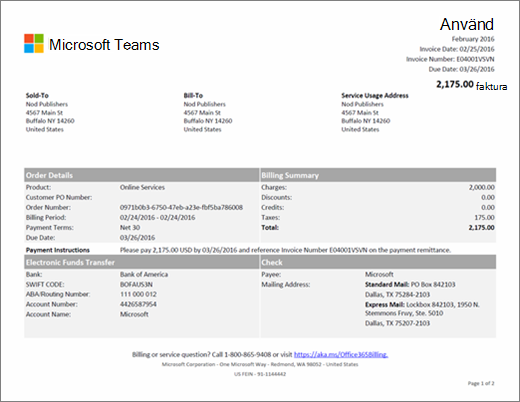
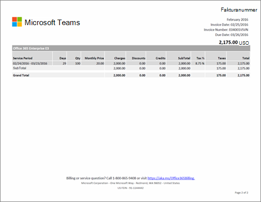

# Förstå din faktura eller faktura för Microsoft 365 för företagUnderstand your bill or invoice for Microsoft 365 for business

Antingen månadsvis eller år (beroende på vilket alternativ du valde när du köpte prenumerationen) får du ett e-postmeddelande som anger att ditt nya faktureringsutdrag är tillgängligt i administrationscentret.Either monthly or annually (depending on the option you chose when you purchased your subscription), you'll receive an email that tells you that your new billing statement is available in the admin center. [Läs mer om hur du hittar och visar fakturan](view-your-bill-or-invoice.md).[Learn how to find and view your bill or invoice](view-your-bill-or-invoice.md).
  
Your invoice contains two pages.Your invoice contains two pages. Page 1 is the invoice summary, and contains general information about the invoice, order, amount due, how to make a payment, and how to contact support.Page 1 is the invoice summary, and contains general information about the invoice, order, amount due, how to make a payment, and how to contact support.
  

  
Sida 2 innehåller information om faktureringsaktiviteten för varje prenumeration.Page 2 contains details about the billing activity for each subscription.
  

  
Beskrivningar av fälten och termerna på fakturan finns i [Ordlista för fakturafält](#invoice-field-glossary) längre fram i den här artikeln.For descriptions of the fields and terms included in your invoice, see the [Invoice Field Glossary](#invoice-field-glossary) later in this article.
  
## Förstå faktureringsbegreppUnderstand billing concepts

Innan du visar fakturan är det bra om du förstår några viktiga faktureringsbegrepp.Before you view your invoice, it's helpful to understand a few key billing concepts.
  
### Fakturasaldo och ordersaldoInvoice balance vs. order balance

 **Fakturasaldo** är beloppet som visas på fakturan och är bara det belopp som ska betalas för den specifika faktureringsperioden.**Invoice balance** is the amount shown on your invoice, and is only the amount due for that particular billing period. Totalt **ordersaldo** är summan av alla obetalda fakturor.Your total **order balance** is the sum of all unpaid invoices. Du kan visa ditt beställningssaldo i avsnittet **Fakturering** i administrationscentret.You can view your order balance in the **Billing** section of the admin center.
  
### Faktureringsfrekvens och fakturafrekvensBilling frequency vs. invoice frequency

 **Faktureringsfrekvens** innebär hur ofta du faktureras.**Billing frequency** means how often you are billed. Prenumerationer faktureras antingen månadsvis eller år, beroende på vilket alternativ du valde under prenumerationsköpet.Subscriptions are billed either monthly or annually, depending on what option you chose during the subscription purchase. **Fakturafrekvens** innebär hur ofta du får en faktura.**Invoice frequency** means how often you receive an invoice. Om du väljer fakturering per år får du bara en faktura årligen, om det inte finns aktiviteter för prenumerationen som kräver avgift eller kredit.If you chose annual billing, you'll only receive one invoice per year, unless activity for your subscription requires a charge or a credit.
  
Om du har fler än en order får du en faktura för varje order.If you have more than one order, you'll receive an invoice for each order.
  
## Ordlista för fakturafältInvoice Field Glossary

The following table describes the fields you might see on your invoice.The following table describes the fields you might see on your invoice. Some fields listed here might not appear in your invoice, depending on whether you pay by invoice or by credit card or bank account.Some fields listed here might not appear in your invoice, depending on whether you pay by invoice or by credit card or bank account.
  
> [!NOTE]
> Betalning med bankkonto är inte tillgängligt i vissa länder eller regioner.Paying by bank account is not available in some countries or regions.
  
|**Name****Name**|**Beskrivning****Description**|
|:-----|:-----|
|Pris per årAnnual Price|Prenumerationer faktureras per månad eller per år.Subscriptions are billed monthly or annually. Om du väljer årlig fakturering under prenumerationsköpet visas det årliga licenspriset på fakturan.If you chose annual billing during the subscription purchase, the annual license price is reflected on the invoice. Om du vill ändra faktureringsfrekvensen måste du avbryta prenumerationen och köpa den på nytt med den nya faktureringsfrekvensen.If you want to change the billing frequency, you'll have to cancel your subscription and repurchase it with the new billing frequency.|
|FaktureringsperiodBilling Period|Billing Period is the time period since the last invoice date.Billing Period is the time period since the last invoice date. Service Period is the time period during which you are charged to use the service.Service Period is the time period during which you are charged to use the service.|
|Faktureras tillBill-To|Det här är adressen till din faktureringsavdelning och är vanligtvis samma som Såld till-adressen.This is the address of your billing department, and is usually the same as the Sold-To address. Information om hur du uppdaterar faktureringsadressen finns i [Ändra dina faktureringsadresser](change-your-billing-addresses.md).To update your billing address, see [Change your billing addresses](change-your-billing-addresses.md).|
|DebiteringCharges|Page 1 of your invoice summarizes all charges for the invoice Billing Period.Page 1 of your invoice summarizes all charges for the invoice Billing Period. Page 2 shows the detailed charges for each subscription.Page 2 shows the detailed charges for each subscription.|
|CheckCheck|If you pay by invoice and check payment is offered in your country, the bottom of page 1 includes information about where to send your payment.If you pay by invoice and check payment is offered in your country, the bottom of page 1 includes information about where to send your payment. Please reference the invoice number on your check.Please reference the invoice number on your check.|
|KrediterCredits|Page 1 of your invoice summarizes all credits for the invoice Billing Period.Page 1 of your invoice summarizes all credits for the invoice Billing Period. Page 2 shows the detailed credits for each subscription.Page 2 shows the detailed credits for each subscription.|
|Inköpsordernr för kundCustomer PO Number|Ditt inköpsordernummer.Your Purchase Order (PO) number. Om du uppdaterar inköpsordernumret visas det på framtida fakturor.If you update the PO number, future invoices will include it. [Ändra inköpsordernumret](#change-your-purchase-order-number).[Change your purchase order number](#change-your-purchase-order-number).   **OBS** Du kan inte lägga till ett inköpsordernummer i en befintlig faktura.**NOTE** You can't add a PO number to an existing invoice.           |
|dagarDays|Each billing transaction is associated with a Service Period.Each billing transaction is associated with a Service Period. The Days column indicates the number of days in that service period.The Days column indicates the number of days in that service period.|
|RabatterDiscounts|Page 1 of your invoice summarizes all discounts for the invoice Billing Period.Page 1 of your invoice summarizes all discounts for the invoice Billing Period. Page 2 shows the detailed discounts for each subscription.Page 2 shows the detailed discounts for each subscription.|
|FörfallodatumDue Date|Datumet när fakturan förfaller till betalning.The date when payment is due for the invoice. Om din prenumeration betalas med ett kreditkort eller bankkonto debiterar vi ditt kreditkort eller bankkonto dagen efter fakturadatumet.If your subscription is paid with a credit card or bank account, we will charge your credit card or banking account the day after the Invoice Date.   **OBS** Att betala med bankkonto är inte tillgängligt i vissa länder eller regioner.**NOTE** Paying by bank account is not available in some countries or regions.           |
|Elektronisk betalningsöverföringElectronic Funds Transfer|Om du väljer "faktura" som betalningsmetod för prenumerationen innehåller sidan 1 Microsofts bankkontoinformation för elektroniska (tråd-, ACH-, SEPA-betalningar osv.) betalningar.If you chose "invoice" as the subscription payment method, page 1 contains the Microsoft bank account information for electronic (wire, ACH, SEPA, etc.) payments. Din bank har vanligtvis ett referensfält som du fyller i när du skickar en betalning.Usually, your bank will have a reference field you complete when you send a payment. Ange fakturanumret som visas i det här fältet.Please reference the invoice number shown in this field.|
|TotalsummaGrand Total|Den här raden innehåller totalsummorna för kolumnerna Debitering, Rabatter, Krediter, Delsumma, Moms och Summa för alla prenumerationer som visas på fakturan.This row includes the totals for all Charges, Discounts, Credits, SubTotal, Tax, and Total columns for all subscriptions listed on the invoice.|
|FakturadatumInvoice Date|The date the invoice was created.The date the invoice was created. The invoice date is the day after the end of your Billing Period.The invoice date is the day after the end of your Billing Period. For example, if your Billing Period is Jan 15 - Feb 14, your Invoice Date is Feb 15.For example, if your Billing Period is Jan 15 - Feb 14, your Invoice Date is Feb 15.|
|FakturanummerInvoice Number|The unique number assigned to your invoice.The unique number assigned to your invoice. Please reference the Invoice Number with your payment.Please reference the Invoice Number with your payment.|
|Pris per månadMonthly Price|Prenumerationer faktureras per månad eller per år.Subscriptions are billed monthly or annually. Om du väljer månadsvis fakturering under prenumerationsköpet visas det månatliga licenspriset på fakturan.If you chose monthly billing during the subscription purchase, the monthly license price is reflected on the invoice. Om du vill ändra faktureringsfrekvensen måste du avbryta prenumerationen och köpa den på nytt med den nya faktureringsfrekvensen.If you want to change the billing frequency, you'll have to cancel your subscription and repurchase it with the new billing frequency.|
|OrdernummerOrder Number|Every time you buy a new subscription, an order is created.Every time you buy a new subscription, an order is created. Every month, you'll receive an invoice for each order.Every month, you'll receive an invoice for each order.|
|BetalningsinstruktionerPayment Instructions|If you pay by credit card, you'll see "Do not pay - charged to credit card on file."If you pay by credit card, you'll see "Do not pay - charged to credit card on file." If you pay by invoice, you'll see instructions for paying by Electronic Funds Transfer (EFT) and check (if applicable).If you pay by invoice, you'll see instructions for paying by Electronic Funds Transfer (EFT) and check (if applicable).|
|BetalningsvillkorPayment Terms|The number of days from the Invoice Date when payment is due.The number of days from the Invoice Date when payment is due. The standard is 30 days.The standard is 30 days.|
|ProduktProduct|On page 1 of your invoice, "Online Services" is the generic term used to describe your subscriptions.On page 1 of your invoice, "Online Services" is the generic term used to describe your subscriptions. On page 2 , you'll see the individual subscription names.On page 2 , you'll see the individual subscription names.|
|AntalQTY|Antalet licenser som köpts under tjänstperioden.The number of licenses purchased during the Service Period.|
|TjänstperiodService Period|Service Period is the time period during which you are charged to use the service.Service Period is the time period during which you are charged to use the service. A Billing Period is the time period since the last invoice date.A Billing Period is the time period since the last invoice date.|
|TjänstanvändningsadressService Usage Address|Adressen där tjänsten används, vanligtvis samma som Såld till-adressen.The address where the service is being used, usually the same as your Sold-To address. Information om hur du uppdaterar tjänstens användningsadress finns i [Ändra dina faktureringsadresser](change-your-billing-addresses.md).To update your Service Usage Address, see [Change your billing addresses](change-your-billing-addresses.md).|
|Såld tillSold-To|Your company name and address.Your company name and address. To update this information, see [Change your organization's address, technical contact email, and other information](../../admin/manage/change-address-contact-and-more.md).To update this information, see [Change your organization's address, technical contact email, and other information](../../admin/manage/change-address-contact-and-more.md).|
|DelsummaSubTotal|Varje prenumeration som visas på fakturan har en separat rad med delsumma för kolumnerna Debitering, Rabatter, Krediter, Delsumma, Moms och Summa för den prenumerationen.Each subscription listed on your invoice has a separate SubTotal row for all Charges, Discounts, Credits, SubTotal, Tax, and Total columns for that subscription.|
|MomsTax|Page 1 of your invoice shows the total tax.Page 1 of your invoice shows the total tax. Page 2 shows the tax rate applied, and the total tax amount for each line item.Page 2 shows the tax rate applied, and the total tax amount for each line item. If your invoice contains taxes and your company is tax exempt, please [contact support](../../admin/contact-support-for-business-products.md).If your invoice contains taxes and your company is tax exempt, please [contact support](../../admin/contact-support-for-business-products.md).|
|SummaTotal|Beloppet som ska betalas för fakturans faktureringsperiod.The amount due for the invoice Billing Period.|

## Ändra ditt inköpsordernummerChange your purchase order number

Om du betalar med faktura kan du lägga till eller ändra inköpsordernumret för din prenumeration.If you pay by invoice, you can add or change the purchase order (PO) number for your subscription.
  
> [!NOTE]
> You can't add a PO number to an existing invoice.You can't add a PO number to an existing invoice. The PO number will appear on all future invoices.The PO number will appear on all future invoices.

::: moniker range="o365-worldwide"

1. I administrationscentret går du till sidan **Fakturering** \> <a href="https://go.microsoft.com/fwlink/p/?linkid=842054" target="_blank">Dina produkter</a>.In the admin center, go to the **Billing** \> <a href="https://go.microsoft.com/fwlink/p/?linkid=842054" target="_blank">Your products</a> page.

2. Om du är i **tabellvyn** väljer du **Kort** för att växla vyer.If you're in **Table** view, select **Cards** to switch views.

3. Leta reda på den prenumeration som du vill ändra.Find the subscription that you want to change.

4. Välj **Redigera** **bredvid faktura**i avsnittet **Fakturering.**In the **Billing** section, next to **invoice**, select **Edit**.

5. Längst ned i fönstret **Redigera betalningsinformation** anger du inköpsordernumret och väljer sedan **Spara**.At the bottom of the **Edit payment details** pane, enter your PO number, then select **Save**.

::: moniker-end

::: moniker range="o365-germany"

1. Gå till sidan **Fakturering** \> <a href="https://go.microsoft.com/fwlink/p/?linkid=847745" target="_blank">Prenumerationer</a> i administrationscentret.In the admin center, go to the **Billing** \> <a href="https://go.microsoft.com/fwlink/p/?linkid=847745" target="_blank">Subscriptions</a> page.

2. Välj den prenumeration som du vill ändra och välj **Ändra betalningsinformation**i avsnittet **Betalningsmetod** .Select the subscription that you want to change, and in the **Payment method** section, select **Change payment details**.

3. Längst ned i fönstret **Ändra betalningsinformation** anger du ditt inköpsordernummer och väljer sedan **Skicka**.At the bottom of the **Change payment details** pane, enter your PO number, then select **Submit**.

::: moniker-end

::: moniker range="o365-21vianet"

1. Gå till sidan **Fakturering** \> <a href="https://go.microsoft.com/fwlink/p/?linkid=850626" target="_blank">Prenumerationer</a> i administrationscentret.In the admin center, go to the **Billing** \> <a href="https://go.microsoft.com/fwlink/p/?linkid=850626" target="_blank">Subscriptions</a> page.

2. Välj den prenumeration som du vill ändra och välj **Ändra betalningsinformation**i avsnittet **Betalningsmetod** .Select the subscription that you want to change, and in the **Payment method** section, select **Change payment details**.

3. Längst ned i fönstret **Ändra betalningsinformation** anger du ditt inköpsordernummer och väljer sedan **Skicka**.At the bottom of the **Change payment details** pane, enter your PO number, then select **Submit**.

::: moniker-end

## Relaterade artiklarRelated articles

[Betala för din Microsoft 365 för företag-prenumerationPay for your Microsoft 365 for business subscription](pay-for-your-subscription.md)

[Betalningsalternativ för Minecraft: Education EditionMinecraft: Education Edition payment options](https://go.microsoft.com/fwlink/p/?linkid=838761)