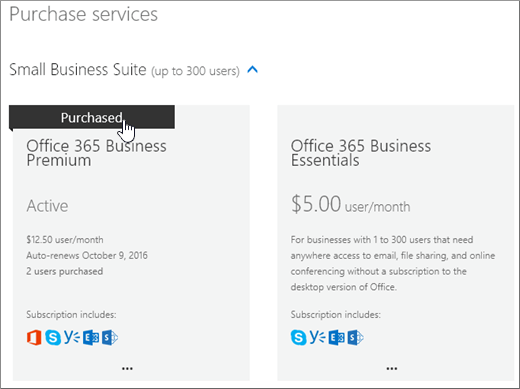

# Köp en annan Microsoft 365 för företag-prenumerationBuy another Microsoft 365 for business subscription

Om du redan har en Prenumeration på Microsoft 365 för företag och vill köpa en annan prenumeration för din organisation är det bästa sättet att göra det via administrationscentret.If you already have a Microsoft 365 for business subscription and you want to buy another subscription for your organization, the best way is to do it is through the admin center. Om du ännu inte har köpt den första Microsoft 365 för företag-prenumerationen för din organisation går [du hit](https://products.office.com/business/compare-office-365-for-business-plans) för att välja ett abonnemang.If you haven't yet purchased the first Microsoft 365 for business subscription for your organization, go [here](https://products.office.com/business/compare-office-365-for-business-plans) to choose a plan.
  
När du köper en annan prenumeration via administrationscentret är du garanterad att den nya prenumerationen associeras med samma organisation (domännamnsutrymme) som din befintliga prenumeration.When you buy another subscription through the admin center, you're guaranteed that the new subscription will be associated with the same organization (domain name space) as your existing subscription. Detta gör det enklare att flytta användare inom organisationen mellan prenumerationer eller tilldela dem en användarlicens för den ytterligare prenumeration de behöver.This makes it easier to move users within your organization between subscriptions or assign them a user license for the additional subscription they need.
  
När du har köpt en ny prenumeration måste du tilldela de användare som du vill använda prenumerationen en användarlicens för den.After purchasing a new subscription, you'll need to assign the users who you want to use that subscription a user license for it. Mer information om hur du gör finns [i Tilldela licenser till användare i Microsoft 365 för företag](../admin/manage/assign-licenses-to-users.md).To learn how, see [Assign licenses to users in Microsoft 365 for business](../admin/manage/assign-licenses-to-users.md).
  
## Köpa en annan prenumerationBuy another subscription

::: moniker range="o365-worldwide"

1. Gå till sidan \> <a href="https://go.microsoft.com/fwlink/p/?linkid=868433" target="_blank">Faktureringsköpstjänster</a> i administrationscentret. **Billing**In the admin center, go to the **Billing** \> <a href="https://go.microsoft.com/fwlink/p/?linkid=868433" target="_blank">Purchase services</a> page.

2. På sidan **Köp tjänster** väljer du den prenumeration som du vill köpa och väljer sedan **Köp**.On the **Purchase services** page, select the subscription that you want to buy, then select **Buy**.

3. Ange hur många användarlicenser du behöver och om du vill betala varje månad eller för hela året.Enter the number of licenses that you need, and choose whether to pay each month or for the whole year. Välj om du vill att licenser automatiskt ska tilldelas alla användare som inte redan har en licens.Choose whether you want to automatically assign licenses to everyone who does not currently have a license. Välj sedan **Checka ut nu**.Then select **Check out now**.

4. Din kundvagn öppnas.Your cart opens. Om din kundvagn försvinner från skärmen väljer du **Varukorg** för att öppna den igen, granskar ordern och väljer sedan **Checka ut**.If your cart disappears from the screen, select **Cart** to reopen it, review the order and then select **Check Out**.

5. Granska prisinformationen och välj **Nästa**.Review the pricing information and select **Next**.

6. Ange din betalningsinformation och välj sedan **Gå** \> **till Admin Home**.Provide your payment information, and then select **Place order** \> **Go to Admin Home**.

::: moniker-end

::: moniker range="o365-germany"

1. Gå till sidan **Fakturering** \> <a href="https://go.microsoft.com/fwlink/p/?linkid=847745" target="_blank">Prenumerationer</a> i administrationscentret.In the admin center, go to the **Billing** \> <a href="https://go.microsoft.com/fwlink/p/?linkid=847745" target="_blank">Subscriptions</a> page.

2. På sidan **Prenumeration** väljer du **Lägg till prenumerationer**.On the **Subscription** page, select **Add subscriptions**.

    Prenumerationerna som är tillgängliga för din organisation visas.You'll see the subscriptions that are available to your organization. Alla prenumerationer som du redan har köpt identifieras på det här sätt.Any subscriptions that you've already purchased are identified like this.

    
  
3. Musen över eller tryck på den prenumeration som du vill köpa och välj sedan **Köp nu**.Mouse over or tap the subscription that you want to buy, and then select **Buy Now**.

    
  
4. Ange antalet användarlicenser du behöver, välj om du vill betala varje månad eller för hela året och välj sedan **Lägg till i kundvagn .**Enter the number of user licenses you need, chose whether to pay each month or for the whole year, and then select **Add to Cart**.

5. Din kundvagn öppnas.Your cart opens. Om din kundvagn försvinner från skärmen väljer du **Varukorg** för att öppna den igen, granskar ordern och väljer sedan **Checka ut**.If your cart disappears from the screen, select **Cart** to reopen it, review the order and then select **Check Out**.

6. Granska prisinformationen och välj **Nästa**.Review the pricing information and select **Next**.

7. Ange din betalningsinformation och välj sedan **Beställ**.Provide your payment information, and then select **Place order**.

8. På bekräftelsesidan väljer du **Gå till Admin Home**.On the confirmation page, select **Go to Admin Home**.

::: moniker-end

::: moniker range="o365-21vianet"

1. Gå till sidan **Fakturering** \> <a href="https://go.microsoft.com/fwlink/p/?linkid=850626" target="_blank">Prenumerationer</a> i administrationscentret.In the admin center, go to the **Billing** \> <a href="https://go.microsoft.com/fwlink/p/?linkid=850626" target="_blank">Subscriptions</a> page.

2. På sidan **Prenumeration** väljer du **Lägg till prenumerationer**.On the **Subscription** page, select **Add subscriptions**.

    Prenumerationerna som är tillgängliga för din organisation visas.You'll see the subscriptions that are available to your organization. Alla prenumerationer som du redan har köpt identifieras på det här sätt.Any subscriptions that you've already purchased are identified like this.

    
  
3. Musen över eller tryck på den prenumeration som du vill köpa och välj sedan **Köp nu**.Mouse over or tap the subscription that you want to buy, and then select **Buy Now**.

    
  
4. Ange antalet användarlicenser du behöver, välj om du vill betala varje månad eller för hela året och välj sedan **Lägg till i kundvagn .**Enter the number of user licenses you need, chose whether to pay each month or for the whole year, and then select **Add to Cart**.

5. Din kundvagn öppnas.Your cart opens. Om din kundvagn försvinner från skärmen väljer du **Varukorg** för att öppna den igen, granskar ordern och väljer sedan **Checka ut**.If your cart disappears from the screen, select **Cart** to reopen it, review the order and then select **Check Out**.

6. Granska prisinformationen och välj **Nästa**.Review the pricing information and select **Next**.

7. Ange din betalningsinformation och välj sedan **Beställ**.Provide your payment information, and then select **Place order**.

8. På bekräftelsesidan väljer du **Gå till Admin Home**.On the confirmation page, select **Go to Admin Home**.

::: moniker-end

## Relaterade artiklarRelated articles

[Tilldela licenser till användareAssign licenses to users](../admin/manage/assign-licenses-to-users.md)
  
[Ta bort licenser från användareRemove licenses from users](../admin/manage/remove-licenses-from-users.md)
