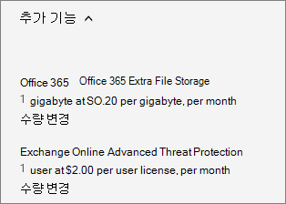

# Köpa eller redigera ett tilläggBuy or edit an add-on

::: moniker range="o365-21vianet"

> [!NOTE]
> Administrationscentret förändras.The admin center is changing. Om din upplevelse inte stämmer överens med informationen som presenteras här läser du [Om det nya administrationscentret för Microsoft 365](https://docs.microsoft.com/microsoft-365/admin/microsoft-365-admin-center-preview?view=o365-21vianet).If your experience doesn't match the details presented here, see [About the new Microsoft 365 admin center](https://docs.microsoft.com/microsoft-365/admin/microsoft-365-admin-center-preview?view=o365-21vianet).

::: moniker-end

Flera av Microsoft 365 för affärsplaner har tillägg som du kan köpa för din prenumeration.Several of the Microsoft 365 for business plans have add-ons that you can buy for your subscription. Ett tillägg ger ytterligare funktioner med den prenumeration som du köper det för.An add-on provides additional functionality to the subscription that you buy it for.

## Köpa ett tilläggBuy an add-on

::: moniker range="o365-worldwide"

1. Gå till sidan \> <a href="https://go.microsoft.com/fwlink/p/?linkid=868433" target="_blank">Faktureringsköpstjänster</a> i administrationscentret. **Billing**In the admin center, go to the **Billing** \> <a href="https://go.microsoft.com/fwlink/p/?linkid=868433" target="_blank">Purchase services</a> page.

2. Längst ned på sidan **Köptjänster** väljer du **Tillägg**.At the bottom of the **Purchase services** page, select **Add-ons**.

3. På sidan **Köptjänster** väljer du den tilläggsprenumeration som du vill köpa.On the **Purchase services** page, select the add-on subscription that you want to buy.

4. Ange hur många användarlicenser du behöver och om du vill betala varje månad eller för hela året.Enter the number of licenses that you need, and choose whether to pay each month or for the whole year. Välj om du vill att licenser automatiskt ska tilldelas alla användare som inte redan har en licens.Choose whether you want to automatically assign licenses to everyone who does not currently have a license. Om det visas väljer du en basprenumeration.If shown, select a base subscription.

5. Välj **Checka ut nu**.Select **Check out now**.

6. Granska prisinformationen och välj sedan **Nästa**.Review the pricing information, then select **Next**.

7. Ange din betalningsinformation och välj sedan **Gå** \> **till Admin Home**.Provide your payment information, and then select **Place order** \> **Go to Admin Home**.

::: moniker-end

::: moniker range="o365-germany"

1. Gå till sidan **Fakturering** \> <a href="https://go.microsoft.com/fwlink/p/?linkid=847745" target="_blank">Prenumerationer</a> i administrationscentret.In the admin center, go to the **Billing** \> <a href="https://go.microsoft.com/fwlink/p/?linkid=847745" target="_blank">Subscriptions</a> page.

2. På sidan **Prenumerationer** väljer du den prenumeration som du vill köpa ett tillägg för.On the **Subscriptions** page, select the subscription for which you want to buy an add-on.

3. I det nedre vänstra hörnet av **prenumerationsinformationen** \> väljer du Tillägg **Köp tillägg**.On the bottom-left corner of the subscription details, select **Add-ons** \> **Buy add-ons**.

    
  
4. På sidan **Köp tjänster** mus över eller tryck på tillägget prenumeration som du vill köpa, och välj sedan **Köp nu**.On the **Purchase services** page, mouse over or tap the add-on subscription that you want to buy, and then select **Buy now**.

5. Ange hur många användarlicenser du behöver och om du vill betala varje månad eller för hela året.Enter the number of licenses that you need, and choose whether to pay each month or for the whole year. Välj om du vill att licenser automatiskt ska tilldelas alla användare som inte redan har en licens.Choose whether you want to automatically assign licenses to everyone who does not currently have a license. Om det visas väljer du en basprenumeration.If shown, select a base subscription.

6. Välj **Checka ut nu**.Select **Check out now**.

7. Granska prisinformationen och välj sedan **Nästa**.Review the pricing information, and then select **Next**.

8. Ange din betalningsinformation och välj sedan **Gå** \> **till Admin Home**.Provide your payment information, and then select **Place order** \> **Go to Admin Home**.

::: moniker-end

::: moniker range="o365-21vianet"

1. Gå till sidan **Fakturering** \> <a href="https://go.microsoft.com/fwlink/p/?linkid=850626" target="_blank">Prenumerationer</a> i administrationscentret.In the admin center, go to the **Billing** \> <a href="https://go.microsoft.com/fwlink/p/?linkid=850626" target="_blank">Subscriptions</a> page.

2. På sidan **Prenumerationer** väljer du den prenumeration som du vill köpa ett tillägg för.On the **Subscriptions** page, select the subscription for which you want to buy an add-on.

3. I det nedre vänstra hörnet av **prenumerationsinformationen** \> väljer du Tillägg **Köp tillägg**.On the bottom-left corner of the subscription details, select **Add-ons** \> **Buy add-ons**.

    
  
4. På sidan **Köp tjänster** mus över eller tryck på tillägget prenumeration som du vill köpa, och välj sedan **Köp nu**.On the **Purchase services** page, mouse over or tap the add-on subscription that you want to buy, and then select **Buy now**.

5. Ange hur många användarlicenser du behöver och om du vill betala varje månad eller för hela året.Enter the number of licenses that you need, and choose whether to pay each month or for the whole year. Välj om du vill att licenser automatiskt ska tilldelas alla användare som inte redan har en licens.Choose whether you want to automatically assign licenses to everyone who does not currently have a license. Om det visas väljer du en basprenumeration.If shown, select a base subscription.

6. Välj **Checka ut nu**.Select **Check out now**.

7. Granska prisinformationen och välj sedan **Nästa**.Review the pricing information, and then select **Next**.

8. Ange din betalningsinformation och välj sedan **Gå** \> **till Admin Home**.Provide your payment information, and then select **Place order** \> **Go to Admin Home**.

::: moniker-end

## Uppdatera ett tilläggUpdate an add-on

Stegen du använder för att uppdatera ett tillägg beror på om tillägget är ett traditionellt tillägg, eller ett fristående tillägg.The steps that you use to update an add-on depend on whether the add-on is a traditional add-on, or a standalone add-on.

*Traditionella tillägg* är länkade till en viss prenumeration.*Traditional add-ons* are linked to a specific subscription. Om du avbryter prenumerationen avbryts även det associerade tillägget.If you cancel the subscription, the associated add-on is also cancelled.
  
*Fristående tillägg* är inte länkade till en viss prenumeration.*Standalone add-ons* are not linked to a specific subscription. Fristående tillägg visas som en separat prenumeration på sidan **Dina produkter** och har ett eget utgångsdatum.Standalone add-ons appear as a separate subscription on the **Your products** page, and have their own expiration date. Du hanterar ett fristående tillägg på samma sätt som du hanterar andra prenumerationer.You manage a standalone add-on the same way that you manage any other subscription.
  
### Uppdatera ett traditionellt tilläggUpdate a traditional add-on

::: moniker range="o365-worldwide"

1. Gå till sidan \> <a href="https://go.microsoft.com/fwlink/p/?linkid=842054" target="_blank">Faktureringsprodukter</a> i administrationscentret. **Billing**In the admin center, go to the **Billing** \> <a href="https://go.microsoft.com/fwlink/p/?linkid=842054" target="_blank">Your products</a> page.

2. På sidan **Dina produkter** väljer du den prenumeration som du vill uppdatera ett tillägg för.On the **Your products** page, select the subscription for which you want to update an add-on.

3. Välj **Tillägg**.Select **Add-ons**. De tillägg som du har köpt visas.The add-ons that you have purchased are shown.

4. Välj **Ändra kvantitet** för det tillägg som du vill ändra.Select **Change quantity** for the add-on you want to change.

5. Ange den kvantitetsändring som du vill använda för prenumerationen och välj sedan **Skicka ändring**.Enter the quantity change you want for the subscription, then select **Submit change**.

::: moniker-end

::: moniker range="o365-germany"

1. Gå till sidan **Fakturering** \> <a href="https://go.microsoft.com/fwlink/p/?linkid=847745" target="_blank">Prenumerationer</a> i administrationscentret.In the admin center, go to the **Billing** \> <a href="https://go.microsoft.com/fwlink/p/?linkid=847745" target="_blank">Subscriptions</a> page.

2. På sidan **Prenumerationer** väljer du den prenumeration som du vill uppdatera ett tillägg för.On the **Subscriptions** page, select the subscription for which you want to update an add-on.

3. Välj **Tillägg**.Select **Add-ons**.

    Tilläggen du har köpt visas och under varje tillägg visas länken **Ändra antal**.The add-ons that you have purchased are shown and each of the add-ons will have a **Change quantity** link below it.

4. Välj länken **Ändra kvantitet** för det tillägg som du vill uppdatera.Select the **Change quantity** link for the add-on that you want to update.

    
  
5. Ange antalet användarlicenser som du behöver i rutan och välj sedan **Skicka**.Enter the number of user licenses that you need in the box, and then select **Submit**.

    > [!TIP]
    > Du kan även använda upp- och nedpilen när du vill ändra antalet användarlicenser eller bara ange siffran du vill ha i rutan.You can also use the up-arrow and down-arrow to change the quantity of user licenses or just enter the number you want in the box.
  
    

::: moniker-end

::: moniker range="o365-21vianet"

1. Gå till sidan **Fakturering** \> <a href="https://go.microsoft.com/fwlink/p/?linkid=850626" target="_blank">Prenumerationer</a> i administrationscentret.In the admin center, go to the **Billing** \> <a href="https://go.microsoft.com/fwlink/p/?linkid=850626" target="_blank">Subscriptions</a> page.

2. På sidan **Prenumerationer** väljer du den prenumeration som du vill uppdatera ett tillägg för.On the **Subscriptions** page, select the subscription for which you want to update an add-on.

3. Välj **Tillägg**.Select **Add-ons**.

    Tilläggen du har köpt visas och under varje tillägg visas länken **Ändra antal**.The add-ons that you have purchased are shown and each of the add-ons will have a **Change quantity** link below it.

4. Välj länken **Ändra kvantitet** för det tillägg som du vill uppdatera.Select the **Change quantity** link for the add-on that you want to update.

    
  
5. Ange antalet användarlicenser som du behöver i rutan och välj sedan **Skicka**.Enter the number of user licenses that you need in the box, and then select **Submit**.

    > [!TIP]
    > Du kan även använda upp- och nedpilen när du vill ändra antalet användarlicenser eller bara ange siffran du vill ha i rutan.You can also use the up-arrow and down-arrow to change the quantity of user licenses or just enter the number you want in the box.
  
    

::: moniker-end

### Uppdatera ett fristående tilläggUpdate a standalone add-on

::: moniker range="o365-worldwide"

1. Gå till sidan \> <a href="https://go.microsoft.com/fwlink/p/?linkid=842054" target="_blank">Faktureringsprodukter</a> i administrationscentret. **Billing**In the admin center, go to the **Billing** \> <a href="https://go.microsoft.com/fwlink/p/?linkid=842054" target="_blank">Your products</a> page.

2. På sidan **Dina produkter** väljer du den tilläggsprenumeration som du vill uppdatera och väljer sedan **Lägg till/ta bort licenser**.On the **Your products** page, select the add-on subscription that you want to update, and then select **Add/Remove licenses**.

3. Ange antalet licenser som du behöver i rutan och välj sedan **Skicka ändring**.Enter the number of licenses that you need in the box, and then select **Submit change**.

::: moniker-end

::: moniker range="o365-germany"

1. Gå till sidan **Fakturering** \> <a href="https://go.microsoft.com/fwlink/p/?linkid=847745" target="_blank">Prenumerationer</a> i administrationscentret.In the admin center, go to the **Billing** \> <a href="https://go.microsoft.com/fwlink/p/?linkid=847745" target="_blank">Subscriptions</a> page.

2. På sidan Prenumerationer väljer du den **tilläggsprenumeration** som du vill uppdatera och väljer sedan **Lägg till/ta bort licenser**.On the **Subscriptions** page, select the add-on subscription that you want to update, and then select **Add/Remove licenses**.

3. Ange antalet licenser som du behöver i rutan och välj sedan **Skicka**.Enter the number of licenses that you need in the box, and then select **Submit**.

    > [!TIP]
    > Du kan även använda upp- och nedpilen för att ändra antalet användarlicenser eller ange siffran du vill ha i rutan.You can also use the up-arrow and down-arrow to change the quantity of licenses or just enter the number you want in the box.
  
    

::: moniker-end

::: moniker range="o365-21vianet"

1. Gå till sidan **Fakturering** \> <a href="https://go.microsoft.com/fwlink/p/?linkid=850626" target="_blank">Prenumerationer</a> i administrationscentret.In the admin center, go to the **Billing** \> <a href="https://go.microsoft.com/fwlink/p/?linkid=850626" target="_blank">Subscriptions</a> page.

2. På sidan Prenumerationer väljer du den **tilläggsprenumeration** som du vill uppdatera och väljer sedan **Lägg till/ta bort licenser**.On the **Subscriptions** page, select the add-on subscription that you want to update, and then select **Add/Remove licenses**.

3. Ange antalet licenser som du behöver i rutan och välj sedan **Skicka**.Enter the number of licenses that you need in the box, and then select **Submit**.

    > [!TIP]
    > Du kan även använda upp- och nedpilen för att ändra antalet användarlicenser eller ange siffran du vill ha i rutan.You can also use the up-arrow and down-arrow to change the quantity of licenses or just enter the number you want in the box.
  
    

::: moniker-end

## Ta bort ett tilläggRemove an add-on

Du kan avsluta ett fristående tillägg på samma sätt som du [avbryter en prenumeration](subscriptions/cancel-your-subscription.md).You can cancel a standalone add-on the same way that you [cancel a subscription](subscriptions/cancel-your-subscription.md). Du kan även avaktivera **automatisk förnyelse** för ett fristående tillägg med hjälp av stegen ovan.Or you can set **Recurring billing** to off for a standalone add-on by using the steps above. Du kan inte dock ta bort ett traditionellt tillägg efter att det har köpts.However, you cannot remove a traditional add-on after it's been bought. Om du behöver ta bort ett traditionellt tillägg kontaktar du [supporten för att få hjälp](../admin/contact-support-for-business-products.md).If you need to remove a traditional add-on, please [contact support for help](../admin/contact-support-for-business-products.md).
  
## Tillgängliga tilläggAvailable add-ons

I följande tabell visas tillägg som är tillgängliga för olika versioner av Microsoft 365 för företag.The following table lists add-ons that are available for different editions of Microsoft 365 for business.
  
Information om tillägg till Skype för företag finns i [tilläggslicensieringen Skype för företag och Microsoft Teams](https://docs.microsoft.com/SkypeForBusiness/skype-for-business-and-microsoft-teams-add-on-licensing/skype-for-business-and-microsoft-teams-add-on-licensing).For information about Skype for Business add-ons, see [Skype for Business and Microsoft Teams add-on licensing](https://docs.microsoft.com/SkypeForBusiness/skype-for-business-and-microsoft-teams-add-on-licensing/skype-for-business-and-microsoft-teams-add-on-licensing).
  
****

|**Tillägg****Add-on**|**Tillgängliga i de här prenumerationerna****Available in these subscriptions**|
|:-----|:-----|
|Customer LockboxCustomer Lockbox    | Office 365 Enterprise E1Office 365 Enterprise E1     Office 365 Enterprise, E3Office 365 Enterprise E3     Office 365 Enterprise E4Office 365 Enterprise E4    |
|[Avancerat hotskydd för Office 365 OnlineOffice 365 Online Advanced Threat Protection](https://go.microsoft.com/fwlink/p/?LinkId=691156)   | Office 365 Enterprise E1Office 365 Enterprise E1     Office 365 Enterprise, E3Office 365 Enterprise E3     Office 365 Enterprise E4Office 365 Enterprise E4    |
|[Exchange Online - arkiveringExchange Online Archiving](https://go.microsoft.com/fwlink/p/?LinkId=691157)   | Microsoft 365 Business BasicMicrosoft 365 Business Basic     Microsoft 365 Business StandardMicrosoft 365 Business Standard     Office 365 Enterprise E1Office 365 Enterprise E1     Office 365 Enterprise F1Office 365 Enterprise F1    |
|Microsoft MyAnalyticsMicrosoft MyAnalytics    | Office 365 Enterprise E1Office 365 Enterprise E1     Office 365 Enterprise, E3Office 365 Enterprise E3     Office 365 Enterprise E4Office 365 Enterprise E4    |
|Office 365 Advanced ComplianceOffice 365 Advanced Compliance    | Office 365 Enterprise E1Office 365 Enterprise E1     Office 365 Enterprise, E3Office 365 Enterprise E3     Office 365 Enterprise E4Office 365 Enterprise E4    |
|Office 365 Extra File StorageOffice 365 Extra File Storage    | Microsoft 365-appar för företagMicrosoft 365 Apps for business     Microsoft 365 Business BasicMicrosoft 365 Business Basic     Microsoft 365 Business StandardMicrosoft 365 Business Standard     Office 365 Enterprise E1Office 365 Enterprise E1     Office 365 Enterprise, E2Office 365 Enterprise E2     Office 365 Enterprise E3Office 365 Enterprise E3     Office 365 Enterprise E4Office 365 Enterprise E4     Office 365 Enterprise E5Office 365 Enterprise E5     Office för webben med SharePoint-abonnemang 1Office for the web with SharePoint Plan 1     Office för webben med SharePoint-abonnemang 2Office for the web with SharePoint Plan 2     SharePoint Online (abonnemang 1)SharePoint Online Plan 1     SharePoint Online (abonnemang 2)SharePoint Online Plan 2    |
|TelefonsystemPhone System    | Office 365 Enterprise E1Office 365 Enterprise E1     Office 365 Enterprise, E3Office 365 Enterprise E3     Office 365 Enterprise E4Office 365 Enterprise E4     Office 365 Enterprise E5Office 365 Enterprise E5    |
|LjudkonferensAudio Conferencing    |  Microsoft 365 Business BasicMicrosoft 365 Business Basic   Microsoft 365 Business StandardMicrosoft 365 Business Standard   Office 365 Enterprise E1Office 365 Enterprise E1   Office 365 Enterprise, E3Office 365 Enterprise E3   Office 365 Enterprise E4Office 365 Enterprise E4   Office 365 Enterprise E5 utan ljudkonferenserOffice 365 Enterprise E5 without Audio Conferencing   Microsoft 365 Business PremiumMicrosoft 365 Business Premium   Microsoft 365 E3Microsoft 365 E3   Microsoft 365 E5Microsoft 365 E5    |
|KommunikationskrediterCommunications Credits    | Office 365 Enterprise E5Office 365 Enterprise E5    |
|Inrikes samtalsplanDomestic Calling Plan   | Office 365 Enterprise E5Office 365 Enterprise E5    |
|Internationell samtalsplanInternational Calling Plan    | Office 365 Enterprise E5Office 365 Enterprise E5    |
  
## Relaterade artiklarRelated articles

[Lägga till lagringsutrymme för din prenumerationAdd storage space for your subscription](add-storage-space.md)
