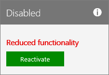

# Återaktivera prenumerationenReactivate your subscription

::: moniker range="o365-21vianet"

> [!NOTE]
> Administrationscentret förändras.The admin center is changing. Om din upplevelse inte stämmer överens med informationen som presenteras här läser du [Om det nya administrationscentret för Microsoft 365](https://docs.microsoft.com/microsoft-365/admin/microsoft-365-admin-center-preview?view=o365-21vianet).If your experience doesn't match the details presented here, see [About the new Microsoft 365 admin center](https://docs.microsoft.com/microsoft-365/admin/microsoft-365-admin-center-preview?view=o365-21vianet).

::: moniker-end

Om prenumerationen går ut eller inaktiverades av Microsoft, eller om du har sagt upp den mitt under en prenumerationsperiod, kan du återaktivera den i administrationscentret.If your subscription expires, or was disabled by Microsoft, or if you cancelled it in the middle of a subscription term, you can reactivate it in the admin center.
  
 **Är du inte administratör?****Not an admin?** Kontakta administrationen för att återaktivera prenumerationen.Contact your administration to reactivate your subscription.

::: moniker range="o365-worldwide"

1. Gå till sidan \> <a href="https://go.microsoft.com/fwlink/p/?linkid=842054" target="_blank">Faktureringsprodukter</a> i administrationscentret. **Billing**In the admin center, go to the **Billing** \> <a href="https://go.microsoft.com/fwlink/p/?linkid=842054" target="_blank">Your products</a> page.

2. Leta reda på den prenumeration som du vill återaktivera på sidan **Dina produkter.**On the **Your products** page, find the subscription that you want to reactivate. Välj **Återaktivera**i avsnittet **Fakturering** .In the **Billing** section, select **Reactivate**.
  
    Om du inte ser **Återaktivera** som en tillgänglig åtgärd [ringer du support](../../admin/contact-support-for-business-products.md) för att återaktivera prenumerationen.If you don't see **Reactivate** as an available action, [call Support](../../admin/contact-support-for-business-products.md) to reactivate your subscription.

3. Bekräfta din betalningsinformation.Confirm your payment details. Du kan uppdatera den befintliga betalningsinformationen här.You can update your existing payment information here. När du är klar med betalningsmetoden väljer du **Återaktivera**.When you're finished entering your payment method, select **Reactivate**.

      - Om din prenumeration har upphört att gälla återgår prenumerationen till ett aktivt tillstånd när du har skickat in dina betalningsuppgifter och faktureringsdatumet **Nästa** sträcker sig med antingen en månad eller ett år, beroende på ditt aktuella prenumerationsåtagande.If your subscription was expired, then after you submit your payment details, your subscription returns to an active state, and the **Next billing** date extends by either one month or one year, depending on your current subscription commitment. Om du betalar med kreditkort eller bankkonto debiteras ditt kreditkort eller bankkonto för förlängningen.If you pay by credit card or bank account, your credit card or bank account will be charged for the extension. Om du betalar med faktura visas tillägget på nästa faktura.If you pay by invoice, you'll see the extension reflected on your next invoice. Om du vill vara säker på att prenumerationen inte upphör att gälla igen [aktiverar du Återkommande fakturering](renew-your-subscription.md#turn-recurring-billing-off-or-on).To make sure that your subscription doesn't expire again, [turn Recurring billing on](renew-your-subscription.md#turn-recurring-billing-off-or-on).

    > [!NOTE]
    > Möjligheten att betala med bankkonto är inte tillgänglig i vissa länder eller regioner.The ability to pay by bank account isn't available in some countries or regions.
  
      - Om din prenumeration har avbrutits eller inaktiverats på grund av att en betalning inte har tagits emot återgår den till ett aktivt tillstånd och **faktureringsdatumet Nästa** förblir detsamma.If your subscription was cancelled, or was disabled because a payment wasn't received, it returns to an active state, and your **Next billing** date stays the same.

::: moniker-end

::: moniker range="o365-germany"
  
1. Gå till sidan **Fakturering** \> <a href="https://go.microsoft.com/fwlink/p/?linkid=847745" target="_blank">Prenumerationer</a> i administrationscentret.In the admin center, go to the **Billing** \> <a href="https://go.microsoft.com/fwlink/p/?linkid=847745" target="_blank">Subscriptions</a> page.

2. Leta reda på den prenumeration som du vill återaktivera och välj sedan **Återaktivera**.Find the subscription that you want to reactivate, then select **Reactivate**.

    
  
    Om du inte ser **Återaktivera** som en tillgänglig åtgärd [ringer du support](../../admin/contact-support-for-business-products.md) för att återaktivera prenumerationen.If you don't see **Reactivate** as an available action, [call Support](../../admin/contact-support-for-business-products.md) to reactivate your subscription.

3. Ange din betalningsinformation.Enter your payment details. Du kan uppdatera den befintliga betalningsinformationen här.You can update your existing payment information here.

      - Om din prenumeration har upphört att gälla återgår prenumerationen till ett aktivt tillstånd när du har skickat in dina betalningsuppgifter och faktureringsdatumet **Nästa** sträcker sig med antingen en månad eller ett år, beroende på ditt aktuella prenumerationsåtagande.If your subscription was expired, then after you submit your payment details, your subscription returns to an active state, and the **Next billing** date extends by either one month or one year, depending on your current subscription commitment. Om du betalar med kreditkort eller bankkonto debiteras ditt kreditkort eller bankkonto för förlängningen.If you pay by credit card or bank account, your credit card or bank account will be charged for the extension. Om du betalar med faktura visas tillägget på nästa faktura.If you pay by invoice, you'll see the extension reflected on your next invoice. Om du vill vara säker på att prenumerationen inte upphör att gälla igen [aktiverar du Återkommande fakturering](renew-your-subscription.md#turn-recurring-billing-off-or-on).To make sure that your subscription doesn't expire again, [turn Recurring billing on](renew-your-subscription.md#turn-recurring-billing-off-or-on).

    > [!NOTE]
    > Möjligheten att betala med bankkonto är inte tillgänglig i vissa länder eller regioner.The ability to pay by bank account isn't available in some countries or regions.
  
      - Om din prenumeration har avbrutits eller inaktiverats på grund av att en betalning inte har tagits emot återgår den till ett aktivt tillstånd och **faktureringsdatumet Nästa** förblir detsamma.If your subscription was cancelled, or was disabled because a payment wasn't received, it returns to an active state, and your **Next billing** date stays the same.

::: moniker-end

::: moniker range="o365-21vianet"
  
1. Gå till sidan **Fakturering** \> <a href="https://go.microsoft.com/fwlink/p/?linkid=850626" target="_blank">Prenumerationer</a> i administrationscentret.In the admin center, go to the **Billing** \> <a href="https://go.microsoft.com/fwlink/p/?linkid=850626" target="_blank">Subscriptions</a> page.

2. Leta reda på den prenumeration som du vill återaktivera och välj sedan **Återaktivera**.Find the subscription that you want to reactivate, then select **Reactivate**.

    
  
    Om du inte ser **Återaktivera** som en tillgänglig åtgärd [ringer du support](../../admin/contact-support-for-business-products.md) för att återaktivera prenumerationen.If you don't see **Reactivate** as an available action, [call Support](../../admin/contact-support-for-business-products.md) to reactivate your subscription.

3. Ange din betalningsinformation.Enter your payment details. Du kan uppdatera den befintliga betalningsinformationen här.You can update your existing payment information here.

    - Om din prenumeration har upphört att gälla återgår prenumerationen till ett aktivt tillstånd när du har skickat in dina betalningsuppgifter och faktureringsdatumet **Nästa** sträcker sig med antingen en månad eller ett år, beroende på ditt aktuella prenumerationsåtagande.If your subscription was expired, then after you submit your payment details, your subscription returns to an active state, and the **Next billing** date extends by either one month or one year, depending on your current subscription commitment. Om du betalar med kreditkort eller bankkonto debiteras ditt kreditkort eller bankkonto för förlängningen.If you pay by credit card or bank account, your credit card or bank account will be charged for the extension. Om du betalar med faktura visas tillägget på nästa faktura.If you pay by invoice, you'll see the extension reflected on your next invoice. Om du vill vara säker på att prenumerationen inte upphör att gälla igen [aktiverar du Återkommande fakturering](renew-your-subscription.md#turn-recurring-billing-off-or-on).To make sure that your subscription doesn't expire again, [turn Recurring billing on](renew-your-subscription.md#turn-recurring-billing-off-or-on).

    > [!NOTE]
    > Möjligheten att betala med bankkonto är inte tillgänglig i vissa länder eller regioner.The ability to pay by bank account isn't available in some countries or regions.
  
    - Om din prenumeration har avbrutits eller inaktiverats på grund av att en betalning inte har tagits emot återgår den till ett aktivt tillstånd och **faktureringsdatumet Nästa** förblir detsamma.If your subscription was cancelled, or was disabled because a payment wasn't received, it returns to an active state, and your **Next billing** date stays the same.

::: moniker-end
